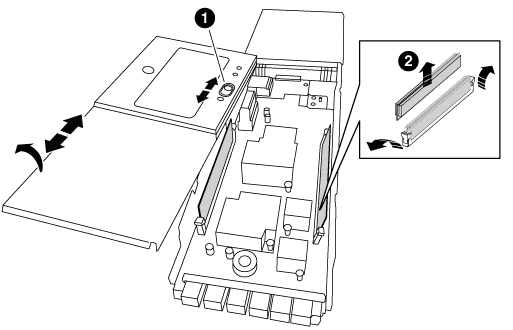

= 手順 1 ：障害のあるコントローラをシャットダウンします
:allow-uri-read: 

NVRAMモジュールは、NVRAM10とDIMM、およびNVRAMモジュールごとに最大2つのNVMe SSD Flash Cacheモジュール（Flash Cacheまたはキャッシングモジュール）で構成されます。障害が発生した NVRAM モジュールまたは NVRAM モジュール内の DIMM を交換できます。

障害が発生したNVRAMモジュールを交換するには、モジュールをシャーシから取り外し、NVRAMモジュールからFlash Cacheモジュールを取り外し、DIMMを交換用モジュールに移動し、Flash Cacheモジュールを再度取り付けて、交換用NVRAMモジュールをシャーシに取り付ける必要があります。

システム ID は NVRAM モジュールから取得されるため、モジュールを交換する場合は、システムに属するディスクを新しいシステム ID に再割り当てします。

.作業を開始する前に
* すべてのディスクシェルフが適切に動作している必要があります。
* HA ペアのシステムの場合は、交換する NVRAM モジュールに関連付けられているノードをパートナーノードがテイクオーバーできる必要があります。
* この手順では次の用語を使用します。
+
** impaired_node は、保守を実行しているノードです。
** healthy_node は、障害ノードの HA パートナーです。

* この手順には、新しい NVRAM モジュールに関連付けられているコントローラモジュールにディスクを自動または手動で再割り当てする手順が含まれています。手順でに指示された場合は、ディスクを再割り当てする必要があります。ギブバックで CAN 原因の問題が発生する前にディスクの再割り当てを完了する。
* 障害が発生したコンポーネントは、プロバイダから受け取った交換用 FRU コンポーネントと交換する必要があります。
* この手順の一部としてディスクやディスクシェルフを変更することはできません。

== 手順 1 ：障害のあるコントローラをシャットダウンします

次のいずれかのオプションを使用して、障害のあるコントローラをシャットダウンまたはテイクオーバーします。

[role="tabbed-block"]
====
.オプション 1 ：ほとんどのシステム
--
障害のあるコントローラをシャットダウンするには、コントローラのステータスを確認し、必要に応じて正常なコントローラが障害のあるコントローラストレージからデータを引き続き提供できるようにコントローラをテイクオーバーする必要があります。

.このタスクについて
* SANシステムを使用している場合は、障害コントローラのSCSIブレードのイベントメッセージを確認しておく必要があり  `cluster kernel-service show`ます）。コマンド（priv advancedモードから）を実行すると、 `cluster kernel-service show`そのノードのノード名、そのノードの可用性ステータス、およびそのノードの動作ステータスが表示されlink:https://docs.netapp.com/us-en/ontap/system-admin/display-nodes-cluster-task.html["クォーラムステータス"]ます。
+
各 SCSI ブレードプロセスは、クラスタ内の他のノードとクォーラムを構成している必要があります。交換を進める前に、すべての問題を解決しておく必要があります。

* ノードが 3 つ以上あるクラスタは、クォーラムを構成している必要があります。クラスタがクォーラムを構成していない場合、または正常なコントローラで適格性と正常性についてfalseと表示される場合は、障害のあるコントローラをシャットダウンする前に問題 を修正する必要があります。を参照してください link:https://docs.netapp.com/us-en/ontap/system-admin/synchronize-node-cluster-task.html?q=Quorum["ノードをクラスタと同期します"^]。

.手順
. AutoSupportが有効になっている場合は、AutoSupportメッセージを呼び出してケースの自動作成を停止します。
+
`system node autosupport invoke -node * -type all -message MAINT=<# of hours>h`

+
次のAutoSupport メッセージは、ケースの自動作成を2時間停止します。

+
`cluster1:> system node autosupport invoke -node * -type all -message MAINT=2h`

. 自動ギブバックを無効にする:
+
.. 正常なコントローラのコンソールから次のコマンドを入力します。
+
`storage failover modify -node local -auto-giveback false`

.. 入力 `y`「自動ギブバックを無効にしますか?」というプロンプトが表示されたら、

. 障害のあるコントローラに LOADER プロンプトを表示します。
+
[cols="1,2"]
|===
| 障害のあるコントローラの表示 | 作業 

 a| 
LOADER プロンプト
 a| 
次の手順に進みます。

 a| 
ギブバックを待っています
 a| 
Ctrl キーを押しながら C キーを押し ' プロンプトが表示されたら y と入力します

 a| 
システムプロンプトまたはパスワードプロンプト
 a| 
正常なコントローラから障害コントローラをテイクオーバーまたは停止します。

`storage failover takeover -ofnode _impaired_node_name_ -halt _true_`

_-halt true _パラメータを指定すると、Loaderプロンプトが表示されます。

|===

--
.オプション2：コントローラは2ノードMetroCluster に搭載されています
--
障害のあるコントローラをシャットダウンするには、コントローラのステータスを確認し、必要に応じて正常なコントローラが障害のあるコントローラストレージからデータを引き続き提供できるようにコントローラをスイッチオーバーする必要があります。

.このタスクについて
* 正常なコントローラに電力を供給するために、この手順 の最後で電源装置をオンのままにしておく必要があります。

.手順
. MetroCluster ステータスをチェックして、障害のあるコントローラが正常なコントローラに自動的にスイッチオーバーしたかどうかを確認します。「 MetroCluster show 」
. 自動スイッチオーバーが発生したかどうかに応じて、次の表に従って処理を進めます。
+
[cols="1,2"]
|===
| 障害のあるコントローラの状況 | 作業 

 a| 
自動的にスイッチオーバーした
 a| 
次の手順に進みます。

 a| 
自動的にスイッチオーバーしていない
 a| 
正常なコントローラから計画的なスイッチオーバー操作を実行します : MetroCluster switchover

 a| 
スイッチオーバーは自動的には行われておらず、 MetroCluster switchover コマンドを使用してスイッチオーバーを試みたが、スイッチオーバーは拒否された
 a| 
拒否メッセージを確認し、可能であれば問題を解決してやり直します。問題を解決できない場合は、テクニカルサポートにお問い合わせください。

|===
. サバイバークラスタから MetroCluster heal-phase aggregates コマンドを実行して、データアグリゲートを再同期します。
+
[listing]
----
controller_A_1::> metrocluster heal -phase aggregates
[Job 130] Job succeeded: Heal Aggregates is successful.
----
+
修復が拒否された場合は '-override-vetoes パラメータを指定して MetroCluster heal コマンドを再実行できますこのオプションパラメータを使用すると、修復処理を妨げるソフトな拒否はすべて無視されます。

. MetroCluster operation show コマンドを使用して、処理が完了したことを確認します。
+
[listing]
----
controller_A_1::> metrocluster operation show
    Operation: heal-aggregates
      State: successful
Start Time: 7/25/2016 18:45:55
   End Time: 7/25/2016 18:45:56
     Errors: -
----
. 「 storage aggregate show 」コマンドを使用して、アグリゲートの状態を確認します。
+
[listing]
----
controller_A_1::> storage aggregate show
Aggregate     Size Available Used% State   #Vols  Nodes            RAID Status
--------- -------- --------- ----- ------- ------ ---------------- ------------
...
aggr_b2    227.1GB   227.1GB    0% online       0 mcc1-a2          raid_dp, mirrored, normal...
----
. 「 MetroCluster heal-phase root-aggregates 」コマンドを使用して、ルートアグリゲートを修復します。
+
[listing]
----
mcc1A::> metrocluster heal -phase root-aggregates
[Job 137] Job succeeded: Heal Root Aggregates is successful
----
+
修復が拒否された場合は '-override-vetoes パラメータを指定して MetroCluster heal' コマンドを再実行できますこのオプションパラメータを使用すると、修復処理を妨げるソフトな拒否はすべて無視されます。

. デスティネーションクラスタで「 MetroCluster operation show 」コマンドを使用して、修復処理が完了したことを確認します。
+
[listing]
----

mcc1A::> metrocluster operation show
  Operation: heal-root-aggregates
      State: successful
 Start Time: 7/29/2016 20:54:41
   End Time: 7/29/2016 20:54:42
     Errors: -
----
. 障害のあるコントローラモジュールで、電源装置の接続を解除します。

--
====

== 手順 2 ： NVRAM モジュールを交換します

NVRAM モジュールを交換するには、シャーシのスロット 6 にある NVRAM モジュールの場所を確認し、特定の手順に従います。

.手順
. 接地対策がまだの場合は、自身で適切に実施します。
. Flash Cacheモジュールを古いNVRAMモジュールから新しいNVRAMモジュールに移動します。
+
image::../media/drw_9000_remove_flashcache.png[キャッシングモジュールの交換]

+
[cols="1,4"]
|===

 a| 
image:../media/icon_round_1.png["番号1"]
 a| 
オレンジ色のリリースボタン（空のFlash Cacheモジュールはグレー）

 a| 
image:../media/icon_round_2.png["番号2"]
 a| 
Flash Cacheのカムハンドル

|===
+
.. Flash Cacheモジュールの前面にあるオレンジのボタンを押します。
+

NOTE: 空のFlash Cacheモジュールのリリースボタンはグレーです。

.. モジュールが古い NVRAM モジュールから少し引き出されるまでカムハンドルを外に開きます。
.. カムハンドルをつかみ、 NVRAM モジュールから引き出して、新しい NVRAM モジュールの前面に挿入します。
.. Flash CacheモジュールをNVRAMモジュールの奥までそっと押し込み、モジュールが所定の位置にロックされるまでカムハンドルを閉じます。

. ターゲットの NVRAM モジュールをシャーシから取り外します。
+
.. 文字と数字が記載されたカムボタンを押し下げます。
+
カムボタンがシャーシから離れます。

.. カムラッチを下に回転させて水平にします。
+
NVRAM モジュールがシャーシから外れ、数インチ外に出ます。

.. NVRAM モジュール前面の両側にあるプルタブを引いてモジュールをシャーシから取り外します。
+
image::../media/drw_9000_move_remove_nvram_module.png[NVRAM モジュールを取り外します]

+
[cols="1,4"]
|===

 a| 
image:../media/icon_round_1.png["番号1"]
 a| 
文字と数字が記載された I/O カムラッチ

 a| 
image:../media/icon_round_2.png["番号2"]
 a| 
ロックが完全に解除された I/O ラッチ

|===

. NVRAM モジュールを安定した場所に置き、カバーの青色のロックボタンを押し下げてカバーを NVRAM モジュールから取り外します。青いボタンを押しながら、カバーをスライドさせて NVRAM モジュールから外します。
+

+
[cols="1,4"]
|===

 a| 
image:../media/icon_round_1.png["番号1"]
 a| 
カバーのロックボタン

 a| 
image:../media/icon_round_2.png["番号2"]
 a| 
DIMM と DIMM のツメ

|===
. 古い NVRAM モジュールから DIMM を 1 つずつ取り外し、交換用 NVRAM モジュールに取り付けます。
. モジュールのカバーを閉じます。
. 交換用 NVRAM モジュールをシャーシに取り付けます。
+
.. モジュールをスロット 6 のシャーシ開口部の端に合わせます。
.. モジュールをスロットにそっと挿入し、文字と数字が記載された I/O カムラッチを上に押してモジュールを所定の位置にロックします。

== 手順 3 ： NVRAM DIMM を交換します

NVRAM モジュールの NVRAM DIMM を交換するには、 NVRAM モジュールを取り外し、モジュールを開き、ターゲット DIMM を交換する必要があります。

.手順
. 接地対策がまだの場合は、自身で適切に実施します。
. ターゲットの NVRAM モジュールをシャーシから取り外します。
+
.. 文字と数字が記載されたカムボタンを押し下げます。
+
カムボタンがシャーシから離れます。

.. カムラッチを下に回転させて水平にします。
+
NVRAM モジュールがシャーシから外れ、数インチ外に出ます。

.. NVRAM モジュール前面の両側にあるプルタブを引いてモジュールをシャーシから取り外します。
+
image::../media/drw_9000_move_remove_nvram_module.png[NVRAM モジュールを取り外します]

+
[cols="1,4"]
|===

 a| 
image:../media/icon_round_1.png["番号1"]
 a| 
文字と数字が記載された I/O カムラッチ

 a| 
image:../media/icon_round_2.png["番号2"]
 a| 
ロックが完全に解除された I/O ラッチ

|===

. NVRAM モジュールを安定した場所に置き、カバーの青色のロックボタンを押し下げてカバーを NVRAM モジュールから取り外します。青いボタンを押しながら、カバーをスライドさせて NVRAM モジュールから外します。
+

+
[cols="1,4"]
|===

 a| 
image:../media/icon_round_1.png["番号1"]
 a| 
カバーのロックボタン

 a| 
image:../media/icon_round_2.png["番号2"]
 a| 
DIMM と DIMM のツメ

|===
. NVRAM モジュール内で交換する DIMM の場所を確認し、 DIMM の固定ツメを押し下げ、ソケットから持ち上げて取り外します。
. DIMM をソケットに合わせ、固定ツメが所定の位置に収まるまで DIMM をそっとソケットに押し込み、交換用 DIMM を取り付けます。
. モジュールのカバーを閉じます。
. 交換用 NVRAM モジュールをシャーシに取り付けます。
+
.. モジュールをスロット 6 のシャーシ開口部の端に合わせます。
.. モジュールをスロットにそっと挿入し、文字と数字が記載された I/O カムラッチを上に押してモジュールを所定の位置にロックします。

== 手順 4 ： FRU の交換後にコントローラをリブートします

FRU を交換したら、コントローラモジュールをリブートする必要があります。

.ステップ
. LOADER プロンプトから ONTAP を起動するには、「 bye 」と入力します。

== 手順 5 ：ディスクを再割り当てする

HA ペア構成と 2 ノード MetroCluster 構成のどちらを使用しているかに応じて、新しいコントローラモジュールへのディスクの再割り当てを確認するか、ディスクを手動で再割り当てする必要があります。

新しいコントローラへのディスクの再割り当て方法については、次のいずれかのオプションを選択します。

[role="tabbed-block"]
====
.オプション 1 ：検証 ID （ HA ペア）
--
.HA システムでシステム ID の変更を確認
_replacement _node のブート時にシステム ID の変更を確定し、その変更が実施されたことを確認する必要があります。

CAUTION: ディスクの再割り当てはNVRAMモジュールを交換する場合にのみ必要で、NVRAM DIMMの交換には該当しません。

.手順
. 交換用ノードがメンテナンス・モード（プロンプトが表示されている）の場合は ' メンテナンス・モードを終了し ' LOADER プロンプト： halt を表示します
. 交換用ノードの LOADER プロンプトからノードをブートし、システム ID が一致しないためにシステム ID を上書きするかどうかを尋ねられたら、「 y 」と入力します。
+
「 boot_ontap bye 」というプロンプトが表示されます

+
自動ブートが設定されている場合は、ノードがリブートします。

. _replacement _node コンソールに「 Waiting for giveback... 」というメッセージが表示されるまで待ち、正常なノードから、新しいパートナーシステム ID が自動的に割り当てられていることを確認します。「 storage failover show
+
コマンド出力には、障害ノードでシステム ID が変更されたことを示すメッセージが表示され、正しい古い ID と新しい ID が示されます。次の例では、 node2 の交換が実施され、新しいシステム ID として 151759706 が設定されています。

+
[listing]
----
node1> `storage failover show`
                                    Takeover
Node              Partner           Possible     State Description
------------      ------------      --------     -------------------------------------
node1             node2             false        System ID changed on partner (Old:
                                                  151759755, New: 151759706), In takeover
node2             node1             -            Waiting for giveback (HA mailboxes)
----
. 正常なノードから、コアダンプがすべて保存されたことを確認します。
+
.. advanced 権限レベルに切り替えます。「 set -privilege advanced 」
+
advanced モードで続行するかどうかを確認するプロンプトが表示されたら、「 y 」と入力します。advanced モードのプロンプトが表示されます（ * > ）。

.. コアダンプをすべて保存します。「 system node run -node _local-node-name_partner savecore 」
.. savecore コマンドが完了するのを待ってからギブバックを実行します
+
次のコマンドを入力すると、 savecore コマンドの進行状況を監視できます。 'system node run -node _local-node-name_partner savecore -s

.. admin 権限レベルに戻ります。「 set -privilege admin 」

. ノードをギブバックします。
+
.. 正常なノードから、交換したノードのストレージをギブバックします。「 storage failover giveback -ofnode replacement_node_name _
+
_replacement _node はストレージをテイクバックしてブートを完了します。

+
システム ID が一致しないためにシステム ID を上書きするかどうかを確認するメッセージが表示された場合は 'y' と入力する必要があります

+

NOTE: ギブバックが拒否されている場合は、拒否を無効にすることを検討してください。

+
http://mysupport.netapp.com/documentation/productlibrary/index.html?productID=62286["使用しているバージョンの ONTAP 9 に対する『ハイアベイラビリティ構成ガイド』を検索してください"]

.. ギブバックが完了したら、 HA ペアが正常で、テイクオーバーが可能であることを確認します。「 storage failover show
+
storage failover show コマンドの出力には 'System ID changed on partner というメッセージは含まれていません

. ディスクが正しく割り当てられたことを確認します。「 storage disk show -ownership
+
replacement _node には、新しいシステム ID が表示されます。次の例では、 node1 で所有されているディスクに、新しいシステム ID 1873775277 が表示されています。

+
[listing]
----
node1> `storage disk show -ownership`

Disk  Aggregate Home  Owner  DR Home  Home ID    Owner ID  DR Home ID Reserver  Pool
----- ------    ----- ------ -------- -------    -------    -------  ---------  ---
1.0.0  aggr0_1  node1 node1  -        1873775277 1873775277  -       1873775277 Pool0
1.0.1  aggr0_1  node1 node1           1873775277 1873775277  -       1873775277 Pool0
.
.
.
----
. システムが MetroCluster 構成になっている場合は ' ノードのステータスを監視します MetroCluster node show
+
MetroCluster 構成では、交換後に通常の状態に戻るまで数分かかります。この時点で各ノードの状態が設定済みになります。 DR ミラーリングは有効で、通常モードになります。MetroCluster node show -fields node-systemid' コマンドの出力には、 MetroCluster 設定が通常の状態に戻るまで古いシステム ID が表示されます。

. ノードが MetroCluster 構成になっている場合は、 MetroCluster の状態に応じて、元の所有者がディザスタサイトのノードである場合に DR ホーム ID のフィールドにディスクの元の所有者が表示されることを確認します。
+
これは、次の両方に該当する場合に必要です。

+
** MetroCluster 構成がスイッチオーバー状態である。
** replacement _node は、ディザスタサイトのディスクの現在の所有者です。
+
https://docs.netapp.com/us-en/ontap-metrocluster/manage/concept_understanding_mcc_data_protection_and_disaster_recovery.html#disk-ownership-changes-during-ha-takeover-and-metrocluster-switchover-in-a-four-node-metrocluster-configuration["4 ノード MetroCluster 構成での HA テイクオーバーおよび MetroCluster スイッチオーバー中のディスク所有権の変更"]

. システムが MetroCluster 構成になっている場合は、各ノードが構成されていることを確認します。「 MetroCluster node show -fields configurion-state 」
+
[listing]
----
node1_siteA::> metrocluster node show -fields configuration-state

dr-group-id            cluster node           configuration-state
-----------            ---------------------- -------------- -------------------
1 node1_siteA          node1mcc-001           configured
1 node1_siteA          node1mcc-002           configured
1 node1_siteB          node1mcc-003           configured
1 node1_siteB          node1mcc-004           configured

4 entries were displayed.
----
. 各ノードに、想定されるボリュームが存在することを確認します。 vol show -node node-name
. リブート時の自動テイクオーバーを無効にした場合は、正常なノードで「 storage failover modify -node replacement-node-name -onreboot true 」を有効にします

--
.オプション 2 ： ID の再割り当て（ MetroCluster 設定）
--
.システムIDを2ノードMetroCluster 構成で再割り当てします
ONTAP を実行している 2 ノード MetroCluster 構成では、システムを通常の動作状態に戻す前に、新しいコントローラのシステム ID にディスクを手動で再割り当てする必要があります。

.このタスクについて
この手順は、 ONTAP を実行している 2 ノード MetroCluster 構成のシステムにのみ適用されます。

この手順のコマンドは、必ず正しいノードで問題に接続してください。

* impaired_node は、保守を実行しているノードです。
* replacement _node は、この手順で障害ノードと交換した新しいノードです。
* healthy_node は、障害ノードの DR パートナーです。

.手順
. まだ実行していない場合は、 _replacement _node を再起動し、 Ctrl+C キーを押してブートプロセスを中断して、表示されたメニューから Maintenance mode を起動するオプションを選択します。
+
システム ID が一致しないためにシステム ID を上書きするかどうかを確認するメッセージが表示されたら 'Y' を入力する必要があります

. 正常なノードから古いシステム ID を表示します MetroCluster node show -fields node-systemid'dr-partner-systemid
+
この例では、 Node_B_1 が古いノードであり、古いシステム ID は 118073209 です。

+
[listing]
----
dr-group-id cluster         node                 node-systemid dr-partner-systemid
 ----------- --------------------- -------------------- ------------- -------------------
 1           Cluster_A             Node_A_1             536872914     118073209
 1           Cluster_B             Node_B_1             118073209     536872914
 2 entries were displayed.
----
. 障害ノードの保守モードプロンプトで新しいシステム ID を表示します。「 Disk show
+
この例では、新しいシステム ID は 118065481 です。

+
[listing]
----
Local System ID: 118065481
    ...
    ...
----
. disk showコマンドから取得したシステムID情報を使用して、ディスク所有権を再割り当てします（FASシステムの場合）。 `disk reassign -s old system ID`
+
上記の例の場合、コマンドは「 Disk reassign -s 118073209 」です

+
続行するかどうかを確認するメッセージが表示されたら、「 Y 」と入力します。

. ディスクが正しく割り当てられていることを確認します。「 Disk show -a 」
+
replacement _node に属するディスクに、 _replacement _node に割り当てられた新しいシステム ID が表示されていることを確認します。次の例では、 system-1 が所有するディスクに、新しいシステム ID 118065481 が表示されています。

+
[listing]
----
*> disk show -a
Local System ID: 118065481

  DISK     OWNER                 POOL   SERIAL NUMBER  HOME
-------    -------------         -----  -------------  -------------
disk_name   system-1  (118065481) Pool0  J8Y0TDZC       system-1  (118065481)
disk_name   system-1  (118065481) Pool0  J8Y09DXC       system-1  (118065481)
.
.
.
----
. 正常なノードから、コアダンプがすべて保存されたことを確認します。
+
.. advanced 権限レベルに切り替えます。「 set -privilege advanced 」
+
advanced モードで続行するかどうかを確認するプロンプトが表示されたら、「 y 」と入力します。advanced モードのプロンプトが表示されます（ * > ）。

.. コアダンプが保存されたことを確認します。「 system node run -node _local-node-name_partner savecore 」
+
コマンド出力に savecore が進行中であることが示された場合は、 savecore が完了してからギブバックを実行します。「 system node run -node _local-node-name_partner savecore -s コマンド」を使用して、 savecore の進行状況を監視できます。 </info>

.. admin 権限レベルに戻ります。「 set -privilege admin 」

. _replacement _node が Maintenance モード（ *> プロンプトが表示されている）の場合、 Maintenance モードを終了して LOADER プロンプト「 halt 」に進みます
. _replacement node: 'boot_ontap ' をブートします
. _replacement _node が完全にブートしたら ' スイッチバックを実行します MetroCluster switchback
. MetroCluster 構成を確認します MetroCluster node show -fields configurion-state
+
[listing]
----
node1_siteA::> metrocluster node show -fields configuration-state

dr-group-id            cluster node           configuration-state
-----------            ---------------------- -------------- -------------------
1 node1_siteA          node1mcc-001           configured
1 node1_siteA          node1mcc-002           configured
1 node1_siteB          node1mcc-003           configured
1 node1_siteB          node1mcc-004           configured

4 entries were displayed.
----
. Data ONTAP で MetroCluster 構成の動作を確認します。
+
.. 両方のクラスタにヘルスアラートがないかどうかを確認します。 'system health alert show'
.. MetroCluster が構成されており、通常モードであることを確認します。「 MetroCluster show 」
.. MetroCluster チェック「 MetroCluster check run 」を実行します
.. MetroCluster チェックの結果を表示します。「 MetroCluster check show 」
.. Config Advisor を実行します。次のURLにあるNetApp Support SiteのConfig Advisorページに移動します。 https://mysupport.netapp.com/site/tools/tool-eula/activeiq-configadvisor/["support.netapp.com/NOW/download/tools/config_advisor/"]。
+
Config Advisor の実行後、ツールの出力を確認し、推奨される方法で検出された問題に対処します。

. スイッチオーバー処理をシミュレートします。
+
.. いずれかのノードのプロンプトで、 advanced 権限レベルに切り替えます。「 set -privilege advanced 」
+
advanced モードで続けるかどうかを尋ねられたら、「 y 」と入力して応答する必要があります。 advanced モードのプロンプトが表示されます（ * > ）。

.. simulate パラメータを指定して、スイッチバック処理を実行します。 MetroCluster switchover -simulate
.. admin 権限レベルに戻ります。「 set -privilege admin 」

--
====

== 手順 6 ：障害が発生したパーツをネットアップに返却する

障害が発生したパーツは、キットに付属のRMA指示書に従ってNetAppに返却してください。 https://mysupport.netapp.com/site/info/rma["パーツの返品と交換"]詳細については、ページを参照してください。
