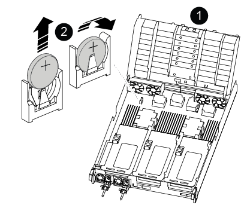

= 
:allow-uri-read: 

RTC バッテリーの交換手順は、コントローラーがオリジナル モデルか VER2 モデルかによって異なります。以下のタブを使用して、コントローラー モデルに適した手順を選択してください。

.このタスクについて
バッテリーは、オリジナル コントローラーの場合はライザー 2 (中央のライザー) の下、VER2 コントローラーの場合は DIMM の近くにあります。

[role="tabbed-block"]
====
.元のコントローラ
--
.手順
. PCIeライザー2（中央のライザー）をコントローラモジュールから取り外します。
+
.. PCIe カード内の SFP モジュールまたは QSFP モジュールを取り外します。
.. ライザーの左側にあるライザーロックラッチをファンモジュールの方に引き上げます。
+
ライザーがコントローラモジュールからわずかに持ち上がります。

.. ライザーを持ち上げ、ファンの方に動かしてライザーの金属板の縁がコントローラモジュールの端に接触しないようにします。次に、ライザーを持ち上げてコントローラモジュールから取り外し、安定した平らな場所に置きます。
+
image::../media/drw_a800_riser_2_3_remove.png[ライザー2の取り外し]

+
[cols="1,4"]
|===

 a| 
image:../media/icon_round_1.png["番号1"]
 a| 
エアダクト

 a| 
image:../media/icon_round_2.png["番号2"]
 a| 
ライザー 2 （中央）のロックラッチ

|===

. ライザー 2 の下で RTC バッテリの場所を確認します。
+
image::../media/drw_a800_rtc_battery_replace.png[RTCバッチを取り外して交換する]

+
[cols="1,4"]
|===

 a| 
image:../media/icon_round_1.png["番号1"]
 a| 
エアダクト

 a| 
image:../media/icon_round_2.png["番号2"]
 a| 
ライザー 2

 a| 
image:../media/icon_round_3.png["番号3"]
 a| 
RTC バッテリとホルダー

|===
. バッテリをそっと押してホルダーから離し、持ち上げてホルダーから取り出します。
+

NOTE: ホルダーから取り外す際に、バッテリの極の向きを確認しておいてください。バッテリに記載されているプラス記号に従って、バッテリをホルダーに正しく配置する必要があります。ホルダーの近くにプラス記号が表示されているので、バッテリーの位置を確認できます。

. 交換用バッテリを静電気防止用の梱包バッグから取り出します。
. RTC バッテリの極の向きを確認し、バッテリを斜めに傾けた状態で押し下げてホルダーに挿入します。
. バッテリがホルダーに完全に取り付けられ、かつ極の向きが正しいことを目で見て確認します。
. コントローラモジュールにライザーを取り付けます。
+
.. ライザーの縁をコントローラモジュールの金属板の下側に合わせます。
.. コントローラモジュールのピンにライザーを合わせ、コントローラモジュールに差し込みます。
.. ロックラッチを下に動かして、ロックされるまでクリックします。
+
ロックされたロックラッチはライザー上部と水平になり、ライザーがコントローラモジュールに垂直に装着されます。

.. PCIe カードから取り外したすべての SFP モジュールを再度取り付けます。

--
.Ver2コントローラ
--
.手順
. DIMMの近くでRTCバッテリの場所を確認します。
+

+
[cols="1,4"]
|===

 a| 
image:../media/icon_round_1.png["番号1"]
 a| 
エアダクト

 a| 
image:../media/icon_round_2.png["番号2"]
 a| 
RTC バッテリとホルダー

|===
. バッテリをそっと押してホルダーから離し、持ち上げてホルダーから取り出します。
+

NOTE: ホルダーから取り外す際に、バッテリの極の向きを確認しておいてください。バッテリに記載されているプラス記号に従って、バッテリをホルダーに正しく配置する必要があります。ホルダーの近くにプラス記号が表示されているので、バッテリーの位置を確認できます。

. 交換用バッテリを静電気防止用の梱包バッグから取り出します。
. RTC バッテリの極の向きを確認し、バッテリを斜めに傾けた状態で押し下げてホルダーに挿入します。
. バッテリがホルダーに完全に取り付けられ、かつ極の向きが正しいことを目で見て確認します。

--
====