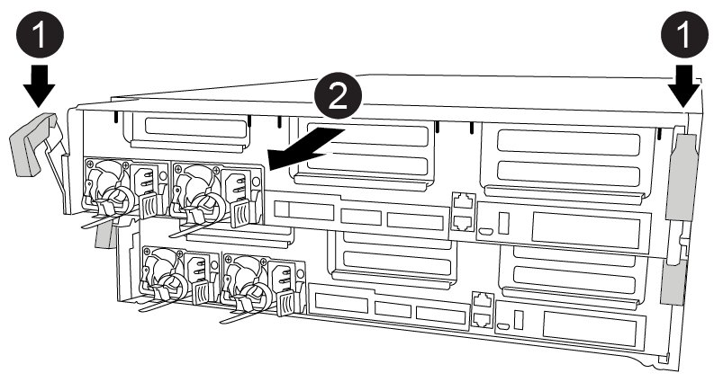

= 
:allow-uri-read: 

コントローラモジュール内部のコンポーネントにアクセスするには、コントローラモジュールをシャーシから取り外す必要があります。

次のアニメーション、図、または記載された手順に従って、コントローラモジュールをシャーシから取り外すことができます。

.アニメーション-コントローラモジュールを取り外します
video::ca74d345-e213-4390-a599-aae10019ec82[panopto]
.手順
. 接地対策がまだの場合は、自身で適切に実施します。
. 電源ケーブル固定クリップを外し、電源装置からケーブルを抜きます。
. ケーブルマネジメントデバイスに接続しているケーブルをまとめているフックとループストラップを緩め、システムケーブルと SFP をコントローラモジュールから外し（必要な場合）、どのケーブルが何に接続されていたかを記録します。
+
ケーブルはケーブルマネジメントデバイスに収めたままにします。これにより、ケーブルマネジメントデバイスを取り付け直すときに、ケーブルを整理する必要がありません。

. ケーブルマネジメントデバイスをコントローラモジュールから取り外し、脇に置きます。
. 両方のロックラッチを押し下げ、両方のラッチを同時に下方向に回転させます。
+
コントローラモジュールがシャーシから少し引き出されます。

+

+
[cols="10a,90a"]
|===

 a| 
image:../media/icon_round_1.png["番号1"]
 a| 
ロックラッチ

 a| 
image:../media/icon_round_2.png["番号2"]
 a| 
コントローラがシャーシからわずかに引き出されます

|===
. コントローラモジュールをシャーシから引き出します。
+
このとき、空いている手でコントローラモジュールの底面を支えてください。

. コントローラモジュールを安定した平らな場所に置きます。
. アニメーション、図、または記載された手順に従って、交換用コントローラモジュールでエアダクトを開き、コントローラモジュールから空のライザーを取り外します。
+
.アニメーション-交換用コントローラモジュールから空のライザーを取り外します
video::49053752-e813-4c15-a917-ab190147fa6e[panopto]

image::../media/drw_a400_empty_riser_remove.png[空のライザーの取り外し]

[cols="10,90"]
|===

 a| 
image:../media/icon_round_1.png["番号1"]
 a| 
ライザーリリースラッチ

|===
. エアダクトの側面にある固定ツメをコントローラモジュールの中央に向かって押します。
. エアダクトをコントローラモジュールの背面方向にスライドさせ、完全に開いた状態になるまで上方向に回転させます。
. ライザー 1 の左側にあるライザーロックラッチをエアダクトの方向に上に回し、ライザーを持ち上げて脇に置きます。
. 残りのライザーについても、同じ手順を繰り返します。

