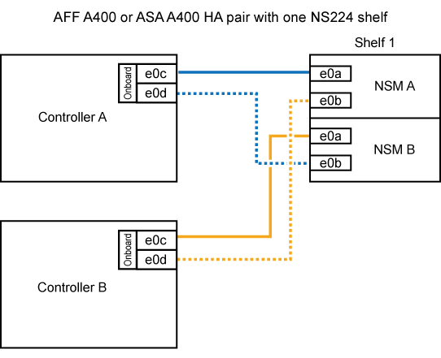
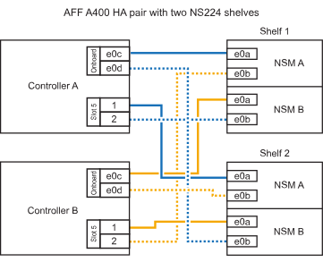

= A400 HAペアへのケーブルシェルフ
:allow-uri-read: 

[[cable-shelf-to-an-a400-ha-pair]]
== A400 HAペアへのケーブルシェルフ

AFF A400 HAペアの場合、最大2つのシェルフをホットアドでき、必要に応じてオンボードポートe0c/e0dとスロット5のポートを使用できます。

.手順
. 各コントローラの1セットのRoCE対応ポート（オンボードRoCE対応ポート）を使用して1台のシェルフをホットアドする場合に、このシェルフがHAペア内の唯一のNS224シェルフである場合は、次の手順を実行します。
+
それ以外の場合は、次の手順に進みます。

+
.. シェルフ NSM A ポート e0a をコントローラ A のポート e0c にケーブル接続します。
.. シェルフ NSM A のポート e0b をコントローラ B のポート e0d にケーブル接続します。
.. シェルフ NSM B ポート e0a をコントローラ B のポート e0c にケーブル接続します。
.. シェルフ NSM B のポート e0b をコントローラ A のポート e0d にケーブル接続します。
+
次の図は、各コントローラの1セットのRoCE対応ポートを使用した、1台のホットアドシェルフのケーブル接続を示しています。

+

. 各コントローラの2セットのRoCE対応ポート（オンボードおよびPCIeカードのRoCE対応ポート）を使用して1台または2台のシェルフをホットアドする場合は、次の手順を実行します。
+
[cols="1,3"]
|===
| シェルフ | ケーブル配線 

 a| 
シェルフ 1
 a| 
.. NSM A ポート e0a をコントローラ A のポート e0c にケーブル接続します。
.. NSM Aのポートe0bをコントローラBのスロット5のポート2（e5b）にケーブル接続します。
.. NSM B ポート e0a をコントローラ B のポート e0c にケーブル接続します。
.. NSM Bのポートe0bをコントローラAのスロット5のポート2（e5b）にケーブル接続します。
.. 2 番目のシェルフをホット アドする場合は、「`シェルフ 2`」のサブステップを完了します。それ以外の場合は、次の手順に進みます。

 a| 
シェルフ 2
 a| 
.. NSM Aのポートe0aをコントローラAのスロット5のポート1（e5a）にケーブル接続します。
.. NSM A のポート e0b をコントローラ B のポート e0d にケーブル接続します。
.. NSM Bのポートe0aをコントローラBのスロット5のポート1（e5a）にケーブル接続します。
.. NSM B のポート e0b をコントローラ A のポート e0d にケーブル接続します。
.. 次の手順に進みます。

|===
+
次の図は、 2 台のホットアドシェルフのケーブル接続を示しています。

+

. ホットアドしたシェルフがを使用して正しくケーブル接続されていることを確認します https://mysupport.netapp.com/site/tools/tool-eula/activeiq-configadvisor["Active IQ Config Advisor"^]。
+
ケーブル接続エラーが発生した場合は、表示される対処方法に従ってください。

[[cable-shelf-to-a-c400-ha-pair]]
== C400 HA ペアへのケーブルシェルフ

AFF C400 HAペアの場合、最大2つのシェルフをホットアドでき、必要に応じてスロット4と5のポートを使用できます。

.手順
. 各コントローラの1組のRoCE対応ポートを使用して1台のシェルフをホットアドする場合に、このシェルフがHAペア内の唯一のNS224シェルフである場合は、次の手順を実行します。
+
それ以外の場合は、次の手順に進みます。

+
.. シェルフNSM Aのポートe0aをコントローラAのスロット4のポート1（e4a）にケーブル接続します。
.. シェルフNSM Aのポートe0bをコントローラBのスロット4のポート2（e4b）にケーブル接続します。
.. シェルフのNSM Bのポートe0aをコントローラBのスロット4のポート1（e4a）にケーブル接続します。
.. シェルフのNSM Bのポートe0bをコントローラAのスロット4のポート2（e4b）にケーブル接続します。
+
次の図は、各コントローラの1セットのRoCE対応ポートを使用した、1台のホットアドシェルフのケーブル接続を示しています。

+
image::../media/drw_ns224_c400_1shelf_IEOPS-985.svg[1台のNS224シェルフと1セットのPCIeカードポートを使用したAFF / ASA C400のケーブル接続]

. 各コントローラの2セットのRoCE対応ポートを使用して1台または2台のシェルフをホットアドする場合は、次の手順を実行します。
+
[cols="1,3"]
|===
| シェルフ | ケーブル配線 

 a| 
シェルフ 1
 a| 
.. NSM Aのポートe0aをコントローラAのスロット4のポート1（e4a）にケーブル接続します。
.. NSM Aのポートe0bをコントローラBのスロット5のポート2（e5b）にケーブル接続します。
.. NSM Bのポートe0aをコントローラBのポートスロット4のポート1（e4a）にケーブル接続します。
.. NSM Bのポートe0bをコントローラAのスロット5のポート2（e5b）にケーブル接続します。
.. 2 番目のシェルフをホット アドする場合は、「`シェルフ 2`」のサブステップを完了します。それ以外の場合は、次の手順に進みます。

 a| 
シェルフ 2
 a| 
.. NSM Aのポートe0aをコントローラAのスロット5のポート1（e5a）にケーブル接続します。
.. NSM Aのポートe0bをコントローラBのスロット4のポート2（e4b）にケーブル接続します。
.. NSM Bのポートe0aをコントローラBのスロット5のポート1（e5a）にケーブル接続します。
.. NSM Bのポートe0bをコントローラAのスロット4のポート2（e4b）にケーブル接続します。
.. 次の手順に進みます。

|===
+
次の図は、 2 台のホットアドシェルフのケーブル接続を示しています。

+
image::../media/drw_ns224_c400_2shelves_IEOPS-984.svg[2台のNS224シェルフと2セットのPCIeカードポートを備えたAFF / ASA C400のケーブル接続]

. ホットアドしたシェルフがを使用して正しくケーブル接続されていることを確認します https://mysupport.netapp.com/site/tools/tool-eula/activeiq-configadvisor["Active IQ Config Advisor"^]。
+
ケーブル接続エラーが発生した場合は、表示される対処方法に従ってください。

