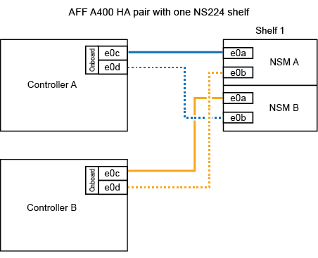

= 
:allow-uri-read: 

NS224シェルフをホットアド用にケーブル接続する方法は、AFF A400とAFF C400のどちらのHAペアを使用しているかによって異なります。

.作業を開始する前に
* を確認しておく必要があります link:requirements-hot-add-shelf.html["ホットアドの要件とベストプラクティス"]。
* の該当する手順を完了しておく必要があります link:prepare-hot-add-shelf.html["準備-シェルフのホットアド"]。
* の説明に従って、シェルフを設置し、電源をオンにし、シェルフIDを設定しておく必要があります link:prepare-hot-add-shelf.html["ホットアド用のシェルフの設置"]。

*シェルフをAFF A400 HAペアにケーブル接続*

AFF A400 HAペアの場合は、最大2台のシェルフをホットアドし、必要に応じてオンボードポートe0c / e0dとスロット5のポートを使用できます。

.手順
. 各コントローラの1セットのRoCE対応ポート（オンボードRoCE対応ポート）を使用して1台のシェルフをホットアドする場合に、このシェルフがHAペア内の唯一のNS224シェルフである場合は、次の手順を実行します。
+
それ以外の場合は、次の手順に進みます。

+
.. シェルフ NSM A ポート e0a をコントローラ A のポート e0c にケーブル接続します。
.. シェルフ NSM A のポート e0b をコントローラ B のポート e0d にケーブル接続します。
.. シェルフ NSM B ポート e0a をコントローラ B のポート e0c にケーブル接続します。
.. シェルフ NSM B のポート e0b をコントローラ A のポート e0d にケーブル接続します。
+
次の図は、各コントローラの1セットのRoCE対応ポートを使用した、1台のホットアドシェルフのケーブル接続を示しています。

+

. 各コントローラの2セットのRoCE対応ポート（オンボードおよびPCIeカードのRoCE対応ポート）を使用して1台または2台のシェルフをホットアドする場合は、次の手順を実行します。
+
[cols="1,3"]
|===
| シェルフ | ケーブル配線 

 a| 
シェルフ 1
 a| 
.. NSM A ポート e0a をコントローラ A のポート e0c にケーブル接続します。
.. NSM Aのポートe0bをコントローラBのスロット5のポート2（e5b）にケーブル接続します。
.. NSM B ポート e0a をコントローラ B のポート e0c にケーブル接続します。
.. NSM Bのポートe0bをコントローラAのスロット5のポート2（e5b）にケーブル接続します。
.. 2 台目のシェルフをホットアドする場合は、「シェルフ 2 」の手順を実行します。そうでない場合は、手順 3 に進みます。

 a| 
シェルフ 2
 a| 
.. NSM Aのポートe0aをコントローラAのスロット5のポート1（e5a）にケーブル接続します。
.. NSM A のポート e0b をコントローラ B のポート e0d にケーブル接続します。
.. NSM Bのポートe0aをコントローラBのスロット5のポート1（e5a）にケーブル接続します。
.. NSM B のポート e0b をコントローラ A のポート e0d にケーブル接続します。
.. 手順 3 に進みます。

|===
+
次の図は、 2 台のホットアドシェルフのケーブル接続を示しています。

+
image::../media/drw_ns224_a400_2shelves_IEOPS-983.svg[2台のNS224シェルフと1セットのオンボードポートと1セットのPCIeカード上の1セットのポートを使用したAFF A400のケーブル接続]

. ホットアドしたシェルフがを使用して正しくケーブル接続されていることを確認します https://mysupport.netapp.com/site/tools/tool-eula/activeiq-configadvisor["Active IQ Config Advisor"^]。
+
ケーブル接続エラーが発生した場合は、表示される対処方法に従ってください。

. この手順の準備作業として自動ドライブ割り当てを無効にした場合は、ドライブ所有権を手動で割り当ててから、必要に応じてドライブの自動割り当てを再度有効にする必要があります。を参照して link:complete-hot-add-shelf.html["ホットアドを完了します"]
+
それ以外の場合は、この手順を使用します。

*シェルフをAFF C400 HAペアにケーブル接続*

AFF C400 HAペアの場合は、最大2台のシェルフをホットアドし、必要に応じてスロット4と5のポートを使用できます。

.手順
. 各コントローラの1組のRoCE対応ポートを使用して1台のシェルフをホットアドする場合に、このシェルフがHAペア内の唯一のNS224シェルフである場合は、次の手順を実行します。
+
それ以外の場合は、次の手順に進みます。

+
.. シェルフNSM Aのポートe0aをコントローラAのスロット4のポート1（e4a）にケーブル接続します。
.. シェルフNSM Aのポートe0bをコントローラBのスロット4のポート2（e4b）にケーブル接続します。
.. シェルフのNSM Bのポートe0aをコントローラBのスロット4のポート1（e4a）にケーブル接続します。
.. シェルフのNSM Bのポートe0bをコントローラAのスロット4のポート2（e4b）にケーブル接続します。
+
次の図は、各コントローラの1セットのRoCE対応ポートを使用した、1台のホットアドシェルフのケーブル接続を示しています。

+
image::../media/drw_ns224_c400_1shelf_IEOPS-985.svg[1台のNS224シェルフと1セットのPCIeカードポートを使用したAFF C400のケーブル接続]

. 各コントローラの2セットのRoCE対応ポートを使用して1台または2台のシェルフをホットアドする場合は、次の手順を実行します。
+
[cols="1,3"]
|===
| シェルフ | ケーブル配線 

 a| 
シェルフ 1
 a| 
.. NSM Aのポートe0aをコントローラAのスロット4のポート1（e4a）にケーブル接続します。
.. NSM Aのポートe0bをコントローラBのスロット5のポート2（e5b）にケーブル接続します。
.. NSM Bのポートe0aをコントローラBのポートスロット4のポート1（e4a）にケーブル接続します。
.. NSM Bのポートe0bをコントローラAのスロット5のポート2（e5b）にケーブル接続します。
.. 2 台目のシェルフをホットアドする場合は、「シェルフ 2 」の手順を実行します。そうでない場合は、手順 3 に進みます。

 a| 
シェルフ 2
 a| 
.. NSM Aのポートe0aをコントローラAのスロット5のポート1（e5a）にケーブル接続します。
.. NSM Aのポートe0bをコントローラBのスロット4のポート2（e4b）にケーブル接続します。
.. NSM Bのポートe0aをコントローラBのスロット5のポート1（e5a）にケーブル接続します。
.. NSM Bのポートe0bをコントローラAのスロット4のポート2（e4b）にケーブル接続します。
.. 手順 3 に進みます。

|===
+
次の図は、 2 台のホットアドシェルフのケーブル接続を示しています。

+
image::../media/drw_ns224_c400_2shelves_IEOPS-984.svg[2台のNS224シェルフと2セットのPCIeカードポートを備えたAFF C400のケーブル接続]

. ホットアドしたシェルフがを使用して正しくケーブル接続されていることを確認します https://mysupport.netapp.com/site/tools/tool-eula/activeiq-configadvisor["Active IQ Config Advisor"^]。
+
ケーブル接続エラーが発生した場合は、表示される対処方法に従ってください。

.次の手順
この手順の準備作業として自動ドライブ割り当てを無効にした場合は、ドライブ所有権を手動で割り当ててから、必要に応じて自動ドライブ割り当てを再度有効にする必要があります。にアクセスします。

それ以外の場合は、シェルフのホットアド手順は終了です。
