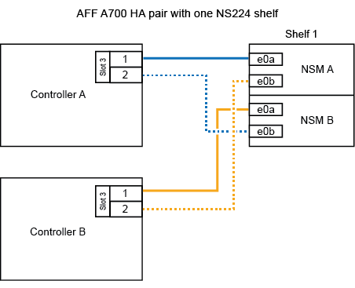
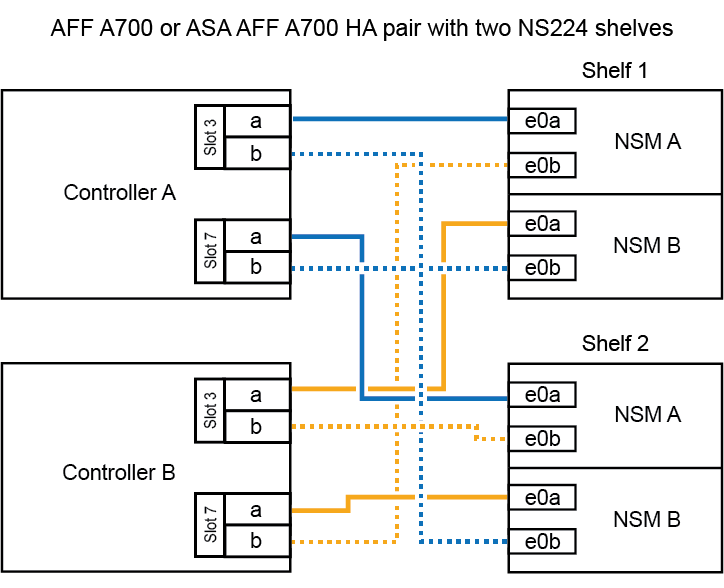

= 
:allow-uri-read: 

.作業を開始する前に
初期のNS224シェルフをホットアドする場合（HAペアにNS224シェルフがない場合）は、コアダンプ（コアファイルを格納）をサポートするために、各コントローラにコアダンプモジュール（X9170A、NVMe 1TB SSD）を取り付ける必要があります。

+ link:../fas9000/caching-module-and-core-dump-module-replace.html["キャッシングモジュールを交換するか、コアダンプモジュール AFF A700 および FAS9000 を追加 / 交換してください"^]を参照してください。

.このタスクについて
NS224シェルフをAFF A700 HAペアにケーブル接続する方法は、ホットアドするシェルフの数と、コントローラで使用するRoCE対応ポートセットの数（1つまたは2つ）によって異なります。

.手順
. 各コントローラのRoCE対応ポートのセット（RoCE対応I/Oモジュール×1）を1つ使用して1台のシェルフをホットアドする場合で、このシェルフがHAペア内で唯一のNS224シェルフである場合は、次の手順を実行します。
+
それ以外の場合は、次の手順に進みます。

+

NOTE: この手順では、RoCE対応I/Oモジュールが各コントローラのスロット7ではなくスロット3に取り付けられていることを前提としています。

+
.. シェルフ NSM A ポート e0a をコントローラ A のスロット 3 のポートにケーブル接続します
.. シェルフ NSM A のポート e0b をコントローラ B のスロット 3 のポート B にケーブル接続します
.. シェルフ NSM B ポート e0a をコントローラ B のスロット 3 のポート a にケーブル接続します
.. シェルフ NSM B のポート e0b をコントローラ A のスロット 3 のポート B にケーブル接続します
+
次の図は、各コントローラでRoCE対応I/Oモジュールを1つ使用した1台のホットアドシェルフのケーブル接続を示しています。

+

. 各コントローラの2セットのRoCE対応ポート（2つのRoCE対応I/Oモジュール）を使用して1台または2台のシェルフをホットアドする場合は、該当する手順を実行します。
+
[cols="1,3"]
|===
| シェルフ | ケーブル配線 

 a| 
シェルフ 1
 a| 

NOTE: 以下の手順は、シェルフポート e0a をスロット 7 ではなくスロット 3 にある RoCE 対応 I/O モジュールにケーブル接続することで、ケーブル接続を開始することを前提としています。

.. NSM A ポート e0a をコントローラ A のスロット 3 のポートにケーブル接続します
.. NSM A のポート e0b をコントローラ B のスロット 7 のポート B にケーブル接続します
.. NSM B ポート e0a をコントローラ B のスロット 3 のポート a にケーブル接続します
.. NSM B のポート e0b をコントローラ A のスロット 7 のポート B にケーブル接続します
.. 2 番目のシェルフをホット アドする場合は、「`シェルフ 2`」のサブステップを完了します。それ以外の場合は、次の手順に進みます。

 a| 
シェルフ 2
 a| 

NOTE: これらの手順は、シェルフポート e0a をスロット 3 （シェルフ 1 のケーブル接続手順に対応）ではなく、スロット 7 の RoCE 対応 I/O モジュールにケーブル接続することで開始されることを前提としています。

.. NSM A ポート e0a をコントローラ A のスロット 7 のポートにケーブル接続します
.. NSM A のポート e0b をコントローラ B のスロット 3 のポート B にケーブル接続します
.. NSM B ポート e0a をコントローラ B のスロット 7 のポート a にケーブル接続します
.. NSM B のポート e0b をコントローラ A のスロット 3 のポート B にケーブル接続します
.. 次の手順に進みます。

|===
+
次の図は、 1 台目と 2 台目のホットアドシェルフのケーブル接続を示しています。

+

. ホットアドしたシェルフがを使用して正しくケーブル接続されていることを確認します https://mysupport.netapp.com/site/tools/tool-eula/activeiq-configadvisor["Active IQ Config Advisor"^]。
+
ケーブル接続エラーが発生した場合は、表示される対処方法に従ってください。

