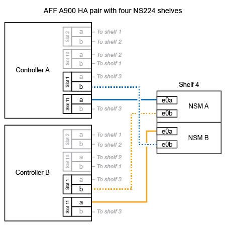

= 
:allow-uri-read: 

.このタスクについて
* この手順では、 HA ペアに既存の NS224 シェルフが少なくとも 1 台あること、およびシェルフを最大 3 台までホットアドすることを前提としています。
* HA ペアに既存の NS224 シェルフが 1 台しかない場合、この手順では、シェルフが各コントローラ上の RoCE 対応 100GbE I/O モジュール 2 台にケーブル接続されていると想定しています。

.手順
. ホットアドする NS224 シェルフが HA ペアの 2 台目の NS224 シェルフになる場合は、次の手順を実行します。
+
それ以外の場合は、次の手順に進みます。

+
.. シェルフ NSM A のポート e0a をコントローラ A のスロット 10 のポート A （ e10a ）にケーブル接続します。
.. シェルフ NSM A ポート e0b をコントローラ B のスロット 2 のポート b （ e2b ）にケーブル接続します。
.. シェルフ NSM B ポート e0a をコントローラ B のスロット 10 のポート A （ e10A ）にケーブル接続します。
.. シェルフ NSM B のポート e0b をコントローラ A のスロット 2 のポート b （ e2b ）にケーブル接続します。
+
次の図は、 2 台目のシェルフ（および 1 台目のシェルフ）のケーブル接続を示しています。

+
image::../media/drw_ns224_a900_2shelves.png[2台のNS224シェルフと2台のIOモジュールを搭載したAFF / ASA A900のケーブル接続]

. ホットアドする NS224 シェルフが HA ペアの 3 台目の NS224 シェルフになる場合は、次の手順を実行します。
+
それ以外の場合は、次の手順に進みます。

+
.. シェルフ NSM A ポート e0a をコントローラ A のスロット 1 のポート A （ e1a ）にケーブル接続します。
.. シェルフ NSM A のポート e0b をコントローラ B のスロット 11 のポート b （ e11b ）にケーブル接続します。
.. シェルフ NSM B ポート e0a をコントローラ B のスロット 1 のポート A （ e1a ）にケーブル接続します。
.. シェルフ NSM B のポート e0b をコントローラ A のスロット 11 のポート b （ e11b ）にケーブル接続します。
+
次の図は、 3 台目のシェルフのケーブル接続を示しています。

+
image::../media/drw_ns224_a900_3shelves.png[3台のNS224シェルフと4台のIOモジュールを搭載したAFF / ASA A900のケーブル接続]

. ホットアドする NS224 シェルフが HA ペアの 4 台目の NS224 シェルフになる場合は、次の手順を実行します。
+
それ以外の場合は、次の手順に進みます。

+
.. シェルフ NSM A のポート e0a をコントローラ A のスロット 11 のポート A （ e11a ）にケーブル接続します。
.. シェルフ NSM A のポート e0b をコントローラ B のスロット 1 のポート b （ e1b ）にケーブル接続します。
.. シェルフ NSM B ポート e0a をコントローラ B のスロット 11 のポート A （ e11a ）にケーブル接続します。
.. シェルフ NSM B のポート e0b をコントローラ A のスロット 1 のポート b （ e1b ）にケーブル接続します。
+
次の図は、 4 台目のシェルフのケーブル接続を示しています。

+

. ホットアドしたシェルフがを使用して正しくケーブル接続されていることを確認します https://mysupport.netapp.com/site/tools/tool-eula/activeiq-configadvisor["Active IQ Config Advisor"^]。
+
ケーブル接続エラーが発生した場合は、表示される対処方法に従ってください。

