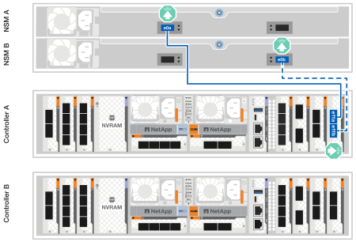

= 手順1：ストレージコントローラをネットワークに接続する
:allow-uri-read: 

.作業を開始する前に
ケーブル配線図の図矢印を参照して、ケーブルコネクタのプルタブの向きが正しいかどうかを確認します。

image::../media/drw_cable_pull_tab_direction_ieops-1699.svg[ケーブルプルタブの向きの例]

* コネクタを挿入すると、カチッという音がして所定の位置に収まります。カチッという音がしない場合は、コネクタを取り外し、ケーブルヘッドを裏返してやり直してください。
* 光スイッチに接続する場合は、ポートにケーブル接続する前に、Small Form-factor Pluggable（SFP）トランシーバをコントローラポートに挿入します。

== 手順1：ストレージコントローラをネットワークに接続する

コントローラ同士、およびホストネットワークに直接接続します。

.作業を開始する前に
ストレージシステムをホストネットワークスイッチに接続する方法については、ネットワーク管理者にお問い合わせください。

.このタスクについて
ここでは、一般的な設定について説明します。具体的なケーブル接続は、ご使用のストレージシステム用に注文したコンポーネントによって異なります。設定およびスロットプライオリティの詳細については、を参照してください link:https://hwu.netapp.com["NetApp Hardware Universe の略"^]。

[role="tabbed-block"]
====
.ASA A1Kストレージシステム
--
ストレージコントローラを相互に接続してONTAPクラスタ接続を確立し、各コントローラのイーサネットポートをホストネットワークに接続します。

.手順
. クラスタ/ HAインターコネクトケーブルを使用して、ポートe1aとe1a、ポートe7aとe7aを接続します。
+

NOTE: クラスタインターコネクトトラフィックとHAトラフィックは、同じ物理ポートを共有します。

+
.. コントローラAのポートe1aをコントローラBのポートe1aに接続します。
.. コントローラAのポートe7aをコントローラBのポートe1aに接続します。
+
*クラスタ/ HAインターコネクトケーブル*

+
image::../media/oie_cable_25Gb_Ethernet_SFP28_IEOPS-1069.svg[クラスタHAケーブル]

+
image::../media/drw_a1k_tnsc_cluster_cabling_ieops-1648.svg[2ノードスイッチレスクラスタのケーブル配線図]

. イーサネットモジュールポートをホストネットワークに接続します。
+
次に、一般的なホストネットワークのケーブル接続例を示します。ご使用のシステム構成については、を参照してください link:https://hwu.netapp.com["NetApp Hardware Universe の略"^] 。

+
.. 図に示すように、ポートe9aとe9bをイーサネットデータネットワークスイッチに接続します。
+

NOTE: クラスタトラフィックとHAトラフィックのシステムパフォーマンスを最大限にするためには、ホストネットワーク接続にポートe1bとe7bを使用しないことを推奨します。パフォーマンスを最大化するには、別のホストカードを使用します。

+
* 100GbEケーブル*

+
image::../media/oie_cable_sfp_gbe_copper.svg[100Gbイーサネットケーブル]

+
image::../media/drw_a1k_network_cabling1_ieops-1649.svg[100Gbイーサネットネットワークへのケーブル接続]

.. 10 / 25GbEホストネットワークスイッチを接続します。
+
* 10/25GbEホスト*

+
image::../media/oie_cable_sfp_gbe_copper.svg[10/25Gbイーサネットケーブル]

+
image::../media/drw_a1k_network_cabling2_ieops-1650.svg[10 / 25Gbイーサネットネットワークへのケーブル接続]

. 1000BASE-T RJ-45ケーブルを使用して、コントローラ管理（レンチ）ポートを管理ネットワークスイッチに接続します。
+
image::../media/oie_cable_rj45.svg[RJ-45ケーブル]

+
* 1000BASE-T RJ-45ケーブル*

+
image::../media/drw_a1k_management_connection_ieops-1651.svg[管理ネットワークへの接続]

IMPORTANT: まだ電源コードを接続しないでください。

--
.ASA A70およびASA A90ストレージシステム
--
ストレージコントローラを相互に接続してONTAPクラスタ接続を確立し、各コントローラのイーサネットポートをホストネットワークに接続します。

.手順
. クラスタ/ HAインターコネクトケーブルを使用して、ポートe1aとe1aを接続し、ポートe7aとe7aを接続します。
+

NOTE: クラスタインターコネクトトラフィックとHAトラフィックは、同じ物理ポートを共有します。

+
.. コントローラAのポートe1aをコントローラBのポートe1aに接続します。
.. コントローラAのポートe7aをコントローラBのポートe1aに接続します。
+
*クラスタ/ HAインターコネクトケーブル*

+
image::../media/oie_cable_25Gb_Ethernet_SFP28_IEOPS-1069.svg[クラスタHAケーブル]

+
image::../media/drw_70-90_tnsc_cluster_cabling_ieops-1653.svg[2ノードスイッチレスクラスタのケーブル配線図]

. イーサネットモジュールポートをホストネットワークに接続します。
+
次に、一般的なホストネットワークのケーブル接続例を示します。ご使用のシステム構成については、を参照してください link:https://hwu.netapp.com["NetApp Hardware Universe の略"^] 。

+
.. 図に示すように、ポートe9aとe9bをイーサネットデータネットワークスイッチに接続します。
+

NOTE: クラスタトラフィックとHAトラフィックのシステムパフォーマンスを最大限にするためには、ホストネットワーク接続にポートe1bとe7bを使用しないことを推奨します。パフォーマンスを最大化するには、別のホストカードを使用します。

+
* 100GbEケーブル*

+
image::../media/oie_cable_sfp_gbe_copper.svg[100Gbイーサネットケーブル]

+
image::../media/drw_70-90_network_cabling1_ieops-1654.svg[100Gbイーサネットネットワークへのケーブル接続]

.. 10 / 25GbEホストネットワークスイッチを接続します。
+
* 4ポート、10/25GbEホスト*

+
image::../media/oie_cable_sfp_gbe_copper.svg[10/25Gbケーブル]

+
image::../media/drw_70-90_network_cabling2_ieops-1655.svg[100Gbイーサネットネットワークへのケーブル接続]

. 1000BASE-T RJ-45ケーブルを使用して、コントローラ管理（レンチ）ポートを管理ネットワークスイッチに接続します。
+
image::../media/oie_cable_rj45.svg[RJ45ケーブル]

+
* 1000BASE-T RJ-45ケーブル*

+
image::../media/drw_70-90_management_connection_ieops-1656.svg[管理ネットワークへの接続]

IMPORTANT: まだ電源コードを接続しないでください。

--
====

== 手順2：ストレージコントローラをストレージシェルフに接続する

次のケーブル接続手順では、1台のシェルフと2台のシェルフにコントローラを接続する方法を示します。最大4台のシェルフをコントローラに直接接続できます。

[role="tabbed-block"]
====
.ASA A1Kシステム
--
次のいずれかのケーブル接続オプションを、ご使用の環境に合わせて選択します。

.オプション1：コントローラを1台のNS224ストレージシェルフにケーブル接続する
[%collapsible]
=====
各コントローラをNS224シェルフのNSMモジュールに接続します。図は、各コントローラからのケーブル接続を示しています。コントローラAのケーブル接続は青、コントローラBのケーブル接続は黄色です。

.手順
. コントローラAで、次のポートを接続します。
+
.. ポートe11aをNSM Aのポートe0aに接続します。
.. ポートe11bをポートNSM Bのポートe0bに接続します。
+

. コントローラBで、次のポートを接続します。
+
.. ポートe11aをNSM Bのポートe0aに接続します。
.. ポートe11bをNSM Aのポートe0bに接続します。
+
image:../media/drw_a1k_1shelf_cabling_b_ieops-1704.svg["コントローラBのポートe11aおよびe11bを1台のNS224シェルフにケーブル接続"]

=====
.オプション2：コントローラを2台のNS224ストレージシェルフにケーブル接続する
[%collapsible]
=====
各コントローラを両方のNS224シェルフのNSMモジュールに接続します。図は、各コントローラからのケーブル接続を示しています。コントローラAのケーブル接続は青、コントローラBのケーブル接続は黄色です。

.手順
. コントローラAで、次のポートを接続します。
+
.. ポートe11aをシェルフ1のNSM Aのポートe0aに接続します。
.. ポートe11bをシェルフ2のNSM Bのポートe0bに接続します。
.. ポートe10aをシェルフ2のNSM Aのポートe0aに接続します。
.. ポートe10bをシェルフ1のNSM Aのポートe0bに接続します。
+
image:../media/drw_a1k_2shelf_cabling_a_ieops-1705.svg["コントロオラAノコントロオラ/シエルフカンノセツソク"]

. コントローラBで、次のポートを接続します。
+
.. ポートe11aをシェルフ1のNSM Bのポートe0aに接続します。
.. ポートe11bをシェルフ2のNSM Aのポートe0bに接続します。
.. ポートe10aをシェルフ2のNSM Bのポートe0aに接続します。
.. ポートe10bをシェルフ1のNSM Aのポートe0bに接続します。
+
image:../media/drw_a1k_2shelf_cabling_b_ieops-1706.svg["コントローラBのコントローラ/シェルフ間の接続"]

=====
--
.ASA A70 および A90 システム
--
次のいずれかのケーブル接続オプションを、ご使用の環境に合わせて選択します。

.オプション1：コントローラを1台のNS224ストレージシェルフに接続する
[%collapsible]
=====
各コントローラをNS224シェルフのNSMモジュールに接続します。図は、各コントローラからのケーブル接続を示しています。コントローラAのケーブル接続は青、コントローラBのケーブル接続は黄色です。

* 100GbE QSFP28銅線ケーブル*

image::../media/oie_cable100_gbe_qsfp28.svg[100GbE QSFP28銅線ケーブル]

.手順
. コントローラAのポートe11aをNSM Aのポートe0aに接続します。
. コントローラAのポートe11bをポートNSM Bのポートe0bに接続します。
+
image:../media/drw_a70-90_1shelf_cabling_a_ieops-1731.svg["コントローラAのe11aおよびe11bを1台のNS224シェルフに移行"]

. コントローラBのポートe11aをNSM Bのポートe0aに接続します。
. コントローラBのポートe11bをNSM Aのポートe0bに接続します。
+
image:../media/drw_a70-90_1shelf_cabling_b_ieops-1732.svg["コントローラB e11aおよびe11bを1台のNS224シェルフに接続"]

=====
.オプション2：コントローラを2台のNS224ストレージシェルフに接続する
[%collapsible]
=====
各コントローラを両方のNS224シェルフのNSMモジュールに接続します。図は、各コントローラからのケーブル接続を示しています。コントローラAのケーブル接続は青、コントローラBのケーブル接続は黄色です。

* 100GbE QSFP28銅線ケーブル*

image::../media/oie_cable100_gbe_qsfp28.svg[100GbE QSFP28銅線ケーブル]

.手順
. コントローラAで、次のポートを接続します。
+
.. ポートe11aをシェルフ1、NSM Aのポートe0aに接続します。
.. ポートe11bをシェルフ2、NSM Bのポートe0bに接続します。
.. ポートe8aをシェルフ2、NSM Aのポートe0aに接続します。
.. ポートe8bをシェルフ1、NSM Bのポートe0bに接続します。
+
image:../media/drw_a70-90_2shelf_cabling_a_ieops-1733.svg["コントロオラAノコントロオラ/シエルフカンノセツソク"]

. コントローラBで、次のポートを接続します。
+
.. ポートe11aをシェルフ1、NSM Bのポートe0aに接続します。
.. ポートe11bをシェルフ2、NSM Aのポートe0bに接続します。
.. ポートe8aをシェルフ2、NSM Bのポートe0aに接続します。
.. ポートe8bをシェルフ1、NSM Aのポートe0bに接続します。
+
image:../media/drw_a70-90_2shelf_cabling_b_ieops-1734.svg["コントローラBのコントローラ/シェルフ間の接続"]

=====
--
====