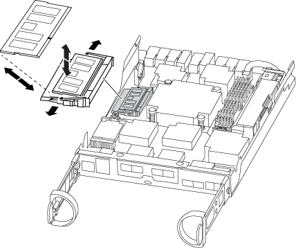

= コントローラモジュールハードウェアを交換してください- AFF A150
:allow-uri-read: 
:icons: font
:imagesdir: ../media/

[role="lead"]
コントローラモジュールハードウェアを交換するには、障害のあるコントローラを取り外し、 FRU コンポーネントを交換用コントローラモジュールに移動し、交換用コントローラモジュールをシャーシに取り付けてから、システムをメンテナンスモードでブートする必要があります。

== 手順 1 ：コントローラモジュールを取り外す

コントローラモジュールを交換するには、最初に古いコントローラモジュールをシャーシから取り外す必要があります。

. 接地対策がまだの場合は、自身で適切に実施します。
. ケーブルマネジメントデバイスに接続しているケーブルをまとめているフックとループストラップを緩め、システムケーブルと SFP をコントローラモジュールから外し（必要な場合）、どのケーブルが何に接続されていたかを記録します。
+
ケーブルはケーブルマネジメントデバイスに収めたままにします。これにより、ケーブルマネジメントデバイスを取り付け直すときに、ケーブルを整理する必要がありません。

. ケーブルマネジメントデバイスをコントローラモジュールの右側と左側から取り外し、脇に置きます。
+
image::../media/drw_25xx_cable_management_arm.png[DRW 25xx ケーブル管理アーム]

. ケーブルを外したあとで SFP モジュールをシステムに残した場合は、それらを新しいコントローラモジュールに移動します。
. カムハンドルのラッチをつかんで解除し、カムハンドルを最大限に開いてコントローラモジュールをミッドプレーンから離し、両手でコントローラモジュールをシャーシから外します。
+
image::../media/drw_2240_x_opening_cam_latch.png[DRW 2240 x オープンカムラッチ]

. コントローラモジュールを裏返し、平らで安定した場所に置きます。
. カバーを開くには、青いタブをスライドしてカバーを外し、カバーを上げて開きます。
+
image::../media/drw_2600_opening_pcm_cover.png[DRW 2600 オープニング PCM カバー]

== 手順 2 ： NVMEM バッテリを移動します

NVMEM バッテリを古いコントローラモジュールから新しいコントローラモジュールに移動するには、特定の手順を実行する必要があります。

. NVMEM の LED を確認します。
+
** HA 構成のシステムの場合は、次の手順に進みます。
** システムがスタンドアロン構成の場合は、コントローラモジュールをクリーンシャットダウンし、 NV アイコンのある NVRAM の LED を確認します。
+
image::../media/drw_hw_nvram_icon.png[DRW hw NVRAM アイコン]

+

NOTE: システムを停止すると、内容がフラッシュメモリにデステージされている間、 NVRAM の LED が点滅します。デステージが完了すると LED は消灯します。

+
*** クリーンシャットダウンせずに電源が失われた場合は、 NVMEM の LED が点滅し、デステージが完了すると消灯します。
*** LED が点灯し、電源もオンになっている場合、書き込み前のデータは NVMEM に格納されます。
+
一般にこの状況は、 ONTAP が正常にブートしたあとの異常シャットダウン中に発生します。

. コントローラモジュールで NVMEM バッテリの場所を確認します。
+
image::../media/drw_2600_nvmem_battery_move_animated_gif.png[DRW 2600 NVMEM バッテリのアニメーション GIF 移動]

. バッテリプラグの場所を確認し、バッテリプラグ前面のクリップを押してプラグをソケットから外し、バッテリケーブルをソケットから抜きます。
. バッテリをつかんで「 PUSH 」と書かれた青色の固定ツメを押し、バッテリを持ち上げてホルダーとコントローラモジュールから取り出します。
. バッテリを交換用コントローラモジュールに移動します。
. バッテリケーブルをバッテリホルダー側面のケーブルチャネルに巻き付けます。
. バッテリホルダーのキーリブを金属板の側壁にある「 V 」ノッチに合わせてバッテリパックを配置します。
. バッテリパックを金属板の側壁に沿って下にスライドさせます。側壁のサポートタブがバッテリパックのスロットに収まると、バッテリパックのラッチがカチッという音を立てて側壁の開口部に固定されます。

== 手順 3 ：ブートメディアを移動します

ブートメディアの場所を確認し、手順に従って古いコントローラモジュールからブートメディアを取り外して、新しいコントローラモジュールに挿入する必要があります。

. 次の図またはコントローラモジュールの FRU マップを使用して、ブートメディアの場所を確認します。
+
image::../media/drw_2600_boot_media_repl_animated_gif.png[DRW 2600 ブートメディア repl アニメーション GIF]

. ブートメディアケースの青いボタンを押してブートメディアをケースからリリースし、ブートメディアソケットからゆっくりと引き出します。
+

NOTE: ソケットやブートメディアが損傷する可能性があるため、ブートメディアをねじったり、真上に引き出したりしないでください。

. 新しいコントローラモジュールにブートメディアを移し、ブートメディアの端をソケットケースに合わせ、ソケットにゆっくりと押し込みます。
. ブートメディアが正しい向きでソケットに完全に装着されたことを確認します。
+
必要に応じて、ブートメディアを取り外してソケットへの装着をやり直します。

. ブートメディアを押し下げて、ブートメディアケースの固定ボタンをはめ込みます。

== 手順 4 ： DIMM を移動します

DIMM を移動するには、手順に従って古いコントローラモジュールの DIMM の場所を確認し、交換用コントローラモジュールに移動する必要があります。

障害のあるコントローラモジュールから交換用コントローラモジュールの対応するスロットに DIMM を直接移動できるように、新しいコントローラモジュールを準備しておく必要があります。

. コントローラモジュールで DIMM の場所を確認します。
. DIMM を交換用コントローラモジュールに正しい向きで挿入できるように、ソケット内の DIMM の向きをメモします。
. DIMM の両側にある 2 つのツメをゆっくり押し開いて DIMM をスロットから外し、そのままスライドさせてスロットから取り出します。
+

NOTE: DIMM 回路基板のコンポーネントに力が加わらないように、 DIMM の両端を慎重に持ちます。

+
DIMM の数と配置は、システムのモデルによって異なります。

+
次の図は、システム DIMM の場所を示しています。

+

. 必要に応じて、同じ手順を繰り返して他の DIMM を取り外します。
. NVMEM バッテリが新しいコントローラモジュールに接続されていないことを確認します。
. DIMM を取り付けるスロットの位置を確認します。
. コネクタにある DIMM のツメが開いた状態になっていることを確認し、 DIMM をスロットに対して垂直に挿入します。
+
DIMM のスロットへの挿入にはある程度の力が必要です。簡単に挿入できない場合は、 DIMM をスロットに正しく合わせてから再度挿入してください。

+

NOTE: DIMM がスロットにまっすぐ差し込まれていることを目で確認してください。

. 残りの DIMM についても、上記の手順を繰り返します。
. NVMEM バッテリプラグソケットの場所を確認し、バッテリケーブルプラグ前面のクリップを押してソケットに挿入します。
+
プラグがコントローラモジュールに固定されていることを確認します。

== 手順 5 ：キャッシングモジュールがある場合は移動します

AFF A220 または FAS2700 システムにキャッシングモジュールが搭載されている場合は、キャッシングモジュールを古いコントローラモジュールから交換用コントローラモジュールに移動する必要があります。キャッシングモジュールは、コントローラモジュールラベル上の「 M.2 PCIe カード」と呼ばれます。

古いコントローラモジュールから新しいコントローラモジュールの対応するスロットにキャッシングモジュールを直接移動できるように、新しいコントローラモジュールを準備しておく必要があります。ストレージシステムのその他のコンポーネントがすべて正常に動作している必要があります。問題がある場合は、必ずテクニカルサポートにお問い合わせください。

. コントローラモジュールの背面にあるキャッシングモジュールの場所を確認して取り外します。
+
.. リリースタブを押します。
.. ヒートシンクを取り外します。

+
image::../media/drw_2600_fcache.png[DRW 2600 の fcache]

. キャッシングモジュールをケースからまっすぐにゆっくりと引き出します。
. 新しいコントローラモジュールにキャッシングモジュールを移動し、キャッシングモジュールの端をソケットケースに合わせ、ソケットにゆっくりと押し込みます。
. キャッシングモジュールが正しい向きでソケットに完全に装着されたことを確認します。
+
必要に応じて、キャッシングモジュールを取り外してソケットへの装着をやり直します。

. ヒートシンクを再び装着して押し下げ、キャッシングモジュールケースの固定ボタンをはめ込みます。
. 必要に応じて、コントローラモジュールカバーを閉じます。

== 手順 6 ：コントローラを取り付ける

古いコントローラモジュールのコンポーネントを新しいコントローラモジュールに取り付けたら、新しいコントローラモジュールをシステムシャーシに取り付けてオペレーティングシステムをブートする必要があります。

2 台のコントローラモジュールを同じシャーシに搭載する HA ペアでは、シャーシへの設置が完了すると同時にリブートが試行されるため、コントローラモジュールの取り付け順序が特に重要です。

NOTE: システムのブート時にシステムファームウェアが更新されることがあります。このプロセスは中止しないでください。手順ではブートプロセスを中断する必要があります。通常はプロンプトが表示されたあとにいつでも中断できます。ただし、システムがブート時にシステムファームウェアの更新を開始した場合は、更新が完了してからブートプロセスを中断する必要があります。

. 接地対策がまだの場合は、自身で適切に実施します。
. コントローラモジュールのカバーをまだ取り付けていない場合は取り付けます。
. コントローラモジュールの端をシャーシの開口部に合わせ、コントローラモジュールをシステムに半分までそっと押し込みます。
+

NOTE: 指示があるまでコントローラモジュールをシャーシに完全に挿入しないでください。

. システムにアクセスして以降のセクションのタスクを実行できるように、管理ポートとコンソールポートのみをケーブル接続します。
+

NOTE: 残りのケーブルは、この手順の後半でコントローラモジュールに接続します。

. コントローラモジュールの再取り付けを完了します。
+
[cols="1,2"]
|===
| システムの構成 | 実行する手順 

 a| 
HA ペア
 a| 
コントローラモジュールは、シャーシに完全に装着されるとすぐにブートを開始します。ブートプロセスを中断できるように準備しておきます。

.. カムハンドルを開き、コントローラモジュールをミッドプレーンまでしっかりと押し込んで完全に装着し、カムハンドルをロック位置まで閉じます。
+

NOTE: コントローラモジュールをスライドさせてシャーシに挿入する際に力を入れすぎないように注意してください。コネクタが破損することがあります。

+
コントローラは、シャーシに装着されるとすぐにブートを開始します。

.. ケーブルマネジメントデバイスをまだ取り付けていない場合は、取り付け直します。
.. ケーブルマネジメントデバイスに接続されているケーブルをフックとループストラップでまとめます。
.. 正しいタイミングであることを確認したら、ブートプロセスを中断します * のみ * 。
+
自動ファームウェア更新コンソールメッセージを確認する必要があります。アップデートメッセージが表示された場合は、アップデートが完了したことを示すメッセージが表示されるまで、「 Ctrl + C 」キーを押してブートプロセスを中断しないでください。

+
「 Press Ctrl-C for Boot Menu' 」というメッセージが表示されたら、 Ctrl キーを押しながら C キーを押してください。

+

NOTE: ファームウェアの更新を中止すると、ブートプロセスが終了して LOADER プロンプトに戻ります。autoboot 起動が表示されたら 'Ctrl+C キーを押して中止し 'update_flash コマンドを実行し ' ローダーを終了してメンテナンス・モードでブートする必要があります

+
プロンプトを見逃してコントローラモジュールが ONTAP を起動した場合は、「 halt 」と入力し、 LOADER プロンプトで「 boot_ontap 」と入力し、プロンプトが表示されたら「 Ctrl+C 」を押して、メンテナンスモードでブートします。

.. 表示されたメニューからメンテナンスモードでブートするオプションを選択します。

 a| 
スタンドアロン構成です
 a| 
.. カムハンドルを開き、コントローラモジュールをミッドプレーンまでしっかりと押し込んで完全に装着し、カムハンドルをロック位置まで閉じます。
+

NOTE: コネクタの破損を防ぐため、コントローラモジュールをスライドしてシャーシに挿入する際に力を入れすぎないでください。

.. ケーブルマネジメントデバイスをまだ取り付けていない場合は、取り付け直します。
.. ケーブルマネジメントデバイスに接続されているケーブルをフックとループストラップでまとめます。
.. 電源装置と電源に電源ケーブルを再接続し、電源をオンにしてブートプロセスを開始します。
.. 正しいタイミングであることを確認したら、ブートプロセスを中断します * のみ * 。
+
自動ファームウェア更新コンソールメッセージを確認する必要があります。アップデートメッセージが表示された場合は、アップデートが完了したことを示すメッセージが表示されるまで、「 Ctrl + C 」キーを押してブートプロセスを中断しないでください。

+
Press Ctrl-C for Boot Menu' というメッセージが表示されたら 'Ctrl-C' を押してください

+

NOTE: ファームウェアの更新を中止すると、ブートプロセスが終了して LOADER プロンプトに戻ります。autoboot 起動が表示されたら 'Ctrl+C キーを押して中止し 'update_flash コマンドを実行し ' ローダーを終了してメンテナンス・モードでブートする必要があります

+
プロンプトを見逃してコントローラモジュールが ONTAP を起動した場合は、「 halt 」と入力し、 LOADER プロンプトで「 boot_ontap 」と入力し、プロンプトが表示されたら「 Ctrl+C 」を押して、メンテナンスモードでブートします。

.. ブートメニューからメンテナンスモードのオプションを選択します。

|===
+
* 重要： * ブートプロセス中に、次のプロンプトが表示されることがあります。

+
** システム ID が一致していないためにシステム ID の上書きを求める警告プロンプト。
** HA 構成でメンテナンスモードに切り替えたときに表示される、正常なコントローラが停止したままであることの確認を求めるプロンプト。これらのプロンプトには「 y 」と入力できます。

