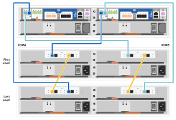

= 詳細ガイド- AFF A150
:allow-uri-read: 
:icons: font
:imagesdir: ../media/

[role="lead"]
AFF A150システムの設置方法について説明します。

MetroCluster 構成の場合は、を使用します https://docs.netapp.com/us-en/ontap-metrocluster/index.html["MetroCluster のドキュメント"^]。

== 手順 1 ：設置の準備

[role="lead"]
AFF A150システムをインストールするには、NetApp Support Site でアカウントを作成し、システムを登録して、ライセンスキーを取得します。また、システムに応じた適切な数とタイプのケーブルを準備し、特定のネットワーク情報を収集する必要があります。

.作業を開始する前に
* にアクセスできることを確認します link:https://hwu.netapp.com["NetApp Hardware Universe の略"^] （ HWU ）を参照してください。サイト要件および構成済みシステム上の追加情報に関する情報が含まれます。
* にアクセスできることを確認します link:http://mysupport.netapp.com/documentation/productlibrary/index.html?productID=62286["リリースノート"^] ONTAP のバージョンに応じて、このシステムの詳細情報を確認してください。
* システムをスイッチに接続する方法については、ネットワーク管理者にお問い合わせください。
* サイトに次のアイテムがあることを確認します。
+
** ストレージシステム用のラックスペース
** No.2 プラスドライバ
** Web ブラウザを使用してシステムをネットワークスイッチおよびラップトップまたはコンソールに接続するための追加のネットワークケーブル
** RJ-45 接続を備え、 Web ブラウザにアクセスできるラップトップまたはコンソール

.手順
. すべての箱を開封して内容物を取り出します。
. コントローラのシステムシリアル番号をメモします。
+
image::../media/drw_ssn_label.png[DRW SSN ラベル]

. アカウントを設定します。
+
.. 既存のアカウントにログインするか、アカウントを作成します。
.. https://mysupport.netapp.com/eservice/registerSNoAction.do?moduleName=RegisterMyProduct["システムを登録します"]。

. ダウンロードしてインストールします https://mysupport.netapp.com/site/tools/tool-eula/activeiq-configadvisor["Config Advisor"] ノートブック PC で。
. 同梱されていたケーブルの数と種類を確認し、書き留めておきます。
+
次の表に、同梱されているケーブルの種類を示します。表に記載されていないケーブルがある場合は、を参照してください https://hwu.netapp.com["NetApp Hardware Universe の略"] ケーブルの場所を確認し、用途を特定します。

+
[cols="1,2,1,2"]
|===
| ケーブルのタイプ | パーツ番号と長さ | コネクタのタイプ | 用途 

 a| 
10GbE ケーブル（注文内容による）
 a| 
X6566B-05-R6 （ 112-00297 ）、 0.5m

X6566B-2-R6 （ 112-00299 ）、 2m
 a| 
image:../media/oie_cable_sfp_gbe_copper.png[""]
 a| 
クラスタインターコネクトネットワーク

 a| 
10GbE ケーブル（注文内容による）
 a| 
パーツ番号 X6566B-2-R6 （ 112-00299 ）、 2m

または X6566B-3-R6 （ 112-00300 ）、 3m

X6566B-5-R6 （ 112-00301 ）、 5m
 a| 
image:../media/oie_cable_sfp_gbe_copper.png[""]
 a| 
データ

 a| 
光ネットワークケーブル（注文内容による）
 a| 
X6553-R6 （ 112-00188 ）、 2m

X6536-R6 （ 112-00090 ）、 5m

X6554-R6 （ 112-00189 ）、 15m
 a| 
image:../media/oie_cable_fiber_lc_connector.png[""]
 a| 
FC ホストネットワーク

 a| 
Cat 6 、 RJ-45 （注文内容による）
 a| 
パーツ番号 X6585-R6 （ 112-00291 ）、 3m

X6562-R6 （ 112-00196 ）、 5m
 a| 
image:../media/oie_cable_rj45.png[""]
 a| 
管理ネットワークとイーサネットデータ

 a| 
ストレージ（注文内容による）
 a| 
部品番号 X66030A （ 112-00435 ）、 0.5m

X66031A （ 112-00436 ）、 1m

X66032A （ 112-00437 ）、 2m

X66033A (112-00438) 、 3m
 a| 
image:../media/oie_cable_mini_sas_hd_to_mini_sas_hd.png[""]
 a| 
ストレージ

 a| 
Micro-USB コンソールケーブル
 a| 
該当なし
 a| 
image:../media/oie_cable_micro_usb.png[""]
 a| 
Windows または Mac 以外のラップトップ / コンソールでソフトウェアをセットアップする際のコンソール接続

 a| 
電源ケーブル
 a| 
該当なし
 a| 
image:../media/oie_cable_power.png[""]
 a| 
システムの電源をオンにします

|===
. https://library.netapp.com/ecm/ecm_download_file/ECMLP2839002["クラスタ構成ワークシートをダウンロードして記入します"]。

== 手順 2 ：ハードウェアを設置する

[role="lead"]
システムを4ポストラックまたはネットアップシステムキャビネットに設置します。

.手順
. 必要に応じてレールキットを取り付けます。
. レールキットに付属の手順書に従って、システムを設置して固定します。
+

NOTE: システムの重量に関連する安全上の注意事項を確認しておく必要があります。

+
image::../media/drw_oie_fas2700_weight_caution.png[DRW OIE fas2700 重量に関する注意]

. ケーブルマネジメントデバイスを取り付けます（図を参照）。
+
image::../media/drw_cable_management_arm_install.png[DRW ケーブルマネジメントアーム取り付け]

. システムの前面にベゼルを配置します。

== 手順3：コントローラをネットワークにケーブル接続する

[role="lead"]
2ノードスイッチレスクラスタまたはクラスタインターコネクトネットワークのいずれかの方法を使用して、コントローラをネットワークにケーブル接続します。

コントローラの管理ネットワーク、UTA2データネットワーク、イーサネットデータネットワーク、および管理ポートは、スイッチに接続されます。クラスタインターコネクトポートは、両方のコントローラでケーブル接続されます。

[role="tabbed-block"]
====
.オプション 1 ： 2 ノードスイッチレスクラスタ
--
2ノードスイッチレスクラスタのケーブル接続方法について説明します。

.作業を開始する前に
図の矢印を見て、ケーブルコネクタのプルタブの正しい向きを確認してください。

image::../media/oie_cable_pull_tab_down.png[OIE ケーブルのプルタブを下に引きます]

NOTE: コネクタを挿入すると、カチッという音がしてコネクタが所定の位置に収まるはずです。音がしない場合は、コネクタを取り外し、回転させてからもう一度試してください。

.このタスクについて
コントローラをホストネットワークに接続するには、UTA2データネットワークポートまたはイーサネットデータネットワークポートを使用します。コントローラとスイッチをケーブル接続する場合は、次のケーブル接続図を参照してください。

UTA2データネットワーク構成::
+
--
image::../media/drw_2700_tnsc_unified_network_cabling_animated_gif.png[DRW 2700 TNSC ユニファイドネットワークケーブルのアニメーション GIF]

--
イーサネットネットワーク構成::
+
--
image::../media/drw_2700_tnsc_ethernet_network_cabling_animated_gif.png[DRW 2700 TNSC イーサネットネットワークケーブル配線のアニメーション GIF]

--

各コントローラモジュールで次の手順を実行します。

.手順
. クラスタインターコネクトケーブルを使用して、クラスタインターコネクトポートe0aとe0a、e0bとe0bを接続します。[+]image:../media/drw_c190_u_tnsc_clust_cbling.png[""]
. 次のいずれかを実行します。
+
UTA2データネットワーク構成:: 次のいずれかのタイプのケーブルを使用して、UTA2データポートをホストネットワークにケーブル接続します。
+
--
** FCホストの場合は、0cと0d *または* 0eと0fを使用します。
** 10GbEシステムの場合は、e0cとe0d *または* e0eとe0fを使用します。
+
image:../media/drw_c190_u_fc_10gbe_cbling.png[""]

+
一方のポートペアを CNA 、もう一方のポートペアを FC として接続するか、あるいは両方のポートペアを CNA または FC として接続することができます。

--
イーサネットネットワーク構成:: Cat 6 RJ45ケーブルを使用して、e0c~e0fポートをホストネットワークに接続します。次の図に示します。
+
--
image:../media/drw_c190_e_rj45_cbling.png[""]

--

. RJ45 ケーブルを使用して、 e0M ポートを管理ネットワークスイッチに接続します。
+
image:../media/drw_c190_u_mgmt_cbling.png[""]

IMPORTANT: この時点ではまだ電源コードをプラグに接続しないでください。

--
.オプション 2 ：スイッチクラスタ
--
スイッチクラスタのケーブル接続方法について説明します。

.作業を開始する前に
図の矢印を見て、ケーブルコネクタのプルタブの正しい向きを確認してください。

image::../media/oie_cable_pull_tab_down.png[OIE ケーブルのプルタブを下に引きます]

NOTE: コネクタを挿入すると、カチッという音がしてコネクタが所定の位置に収まるはずです。音がしない場合は、コネクタを取り外し、回転させてからもう一度試してください。

.このタスクについて
コントローラをホストネットワークに接続するには、UTA2データネットワークポートまたはイーサネットデータネットワークポートを使用します。コントローラとスイッチをケーブル接続する場合は、次のケーブル接続図を参照してください。

ユニファイドネットワークのケーブル配線::
+
--
image::../media/drw_2700_switched_unified_network_cabling_animated_gif.png[DRW 2700 スイッチドユニファイドネットワークケーブルのアニメーション GIF]

--
イーサネットネットワークのケーブル配線::
+
--
image::../media/drw_2700_switched_ethernet_network_cabling_animated_gif.png[DRW 2700 スイッチドイーサネットネットワークケーブル配線アニメーション GIF]

--

各コントローラモジュールで次の手順を実行します。

.手順
. 各コントローラモジュールで、クラスタインターコネクトケーブルを使用してe0aとe0bをクラスタインターコネクトスイッチに接続します。
+
image:../media/drw_c190_u_switched_clust_cbling.png[""]

. 次のいずれかを実行します。
+
UTA2データネットワーク構成:: 次のいずれかのタイプのケーブルを使用して、UTA2データポートをホストネットワークにケーブル接続します。
+
--
** FCホストの場合は、0cおよび0d**または** 0eおよび0fを使用します。
** 10GbEシステムの場合は、e0cとe0d**または** e0eとe0fを使用します。
+
image:../media/drw_c190_u_fc_10gbe_cbling.png[""]

+
一方のポートペアを CNA 、もう一方のポートペアを FC として接続するか、あるいは両方のポートペアを CNA または FC として接続することができます。

--
イーサネットネットワーク構成:: Cat 6 RJ45ケーブルを使用して、e0c~e0fポートをホストネットワークに接続します。
+
--
image:../media/drw_c190_e_rj45_cbling.png[""]

--

. RJ45 ケーブルを使用して、 e0M ポートを管理ネットワークスイッチに接続します。
+
image:../media/drw_c190_u_mgmt_cbling.png[""]

IMPORTANT: この時点ではまだ電源コードをプラグに接続しないでください。

--
====

== 手順 4 ：コントローラをドライブシェルフにケーブル接続する

オンボードストレージポートを使用して、コントローラをシェルフにケーブル接続します。ネットアップでは、外付けストレージを使用するシステムに MP-HA ケーブル接続を推奨しています。

.このタスクについて
SAS テープドライブがある場合は、シングルパスケーブル接続を使用できます。外付けシェルフがない場合は、システムと一緒に SAS ケーブルを購入した場合、内蔵ドライブへの MP-HA ケーブル接続はオプションです（図では省略しています）。

シェルフ / シェルフ間をケーブル接続し、そのあとに両方のコントローラをドライブシェルフにケーブル接続する必要があります。

図の矢印を見て、ケーブルコネクタのプルタブの正しい向きを確認してください。

image::../media/oie_cable_pull_tab_down.png[OIE ケーブルのプルタブを下に引きます]

.手順
. 外付けドライブシェルフとHAペアをケーブル接続します。
+
次の例は、DS224Cドライブシェルフのケーブル接続を示しています。サポートされている他のドライブシェルフと同様のケーブル接続が可能です。

+

. シェルフ間でポートをケーブル接続します。
+
** IOM A のポート 3 と直下のシェルフにある IOM A のポート 1
** IOM B のポート 3 と直下のシェルフにある IOM B のポート 1
+
image:../media/oie_cable_mini_sas_hd_to_mini_sas_hd.png[""] mini-SAS HD 間ケーブル

. 各ノードをスタック内の IOM A に接続します。
+
** コントローラ 1 のポート 0b とスタックの最後のドライブシェルフにある IOM A のポート 3
** コントローラ 2 のポート 0a とスタックの最初のドライブシェルフにある IOM A のポート 1
+
image:../media/oie_cable_mini_sas_hd_to_mini_sas_hd.png[""] mini-SAS HD 間ケーブル

. 各ノードをスタック内の IOM B に接続します
+
** コントローラ 1 のポート 0a とスタックの最初のドライブシェルフにある IOM B のポート 1
** コントローラ 2 のポート 0b とスタックの最後のドライブシェルフにある IOM B のポート 3image:../media/oie_cable_mini_sas_hd_to_mini_sas_hd.png[""] mini-SAS HD 間ケーブル

ドライブシェルフスタックが複数ある場合は、を参照してください link:../com.netapp.doc.hw-ds-sas3-icg/home.html["設置とケーブル接続"] をクリックします。

== 手順5：システムのセットアップを完了します

[role="lead"]
システムのセットアップと設定を実行するには、スイッチとラップトップのみを接続してクラスタ検出を使用するか、システムのコントローラに直接接続してから管理スイッチに接続します。

[role="tabbed-block"]
====
.オプション 1 ：ネットワーク検出が有効になっている場合
--
ラップトップでネットワーク検出が有効になっている場合は、クラスタの自動検出を使用してシステムのセットアップと設定を実行できます。

.手順
. 次のアニメーションに従って、 1 つ以上のドライブシェルフ ID を設定します。
+
.アニメーション-ドライブシェルフIDを設定します
video::c600f366-4d30-481a-89d9-ab1b0066589b[panopto]
. 電源コードをコントローラの電源装置に接続し、さらに別の回路の電源に接続します。
. 両方のノードの電源スイッチをオンにします。
+
image::../media/drw_turn_on_power_switches_to_psus.png[DRW 電源スイッチをオンにして PSU に切り替えます]

+

NOTE: 初回のブートには最大 8 分かかる場合があります。

. ラップトップでネットワーク検出が有効になっていることを確認します。
+
詳細については、ラップトップのオンラインヘルプを参照してください。

. 次のアニメーションに従って、ラップトップを管理スイッチに接続します。
+
.アニメーション-ラップトップを管理スイッチに接続します
video::d61f983e-f911-4b76-8b3a-ab1b0066909b[panopto]
. 検出する ONTAP アイコンを選択します。
+
image::../media/drw_autodiscovery_controler_select.png[DRW 自動検出コントローラ選択]

+
.. エクスプローラを開きます。
.. 左側のペインで、 [Network] ( ネットワーク ) をクリックします。
.. 右クリックして、更新を選択します。
.. いずれかの ONTAP アイコンをダブルクリックし、画面に表示された証明書を受け入れます。
+

NOTE: 「 XXXXX 」は、ターゲットノードのシステムシリアル番号です。

+
System Manager が開きます。

. で収集したデータを使用してシステムを設定します https://library.netapp.com/ecm/ecm_download_file/ECMLP2862613["『 ONTAP 構成ガイド』"]。
. アカウントを設定して Active IQ Config Advisor をダウンロードします。
+
.. にログインします https://mysupport.netapp.com/site/user/registration["既存のアカウントまたは作成してアカウントを作成します"]。
.. https://mysupport.netapp.com/site/systems/register["登録"] お使いのシステム。
.. ダウンロード https://mysupport.netapp.com/site/tools["Active IQ Config Advisor"]。

. Config Advisor を実行してシステムの健全性を確認します。
. 初期設定が完了したら、に進みます https://docs.netapp.com/us-en/ontap-family/["ONTAP のドキュメント"] ONTAP の追加機能の設定については、サイトを参照してください。

--
.オプション 2 ：ネットワーク検出が有効になっていない場合
--
ラップトップでネットワーク検出が有効になっていない場合は、このタスクを使用して設定とセットアップを実行する必要があります。

.手順
. ラップトップまたはコンソールをケーブル接続して設定します。
+
.. ラップトップまたはコンソールのコンソールポートを、 115 、 200 ボー、 N-8-1 に設定します。
+
コンソールポートの設定手順については、ラップトップまたはコンソールのオンラインヘルプを参照してください。

.. ラップトップまたはコンソールにコンソールケーブルを接続し、システムに付属のコンソールケーブルを使用してコントローラのコンソールポートに接続します。
+
image::../media/drw_console_connect_fas2700_affa200.png[DRW コンソール接続 fas2700 affa200]

.. ラップトップまたはコンソールを管理サブネット上のスイッチに接続します。
+
image::../media/drw_client_to_mgmt_subnet_fas2700_affa220.png[DRW クライアントから mgmt サブネット fas2700 affa220]

.. 管理サブネット上の TCP / IP アドレスをラップトップまたはコンソールに割り当てます。

. 次のアニメーションに従って、 1 つ以上のドライブシェルフ ID を設定します。
+
.アニメーション-ドライブシェルフIDを設定します
video::c600f366-4d30-481a-89d9-ab1b0066589b[panopto]
. 電源コードをコントローラの電源装置に接続し、さらに別の回路の電源に接続します。
. 両方のノードの電源スイッチをオンにします。
+
image::../media/drw_turn_on_power_switches_to_psus.png[DRW 電源スイッチをオンにして PSU に切り替えます]

+

NOTE: 初回のブートには最大 8 分かかる場合があります。

. いずれかのノードに初期ノード管理 IP アドレスを割り当てます。
+
[cols="1-3"]
|===
| 管理ネットワークでの DHCP の状況 | 作業 

 a| 
を設定します
 a| 
新しいコントローラに割り当てられた IP アドレスを記録します。

 a| 
未設定
 a| 
.. PuTTY 、ターミナルサーバ、または環境に対応した同等の機能を使用して、コンソールセッションを開きます。
+

NOTE: PuTTY の設定方法がわからない場合は、ラップトップまたはコンソールのオンラインヘルプを確認してください。

.. スクリプトからプロンプトが表示されたら、管理 IP アドレスを入力します。

|===
. ラップトップまたはコンソールでSystem Managerを使用して、クラスタを設定します。
+
.. ブラウザでノード管理 IP アドレスを指定します。
+

NOTE: アドレスの形式はです https://x.x.x.x[]。

.. で収集したデータを使用してシステムを設定します https://library.netapp.com/ecm/ecm_download_file/ECMLP2862613["『 ONTAP 構成ガイド』"]。

. アカウントを設定して Active IQ Config Advisor をダウンロードします。
+
.. にログインします https://mysupport.netapp.com/site/user/registration["既存のアカウントまたは作成してアカウントを作成します"]。
.. https://mysupport.netapp.com/site/systems/register["登録"] お使いのシステム。
.. ダウンロード https://mysupport.netapp.com/site/tools["Active IQ Config Advisor"]。

. Config Advisor を実行してシステムの健全性を確認します。
. 初期設定が完了したら、に進みます https://docs.netapp.com/us-en/ontap-family/["ONTAP のドキュメント"] ONTAP の追加機能の設定については、サイトを参照してください。

--
====