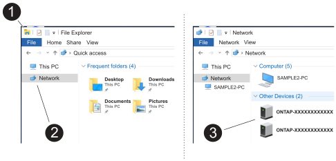

= ストレージシステムのセットアップと設定の完了- AFF A1K
:allow-uri-read: 
:icons: font
:imagesdir: ../media/

[role="lead"]
ストレージシステムの電源をオンにすると、クラスタネットワークを検出してONTAPクラスタをセットアップできるようになります。

== 手順1：クラスタ情報を収集する

クラスタ管理インターフェイスのポートやIPアドレスなど、クラスタの設定に必要な情報を収集します（まだ収集していない場合）。

を使用し https://docs.netapp.com/us-en/ontap/software_setup/index.html["クラスタセットアップワークシート"^] て、クラスタのセットアッププロセスで必要となる値を記録します。デフォルト値が指定されている場合は、その値を使用するか、独自の値を入力できます。

== 手順2：クラスタネットワークを検出する

検出プロセスでは、ネットワーク上のストレージシステムコントローラを検出できます。

[role="tabbed-block"]
====
.オプション1：ネットワーク検出を有効にする
--
ラップトップでネットワーク検出を有効にしている場合は、クラスタの自動検出を使用してセットアップと設定を完了できます。

.手順
. ラップトップを管理スイッチに接続し、ネットワークコンピュータとデバイスにアクセスします。
. 検出する ONTAP アイコンを選択します。
+

+
.. エクスプローラを開きます。
.. 左側のペインで*[ネットワーク]*をクリックし、右クリックして*[更新]*を選択します。
.. いずれかの ONTAP アイコンをダブルクリックし、画面に表示された証明書を受け入れます。
+

NOTE: XXXXXは、ターゲットノードのストレージシステムのシリアル番号です。

+
System Manager が開きます。

--
.オプション2：ネットワーク検出が有効になっていない
--
ラップトップでネットワーク検出が有効になっていない場合は、ONTAPコマンドラインインターフェイス（CLI）のクラスタセットアップウィザードを使用して設定とセットアップを完了します。

.作業を開始する前に
ラップトップがシリアルコンソールポートに接続され、コントローラの電源がオンになっていることを確認します。手順については'を参照して link:install-power-hardware.html#step-2-power-on-the-controllers["ストレージ・システムの電源をオンにする"] ください

.手順
いずれかのノードに初期ノード管理 IP アドレスを割り当てます。

[cols="1,2"]
|===
| 管理ネットワークでの DHCP の状況 | 作業 

 a| 
を設定します
 a| 
新しいコントローラに割り当てられた IP アドレスを記録します。

 a| 
未設定
 a| 
. PuTTY 、ターミナルサーバ、または環境に対応した同等の機能を使用して、コンソールセッションを開きます。
+

NOTE: PuTTY の設定方法がわからない場合は、ラップトップまたはコンソールのオンラインヘルプを確認してください。

. 最初のノードのコンソールに接続します。
+
ノードがブートし、クラスタセットアップウィザードがコンソール上で起動されます。

. クラスタセットアップウィザードのプロンプトが表示されたら、ノードの管理IPアドレスを入力します。

|===
--
====

== 手順3：クラスタを構成する

NetAppでは、System Managerを使用して新しいクラスタをセットアップすることを推奨しています。セットアップ手順については、を参照してください https://docs.netapp.com/us-en/ontap/task_configure_ontap.html["System Managerを使用して新しいクラスタにONTAPを設定します"^] 。

System Managerでは、ノード管理IPアドレスの割り当て、クラスタの初期化、ローカル階層の作成、プロトコルの設定、接続されたストレージの初期プロビジョニングなど、クラスタのセットアップと設定のワークフローをシンプルかつ簡単に実行できます。

.次の手順
クラスタが初期化されたら、をダウンロードしてを実行し、  https://mysupport.netapp.com/site/tools/tool-eula/activeiq-configadvisor["Active IQ Config Advisor"^] セットアップを確認します。
