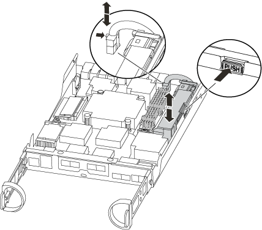

= DIMM- AFF A200 を交換します
:icons: font
:imagesdir: ../media/

[role="lead"]
システムで登録される修正可能なエラー修正コード（ ECC ）の数が増え続けている場合は、コントローラモジュールの DIMM を交換する必要があります。そのままにしているとシステムがパニック状態になります。

.このタスクについて
* システムのその他のコンポーネントがすべて正常に動作している必要があります。問題がある場合は、必ずテクニカルサポートにお問い合わせください。
* 障害が発生したコンポーネントは、プロバイダから受け取った交換用 FRU コンポーネントと交換する必要があります。

== 手順 1 ：障害のあるコントローラをシャットダウンします

障害ノードをシャットダウンするには、ノードのステータスを確認し、必要に応じて正常なノードが障害ノードのストレージからデータを引き続き提供できるようにノードをテイクオーバーする必要があります。

ノードが 3 つ以上あるクラスタは、クォーラムを構成している必要があります。クラスタがクォーラムを構成していない場合や、正常なノードの資格と健全性に false と表示される場合は、障害ノードをシャットダウンする前に問題を修正する必要があります。を参照してください https://docs.netapp.com/us-en/ontap/system-admin/index.html["CLI での管理の概要"]。

.手順
. AutoSupport が有効になっている場合は、 AutoSupport メッセージを呼び出してケースの自動作成を抑制します。「 system node AutoSupport invoke -node * -type all -message MAINT=number_OF_hours_downh
+
次の AutoSupport メッセージは、ケースの自動作成を 2 時間停止します。 cluster1 ： * > system node AutoSupport invoke -node * -type all -message MAINT=2h`

. 正常なノードのコンソールから自動ギブバックを無効にします。「 storage failover modify – node local-auto-giveback false
. 障害ノードに LOADER プロンプトを表示します。
+
[cols="1,2"]
|===
| 障害ノードの表示 | 作業 

 a| 
LOADER プロンプト
 a| 
次の手順に進みます。

 a| 
ギブバックを待っています
 a| 
Ctrl キーを押しながら C キーを押し ' プロンプトが表示されたら y と入力します

 a| 
システムプロンプトまたはパスワードプロンプト（システムパスワードの入力）
 a| 
障害ノードをテイクオーバーまたは停止します。

** HA ペアの場合は、正常なノードから障害ノードをテイクオーバーします。「 storage failover takeover -ofnode impaired_node_name _
+
障害ノードに「 Waiting for giveback... 」と表示されたら、 Ctrl+C キーを押し、「 y 」と入力します。

|===
. システムのシャーシにコントローラモジュールが 1 つしかない場合は、電源装置をオフにして、障害ノードの電源コードを電源から抜きます。

== 手順 2 ：システムを開く

コントローラ内部のコンポーネントにアクセスするには、まずコントローラモジュールをシステムから取り外し、続いてコントローラモジュールのカバーを外す必要があります。

. 接地対策がまだの場合は、自身で適切に実施します。
. ケーブルマネジメントデバイスに接続しているケーブルをまとめているフックとループストラップを緩め、システムケーブルと SFP をコントローラモジュールから外し（必要な場合）、どのケーブルが何に接続されていたかを記録します。
+
ケーブルはケーブルマネジメントデバイスに収めたままにします。これにより、ケーブルマネジメントデバイスを取り付け直すときに、ケーブルを整理する必要がありません。

. ケーブルマネジメントデバイスをコントローラモジュールの右側と左側から取り外し、脇に置きます。
+
image::../media/drw_25xx_cable_management_arm.png[DRW 25xx ケーブル管理アーム]

. カムハンドルのラッチをつかんで解除し、カムハンドルを最大限に開いてコントローラモジュールをミッドプレーンから離し、両手でコントローラモジュールをシャーシから外します。
+
image::../media/drw_2240_x_opening_cam_latch.png[DRW 2240 x オープンカムラッチ]

. コントローラモジュールを裏返し、平らで安定した場所に置きます。
. カバーを開くには、青いタブをスライドしてカバーを外し、カバーを上げて開きます。
+
image::../media/drw_2600_opening_pcm_cover.png[DRW 2600 オープニング PCM カバー]

== 手順 3 ： DIMM を交換します

DIMM を交換するには、コントローラ内で DIMM の場所を確認し、特定の手順を実行します。

DIMM を交換する場合は、コントローラモジュールから NVMEM バッテリを取り外したあとに DIMM を取り外す必要があります。

.手順
. 接地対策がまだの場合は、自身で適切に実施します。
. コントローラモジュールの NVMEM LED を確認します。
+
システムコンポーネントを交換する前にシステムのクリーンシャットダウンを実行し、不揮発性メモリ（ NVMEM ）内の書き込み前のデータが失われないようにする必要があります。LED はコントローラモジュールの背面にあります。次のアイコンを探します。

+
image::../media/drw_hw_nvram_icon.png[DRW hw NVRAM アイコン]

. NVMEM LED が点滅していない場合は、 NVMEM が空の状態です。以降の手順を省略して、この手順の次のタスクに進むことができます。
. NVMEM LED が点滅している場合は、 NVMEM にデータが含まれています。バッテリを取り外してメモリをクリアする必要があります。
+
.. バッテリの場所を確認し、バッテリプラグ前面のクリップを押してプラグソケットからロッククリップを外し、バッテリケーブルをソケットから抜きます。
+

.. NVMEM LED が点灯していないことを確認します。
.. バッテリコネクタを再接続します。

. この手順のステップ 2 に戻って、 NVMEM LED を再確認します。
. コントローラモジュールで DIMM の場所を確認します。
+

NOTE: 各システムメモリ DIMM の LED は、ボード上の各 DIMM スロットの横にあります。障害が発生した場合は、 LED が 2 秒ごとに点滅します。

. 交換用 DIMM を正しい向きで挿入できるように、ソケット内の DIMM の向きをメモします。
. DIMM の両側にある 2 つのツメをゆっくり押し開いて DIMM をスロットから外し、そのままスライドさせてスロットから取り出します。
+

NOTE: DIMM 回路基板のコンポーネントに力が加わらないように、 DIMM の両端を慎重に持ちます。

+
DIMM の数と配置は、システムのモデルによって異なります。

+
次の図は、システム DIMM の場所を示しています。

+
image::../media/drw_2600_dimm_repl_animated_gif.png[DRW 2600 DIMM repl アニメーション GIF]

. 交換用 DIMM を静電気防止用の梱包バッグから取り出し、 DIMM の端を持ってスロットに合わせます。
+
DIMM のピンの間にある切り欠きを、ソケットの突起と揃える必要があります。

. コネクタにある DIMM のツメが開いた状態になっていることを確認し、 DIMM をスロットに対して垂直に挿入します。
+
DIMM のスロットへの挿入にはある程度の力が必要です。簡単に挿入できない場合は、 DIMM をスロットに正しく合わせてから再度挿入してください。

+

NOTE: DIMM がスロットにまっすぐ差し込まれていることを目で確認してください。

. DIMM の両端のノッチにツメがかかるまで、 DIMM の上部を慎重にしっかり押し込みます。
. NVMEM バッテリプラグソケットの場所を確認し、バッテリケーブルプラグ前面のクリップを押してソケットに挿入します。
+
プラグがコントローラモジュールに固定されていることを確認します。

. コントローラモジュールのカバーを閉じます。

== 手順 4 ：コントローラモジュールを再度取り付けます

コントローラモジュールのコンポーネントを交換したら、モジュールをシャーシに再度取り付けます。

. 接地対策がまだの場合は、自身で適切に実施します。
. コントローラモジュールのカバーをまだ取り付けていない場合は取り付けます。
. コントローラモジュールの端をシャーシの開口部に合わせ、コントローラモジュールをシステムに半分までそっと押し込みます。
+

NOTE: 指示があるまでコントローラモジュールをシャーシに完全に挿入しないでください。

. 必要に応じてシステムにケーブルを再接続します。
+
光ファイバケーブルを使用する場合は、メディアコンバータ（ QSFP または SFP ）を取り付け直してください（取り外した場合）。

. コントローラモジュールの再取り付けを完了します。

[cols="1,3"]
|===
| システムの構成 | 実行する手順 

 a| 
HA ペア
 a| 
コントローラモジュールは、シャーシに完全に装着されるとすぐにブートを開始します。ブートプロセスを中断できるように準備しておきます。

. カムハンドルを開き、コントローラモジュールをミッドプレーンまでしっかりと押し込んで完全に装着し、カムハンドルをロック位置まで閉じます。
+

NOTE: コネクタの破損を防ぐため、コントローラモジュールをスライドしてシャーシに挿入する際に力を入れすぎないでください。

+
コントローラは、シャーシに装着されるとすぐにブートを開始します。

. ケーブルマネジメントデバイスをまだ取り付けていない場合は、取り付け直します。
. ケーブルマネジメントデバイスに接続されているケーブルをフックとループストラップでまとめます。
. 「 Press Ctrl-C for Boot Menu 」というメッセージが表示されたら、 Ctrl+C キーを押してブートプロセスを中断します。
+

NOTE: プロンプトを見逃してコントローラモジュールが ONTAP を起動した場合は、「 halt 」と入力し、 LOADER プロンプトで「 boot_ontap 」と入力し、プロンプトが表示されたら「 Ctrl+C 」を押して、メンテナンスモードでブートします。

. 表示されたメニューからメンテナンスモードでブートするオプションを選択します。

 a| 
スタンドアロン構成です
 a| 
. カムハンドルを開き、コントローラモジュールをミッドプレーンまでしっかりと押し込んで完全に装着し、カムハンドルをロック位置まで閉じます。
+

NOTE: コネクタの破損を防ぐため、コントローラモジュールをスライドしてシャーシに挿入する際に力を入れすぎないでください。

. ケーブルマネジメントデバイスをまだ取り付けていない場合は、取り付け直します。
. ケーブルマネジメントデバイスに接続されているケーブルをフックとループストラップでまとめます。
. 電源装置と電源に電源ケーブルを再接続し、電源を入れてブートプロセスを開始し、「 Press Ctrl-C for Boot Menu 」 (Boot Menu を表示するには Ctrl+C を押してください ) というメッセージが表示されたら「 Ctrl-C 」を押してください。
+

NOTE: プロンプトを見逃してコントローラモジュールが ONTAP を起動した場合は、「 halt 」と入力し、 LOADER プロンプトで「 boot_ontap 」と入力し、プロンプトが表示されたら「 Ctrl+C 」を押して、メンテナンスモードでブートします。

. ブートメニューからメンテナンスモードのオプションを選択します。

|===

== 手順 5 ：システムレベルの診断を実行します

新しい DIMM を取り付けたら、診断を実行する必要があります。

システムレベルの診断を開始するには、システムに LOADER プロンプトが表示されている必要があります。

診断手順のコマンドは、すべてコンポーネントを交換するノードから実行します。

.手順
. 作業をするノードに LOADER プロンプトが表示されていない場合は、次の手順を実行します。
+
.. 表示されたメニューからメンテナンスモードオプションを選択します。
.. ノードが保守モードでブートしたら ' ノードを停止します
+
コマンドを問題したら、システムが LOADER プロンプトで停止するまで待ちます。

+

NOTE: 起動プロセス中に 'y' をプロンプトに安全に応答できます

+
*** HA 構成でメンテナンスモードに切り替えたときに表示される、正常なノードが停止したままであることの確認を求めるプロンプト。

. LOADER プロンプトで、システムレベルの診断用に特別に設計されたドライバ「 boot_diags 」にアクセスします
+
ブート・プロセス中に 'Maintenance] モードのプロンプト（ *> ）が表示されるまで 'y とプロンプトを入力しても安全です

. システムメモリの診断を実行します。 'lddiag device run -dev mem'
. DIMM の交換が原因でハードウェアの問題が発生していないことを確認します。 'lddiag device status -dev mem-long-state failed
+
テストに失敗した場合は、プロンプトに戻ります。失敗した場合は、そのステータスがすべて表示されます。

. 前述の手順の結果に応じて、次に進みます。

[cols="1,3"]
|===
| システムレベルの診断のテスト結果 | 作業 

 a| 
は失敗なしで完了しました
 a| 
. ステータスログ「 `diag device clearstatus` 」を消去します
. ログがクリアされたことを確認します。「 diag device status 」
+
次のデフォルトの応答が表示されます。

+
SLDIAG ：ログメッセージが存在しません。

. 保守モードを終了します :halt
+
ノードに LOADER プロンプトが表示されます。

. LOADER プロンプトからノードをブートします。 bye
. ノードを通常動作に戻します。
+
* ノードが HA ペアに含まれている場合は、ギブバックを実行します。「 storage failover giveback -ofnode replacement_node_name _

+
* 注：自動ギブバックを無効にした場合は 'storage failover modify コマンドを使用して再度有効にします

+
* スタンドアロン構成のノードの場合 * は、次の手順に進みます。対処は不要です。

+
これで、システムレベルの診断が完了しました。

 a| 
テストが失敗しました
 a| 
問題の原因を特定します。

. 保守モードを終了します :halt
+
コマンドを問題したら、システムが LOADER プロンプトで停止するまで待ちます。

. シャーシ内のコントローラモジュールの数に応じて、電源装置をオフにするか、オンのままにします。
+
** シャーシ内にコントローラモジュールが 2 つある場合は、他のコントローラモジュールに電力を供給するために、電源装置をオンのままにします。
** シャーシ内にコントローラモジュールが 1 つしかない場合は、電源装置をオフにして電源から取り外します。

. システムレベルの診断を実行するための考慮事項をすべて確認するとともに、ケーブルがしっかりと接続されているか、ハードウェアコンポーネントがストレージシステムに適切に取り付けられているかを確認します。
. 対象となるコントローラモジュールをブートし、ブートメニューを表示するよう求められたら Ctrl+C キーを押してブートを中断します。
+
** シャーシ内にコントローラモジュールが 2 つある場合は、対象となるコントローラモジュールをシャーシに完全に取り付けます。
+
コントローラモジュールを完全に取り付けると、モジュールがブートします。

** シャーシ内にコントローラモジュールが 1 つしかない場合は、電源装置を接続して電源をオンにします。

. メニューから、メンテナンスモードでのブートを選択します。
. 次のコマンドを入力して保守モードを終了します :halt
+
コマンドを問題したら、システムが LOADER プロンプトで停止するまで待ちます。

. システムレベルの診断テストを再実行します。

|===
. 前述の手順の結果に応じて、次に進みます。
+
[cols="1,3"]
|===
| システムレベルの診断のテスト結果 | 作業 

 a| 
は失敗なしで完了しました
 a| 
.. ステータスログ「 `diag device clearstatus` 」を消去します
.. ログがクリアされたことを確認します。「 diag device status 」
+
次のデフォルトの応答が表示されます。

+
SLDIAG ：ログメッセージが存在しません。

.. 保守モードを終了します :halt
+
ノードに LOADER プロンプトが表示されます。

.. LOADER プロンプトからノードをブートします。 bye
.. ノードを通常動作に戻します。
+
* ノードが HA ペアに含まれている場合は、ギブバックを実行します。「 storage failover giveback -ofnode replacement_node_name _

+

NOTE: 自動ギブバックを無効にした場合は、「 storage failover modify 」コマンドを使用して再度有効にします。

+
* スタンドアロン構成のノードの場合 * は、次の手順に進みます。対処は不要です。

+
これで、システムレベルの診断が完了しました。

 a| 
テストが失敗しました
 a| 
問題の原因を特定します。

.. 保守モードを終了します :halt
+
コマンドを問題したら、システムが LOADER プロンプトで停止するまで待ちます。

.. シャーシ内のコントローラモジュールの数に応じて、電源装置をオフにするか、オンのままにします。
+
*** シャーシ内にコントローラモジュールが 2 つある場合は、他のコントローラモジュールに電力を供給するために、電源装置をオンのままにします。
*** シャーシ内にコントローラモジュールが 1 つしかない場合は、電源装置をオフにして電源から取り外します。

.. システムレベルの診断を実行するための考慮事項をすべて確認するとともに、ケーブルがしっかりと接続されているか、ハードウェアコンポーネントがストレージシステムに適切に取り付けられているかを確認します。
.. 対象となるコントローラモジュールをブートし、ブートメニューを表示するよう求められたら Ctrl+C キーを押してブートを中断します。
+
*** シャーシ内にコントローラモジュールが 2 つある場合は、対象となるコントローラモジュールをシャーシに完全に取り付けます。
+
コントローラモジュールを完全に取り付けると、モジュールがブートします。

*** シャーシ内にコントローラモジュールが 1 つしかない場合は、電源装置を接続して電源をオンにします。

.. メニューから、メンテナンスモードでのブートを選択します。
.. 次のコマンドを入力して保守モードを終了します :halt
+
コマンドを問題したら、システムが LOADER プロンプトで停止するまで待ちます。

.. システムレベルの診断テストを再実行します。

|===

== 手順 6 ：障害が発生したパーツをネットアップに返却する

部品を交換したあと、障害のある部品をネットアップに返却することができます。詳細については、キットに付属する RMA 指示書を参照してください。テクニカルサポートにお問い合わせください https://mysupport.netapp.com/site/global/dashboard["ネットアップサポート"]RMA 番号を確認する場合や、交換用手順にサポートが必要な場合は、日本国内サポート用電話番号：国内フリーダイヤル 0066-33-123-265 または 0066-33-821-274 （国際フリーフォン 800-800-80-800 も使用可能）までご連絡ください。
