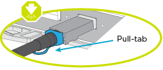
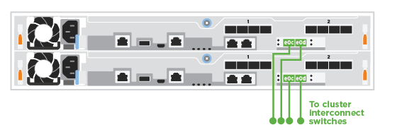

= 詳細手順 - AFF A250
:allow-uri-read: 
:icons: font
:imagesdir: ../media/

[role="lead"]
ここでは、 AFF A250 システムのインストール手順について詳しく説明します。

== 手順 1 ：設置の準備

AFF A250 システムをインストールするには、アカウントを作成してシステムを登録する必要があります。また、システムに応じた適切な数とタイプのケーブルを準備し、特定のネットワーク情報を収集する必要があります。

NOTE: 特定の電力要件を持つお客様は、 HWU で構成オプションを確認する必要があります。

.作業を開始する前に
* にアクセスできることを確認します link:https://hwu.netapp.com["NetApp Hardware Universe の略"^] （HWU）」を参照してください。
* にアクセスできることを確認します link:http://mysupport.netapp.com/documentation/productlibrary/index.html?productID=62286["使用している ONTAP のバージョンに対応したリリースノート"^] このシステムの詳細については、を参照してください。
* お客様のサイトで次のものを準備する必要があります。
+
** ストレージシステム用のラックスペース
** No.2 プラスドライバ
** Web ブラウザを使用してシステムをネットワークスイッチおよびラップトップまたはコンソールに接続するための追加のネットワークケーブル

.手順
. すべての箱を開封して内容物を取り出します。
. コントローラのシステムシリアル番号をメモします。
+
image::../media/drw_ssn_label.png[システムシリアル番号の例]

. アカウントを設定します。
+
.. 既存のアカウントにログインするか、アカウントを作成します。
.. link:https://mysupport.netapp.com/eservice/registerSNoAction.do?moduleName=RegisterMyProduct["登録"^] お使いのシステム。

. ダウンロードしてインストールします link:https://mysupport.netapp.com/site/tools/tool-eula/activeiq-configadvisor["ネットアップのダウンロード： Config Advisor"^] ノートブック PC で。
. 同梱されていたケーブルの数と種類を確認し、書き留めておきます。
+
次の表に、同梱されているケーブルの種類を示します。表に記載されていないケーブルがある場合は、を参照してください link:https://hwu.netapp.com["NetApp Hardware Universe の略"^] ケーブルの場所を確認し、用途を特定します。

+
[cols="1,2,1,2"]
|===
| ケーブルのタイプ | パーツ番号と長さ | コネクタのタイプ | 用途 

 a| 
25GbE ケーブル
 a| 
X66240A-05 (112-00595) 、 0.5m ；

X66240 2 （ 112-00573 ）、 2m
 a| 
image:../media/oie_cable100_gbe_qsfp28.png["100GbE QSFP28コネクタ"]
 a| 
クラスタインターコネクトネットワーク

 a| 
X66240A-2 （ 112-00598 ）、 2m ；

X66240A-5 （ 112-00600 ）、 5m
 a| 
データ

 a| 
100GbE ケーブル
 a| 
X66211-2 （ 112-00574 ）、 2m ；

X66211-5 （ 112-00576 ）、 5m
 a| 
ストレージ

 a| 
RJ-45 （注文内容による）
 a| 
該当なし
 a| 
image:../media/oie_cable_rj45.png["RJ-45ケーブルコネクタ"]
 a| 
管理ネットワーク（ BMC およびレンチポート）とイーサネットデータ（ e0a および e0b ）

 a| 
ファイバチャネル
 a| 
X66250-2 （ 112-00342 ） 2m ；

X66250-5 （ 112-00344 ） 5m ；

X66250-15 （ 112-00346 ） 15m ；

X66250-30 （ 112-00347 ） 30m
 a| 

 a| 

 a| 
Micro-USB コンソールケーブル
 a| 
該当なし
 a| 
image:../media/oie_cable_micro_usb.png["マイクロUSBコネクタ"]
 a| 
ソフトウェアのセットアップ中のコンソール接続

 a| 
電源ケーブル
 a| 
該当なし
 a| 
image:../media/oie_cable_power.png["電源ケーブル"]
 a| 
システムの電源をオンにします

|===
. を確認します link:https://library.netapp.com/ecm/ecm_download_file/ECMLP2862613["『 ONTAP 構成ガイド』"^] およびそのガイドに記載されている必要な情報を収集します。

== 手順 2 ：ハードウェアを設置する

システムは、 4 ポストラックまたはネットアップシステムキャビネットのいずれかに設置する必要があります。

.手順
. 必要に応じてレールキットを取り付けます。
. レールキットに付属の手順書に従って、システムを設置して固定します。
+

NOTE: システムの重量に関連する安全上の注意事項を確認しておく必要があります。

+
image::../media/drw_affa250_weight_caution.png[2人で持ち上げる場合の注意]

. このシステムにはケーブル管理デバイスがないため、ケーブルを特定して管理します。
. システムの前面にベゼルを配置します。

== 手順3：コントローラをクラスタにケーブル接続する

2ノードスイッチレスクラスタメソッドまたはクラスタインターコネクトネットワークメソッドを使用して、コントローラをクラスタにケーブル接続します。

[role="tabbed-block"]
====
.オプション 1 ： 2 ノードスイッチレスクラスタ
--
コントローラモジュールの管理ポート、ファイバチャネルポート、データポートまたはホストネットワークポートは、スイッチに接続されます。クラスタインターコネクトポートは、両方のコントローラモジュールでケーブル接続されます。

.作業を開始する前に
* システムとスイッチの接続については、ネットワーク管理者にお問い合わせください。
* 図の矢印を見て、ケーブルコネクタのプルタブの正しい向きを確認してください。
+

+

NOTE: コネクタを挿入すると、カチッという音がしてコネクタが所定の位置に収まるはずです。音がしない場合は、コネクタを取り外し、回転させてからもう一度試してください。

.このタスクについて
アニメーションまたは記載された手順に従って、コントローラとスイッチの間のケーブル接続を完了します。各コントローラでこの手順を実行します。

.アニメーション-ケーブル接続による2ノードスイッチレスクラスタ
video::beec3966-0a01-473c-a5de-ac68017fbf29[panopto]
.手順
. 25GbEクラスタインターコネクトケーブルを使用して、クラスタインターコネクトポートe0cとe0c、e0dとe0dを接続します。
+
image:../media/oie_cable_sfp_gbe_copper.png["GbE SFP銅線コネクタ"]：

+
image:../media/drw_affa250_tnsc_cabling.png["2ノードスイッチレスクラスタでのクラスタインターコネクトのケーブル接続"]

. RJ45 ケーブルを使用して、レンチマークのポートを管理ネットワークスイッチに接続します。
+
image::../media/drw_affa250_mgmt_cabling.png[管理ポートのケーブル接続]

IMPORTANT: この時点ではまだ電源コードをプラグに接続しないでください。

--
.オプション 2 ：スイッチクラスタ
--
コントローラのすべてのポートがスイッチに接続されます。スイッチには、クラスタインターコネクト、管理、ファイバチャネル、データネットワークスイッチまたはホストネットワークスイッチがあります。

.作業を開始する前に
* システムとスイッチの接続については、ネットワーク管理者にお問い合わせください。
* 図の矢印を見て、ケーブルコネクタのプルタブの正しい向きを確認してください。
+

+

NOTE: コネクタを挿入すると、カチッという音がしてコネクタが所定の位置に収まるはずです。音がしない場合は、コネクタを取り外し、回転させてからもう一度試してください。

.このタスクについて
アニメーションや手順に従って、コントローラとスイッチの間のケーブル接続を完了します。各コントローラでこの手順を実行します。

.アニメーション-スイッチクラスタをケーブル接続します
video::bf6759dc-4cbf-488e-982e-ac68017fbef8[panopto]
.手順
. クラスタインターコネクトポートe0cとe0dを25GbEクラスタインターコネクトスイッチにケーブル接続します。
+

. RJ45 ケーブルを使用して、レンチマークのポートを管理ネットワークスイッチに接続します。
+
image::../media/drw_affa250_mgmt_cabling.png[管理ポートのケーブル接続]

--
====

== 手順4：ホストネットワークまたはストレージへのケーブル接続（オプション）

オプションで、 Fibre Channel または iSCSI ホストネットワークまたは直接接続型ストレージに、構成に依存するケーブルを接続します。このケーブル接続は排他的ではなく、ホストネットワークおよびストレージにケーブル接続できます。

NOTE: link:https://hwu.netapp.com["NetApp Hardware Universe の略"^] ホストネットワークカード（ファイバチャネルまたは25GbE）のスロットプライオリティはスロット2です。ただし、両方のカードがある場合は、ファイバチャネルカードはスロット2に、25GbEカードはスロット1に装着します（次のオプションを参照）。外付けシェルフがある場合、ストレージカードはシェルフでサポートされる唯一のスロットであるスロット1に挿入します。

[role="tabbed-block"]
====
.オプション1：Fibre Channelホストネットワークへのケーブル接続
--
コントローラの Fibre Channel ポートは、 Fibre Channel ホストネットワークスイッチに接続されます。

.作業を開始する前に
* システムとスイッチの接続については、ネットワーク管理者にお問い合わせください。
* 図の矢印を見て、ケーブルコネクタのプルタブの正しい向きを確認してください。
+
image::../media/oie_cable_pull_tab_up.png[プルタブ付きケーブルコネクタ（上部）]

+

NOTE: コネクタを挿入すると、カチッという音がして所定の位置に収まります。カチッという音がしない場合は、コネクタを取り外して回転させ、もう一度試してください。

.このタスクについて
各コントローラモジュールで次の手順を実行します。

.手順
. ポート 2a~2d を FC ホストスイッチにケーブル接続します。
+
image:../media/drw_affa250_fc_host_cabling.png["Fibre Channelホストのケーブル接続"]

--
.オプション2：25GbEデータまたはホストネットワークにケーブル接続
--
コントローラ上の 25GbE ポートは、 25GbE データスイッチまたはホストネットワークスイッチに接続されます。

.作業を開始する前に
* システムとスイッチの接続については、ネットワーク管理者にお問い合わせください。
* 図の矢印を見て、ケーブルコネクタのプルタブの正しい向きを確認してください。
+
image::../media/oie_cable_pull_tab_up.png[プルタブ付きケーブルコネクタ（上部）]

+

NOTE: コネクタを挿入すると、カチッという音がしてコネクタが所定の位置に収まるはずです。音がしない場合は、コネクタを取り外し、回転させてからもう一度試してください。

.このタスクについて
各コントローラモジュールで次の手順を実行します。

.手順
. ポート e4A から e4d を 10GbE ホストネットワークスイッチにケーブル接続します。
+
image:../media/drw_affa250_25gbe_host_cabling.png["25GbEのケーブル接続"]

--
.オプション3：コントローラを1台のドライブシェルフにケーブル接続します
--
各コントローラを、 NS224 ドライブシェルフの NSM モジュールにケーブル接続します。

.作業を開始する前に
図の矢印を見て、ケーブルコネクタのプルタブの正しい向きを確認してください。

image::../media/oie_cable_pull_tab_up.png[プルタブ付きケーブルコネクタ（上部）]

NOTE: コネクタを挿入すると、カチッという音がしてコネクタが所定の位置に収まるはずです。音がしない場合は、コネクタを取り外し、回転させてからもう一度試してください。

.このタスクについて
アニメーションまたは記載された手順に従って、コントローラと1台のシェルフをケーブル接続します。各コントローラモジュールで手順を実行します。

.アニメーション-コントローラを1つのNS224にケーブル接続します
video::3f92e625-a19c-4d10-9028-ac68017fbf57[panopto]
.手順
. コントローラAをシェルフにケーブル接続します。
+
image:../media/drw_affa250_1shelf_cabling_a.png["コントローラAのケーブル接続"]

. コントローラBをシェルフにケーブル接続します。
+
image:../media/drw_affa250_1shelf_cabling_b.png["コントローラBのケーブル接続"]

--
====

== 手順5：システムのセットアップを完了します

スイッチとラップトップのみを接続したクラスタ検出を使用するか、システムのコントローラに直接接続してから管理スイッチに接続して、システムのセットアップと設定を実行します。

[role="tabbed-block"]
====
.オプション 1 ：ネットワーク検出が有効になっている場合
--
ラップトップでネットワーク検出が有効になっている場合は、クラスタの自動検出を使用してシステムのセットアップと設定を実行できます。

.手順
. 電源コードをコントローラの電源装置に接続し、さらに別の回路の電源に接続します。
+
システムがブートを開始します。初回のブートには最大 8 分かかる場合があります。

. ラップトップでネットワーク検出が有効になっていることを確認します。
+
詳細については、ラップトップのオンラインヘルプを参照してください。

. アニメーションに従って、ラップトップを管理スイッチに接続します。
+
.アニメーション-ラップトップを管理スイッチに接続します
video::d61f983e-f911-4b76-8b3a-ab1b0066909b[panopto]
. 検出する ONTAP アイコンを選択します。
+
image::../media/drw_autodiscovery_controler_select.png[ONTAPアイコンの選択]

+
.. エクスプローラを開きます。
.. 左側のペインで、 *Network* をクリックします。
.. 右クリックし、 * 更新 * を選択します。
.. いずれかの ONTAP アイコンをダブルクリックし、画面に表示された証明書を受け入れます。
+

NOTE: 「 XXXXX 」は、ターゲットノードのシステムシリアル番号です。

+
System Manager が開きます。

. System Manager のセットアップガイドを使用して、で収集したデータを基にシステムを設定します link:https://library.netapp.com/ecm/ecm_download_file/ECMLP2862613["『 ONTAP 構成ガイド』"^]。
. Config Advisor を実行してシステムの健全性を確認します。
. 初期設定が完了したら、ONTAPのその他の機能の設定についてに進みます https://docs.netapp.com/us-en/ontap/index.html["ONTAP 9 のドキュメント"^]。

--
.オプション 2 ：ネットワーク検出が有効になっていない場合
--
ラップトップでネットワーク検出が有効になっていない場合は、このタスクを使用して設定とセットアップを実行する必要があります。

.手順
. ラップトップまたはコンソールをケーブル接続して設定します。
+
.. ラップトップまたはコンソールのコンソールポートを、 115 、 200 ボー、 N-8-1 に設定します。
+

NOTE: コンソールポートの設定方法については、ラップトップまたはコンソールのオンラインヘルプを参照してください。

.. ラップトップまたはコンソールを管理サブネット上のスイッチに接続します。
+
image::../media/drw_console_client_mgmt_subnet_affa250.png[管理サブネットへの接続]

.. 管理サブネット上の TCP / IP アドレスをラップトップまたはコンソールに割り当てます。

. 電源コードをコントローラの電源装置に接続し、さらに別の回路の電源に接続します。
+
システムがブートを開始します。初回のブートには最大 8 分かかる場合があります。

. いずれかのノードに初期ノード管理 IP アドレスを割り当てます。
+
[cols="1,2"]
|===
| 管理ネットワークでの DHCP の状況 | 作業 

 a| 
を設定します
 a| 
新しいコントローラに割り当てられた IP アドレスを記録します。

 a| 
未設定
 a| 
.. PuTTY 、ターミナルサーバ、または環境に対応した同等の機能を使用して、コンソールセッションを開きます。
+

NOTE: PuTTY の設定方法がわからない場合は、ラップトップまたはコンソールのオンラインヘルプを確認してください。

.. スクリプトからプロンプトが表示されたら、管理 IP アドレスを入力します。

|===
. ラップトップまたはコンソールで、 System Manager を使用してクラスタを設定します。
+
.. ブラウザでノード管理 IP アドレスを指定します。
+

NOTE: アドレスの形式は、 +https://x.x.x.x+ です。

.. で収集したデータを使用してシステムを設定します link:https://library.netapp.com/ecm/ecm_download_file/ECMLP2862613["『 ONTAP 構成ガイド』"^]。

. Config Advisor を実行してシステムの健全性を確認します。
. 初期設定が完了したら、ONTAPのその他の機能の設定についてに進みます https://docs.netapp.com/us-en/ontap/index.html["ONTAP 9 のドキュメント"^]。

--
====