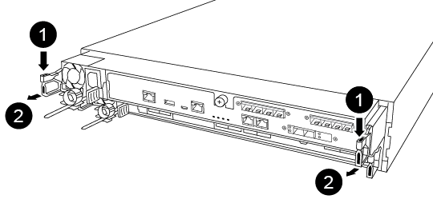

= リアルタイムクロックバッテリを交換してください - AFF A250
:allow-uri-read: 
:icons: font
:imagesdir: ../media/

[role="lead"]
コントローラモジュールのリアルタイムクロック（ RTC ）バッテリを交換して、正確な時刻同期に依存するシステムのサービスとアプリケーションが機能を継続できるようにします。

* この手順は、システムでサポートされるすべてのバージョンの ONTAP で使用できます
* システムのその他のコンポーネントがすべて正常に動作している必要があります。問題がある場合は、必ずテクニカルサポートにお問い合わせください。

== 手順 1 ：障害のあるコントローラをシャットダウンします

障害のあるコントローラをシャットダウンするには、コントローラのステータスを確認し、必要に応じて正常なコントローラが障害のあるコントローラストレージからデータを引き続き提供できるようにコントローラをテイクオーバーする必要があります。

.このタスクについて
* SANシステムを使用している場合は、障害コントローラのSCSIブレードのイベントメッセージを確認しておく必要があり  `cluster kernel-service show`ます）。コマンド（priv advancedモードから）を実行すると、 `cluster kernel-service show` ノード名、そのノードのクォーラムステータス、そのノードの可用性ステータス、およびそのノードの動作ステータスが表示されます。
+
各 SCSI ブレードプロセスは、クラスタ内の他のノードとクォーラムを構成している必要があります。交換を進める前に、すべての問題を解決しておく必要があります。

* ノードが 3 つ以上あるクラスタは、クォーラムを構成している必要があります。クラスタがクォーラムを構成していない場合、または正常なコントローラで適格性と正常性についてfalseと表示される場合は、障害のあるコントローラをシャットダウンする前に問題 を修正する必要があります。を参照してください link:https://docs.netapp.com/us-en/ontap/system-admin/synchronize-node-cluster-task.html?q=Quorum["ノードをクラスタと同期します"^]。

.手順
. AutoSupportが有効になっている場合は、AutoSupportメッセージを呼び出してケースの自動作成を停止します。 `system node autosupport invoke -node * -type all -message MAINT=<# of hours>h`
+
次のAutoSupport メッセージは、ケースの自動作成を2時間停止します。 `cluster1:> system node autosupport invoke -node * -type all -message MAINT=2h`

. 正常なコントローラのコンソールから自動ギブバックを無効にします。 storage failover modify – node local-auto-giveback false
+

NOTE: 自動ギブバックを無効にしますか?_と表示されたら'y'を入力します

. 障害のあるコントローラに LOADER プロンプトを表示します。
+
[cols="1,2"]
|===
| 障害のあるコントローラの表示 | 作業 

 a| 
LOADER プロンプト
 a| 
次の手順に進みます。

 a| 
ギブバックを待っています
 a| 
Ctrl キーを押しながら C キーを押し ' プロンプトが表示されたら y と入力します

 a| 
システムプロンプトまたはパスワードプロンプト
 a| 
正常なコントローラから障害のあるコントローラをテイクオーバーまたは停止します。「 storage failover takeover -ofnode impaired_node_name _

障害のあるコントローラに「 Waiting for giveback... 」と表示されたら、 Ctrl+C キーを押し、「 y 」と入力します。

|===

== 手順 2 ：コントローラモジュールを取り外す

コントローラモジュール内部のコンポーネントを交換する場合は、コントローラモジュールをシャーシから取り外す必要があります。

元の場所がわかるように、ケーブルにラベルを付けておいてください。

. 接地対策がまだの場合は、自身で適切に実施します。
. コントローラモジュールの電源装置のコードをソースから抜きます。
. 電源ケーブル固定クリップを外し、電源装置からケーブルを抜きます。
. コントローラモジュールの両側にあるラッチ機構に人差し指をかけ、親指でレバーを押し、コントローラをシャーシからゆっくりと引き出します。
+

NOTE: コントローラモジュールを取り外しにくい場合は、（腕を交差させて）内側から穴に人さし指を入れます。

+

+
[cols="1,4"]
|===

 a| 
image:../media/icon_round_1.png["番号1"]
 a| 
レバー

 a| 
image:../media/icon_round_2.png["番号2"]
 a| 
ラッチ機構

|===
. コントローラモジュールの両側を両手で持ってシャーシからゆっくりと引き出し、平らで安定した場所に置きます。
. コントローラモジュールの前面にある取り付けネジを反時計回りに回して、コントローラモジュールのカバーを開きます。
+
image::../media/drw_a250_open_controller_module_cover.png[コントローラモジュールのカバーを開く]

+
[cols="1,4"]
|===

 a| 
image:../media/icon_round_1.png["番号1"]
| 取り付けネジ 

 a| 
image::../media/icon_round_2.png[番号2]
 a| 
コントローラモジュールカバー

|===
. エアダクトカバーを持ち上げて外します。
+
image::../media/drw_a250_remove_airduct_cover.png[エアダクトカバーを持ち上げて取り外します。]

== 手順 3 ： RTC バッテリを交換します

RTC バッテリを交換するには、コントローラ内でバッテリの場所を確認し、特定の手順を実行します。

次のビデオまたは表に示す手順を使用して、 RTC バッテリを交換します。

.アニメーション- RTCバッテリを交換します
video::6ed27f71-d3a7-4cee-8d9f-ac5b016c982d[panopto]
. ヒートシンクとミッドプレーンの間にある RTC バッテリの位置を確認し、図のように完全に取り外します。
+
image::../media/drw_a250_remove_rtc_batt.png[RTCバッテリの取り外し]

+
[cols="1,4"]
|===

 a| 
image:../media/icon_round_1.png["番号1"]
 a| 
タブをバッテリケースからゆっくりと引き出します。* 注意： * 積極的に離れて引き出すと、タブが外れてしまう可能性があります。

 a| 
image:../media/icon_round_2.png["番号2"]
 a| 
バッテリを持ち上げます。* 注： * バッテリの極の向きをメモしておいてください。

 a| 
image:../media/icon_round_3.png["番号3"]
 a| 
バッテリがイジェクトされるはずです。

|===
+
バッテリがイジェクトされます。

. 交換用バッテリを静電気防止用の梱包バッグから取り出します。
. ヒートシンクとミッドプレーンの間にある RTC バッテリホルダーの位置を確認し、図のように正確に挿入します。
+
image::../media/drw_a250_install_rtc_batt.png[RTCバッテリの取り付け]

+
|===

 a| 
image:../media/icon_round_1.png["番号1"]
| 正の極性を上向きにして、バッテリハウジングのタブの下にバッテリをスライドさせます。 

 a| 
image:../media/icon_round_2.png["番号2"]
 a| 
バッテリをゆっくりと所定の位置に押し込み、タブでケースに固定されていることを確認します。

CAUTION: 積極的に押すと原因 、バッテリがイジェクトされる可能性があります。

|===
. バッテリがホルダーに完全に取り付けられ、かつ極の向きが正しいことを目で見て確認します。

== 手順 4 ：コントローラモジュールを再度取り付け、 RTC バッテリ交換後に日時を設定します

コントローラモジュール内のコンポーネントを交換したら、コントローラモジュールをシステムシャーシに再度取り付け、コントローラの日付と時刻をリセットしてブートする必要があります。

. エアダクトまたはコントローラモジュールカバーを閉じていない場合は閉じます。
. コントローラモジュールの端をシャーシの開口部に合わせ、コントローラモジュールをシステムに半分までそっと押し込みます。
+
指示があるまでコントローラモジュールをシャーシに完全に挿入しないでください。

. 必要に応じてシステムにケーブルを再接続します。
+
光ファイバケーブルを使用する場合は、メディアコンバータ（ QSFP または SFP ）を取り付け直してください（取り外した場合）。

. 電源装置を取り外した場合は、電源装置を再度接続し、電源ケーブルの固定クリップを再度取り付けます。
. コントローラモジュールをシャーシに挿入します。
+
.. ラッチのアームがすべて引き出された位置で固定されていることを確認します。
.. コントローラモジュールを両手で位置に合わせ、ラッチのアームにゆっくりとスライドさせて停止させます。
.. ラッチの内側から穴に人さし指を入れます。
.. ラッチ上部のオレンジ色のタブで親指を押し下げ、コントローラモジュールをゆっくりと停止位置に押し込みます。
.. ラッチの上部から親指を離し、ラッチが完全に固定されるまで押し続けます。
+
コントローラモジュールは、シャーシに完全に装着されるとすぐにブートを開始します。ブートプロセスを中断できるように準備しておきます。

.. LOADER プロンプトでコントローラを停止します。

+
コントローラモジュールを完全に挿入し、シャーシの端と同一平面になるようにします。

. コントローラの時刻と日付をリセットします。
+
.. show date コマンドを使用して ' 正常なコントローラの日付と時刻を確認します
.. ターゲットコントローラの LOADER プロンプトで、日時を確認します。
.. 必要に応じて 'set date mm/dd/yyyy` コマンドで日付を変更します
.. 必要に応じて、「 set time hh ： mm ： ss 」コマンドを使用して、時刻を GMT で設定します。
.. ターゲットコントローラの日付と時刻を確認します。

. LOADER プロンプトで「 bye 」と入力して、 PCIe カードおよびその他のコンポーネントを再初期化し、コントローラをリブートさせます。
. ストレージをギブバックして、コントローラを通常の動作に戻します。 storage failover giveback -ofnode impaired_node_name _`
. 自動ギブバックを無効にした場合は、再度有効にします。「 storage failover modify -node local-auto-giveback true 」

== 手順 5 ：障害が発生したパーツをネットアップに返却する

障害が発生したパーツは、キットに付属のRMA指示書に従ってNetAppに返却してください。 https://mysupport.netapp.com/site/info/rma["パーツの返品と交換"]詳細については、ページを参照してください。
