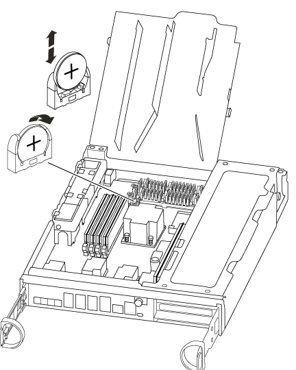

= リアルタイムクロックバッテリを交換してください - AFF A300
:icons: font
:imagesdir: ../media/

[role="lead"]
コントローラモジュールのリアルタイムクロック（ RTC ）バッテリを交換して、正確な時刻同期に依存するシステムのサービスとアプリケーションが機能を継続できるようにします。

* この手順は、システムでサポートされるすべてのバージョンの ONTAP で使用できます
* システムのその他のコンポーネントがすべて正常に動作している必要があります。問題がある場合は、必ずテクニカルサポートにお問い合わせください。

== 手順 1 ：障害のあるコントローラをシャットダウンします

[role="lead"]
ストレージシステムのハードウェア構成に応じた手順を使用して、障害のあるコントローラをシャットダウンまたはテイクオーバーできます。

=== オプション 1 ：ほとんどの構成

[role="lead"]
障害ノードをシャットダウンするには、ノードのステータスを確認し、必要に応じて正常なノードが障害ノードのストレージからデータを引き続き提供できるようにノードをテイクオーバーする必要があります。

ノードが 3 つ以上あるクラスタは、クォーラムを構成している必要があります。クラスタがクォーラムを構成していない場合や、正常なノードの資格と健全性に false と表示される場合は、障害ノードをシャットダウンする前に問題を修正する必要があります。を参照してください https://docs.netapp.com/us-en/ontap/system-admin/index.html["CLI での管理の概要"]。

.手順
. AutoSupport が有効になっている場合は、 AutoSupport メッセージを呼び出してケースの自動作成を抑制します。「 system node AutoSupport invoke -node * -type all -message MAINT=number_OF_hours_downh
+
次の AutoSupport メッセージは、ケースの自動作成を 2 時間停止します。 cluster1 ： * > system node AutoSupport invoke -node * -type all -message MAINT=2h`

. 正常なノードのコンソールから自動ギブバックを無効にします。「 storage failover modify – node local-auto-giveback false
. 障害ノードに LOADER プロンプトを表示します。
+
[cols="1,2"]
|===
| 障害ノードの表示 | 作業 

 a| 
LOADER プロンプト
 a| 
次の手順に進みます。

 a| 
ギブバックを待っています
 a| 
Ctrl キーを押しながら C キーを押し ' プロンプトが表示されたら y と入力します

 a| 
システムプロンプトまたはパスワードプロンプト（システムパスワードの入力）
 a| 
障害ノードをテイクオーバーまたは停止します。

** HA ペアの場合は、正常なノードから障害ノードをテイクオーバーします。「 storage failover takeover -ofnode impaired_node_name _
+
障害ノードに「 Waiting for giveback... 」と表示されたら、 Ctrl+C キーを押し、「 y 」と入力します。

|===

=== オプション 2 ：コントローラが MetroCluster に搭載されている

NOTE: 2 ノード MetroCluster 構成のシステムでは、この手順を使用しないでください。

障害ノードをシャットダウンするには、ノードのステータスを確認し、必要に応じて正常なノードが障害ノードのストレージからデータを引き続き提供できるようにノードをテイクオーバーする必要があります。

* ノードが 3 つ以上あるクラスタは、クォーラムを構成している必要があります。クラスタがクォーラムを構成していない場合や、正常なノードの資格と健全性に false と表示される場合は、障害ノードをシャットダウンする前に問題を修正する必要があります。を参照してください https://docs.netapp.com/us-en/ontap/system-admin/index.html["CLI での管理の概要"]。
* MetroCluster 構成を使用している場合は、 MetroCluster 構成状態が構成済みで、ノードが有効かつ正常な状態であることを確認しておく必要があります（「 MetroCluster node show 」）。

.手順
. AutoSupport が有効になっている場合は、 AutoSupport メッセージを呼び出してケースの自動作成を抑制します。「 system node AutoSupport invoke -node * -type all -message MAINT=number_OF_hours_downh
+
次の AutoSupport メッセージは、ケースの自動作成を 2 時間停止します。 cluster1 ： * > system node AutoSupport invoke -node * -type all -message MAINT=2h`

. 正常なノードのコンソールから自動ギブバックを無効にします。「 storage failover modify – node local-auto-giveback false
. 障害ノードに LOADER プロンプトを表示します。
+
[cols="1,2"]
|===
| 障害ノードの表示 | 作業 

 a| 
LOADER プロンプト
 a| 
次の手順に進みます。

 a| 
ギブバックを待っています
 a| 
Ctrl キーを押しながら C キーを押し ' プロンプトが表示されたら y と入力します

 a| 
システムプロンプトまたはパスワードプロンプト（システムパスワードの入力）
 a| 
障害ノードをテイクオーバーまたは停止します。

** HA ペアの場合は、正常なノードから障害ノードをテイクオーバーします。「 storage failover takeover -ofnode impaired_node_name _
+
障害ノードに「 Waiting for giveback... 」と表示されたら、 Ctrl+C キーを押し、「 y 」と入力します。

|===

=== オプション 3 ：コントローラは 2 ノード MetroCluster に搭載されています

[role="lead"]
障害ノードをシャットダウンするには、ノードのステータスを確認し、必要に応じて正常なノードが障害ノードのストレージからデータを引き続き提供できるようにノードをスイッチオーバーする必要があります。

.このタスクについて
* NetApp Storage Encryption を使用している場合は、の「 SED を非保護モードに戻す」セクションの手順に従って MSID をリセットしておく必要があります https://docs.netapp.com/us-en/ontap/system-admin/index.html["CLI での管理の概要"]。
* 正常なノードに電力を供給するために、この手順の最後で電源装置をオンのままにしておく必要があります。

.手順
. MetroCluster ステータスをチェックして、障害ノードが正常なノードに自動的にスイッチオーバーしたかどうかを確認します。「 MetroCluster show 」
. 自動スイッチオーバーが発生したかどうかに応じて、次の表に従って処理を進めます。
+
[cols="1,2"]
|===
| 障害ノードの状況 | 作業 

 a| 
自動的にスイッチオーバーした
 a| 
次の手順に進みます。

 a| 
自動的にスイッチオーバーしていない
 a| 
正常なノードから計画的スイッチオーバー処理を実行します： MetroCluster switchover

 a| 
スイッチオーバーは自動的には行われておらず、 MetroCluster switchover コマンドを使用してスイッチオーバーを試みたが、スイッチオーバーは拒否された
 a| 
拒否メッセージを確認し、可能であれば問題を解決してやり直します。問題を解決できない場合は、テクニカルサポートにお問い合わせください。

|===
. サバイバークラスタから MetroCluster heal-phase aggregates コマンドを実行して、データアグリゲートを再同期します。
+
[listing]
----
controller_A_1::> metrocluster heal -phase aggregates
[Job 130] Job succeeded: Heal Aggregates is successful.
----
+
修復が拒否された場合は '-override-vetoes パラメータを指定して MetroCluster heal' コマンドを再実行できますこのオプションパラメータを使用すると、修復処理を妨げるソフトな拒否はすべて無視されます。

. MetroCluster operation show コマンドを使用して、処理が完了したことを確認します。
+
[listing]
----
controller_A_1::> metrocluster operation show
    Operation: heal-aggregates
      State: successful
Start Time: 7/25/2016 18:45:55
   End Time: 7/25/2016 18:45:56
     Errors: -
----
. 「 storage aggregate show 」コマンドを使用して、アグリゲートの状態を確認します。
+
[listing]
----
controller_A_1::> storage aggregate show
Aggregate     Size Available Used% State   #Vols  Nodes            RAID Status
--------- -------- --------- ----- ------- ------ ---------------- ------------
...
aggr_b2    227.1GB   227.1GB    0% online       0 mcc1-a2          raid_dp, mirrored, normal...
----
. 「 MetroCluster heal-phase root-aggregates 」コマンドを使用して、ルートアグリゲートを修復します。
+
[listing]
----
mcc1A::> metrocluster heal -phase root-aggregates
[Job 137] Job succeeded: Heal Root Aggregates is successful
----
+
修復が拒否された場合は '-override-vetoes パラメータを指定して MetroCluster heal' コマンドを再実行できますこのオプションパラメータを使用すると、修復処理を妨げるソフトな拒否はすべて無視されます。

. デスティネーションクラスタで「 MetroCluster operation show 」コマンドを使用して、修復処理が完了したことを確認します。
+
[listing]
----

mcc1A::> metrocluster operation show
  Operation: heal-root-aggregates
      State: successful
 Start Time: 7/29/2016 20:54:41
   End Time: 7/29/2016 20:54:42
     Errors: -
----
. 障害のあるコントローラモジュールで、電源装置の接続を解除します。

== 手順 2 ：コントローラモジュールを開く

[role="lead"]
コントローラ内部のコンポーネントにアクセスするには、まずコントローラモジュールをシステムから取り外し、続いてコントローラモジュールのカバーを外す必要があります。

. 接地対策がまだの場合は、自身で適切に実施します。
. ケーブルマネジメントデバイスに接続しているケーブルをまとめているフックとループストラップを緩め、システムケーブルと SFP をコントローラモジュールから外し（必要な場合）、どのケーブルが何に接続されていたかを記録します。
+
ケーブルはケーブルマネジメントデバイスに収めたままにします。これにより、ケーブルマネジメントデバイスを取り付け直すときに、ケーブルを整理する必要がありません。

. ケーブルマネジメントデバイスをコントローラモジュールの右側と左側から取り外し、脇に置きます。
+
image::../media/drw_32xx_cbl_mgmt_arm.png[DRW 32xx CBL mgmt arm （ DRW 32xx CBL 管理アーム]

. コントローラモジュールのカムハンドルの取り付けネジを緩めます。
+
image::../media/drw_8020_cam_handle_thumbscrew.png[DRW 8020 カムハンドルの取り付けネジ]

+
|===

 a| 
image:../media/legend_icon_01.png[""]
| 取り付けネジ 

 a| 
image:../media/legend_icon_02.png[""]
 a| 
カムハンドル

|===
. カムハンドルを下に引き、コントローラモジュールをシャーシから引き出します。
+
このとき、空いている手でコントローラモジュールの底面を支えてください。

== 手順 3 ： RTC バッテリを交換します

[role="lead"]
RTC バッテリを交換するには、コントローラ内でバッテリの場所を確認し、特定の手順を実行します。

. 接地対策がまだの場合は、自身で適切に実施します。
. RTC バッテリの場所を確認します。
+

. バッテリをそっと押してホルダーから離し、持ち上げてホルダーから取り出します。
+

NOTE: ホルダーから取り外す際に、バッテリの極の向きを確認しておいてください。バッテリに記載されているプラス記号に従って、バッテリをホルダーに正しく配置する必要があります。ホルダーの近くにプラス記号が表示されているので、バッテリーの位置を確認できます。

. 交換用バッテリを静電気防止用の梱包バッグから取り出します。
. コントローラモジュールで空のバッテリホルダーの場所を確認します。
. RTC バッテリの極の向きを確認し、バッテリを斜めに傾けた状態で押し下げてホルダーに挿入します。
. バッテリがホルダーに完全に取り付けられ、かつ極の向きが正しいことを目で見て確認します。

== 手順 4 ：コントローラモジュールを再度取り付け、 RTC バッテリ交換後に日時を設定します

[role="lead"]
コントローラモジュール内のコンポーネントを交換したら、コントローラモジュールをシステムシャーシに再度取り付け、コントローラの日付と時刻をリセットしてブートする必要があります。

. エアダクトまたはコントローラモジュールカバーを閉じていない場合は閉じます。
. コントローラモジュールの端をシャーシの開口部に合わせ、コントローラモジュールをシステムに半分までそっと押し込みます。
+
指示があるまでコントローラモジュールをシャーシに完全に挿入しないでください。

. 必要に応じてシステムにケーブルを再接続します。
+
光ファイバケーブルを使用する場合は、メディアコンバータ（ QSFP または SFP ）を取り付け直してください（取り外した場合）。

. 電源装置を取り外した場合は、電源装置を再度接続し、電源ケーブルの固定クリップを再度取り付けます。
. コントローラモジュールの再取り付けを完了します。
+
.. カムハンドルを開き、コントローラモジュールをミッドプレーンまでしっかりと押し込んで完全に装着し、カムハンドルをロック位置まで閉じます。
+
コントローラモジュール背面のカムハンドルの取り付けネジを締めます。

+

NOTE: コネクタの破損を防ぐため、コントローラモジュールをスライドしてシャーシに挿入する際に力を入れすぎないでください。

.. ケーブルマネジメントデバイスをまだ取り付けていない場合は、取り付け直します。
.. ケーブルマネジメントデバイスに接続されているケーブルをフックとループストラップでまとめます。
.. 電源装置と電源に電源ケーブルを再接続し、電源をオンにしてブートプロセスを開始します。
.. LOADER プロンプトでコントローラを停止します。

. コントローラの時刻と日付をリセットします。
+
.. 'how date ' コマンドを使用して ' 正常なノードの日付と時刻を確認します
.. ターゲットノードの LOADER プロンプトで、日時を確認します。
.. 必要に応じて 'set date mm/dd/yyyy` コマンドで日付を変更します
.. 必要に応じて、「 set time hh ： mm ： ss 」コマンドを使用して、時刻を GMT で設定します。
.. ターゲットノードの日時を確認します。

. LOADER プロンプトで「 bye 」と入力して、 PCIe カードおよびその他のコンポーネントを再初期化し、ノードをリブートさせます。
. ストレージをギブバックしてノードを通常動作に戻します。「 storage failover giveback -ofnode impaired_node_name _
. 自動ギブバックを無効にした場合は、再度有効にします。「 storage failover modify -node local-auto-giveback true 」

== 手順 5 ： 2 ノード MetroCluster 構成のアグリゲートをスイッチバックする

[role="lead"]
2 ノード MetroCluster 構成で FRU の交換が完了したら、 MetroCluster スイッチバック処理を実行できます。これにより構成が通常の動作状態に戻ります。また、障害が発生していたサイトの同期元 Storage Virtual Machine （ SVM ）がアクティブになり、ローカルディスクプールからデータを提供します。

このタスクでは、環境の 2 ノード MetroCluster 構成のみを実行します。

.手順
. すべてのノードの状態が「 enabled 」であることを確認します。 MetroCluster node show
+
[listing]
----
cluster_B::>  metrocluster node show

DR                           Configuration  DR
Group Cluster Node           State          Mirroring Mode
----- ------- -------------- -------------- --------- --------------------
1     cluster_A
              controller_A_1 configured     enabled   heal roots completed
      cluster_B
              controller_B_1 configured     enabled   waiting for switchback recovery
2 entries were displayed.
----
. すべての SVM で再同期が完了したことを確認します。「 MetroCluster vserver show 」
. 修復処理によって実行される LIF の自動移行が正常に完了したことを確認します。 MetroCluster check lif show
. サバイバークラスタ内の任意のノードから MetroCluster switchback コマンドを使用して、スイッチバックを実行します。
. スイッチバック処理が完了したことを確認します MetroCluster show
+
クラスタの状態が waiting-for-switchback の場合は、スイッチバック処理がまだ実行中です。

+
[listing]
----
cluster_B::> metrocluster show
Cluster              Configuration State    Mode
--------------------	------------------- 	---------
 Local: cluster_B configured       	switchover
Remote: cluster_A configured       	waiting-for-switchback
----
+
クラスタが「 normal 」状態のとき、スイッチバック処理は完了しています。

+
[listing]
----
cluster_B::> metrocluster show
Cluster              Configuration State    Mode
--------------------	------------------- 	---------
 Local: cluster_B configured      		normal
Remote: cluster_A configured      		normal
----
+
スイッチバックが完了するまでに時間がかかる場合は、「 MetroCluster config-replication resync-status show 」コマンドを使用することで、進行中のベースラインのステータスを確認できます。

. SnapMirror 構成または SnapVault 構成があれば、再確立します。

== 手順 6 ：障害が発生したパーツをネットアップに返却する

[role="lead"]
部品を交換したあと、障害のある部品をネットアップに返却することができます。詳細については、キットに付属する RMA 指示書を参照してください。テクニカルサポートにお問い合わせください https://mysupport.netapp.com/site/global/dashboard["ネットアップサポート"]RMA 番号を確認する場合や、交換用手順にサポートが必要な場合は、日本国内サポート用電話番号：国内フリーダイヤル 0066-33-123-265 または 0066-33-821-274 （国際フリーフォン 800-800-80-800 も使用可能）までご連絡ください。
