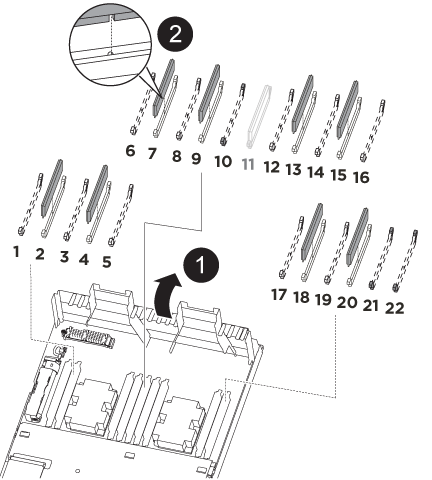

= コントローラモジュールハードウェア - AFF A320 を移動します
:icons: font
:imagesdir: ../media/

[role="lead"]
コントローラモジュールハードウェアを交換するには、障害ノードを取り外し、 FRU コンポーネントを交換用コントローラモジュールに移動し、交換用コントローラモジュールをシャーシに取り付けてから、システムをメンテナンスモードでブートする必要があります。

== 手順 1 ：コントローラモジュールを取り外す

[role="lead"]
コントローラモジュール内部のコンポーネントにアクセスするには、コントローラモジュールをシャーシから取り外す必要があります。

次の図または記載された手順に従って、コントローラモジュールをシャーシから取り外すことができます。

次の図は、障害のあるコントローラモジュールからケーブルとケーブル管理アームを取り外す方法を示しています。

image::../media/drw_a320_cable_management_arms.png[DRW A320 ケーブル管理アーム]

次の図は、障害のあるコントローラモジュールをシャーシから取り外す方法を示しています。

image::../media/drw_a320_controller_remove_animated_gif.png[DRW A320 コントローラアニメーション GIF を削除します]

. 接地対策がまだの場合は、自身で適切に実施します。
. コントローラモジュールの電源装置のコードを電源から抜きます。
. ケーブルマネジメントデバイスに接続しているケーブルをまとめているフックとループストラップを緩め、システムケーブルと SFP をコントローラモジュールから外し（必要な場合）、どのケーブルが何に接続されていたかを記録します。
+
ケーブルはケーブルマネジメントデバイスに収めたままにします。これにより、ケーブルマネジメントデバイスを取り付け直すときに、ケーブルを整理する必要がありません。

. ケーブルマネジメントデバイスをコントローラモジュールの右側と左側から取り外し、脇に置きます。
. コントローラモジュールをシャーシから取り外します。
+
.. コントローラモジュールの両側にあるラッチ機構に人差し指をかけます。
.. ラッチ機構の上部にあるオレンジ色のタブを押し下げて、シャーシのラッチピンを解除します。
+
ラッチ機構のフックがほぼ垂直に位置し、シャーシピンから解除されている必要があります。

.. コントローラモジュールの側面を持てるように、コントローラモジュールをゆっくりと少し手前に引き出します。
.. コントローラモジュールを両手でシャーシからゆっくりと引き出し、平らで安定した場所に置きます。

== 手順 2 ：電源装置を移動します

[role="lead"]
コントローラモジュールを交換する場合は、障害のあるコントローラモジュールから交換用コントローラモジュールに電源装置を移動する必要があります。

. 青色の固定ツメを押しながらカムハンドルを回転させて、コントローラモジュールから電源装置を引き出せるようにします。
+
* 注意： *

+
電源装置は奥行きがないので、コントローラモジュールから突然落下して負傷することがないように、取り外すときは必ず両手で支えてください。

. 電源装置を新しいコントローラモジュールに移して取り付けます。
. 電源装置の端を両手で支えながらコントローラモジュールの開口部に合わせ、固定ツメがカチッと音を立てて所定の位置に収まるまで電源装置をコントローラモジュールにそっと押し込みます。
+
電源装置は、内部コネクタに正しく差し込まれ、所定の位置にロックされているだけです。

+

NOTE: 内部コネクタの破損を防ぐため、電源装置をシステムに挿入する際に力を入れすぎないようにしてください。

== 手順 3 ： NVDIMM バッテリを移動します

[role="lead"]
NVDIMM バッテリを障害のあるコントローラモジュールから交換用コントローラモジュールに移動するには、特定の手順を実行する必要があります。

次に示すアニメーションや手順説明に従って、障害のあるコントローラモジュールから交換用コントローラモジュールに NVDIMM バッテリを移動します。

image::../media/drw_a320_nvbat_move_animated_gif.png[DRW A320 nvsbat アニメーション GIF を移動します]

. コントローラモジュールで NVDIMM バッテリの場所を確認します。
. バッテリプラグの場所を確認し、バッテリプラグ前面のクリップを押してプラグをソケットから外し、バッテリケーブルをソケットから抜きます。
. バッテリをつかんで「 PUSH 」と書かれた青色の固定ツメを押し、バッテリを持ち上げてホルダーとコントローラモジュールから取り出します。
. バッテリを交換用コントローラモジュールに移動します。
. バッテリモジュールをバッテリの開口部に合わせ、バッテリをスロットにそっと押し込んで所定の位置に固定します。
+

NOTE: 指示があるまで、バッテリケーブルをマザーボードに再接続しないでください。

== 手順 4 ：ブートメディアを移動します

[role="lead"]
ブートメディアの場所を確認し、手順に従って障害のあるコントローラモジュールからブートメディアを取り外して、交換用コントローラモジュールに挿入する必要があります。

次に示すアニメーションや手順説明に従って、障害のあるコントローラモジュールから交換用コントローラモジュールにブートメディアを移動します。

image::../media/drw_a320_boot_media_move_animated_gif.png[DRW A320 ブートメディア移動アニメーション GIF]

. エアダクトを開き、次の図またはコントローラモジュールの FRU マップを使用してブートメディアの場所を確認します。
. コントローラモジュールからブートメディアの場所を確認して取り出します。
+
.. ブートメディアの横の青いボタンを押して、ブートメディアの端を青いボタンの上まで跳ね上げます。
.. ブートメディアを回しながらソケットからゆっくりと引き出します。

. 新しいコントローラモジュールにブートメディアを移し、ブートメディアの端をソケットケースに合わせ、ソケットにゆっくりと押し込みます。
. ブートメディアが正しい向きでソケットに完全に装着されたことを確認します。
+
必要に応じて、ブートメディアを取り外してソケットへの装着をやり直します。

. ブートメディアを所定の位置にロックします。
+
.. ブートメディアをマザーボードの方に回転させます。
.. ブートメディアの横の青いボタンを押し、ブートメディアの端を押し下げて、青いロックボタンをはめ込みます。
.. ブートメディアを押し下げながら青いロックボタンを持ち上げて、ブートメディアを所定の位置にロックします。

== 手順 5 ： DIMM を移動します

[role="lead"]
DIMM の場所を確認し、障害のあるコントローラモジュールから交換用コントローラモジュールに DIMM を移動する必要があります。

障害のあるコントローラモジュールから交換用コントローラモジュールの対応するスロットに DIMM を直接移動できるように、新しいコントローラモジュールを準備しておく必要があります。

次に示すアニメーションや手順説明に従って、障害のあるコントローラモジュールから交換用コントローラモジュールに DIMM を移動します。

. コントローラモジュールで DIMM の場所を確認します。
+
image::../media/drw_a320_dimm_map.png[DRW A320 DIMM マップ]

+
|===

 a| 
image:../media/legend_icon_01.png[""]
| エアダクト 

 a| 
image:../media/legend_icon_02.png[""]
 a| 
** システム DIMM スロット： 2 、 4 、 7 、 9 、 13 、 15 、 18 、 20
** NVDIMM スロット： 11
+

NOTE: NVDIMM の外観はシステム DIMM とは大きく異なります。

|===
. DIMM を交換用コントローラモジュールに正しい向きで挿入できるように、ソケット内の DIMM の向きをメモします。
. NVDIMM バッテリが新しいコントローラモジュールに接続されていないことを確認します。
. 障害のあるコントローラモジュールから交換用コントローラモジュールに DIMM を移動します。
+

NOTE: 障害のあるコントローラモジュールで使用していたスロットと同じスロットに各 DIMM を取り付けてください。

+
.. DIMM の両側にあるツメをゆっくり押し開いて DIMM をスロットから外し、そのままスライドさせてスロットから取り出します。
+

NOTE: DIMM 回路基板のコンポーネントに力が加わらないように、 DIMM の両端を慎重に持ちます。

.. 交換用コントローラモジュールで対応する DIMM スロットの場所を確認します。
.. DIMM ソケットのツメが開いた状態になっていることを確認し、 DIMM をソケットに対して垂直に挿入します。
+
DIMM のソケットへの挿入にはある程度の力が必要です。簡単に挿入できない場合は、 DIMM をソケットに正しく合わせてから再度挿入してください。

.. DIMM がソケットにまっすぐ差し込まれていることを目で確認してください。
.. 残りの DIMM についても、上記の手順を繰り返します。

. NVDIMM バッテリをマザーボードに接続します。
+
プラグがコントローラモジュールに固定されていることを確認します。

== 手順 6 ： PCIe ライザーを移動します

[role="lead"]
PCIe ライザーに PCIe カードを取り付けた状態で、障害のあるコントローラモジュールから交換用コントローラモジュールに PCIe ライザーを移動する必要があります。

次に示すアニメーションや手順説明に従って、障害のあるコントローラモジュールから交換用コントローラモジュールに PCIe ライザーを移動します。

image::../media/drw_a320_pci_riser_move_animated_gif.png[DRW A320 PCI ライザー動画 GIF を移動します]

. PCIe ライザーのカバーの青色の取り付けネジを外してカバーを取り外します。カバーを手前にスライドさせて上に回転させ、コントローラモジュールから持ち上げて外し、脇に置きます。
. 交換用コントローラモジュールから空のライザーを取り外します。
+
.. ライザーモジュールの左側にある穴に人差し指を入れ、親指でライザーをつかみます。
.. ライザーを真上に持ち上げてベイから取り出し、脇に置きます。
.. 2 つ目のライザーに対して上記の手順を繰り返します。

. PCIe ライザーを、障害のあるコントローラモジュールから交換用コントローラモジュールの同じライザーベイに移します。
+
.. 障害のあるコントローラモジュールからライザーを取り外し、交換用コントローラモジュールに移します。
.. ライザーのピンがベイの背面にあるガイド穴に入るように、ライザーをまっすぐベイに下ろします。
.. ライザーの両端を均等な力で真下に押し込んで、マザーボードソケットに装着します。
+
ライザーはほとんど抵抗なくスムーズに装着されるはずです。ライザーがスムーズにソケットに装着されない場合は、ライザーをベイに装着し直してください。

.. 2 つ目のライザーに対して上記の手順を繰り返します。
.. PCIe ライザーにカバーを再度取り付けます。

== 手順 7 ：コントローラモジュールを取り付ける

[role="lead"]
障害のあるコントローラモジュールから交換用コントローラモジュールにすべてのコンポーネントを移動したら、交換用コントローラモジュールをシャーシに取り付け、メンテナンスモードでブートする必要があります。

次に示すアニメーションや手順説明に従って、交換用コントローラモジュールをシャーシに取り付けます。

image::../media/drw_a320_controller_install_animated_gif.png[DRW A320 コントローラにアニメーション GIF をインストールします]

. コントローラモジュールの背面にあるエアダクトを閉じ、 PCIe カードにカバーを再度取り付けていない場合は、
. コントローラモジュールの端をシャーシの開口部に合わせ、コントローラモジュールをシステムに半分までそっと押し込みます。
+

NOTE: 指示があるまでコントローラモジュールをシャーシに完全に挿入しないでください。

. システムにアクセスして以降のセクションのタスクを実行できるように、管理ポートとコンソールポートのみをケーブル接続します。
+

NOTE: 残りのケーブルは、この手順の後半でコントローラモジュールに接続します。

. コントローラモジュールの再取り付けを完了します。
+
.. ラッチアームが引き出された位置で固定されていることを確認します。
.. ラッチアームを使用して、コントローラモジュールをシャーシベイの奥まで押し込みます。
.. ラッチ上部にあるオレンジ色のタブを押し下げます。
.. コントローラモジュールをシャーシの端と揃うまで、シャーシベイにそっと押し込みます。
+

NOTE: ラッチのアームがシャーシ内にスライドします。

+
コントローラモジュールは、シャーシに完全に装着されるとすぐにブートを開始します。

.. ラッチを外してコントローラモジュールを所定の位置に固定します。
.. 電源装置を再度ケーブル接続します。
.. ケーブルマネジメントデバイスをまだ取り付けていない場合は、取り付け直します。
.. Ctrl キーを押しながら C キーを押して ' 通常の起動プロセスを中断します

