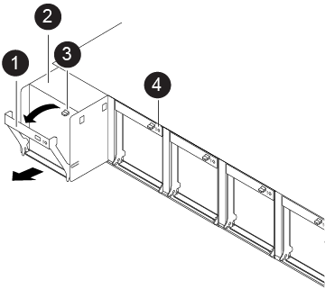

= ファンモジュールのホットスワップ - AFF A320
:icons: font
:imagesdir: ../media/

[role="lead"]
サービスを中断せずにファンモジュールを交換するには、特定の順序でタスクを実行する必要があります。

. 接地対策がまだの場合は、自身で適切に実施します。
. （必要な場合）両手でベゼルの両側の開口部を持ち、手前に引いてシャーシフレームのボールスタッドからベゼルを外します。
. 交換が必要なファンモジュールを特定するために、コンソールのエラーメッセージを確認し、ファンモジュールの警告 LED を確認します。
. ファンモジュールのカムハンドルのリリースラッチを押し下げ、カムハンドルを下に回転させます。
+
ファンモジュールがシャーシから少し離れた場所に移動します。

. ファンモジュールをシャーシから引き出します。このとき、ファンモジュールがシャーシから落下しないように、必ず空いている手で支えてください。
+

NOTE: ファンモジュールは奥行きがないので、シャーシから突然落下してけがをすることがないように、必ず空いている手でファンモジュールの底面を支えてください。

. ファンモジュールを脇へ置きます。
. 交換用ファンモジュールをシャーシの開口部に合わせ、スライドさせながらシャーシに挿入します。
. ファンモジュールのカムハンドルをしっかり押して、シャーシに完全に装着されるようにします。
+
ファンモジュールが完全に装着されると、カムハンドルが少し持ち上がります。

. カムハンドルを閉じる位置まで上げ、カムハンドルのリリースラッチがカチッという音を立ててロックされたことを確認します。
+
ファンが装着されて動作速度まで回転数が上がっても、警告 LED は点灯しません。

. ベゼルをボールスタッドに合わせ、ボールスタッドにそっと押し込みます。

