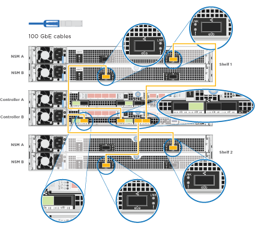

= 詳細ガイド - AFF A320
:icons: font
:imagesdir: ../media/

[role="lead"]
このガイドでは、一般的なネットアップシステムのインストール手順について詳しく説明します。インストール手順の詳細については、このガイドを参照してください。

== 設置を準備

[role="lead"]
AFF A320 システムを設置するには、アカウントを作成し、システムを登録し、ライセンスキーを取得する必要があります。また、システムに応じた適切な数とタイプのケーブルを準備し、特定のネットワーク情報を収集する必要があります。

サイト要件および構成済みシステムの追加情報の情報については、 Hardware Universe にアクセスできる必要があります。また、ご使用の ONTAP バージョンのリリースノートにアクセスして、このシステムの詳細を確認しておくことを推奨します。

https://hwu.netapp.com["NetApp Hardware Universe の略"]

http://mysupport.netapp.com/documentation/productlibrary/index.html?productID=62286["使用しているバージョンの ONTAP 9 に対するリリースノートを検索してください"]

お客様のサイトで次のものを準備する必要があります。

* ストレージシステム用のラックスペース
* No.2 プラスドライバ
* Web ブラウザを使用してシステムをネットワークスイッチおよびラップトップまたはコンソールに接続するための追加のネットワークケーブル
* RJ-45 接続を備え、 Web ブラウザにアクセスできるラップトップまたはコンソール
+
.. すべての箱を開封して内容物を取り出します。
.. コントローラのシステムシリアル番号をメモします。
+
image::../media/drw_ssn_label.png[DRW SSN ラベル]

.. アカウントを設定します。
+
... 既存のアカウントにログインするか、アカウントを作成します。
... システムを登録します。
+
https://mysupport.netapp.com/eservice/registerSNoAction.do?moduleName=RegisterMyProduct["ネットアップ製品登録"]

.. 同梱されていたケーブルの数と種類を確認し、書き留めておきます。
+
次の表に、同梱されているケーブルの種類を示します。この表にないケーブルが含まれていた場合は、 Hardware Universe を参照してケーブルを特定し、用途を確認してください。

+
https://hwu.netapp.com["NetApp Hardware Universe の略"]

+
[cols="1,2,1,2"]
|===
| ケーブルのタイプ | パーツ番号と長さ | コネクタのタイプ | 用途 

 a| 
100GbE ケーブル（ QSF （ 28 ）
 a| 
X666211A-05 (112-00595) 、 0.5m

X666211A-1 （ 112-00573 ）、 1m

X666211A-2 （ 112-00574 ）、 2m

X666211A-5 （ 112-00574 ）、 5m
 a| 
image:../media/oie_cable100_gbe_qsfp28.png[""]
 a| 
ストレージ、クラスタインターコネクト / HA 、イーサネットデータ（注文内容による）

 a| 
40GbE ケーブル
 a| 
X666211A-1 （ 112-00573 ）、 1m ；

X666211A-3 （ 112-00543 ）、 3m ；

X666211A-5 （ 112-00576 ）、 5m
 a| 
image:../media/oie_cable_sfp_gbe_copper.png[""]
 a| 
ストレージ、クラスタインターコネクト / HA 、イーサネットデータ（注文内容による）

 a| 
イーサネットケーブル - MPO
 a| 
X66200-2 （ 112-00326 ）、 2m

X66250-5 （ 112-00328 ）、 5m

X66250-30 （ 112-00331 ）、 30m
 a| 
image:../media/oie_cable_etherned_mpo.png[""]
 a| 
イーサネットケーブル（注文内容による）

 a| 
光ケーブル
 a| 
SR ：

X6553-R6 （ 112-00188 ）、 2m

X6554-R6 （ 112-00189 ）、 15m

X6537-R6 （ 112-00091 ）、 30m

LR ：

X66250-3 （ 112-00342 ）、 2m

X66260-5 （ 112-00344 ）、 5m

X66260-30 （ 112-00354 ）、 30m
 a| 
image:../media/oie_cable_fiber_lc_connector.png[""]
 a| 
FC 構成（注文内容による）

 a| 
RJ-45 （注文内容による）
 a| 
X6585-R6 （ 112-00291 ）、 3m

X6562-R6 （ 112-00196 ）、 5m
 a| 
image:../media/oie_cable_rj45.png[""]
 a| 
管理ネットワーク

 a| 
Micro-USB コンソールケーブル
 a| 
該当なし
 a| 
image:../media/oie_cable_micro_usb.png[""]
 a| 
ネットワーク検出をサポートしていないラップトップまたはコンソールでソフトウェアをセットアップする際に使用するコンソール接続

 a| 
電源ケーブル
 a| 
該当なし
 a| 
image:../media/oie_cable_power.png[""]
 a| 
システムの電源をオンにします

|===
.. クラスタ設定ワークシート _ をダウンロードして記入します。
+
https://library.netapp.com/ecm/ecm_download_file/ECMLP2839002["クラスタ設定ワークシート"]

== ハードウェアを設置

[role="lead"]
システムは、 4 ポストラックまたはネットアップシステムキャビネットのいずれかに設置する必要があります。

. 必要に応じてレールキットを取り付けます。
. レールキットに付属の手順書に従って、システムを設置して固定します。
+

NOTE: システムの重量に関連する安全上の注意事項を確認しておく必要があります。

+
image::../media/drw_a320_weight_label.png[DRW A320 重量ラベル]

. ケーブルマネジメントデバイスを取り付けます（図を参照）。
+
image::../media/drw_a320_cable_management_arms.png[DRW A320 ケーブル管理アーム]

. システムの前面にベゼルを配置します。

== コントローラをネットワークに接続

[role="lead"]
2 ノードスイッチレスクラスタメソッドまたはクラスタインターコネクトネットワークを使用して、コントローラをネットワークにケーブル接続できます。

=== オプション 1 ： 2 ノードスイッチレスクラスタをケーブル接続

[role="lead"]
コントローラモジュールのオプションのデータポート、オプションの NIC カード、および管理ポートは、スイッチに接続されます。クラスタインターコネクト / HA ポートは、両方のコントローラモジュールでケーブル接続されます。

システムとスイッチの接続に関する情報を、ネットワーク管理者に確認しておく必要があります。

図の矢印を見て、ケーブルコネクタのプルタブの正しい向きを確認してください。

image::../media/oie_cable_pull_tab_up.png[OIE ケーブルのプルタブを上にします]

NOTE: コネクタを挿入すると、カチッという音がしてコネクタが所定の位置に収まるはずです。音がしない場合は、コネクタを取り外し、回転させてからもう一度試してください。

. この図またはステップバイステップの手順に従って、コントローラとスイッチをケーブルで接続します。
+
image::../media/drw_a320_tnsc_network_cabling_composite_animated_gif.png[DRW A320 TNSC ネットワークケーブルの複合アニメーション GIF]

+
[cols="1,2"]
|===
| ステップ | 各コントローラモジュールでを実行します 

 a| 
image:../media/oie_legend_icon_1_lg.png[""]
 a| 
100GbE （ QSFP28 ）ケーブルを使用して、クラスタ / HA ポートを相互に接続します。

** e0a から e0a
** e0d から e0dimage:../media/drw_a320_tnsc_cluster_ha_connection_step1a.png[""]

 a| 
image:../media/oie_legend_icon_2_o.png[""]
 a| 
オンボードポートをデータネットワーク接続に使用している場合は、 100GbE または 40GbE ケーブルを適切なデータネットワークスイッチに接続します。

** e0g と e0himage:../media/drw_a320_onboard_data_connection_step2.png[""]

 a| 

 a| 
イーサネット接続または FC 接続に NIC カードを使用している場合は、 NIC カードを適切なスイッチに接続します。

image::../media/drw_a320_nic_connections_step3.png[DRW A320 NIC 接続手順 3.]

 a| 
image:../media/oie_legend_icon_4_lp.png[""]
 a| 
RJ45 ケーブルを使用して、 e0M ポートを管理ネットワークスイッチに接続します。

image:../media/drw_a320_management_port_connection_step4.png[""]

 a| 
image:../media/oie_legend_icon_attn_symbol.png[""]
 a| 
この時点ではまだ電源コードをプラグに接続しないでください。

|===
. ストレージをケーブル接続します。 link:install_detailed_guide.md#["コントローラとドライブシェルフのケーブル接続"]

=== オプション 2 ：スイッチクラスタのケーブル接続

[role="lead"]
コントローラモジュールのオプションのデータポート、オプションの NIC カード、および管理ポートは、スイッチに接続されます。クラスタインターコネクト / HA ポートは、クラスタ / HA スイッチにケーブル接続されます。

システムとスイッチの接続に関する情報を、ネットワーク管理者に確認しておく必要があります。

図の矢印を見て、ケーブルコネクタのプルタブの正しい向きを確認してください。

image::../media/oie_cable_pull_tab_up.png[OIE ケーブルのプルタブを上にします]

NOTE: コネクタを挿入すると、カチッという音がしてコネクタが所定の位置に収まるはずです。音がしない場合は、コネクタを取り外し、回転させてからもう一度試してください。

. この図またはステップバイステップの手順に従って、コントローラとスイッチをケーブルで接続します。
+
image::../media/drw_a320_switched_network_cabling_composite_animated_gif.png[DRW A320 スイッチドネットワークケーブルの複合アニメーション GIF]

+
[cols="1,3"]
|===
| ステップ | 各コントローラモジュールでを実行します 

 a| 
image:../media/oie_legend_icon_1_lg.png[""]
 a| 
100GbE （ QSFP28 ）ケーブルを使用して、クラスタ / HA ポートをクラスタ / HA スイッチに接続します。

** 両方のコントローラの e0a をクラスタ / HA スイッチに接続します
** 両方のコントローラの e0d とクラスタ / HA スイッチimage:../media/drw_a320_switched_cluster_ha_connection_step1b.png[""]

 a| 
image:../media/oie_legend_icon_2_o.png[""]
 a| 
オンボードポートをデータネットワーク接続に使用している場合は、 100GbE または 40GbE ケーブルを適切なデータネットワークスイッチに接続します。

** e0g と e0himage:../media/drw_a320_onboard_data_connection_step2.png[""]

 a| 

 a| 
イーサネット接続または FC 接続に NIC カードを使用している場合は、 NIC カードを適切なスイッチに接続します。

image::../media/drw_a320_nic_connections_step3.png[DRW A320 NIC 接続手順 3.]

 a| 
image:../media/oie_legend_icon_4_lp.png[""]
 a| 
RJ45 ケーブルを使用して、 e0M ポートを管理ネットワークスイッチに接続します。

image:../media/drw_a320_management_port_connection_step4.png[""]

 a| 
image:../media/oie_legend_icon_attn_symbol.png[""]
 a| 
この時点ではまだ電源コードをプラグに接続しないでください。

|===
. ストレージをケーブル接続します。 link:install_detailed_guide.md#["コントローラとドライブシェルフのケーブル接続"]

== コントローラをドライブシェルフにケーブル接続

[role="lead"]
オンボードストレージポートを使用して、コントローラをシェルフにケーブル接続する必要があります。

=== オプション 1 ：コントローラを 1 台のドライブシェルフにケーブル接続する

[role="lead"]
各コントローラを、 NS224 ドライブシェルフの NSM モジュールにケーブル接続する必要があります。

図の矢印を見て、ケーブルコネクタのプルタブの正しい向きを確認してください。

image::../media/oie_cable_pull_tab_up.png[OIE ケーブルのプルタブを上にします]

NOTE: コネクタを挿入すると、カチッという音がしてコネクタが所定の位置に収まるはずです。音がしない場合は、コネクタを取り外し、回転させてからもう一度試してください。

. この図またはステップバイステップの手順に従って、 1 台のシェルフにコントローラをケーブル接続できます。
+
image::../media/drw_a320_single_shelf_connections_animated_gif.png[DRW A320 シングルシェルフ接続アニメーション GIF]

+
[cols="1,3"]
|===
| ステップ | 各コントローラモジュールでを実行します 

 a| 
image:../media/oie_legend_icon_1_mb.png[""]
 a| 
コントローラ A をシェルフにケーブル接続します image:../media/drw_a320_storage_cabling_controller_a_single_shelf.png[""]

 a| 
image:../media/oie_legend_icon_2_lo.png[""]
 a| 
コントローラ B をシェルフにケーブル接続します。 image:../media/drw_a320_storage_cabling_controller_b_single_shelf.png[""]

|===
. システムのセットアップを完了するには、を参照してください link:install_detailed_guide.md#["システムのセットアップと設定を実行"]。

=== オプション 2 ：コントローラを 2 台のドライブシェルフにケーブル接続する

[role="lead"]
各コントローラを両方の NS224 ドライブシェルフの NSM モジュールにケーブル接続する必要があります。

図の矢印を見て、ケーブルコネクタのプルタブの正しい向きを確認してください。

image::../media/oie_cable_pull_tab_up.png[OIE ケーブルのプルタブを上にします]

NOTE: コネクタを挿入すると、カチッという音がしてコネクタが所定の位置に収まるはずです。音がしない場合は、コネクタを取り外し、回転させてからもう一度試してください。

. 次の図または記載された手順を使用して、 2 台のドライブシェルフにコントローラをケーブル接続できます。
+
image::../media/drw_a320_2_shevles_cabling_animated_gif.png[DRW A320 2 シェイブルケーブル配線アニメーション GIF]

+
[cols="1-3"]
|===
| ステップ | 各コントローラモジュールでを実行します 

 a| 
image:../media/oie_legend_icon_1_mb.png[""]
 a| 
コントローラ A をシェルフにケーブル接続します。 image:../media/drw_a320_2_shelves_cabling_controller_a.png[""]

 a| 
image:../media/oie_legend_icon_2_lo.png[""]
 a| 
コントローラ B をシェルフにケーブル接続します。 

|===
. システムのセットアップを完了するには、を参照してください link:install_detailed_guide.md#["システムのセットアップと設定を実行"]。

== システムのセットアップと設定を完了

[role="lead"]
システムのセットアップと設定を実行するには、スイッチとラップトップのみを接続してクラスタ検出を使用するか、システムのコントローラに直接接続してから管理スイッチに接続します。

=== オプション 1 ：ネットワーク検出が有効になっている場合は、システムのセットアップと設定を実行する

[role="lead"]
ラップトップでネットワーク検出が有効になっている場合は、クラスタの自動検出を使用してシステムのセットアップと設定を実行できます。

. 電源コードをコントローラの電源装置に接続し、さらに別の回路の電源に接続します。
+
システムがブートを開始します。初回のブートには最大 8 分かかる場合があります

. ラップトップでネットワーク検出が有効になっていることを確認します。
+
詳細については、ラップトップのオンラインヘルプを参照してください。

. 次の図を使用して、ラップトップを管理スイッチに接続します。
+
https://netapp.hosted.panopto.com/Panopto/Pages/embed.aspx?id=d61f983e-f911-4b76-8b3a-ab1b0066909b["ラップトップを管理スイッチに接続します"]

. 検出する ONTAP アイコンを選択します。
+
image::../media/drw_autodiscovery_controler_select.png[DRW 自動検出コントローラ選択]

+
.. エクスプローラを開きます。
.. 左側のペインで、 [Network] ( ネットワーク ) をクリックします。
.. 右クリックして、更新を選択します。
.. いずれかの ONTAP アイコンをダブルクリックし、画面に表示された証明書を受け入れます。
+

NOTE: 「 XXXXX 」は、ターゲットノードのシステムシリアル番号です。

+
System Manager が開きます。

. System Manager のセットアップガイドを使用して、 _NetApp ONTAP 構成ガイド _ で収集したデータを基にシステムを設定します。
+
https://library.netapp.com/ecm/ecm_download_file/ECMLP2862613["『 ONTAP 構成ガイド』"]

. Config Advisor を実行してシステムの健全性を確認します。
. 初期設定が完了したら、に進みます https://www.netapp.com/data-management/oncommand-system-documentation/["ONTAP & ONTAP システムマネージャのマニュアルリソース"] ONTAP での追加機能の設定については、ページを参照してください。

=== オプション 2 ：ネットワーク検出が有効になっていない場合のシステムのセットアップと設定の実行

[role="lead"]
ラップトップでネットワーク検出が有効になっていない場合は、このタスクを使用して設定とセットアップを実行する必要があります。

. ラップトップまたはコンソールをケーブル接続して設定します。
+
.. ラップトップまたはコンソールのコンソールポートを、 115 、 200 ボー、 N-8-1 に設定します。
+

NOTE: コンソールポートの設定方法については、ラップトップまたはコンソールのオンラインヘルプを参照してください。

.. システム付属のコンソールケーブルを使用してラップトップまたはコンソールにコンソールケーブルを接続し、ラップトップを管理サブネット上の管理スイッチに接続します。
+
image::../media/drw_a320_laptop_to_switch_and_controller.png[DRW A320 ラップトップをスイッチとコントローラに接続]

.. 管理サブネット上の TCP / IP アドレスをラップトップまたはコンソールに割り当てます。

. 次の図を使用して、 1 つ以上のドライブシェルフ ID を設定します。
. 電源コードをコントローラの電源装置に接続し、さらに別の回路の電源に接続します。
+
システムがブートを開始します。初回のブートには最大 8 分かかる場合があります

. いずれかのノードに初期ノード管理 IP アドレスを割り当てます。
+
[cols="1,3"]
|===
| 管理ネットワークでの DHCP の状況 | 作業 

 a| 
を設定します
 a| 
新しいコントローラに割り当てられた IP アドレスを記録します。

 a| 
未設定
 a| 
.. PuTTY 、ターミナルサーバ、または環境に対応した同等の機能を使用して、コンソールセッションを開きます。
+

NOTE: PuTTY の設定方法がわからない場合は、ラップトップまたはコンソールのオンラインヘルプを確認してください。

.. スクリプトからプロンプトが表示されたら、管理 IP アドレスを入力します。

|===
. ラップトップまたはコンソールで、 System Manager を使用してクラスタを設定します。
+
.. ブラウザでノード管理 IP アドレスを指定します。
+

NOTE: アドレスの形式は、 +https://x.x.x.x+ です。

.. NetApp ONTAP 構成ガイドで収集したデータを基にシステムを設定します。
+
https://library.netapp.com/ecm/ecm_download_file/ECMLP2862613["『 ONTAP 構成ガイド』"]

. Config Advisor を実行してシステムの健全性を確認します。
. 初期設定が完了したら、に進みます https://www.netapp.com/data-management/oncommand-system-documentation/["ONTAP & ONTAP システムマネージャのマニュアルリソース"] ONTAP での追加機能の設定については、ページを参照してください。

