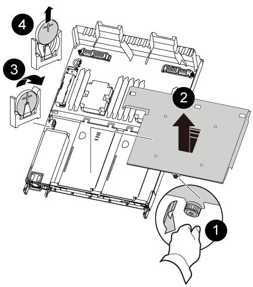

= リアルタイムクロックバッテリを交換してください - AFF A320
:icons: font
:imagesdir: ../media/

[role="lead"]
コントローラモジュールのリアルタイムクロック（ RTC ）バッテリを交換して、正確な時刻同期に依存するシステムのサービスとアプリケーションが機能を継続できるようにします。

* この手順は、システムでサポートされるすべてのバージョンの ONTAP で使用できます
* システムのその他のコンポーネントがすべて正常に動作している必要があります。問題がある場合は、必ずテクニカルサポートにお問い合わせください。

== 手順 1 ：ノードをシャットダウンします

[role="lead"]
ストレージシステムのハードウェア構成に応じた手順を使用して、障害のあるコントローラをシャットダウンまたはテイクオーバーできます。

=== オプション 1 ：ほとんどの構成

[role="lead"]
障害ノードをシャットダウンするには、ノードのステータスを確認し、必要に応じて正常なノードが障害ノードのストレージからデータを引き続き提供できるようにノードをテイクオーバーする必要があります。

ノードが 3 つ以上あるクラスタは、クォーラムを構成している必要があります。クラスタがクォーラムを構成していない場合や、正常なノードの資格と健全性に false と表示される場合は、障害ノードをシャットダウンする前に問題を修正する必要があります。を参照してください link:https://docs.netapp.com/us-en/ontap/system-admin/index.html["CLI での管理の概要"^]。

.手順
. AutoSupport が有効になっている場合は、 AutoSupport メッセージを呼び出してケースの自動作成を抑制します。「 system node AutoSupport invoke -node * -type all -message MAINT=number_OF_hours_downh
+
次の AutoSupport メッセージは、ケースの自動作成を 2 時間停止します。 cluster1 ： * > system node AutoSupport invoke -node * -type all -message MAINT=2h`

. 正常なノードのコンソールから自動ギブバックを無効にします。「 storage failover modify – node local-auto-giveback false
. 障害ノードに LOADER プロンプトを表示します。
+
[cols="1,2"]
|===
| 障害ノードの表示 | 作業 

 a| 
LOADER プロンプト
 a| 
コントローラモジュールの取り外しに進みます。

 a| 
ギブバックを待っています
 a| 
Ctrl キーを押しながら C キーを押し ' プロンプトが表示されたら y と入力します

 a| 
システムプロンプトまたはパスワードプロンプト（システムパスワードの入力）
 a| 
障害ノードをテイクオーバーまたは停止します。

** HA ペアの場合は、正常なノードから障害ノードをテイクオーバーします。「 storage failover takeover -ofnode impaired_node_name _
+
障害ノードに「 Waiting for giveback... 」と表示されたら、 Ctrl+C キーを押し、「 y 」と入力します。

|===

=== オプション 2 ：コントローラが MetroCluster に搭載されている

NOTE: 2 ノード MetroCluster 構成のシステムでは、この手順を使用しないでください。

障害ノードをシャットダウンするには、ノードのステータスを確認し、必要に応じて正常なノードが障害ノードのストレージからデータを引き続き提供できるようにノードをテイクオーバーする必要があります。

* ノードが 3 つ以上あるクラスタは、クォーラムを構成している必要があります。クラスタがクォーラムを構成していない場合や、正常なノードの資格と健全性に false と表示される場合は、障害ノードをシャットダウンする前に問題を修正する必要があります。を参照してください link:https://docs.netapp.com/us-en/ontap/system-admin/index.html["CLI での管理の概要"^]。
* MetroCluster 構成を使用している場合は、 MetroCluster 構成状態が構成済みで、ノードが有効かつ正常な状態であることを確認しておく必要があります（「 MetroCluster node show 」）。

.手順
. AutoSupport が有効になっている場合は、 AutoSupport メッセージを呼び出してケースの自動作成を抑制します。「 system node AutoSupport invoke -node * -type all -message MAINT=number_OF_hours_downh
+
次の AutoSupport メッセージは、ケースの自動作成を 2 時間停止します。 cluster1 ： * > system node AutoSupport invoke -node * -type all -message MAINT=2h`

. 正常なノードのコンソールから自動ギブバックを無効にします。「 storage failover modify – node local-auto-giveback false
. 障害ノードに LOADER プロンプトを表示します。
+
[cols="1,2"]
|===
| 障害ノードの表示 | 作業 

 a| 
LOADER プロンプト
 a| 
コントローラモジュールの取り外しに進みます。

 a| 
ギブバックを待っています
 a| 
Ctrl キーを押しながら C キーを押し ' プロンプトが表示されたら y と入力します

 a| 
システムプロンプトまたはパスワードプロンプト（システムパスワードの入力）
 a| 
障害ノードをテイクオーバーまたは停止します。

** HA ペアの場合は、正常なノードから障害ノードをテイクオーバーします。「 storage failover takeover -ofnode impaired_node_name _
+
障害ノードに「 Waiting for giveback... 」と表示されたら、 Ctrl+C キーを押し、「 y 」と入力します。

|===

== 手順 2 ： RTC バッテリを交換します

[role="lead"]
コントローラモジュール内で RTC バッテリの場所を確認し、特定の手順を実行する必要があります。

== 手順 3 ：コントローラモジュールを取り外す

[role="lead"]
コントローラモジュール内部のコンポーネントにアクセスするには、コントローラモジュールをシャーシから取り外す必要があります。

. 接地対策がまだの場合は、自身で適切に実施します。
. コントローラモジュールの電源装置のコードを電源から抜きます。
. ケーブルマネジメントデバイスに接続しているケーブルをまとめているフックとループストラップを緩め、システムケーブルと SFP をコントローラモジュールから外し（必要な場合）、どのケーブルが何に接続されていたかを記録します。
+
image::../media/drw_a320_controller_cable_unplug_animated_gif.png[DRW A320 コントローラケーブルプラグアニメーション GIF]

+
ケーブルはケーブルマネジメントデバイスに収めたままにします。これにより、ケーブルマネジメントデバイスを取り付け直すときに、ケーブルを整理する必要がありません。

. ケーブルマネジメントデバイスをコントローラモジュールの右側と左側から取り外し、脇に置きます。
. コントローラモジュールをシャーシから取り外します。
+
image::../media/drw_a320_controller_remove_animated_gif.png[DRW A320 コントローラアニメーション GIF を削除します]

+
.. コントローラモジュールの両側にあるラッチ機構に人差し指をかけます。
.. ラッチ機構の上部にあるオレンジ色のタブを押し下げて、シャーシのラッチピンを解除します。

+
ラッチ機構のフックがほぼ垂直に位置し、シャーシピンから解除されている必要があります。

+
.. コントローラモジュールの側面を持てるように、コントローラモジュールをゆっくりと少し手前に引き出します。
.. コントローラモジュールを両手でシャーシからゆっくりと引き出し、平らで安定した場所に置きます。

== 手順 4 ： RTC バッテリを交換します

. PCIe カバーを取り外します。
+
.. コントローラモジュールの背面で、オンボードポートの上にある青色の取り付けネジを外します。
.. カバーを手前にスライドさせ、上に回転させます。
.. カバーを取り外し、脇に置きます。

. RTC バッテリの場所を確認して取り出し、交換します。
+
.. FRU マップを使用して、コントローラモジュール上の RTC バッテリの場所を確認します。
.. バッテリをそっと押してホルダーから離し、持ち上げてホルダーから取り出します。
+

NOTE: ホルダーから取り外す際に、バッテリの極の向きを確認しておいてください。バッテリに記載されているプラス記号に従って、バッテリをホルダーに正しく配置する必要があります。ホルダーの近くにプラス記号が表示されているので、バッテリーの位置を確認できます。

.. 交換用バッテリを静電気防止用の梱包バッグから取り出します。
.. RTC バッテリの極の向きを確認し、バッテリを斜めに傾けた状態で押し下げてホルダーに挿入します。

. バッテリがホルダーに完全に取り付けられ、かつ極の向きが正しいことを目で見て確認します。
. PCIe カバーをコントローラモジュールに再度取り付けます。

== 手順 5 ：コントローラモジュールを再度取り付け、 RTC バッテリ交換後に日時を設定します

[role="lead"]
コントローラモジュール内のコンポーネントを交換したら、コントローラモジュールをシステムシャーシに再度取り付け、コントローラの日付と時刻をリセットしてブートする必要があります。

. エアダクトまたはコントローラモジュールカバーを閉じていない場合は閉じます。
. コントローラモジュールの端をシャーシの開口部に合わせ、コントローラモジュールをシステムに半分までそっと押し込みます。
+
指示があるまでコントローラモジュールをシャーシに完全に挿入しないでください。

. 必要に応じてシステムにケーブルを再接続します。
+
光ファイバケーブルを使用する場合は、メディアコンバータ（ QSFP または SFP ）を取り付け直してください（取り外した場合）。

. 電源装置を取り外した場合は、電源装置を再度接続し、電源ケーブルの固定クリップを再度取り付けます。
. コントローラモジュールの再取り付けを完了します。
+
.. ラッチアームが引き出された位置で固定されていることを確認します。
.. ラッチアームを使用して、コントローラモジュールをシャーシベイの奥まで押し込みます。
+

NOTE: ラッチアームの上部にあるラッチを押し下げないでください。そのためには、ロックを上げて、コントローラモジュールがシャーシにスライドしないようにします。

.. ラッチ上部にあるオレンジ色のタブを押し下げます。
.. コントローラモジュールをシャーシの端と揃うまで、シャーシベイにそっと押し込みます。
+

NOTE: ラッチのアームがシャーシ内にスライドします。

+
コントローラモジュールは、シャーシに完全に装着されるとすぐにブートを開始します。

.. ラッチを外してコントローラモジュールを所定の位置に固定します。
.. ケーブルマネジメントデバイスをまだ取り付けていない場合は、取り付け直します。
.. LOADER プロンプトでコントローラを停止します。

. コントローラの時刻と日付をリセットします。
+
.. 'how date ' コマンドを使用して ' 正常なノードの日付と時刻を確認します
.. ターゲットノードの LOADER プロンプトで、日時を確認します。
.. 必要に応じて 'set date mm/dd/yyyy` コマンドで日付を変更します
.. 必要に応じて、「 set time hh ： mm ： ss 」コマンドを使用して、時刻を GMT で設定します。
.. ターゲットノードの日時を確認します。

. LOADER プロンプトで「 bye 」と入力して、 PCIe カードおよびその他のコンポーネントを再初期化し、ノードをリブートさせます。
. ストレージをギブバックしてノードを通常動作に戻します。「 storage failover giveback -ofnode impaired_node_name _
. 自動ギブバックを無効にした場合は、再度有効にします。「 storage failover modify -node local-auto-giveback true 」

== 手順 6 ：障害が発生したパーツをネットアップに返却する

[role="lead"]
部品を交換したあと、障害のある部品をネットアップに返却することができます。詳細については、キットに付属する RMA 指示書を参照してください。テクニカルサポートにお問い合わせください https://mysupport.netapp.com/site/global/dashboard["ネットアップサポート"]RMA 番号を確認する場合や、交換用手順にサポートが必要な場合は、日本国内サポート用電話番号：国内フリーダイヤル 0066-33-123-265 または 0066-33-821-274 （国際フリーフォン 800-800-80-800 も使用可能）までご連絡ください。
