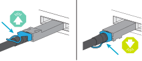
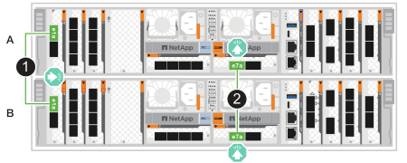
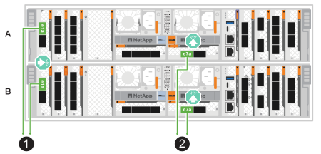
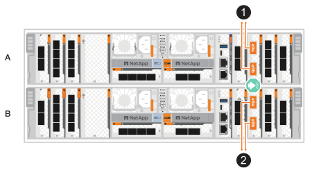
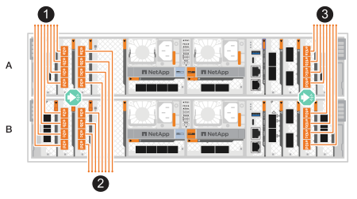
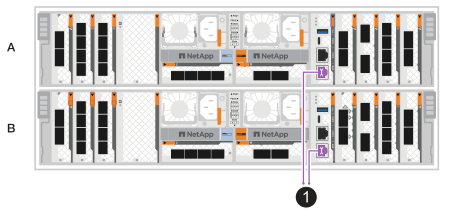
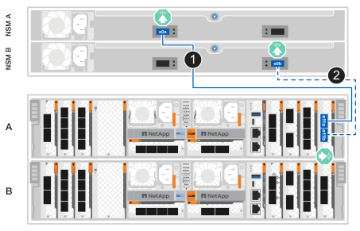
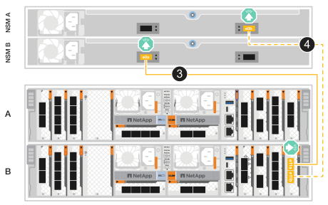
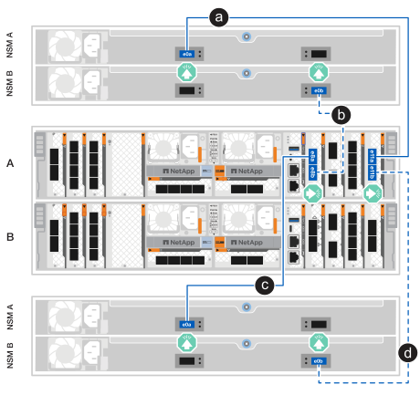
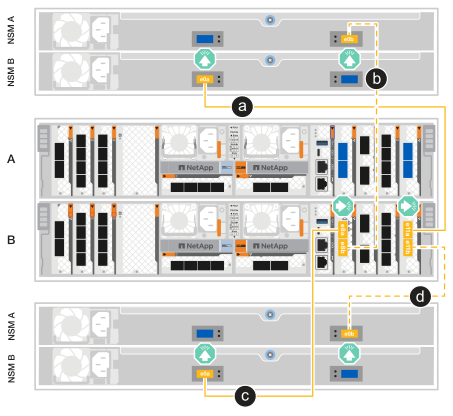

= AFF A70またはAFF A90のネットワークおよびストレージ接続用ハードウェアのケーブル接続
:allow-uri-read: 
:icons: font
:imagesdir: ../media/

[role="lead"]
AFF A70またはAFF A90ストレージシステムのラックハードウェアを設置したら、コントローラにネットワークケーブルを接続し、コントローラとストレージシェルフの間をケーブルで接続します。

.作業を開始する前に
ストレージシステムをスイッチに接続する方法については、ネットワーク管理者にお問い合わせください。

.このタスクについて
* ここでは、一般的な設定について説明します。具体的なケーブル接続は、ご使用のストレージシステム用に注文したコンポーネントによって異なります。設定およびスロットプライオリティの詳細については、を参照してください link:https://hwu.netapp.com["NetApp Hardware Universe の略"^]。
* AFF A70コントローラとAFF A90コントローラのI/Oスロットには1~11の番号が付けられています。
+
image::../media/drw_a1K_back_slots_labeled_ieops-2162.svg[AFF A70コントローラおよびAFF A90コントローラでのスロット番号]

* ケーブル配線図には、ポートにコネクタを挿入する際のケーブルコネクタプルタブの正しい方向（上または下）を示す矢印アイコンがあります。
+
コネクタを挿入すると、カチッという音がしてコネクタが所定の位置に収まるはずです。カチッと音がしない場合は、コネクタを取り外し、裏返してもう一度試してください。

+

* 光スイッチにケーブル接続する場合は、光トランシーバをコントローラポートに挿入してから、スイッチポートにケーブル接続します。

[[step-1-cable-the-clusterha-connections]]
== 手順1：クラスタ/ HAをケーブル接続する

コントローラをONTAPクラスタにケーブル接続します。この手順は、ストレージシステムのモデルおよびI/Oモジュールの構成によって異なります。

NOTE: クラスタインターコネクトトラフィックとHAトラフィックは、同じ物理ポートを共有します。

[role="tabbed-block"]
====
.スイッチレスクラスタのケーブル接続
--
クラスタ/ HAインターコネクトケーブルを使用して、ポートe1aとe1a、ポートe7aとe7aを接続します。

.手順
. コントローラAのポートe1aをコントローラBのポートe1aに接続します。
. コントローラAのポートe7aをコントローラBのポートe7aに接続します。
+
*クラスタ/ HAインターコネクトケーブル*

+
image::../media/oie_cable_25Gb_Ethernet_SFP28_ieops-1069.png[クラスタHAケーブル]

+

--
.スイッチクラスタのケーブル接続
--
100 GbE ケーブルを使用して、コントローラー A と B のポート e1a と e7a をクラスター ネットワーク スイッチ A と B に接続します。

.手順
. コントローラAのポートe1aとコントローラBのポートe1aをクラスタネットワークスイッチAに接続します。
. コントローラAのポートe7aとコントローラBのポートe7aをクラスタネットワークスイッチBに接続します。
+
* 100GbEケーブル*

+
image::../media/oie_cable100_gbe_qsfp28.png[100Gbケーブル]

+

--
====

[[step-2-cable-the-host-network-connections]]
== 手順2：ホストネットワーク接続をケーブル接続する

イーサネットモジュールポートをホストネットワークに接続します。

以下に、ホストネットワークのケーブル配線に関する一般的な例をいくつか示します。link:https://hwu.netapp.com["NetApp Hardware Universe の略"^]でお客様のシステム構成を参照してください。

.手順
. ポートe9aおよびe9bをイーサネットデータネットワークスイッチに接続します。
+

NOTE: ホストネットワーク接続には、ポートe1bとe7bを使用しないでください。別のホストカードを使用してください。

+
* 100GbEケーブル*

+
image::../media/oie_cable_sfp_gbe_copper.png[100Gbイーサネットケーブル]

+

. 10/25 GbEカードをホストネットワークスイッチに接続してください。
+
* 4ポート、10/25GbEホスト*

+
image::../media/oie_cable_sfp_gbe_copper.png[10/25Gbケーブル]

+

[[step-3-cable-the-management-network-connections]]
== 手順3：管理ネットワークをケーブル接続する

1000BASE-T RJ-45ケーブルを使用して、各コントローラの管理（レンチ）ポートを管理ネットワークスイッチに接続します。

* 1000BASE-T RJ-45ケーブル*

image::../media/oie_cable_rj45.png[RJ45ケーブル]

IMPORTANT: まだ電源コードを接続しないでください。

[[step-4-cable-the-shelf-connections]]
== 手順4：シェルフをケーブル接続する

以下のケーブル接続手順では、コントローラーをストレージシェルフに接続する方法を説明します。お使いのシステム構成に合ったケーブル接続オプションを以下からお選びください。

ストレージシステムでサポートされるシェルフの最大数、およびすべてのケーブル接続オプションについては、を参照してくださいlink:https://hwu.netapp.com["NetApp Hardware Universe の略"^]。

.このタスクについて
AFF A70およびAFF A90ストレージシステムは、NSM100またはNSM100Bモジュールを搭載したNS224シェルフをサポートします。モジュール間の主な違いは次のとおりです：

* NSM100 シェルフ モジュールは、組み込みポート e0a および e0b を使用します。
* NSM100B シェルフ モジュールは、スロット 1 のポート e1a と e1b を使用します。

次の配線例は、シェルフ モジュール ポートを参照する場合の NS224 シェルフ内の NSM100 モジュールを示しています。

[role="tabbed-block"]
====
.オプション1：NS224ストレージシェルフ1台
--
各コントローラをNS224シェルフのNSMモジュールに接続します。図は、コントローラAのケーブル配線を青で示し、コントローラBのケーブル配線を黄色で示しています。

* 100GbE QSFP28銅線ケーブル*

image::../media/oie_cable100_gbe_qsfp28.png[100GbE QSFP28銅線ケーブル]

.手順
. コントローラAのポートe11aをNSM Aのポートe0aに接続します。
. コントローラAのポートe11bをNSM Bのポートe0bに接続します。
+

. コントローラBのポートe11aをNSM Bのポートe0aに接続します。
. コントローラBのポートe11bをNSM Aのポートe0bに接続します。
+

--
.オプション2：NS224ストレージシェルフ×2
--
各コントローラを両方のNS224シェルフのNSMモジュールに接続します。図は、コントローラAのケーブル配線を青で示し、コントローラBのケーブル配線を黄色で示しています。

* 100GbE QSFP28銅線ケーブル*

image::../media/oie_cable100_gbe_qsfp28.png[100GbE QSFP28銅線ケーブル]

.手順
. コントローラAで、次のポートを接続します。
+
.. ポートe11aをシェルフ1、NSM Aのポートe0aに接続します。
.. ポートe8bをシェルフ1、NSM Bのポートe0bに接続します。
.. ポートe8aをシェルフ2、NSM Aのポートe0aに接続します。
.. ポートe11bをシェルフ2、NSM Bのポートe0bに接続します。
+

. コントローラBで、次のポートを接続します。
+
.. ポートe11aをシェルフ1、NSM Bのポートe0aに接続します。
.. ポートe8bをシェルフ1、NSM Aのポートe0bに接続します。
.. ポートe8aをシェルフ2、NSM Bのポートe0aに接続します。
.. ポートe11bをシェルフ2のNSM Aポートe0bに接続します。
+

--
====
.次の手順
AFF A70またはAFF A90システムのハードウェアのケーブル接続が完了したら、link:install-power-hardware.html["AFF A70またはAFF A90ストレージシステムの電源をオンにする"]。
