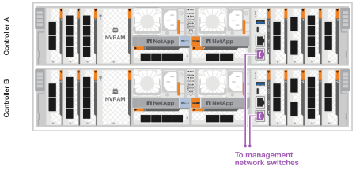

= ハードウェアのケーブル接続- AFF A70とAFF A90
:allow-uri-read: 
:icons: font
:imagesdir: ../media/

[role="lead"]
AFF A70またはAFF A90ストレージシステムのラックハードウェアを設置したら、コントローラにネットワークケーブルを接続し、コントローラとストレージシェルフの間をケーブルで接続します。

.作業を開始する前に
ストレージシステムをスイッチに接続する方法については、ネットワーク管理者にお問い合わせください。

.このタスクについて
* ここでは、一般的な設定について説明します。具体的なケーブル接続は、ご使用のストレージシステム用に注文したコンポーネントによって異なります。設定およびスロットプライオリティの詳細については、を参照してください link:https://hwu.netapp.com["NetApp Hardware Universe の略"^]。
* AFF A70コントローラとAFF A90コントローラのI/Oスロットには1~11の番号が付けられています。
+
image::../media/drw_a1K_back_slots_labeled_ieops-2162.svg[FAS70およびFAS90コントローラのスロット番号]

* ケーブル配線図には、ポートにコネクタを挿入する際のケーブルコネクタプルタブの正しい方向（上または下）を示す矢印アイコンがあります。
+
コネクタを挿入すると、カチッという音がしてコネクタが所定の位置に収まるはずです。カチッと音がしない場合は、コネクタを取り外し、裏返してもう一度試してください。

+
image::../media/drw_cable_pull_tab_direction_ieops-1699.svg[ケーブルプルタブの向きの例]

* 光スイッチにケーブル接続する場合は、光トランシーバをコントローラポートに挿入してから、スイッチポートにケーブル接続します。

== 手順1：ストレージコントローラをネットワークに接続する

コントローラをONTAPクラスタにケーブル接続します。この手順は、ストレージシステムのモデルおよびI/Oモジュールの構成によって異なります。

NOTE: クラスタインターコネクトトラフィックとHAトラフィックは、同じ物理ポートを共有します。

[role="tabbed-block"]
====
.スイッチレスクラスタのケーブル接続
--
クラスタ/ HAインターコネクトケーブルを使用して、ポートe1aとe1aを接続し、ポートe7aとe7aを接続します。

.手順
. コントローラAのポートe1aをコントローラBのポートe1aに接続します。
. コントローラAのポートe7aをコントローラBのポートe7aに接続します。
+
*クラスタ/ HAインターコネクトケーブル*

+
image::../media/oie_cable_25Gb_Ethernet_SFP28_ieops-1069.png[クラスタHAケーブル]

+
image::../media/drw_70-90_tnsc_cluster_cabling_ieops-1653.svg[2ノードスイッチレスクラスタのケーブル配線図]

--
.スイッチクラスタのケーブル接続
--
100 GbE ケーブルを使用して、コントローラー A と B のポート e1a および e7a をクラスター ネットワーク スイッチ A と B に接続します。

.手順
. コントローラAのポートe1aとコントローラBのポートe1aをクラスタネットワークスイッチAに接続します。
. コントローラAのポートe7aとコントローラBのポートe7aをクラスタネットワークスイッチBに接続します。
+
* 100GbEケーブル*

+
image::../media/oie_cable100_gbe_qsfp28.png[100Gbケーブル]

+
image::../media/drw_70-90_switched_cluster_cabling_ieops-1657.svg[クラスタネットワークへのクラスタ接続のケーブル接続]

--
====

== 手順2：ホストネットワーク接続をケーブル接続する

イーサネットモジュールポートをホストネットワークに接続します。

次に、一般的なホストネットワークのケーブル接続例を示します。ご使用のシステム構成については、を参照してください link:https://hwu.netapp.com["NetApp Hardware Universe の略"^] 。

.手順
. ポートe9aおよびe9bをイーサネットデータネットワークスイッチに接続します。
+

NOTE: ホスト ネットワーク接続にはポート e1b および e7b ポートを使用しないでください。別のホスト カードを使用します。

+
* 100GbEケーブル*

+
image::../media/oie_cable_sfp_gbe_copper.png[100Gbイーサネットケーブル]

+
image::../media/drw_70-90_network_cabling1_ieops-1654.svg[100Gbイーサネットネットワークへのケーブル接続]

. 10 / 25GbEホストネットワークスイッチを接続します。
+
* 4ポート、10/25GbEホスト*

+
image::../media/oie_cable_sfp_gbe_copper.png[10/25Gbケーブル]

+
image::../media/drw_70-90_network_cabling2_ieops-1655.svg[100Gbイーサネットネットワークへのケーブル接続]

== 手順3：管理ネットワークをケーブル接続する

1000BASE-T RJ-45ケーブルを使用して、各コントローラの管理（レンチ）ポートを管理ネットワークスイッチに接続します。

* 1000BASE-T RJ-45ケーブル*

image::../media/oie_cable_rj45.png[RJ45ケーブル]

IMPORTANT: まだ電源コードを接続しないでください。

== 手順4：シェルフをケーブル接続する

次のケーブル接続手順では、コントローラをストレージシェルフに接続する方法を示します。次のいずれかのケーブル接続オプションを、ご使用の環境に合わせて選択します。

ストレージシステムでサポートされるシェルフの最大数、およびすべてのケーブル接続オプションについては、を参照してくださいlink:https://hwu.netapp.com["NetApp Hardware Universe の略"^]。

.このタスクについて
AFF A70および90ストレージシステムは、NSM100またはNSM100Bモジュールを搭載したNS224シェルフをサポートします。モジュール間の主な違いは次のとおりです。

* NSM100 シェルフ モジュールは、組み込みポート e0a および e0b を使用します。
* NSM100B シェルフ モジュールは、スロット 1 のポート e1a と e1b を使用します。

次の配線例は、シェルフ モジュール ポートを参照する場合の NS224 シェルフ内の NSM100 モジュールを示しています。

[role="tabbed-block"]
====
.オプション1：NS224ストレージシェルフ1台
--
各コントローラをNS224シェルフのNSMモジュールに接続します。図は、コントローラAのケーブル配線を青で示し、コントローラBのケーブル配線を黄色で示しています。

* 100GbE QSFP28銅線ケーブル*

image::../media/oie_cable100_gbe_qsfp28.png[100GbE QSFP28銅線ケーブル]

.手順
. コントローラAのポートe11aをNSM Aのポートe0aに接続します。
. コントローラAのポートe11bをポートNSM Bのポートe0bに接続します。
+
image:../media/drw_a70-90_1shelf_cabling_a_ieops-1731.svg["コントローラAのe11aおよびe11bを1台のNS224シェルフに移行"]

. コントローラBのポートe11aをNSM Bのポートe0aに接続します。
. コントローラBのポートe11bをNSM Aのポートe0bに接続します。
+
image:../media/drw_a70-90_1shelf_cabling_b_ieops-1732.svg["コントローラB e11aおよびe11bを1台のNS224シェルフに接続"]

--
.オプション2：NS224ストレージシェルフ×2
--
各コントローラを両方のNS224シェルフのNSMモジュールに接続します。図は、コントローラAのケーブル配線を青で示し、コントローラBのケーブル配線を黄色で示しています。

* 100GbE QSFP28銅線ケーブル*

image::../media/oie_cable100_gbe_qsfp28.png[100GbE QSFP28銅線ケーブル]

.手順
. コントローラAで、次のポートを接続します。
+
.. ポートe11aをシェルフ1、NSM Aのポートe0aに接続します。
.. ポートe11bをシェルフ2、NSM Bのポートe0bに接続します。
.. ポートe8aをシェルフ2、NSM Aのポートe0aに接続します。
.. ポートe8bをシェルフ1、NSM Bのポートe0bに接続します。
+
image:../media/drw_a70-90_2shelf_cabling_a_ieops-1733.svg["コントロオラAノコントロオラ/シエルフカンノセツソク"]

. コントローラBで、次のポートを接続します。
+
.. ポートe11aをシェルフ1、NSM Bのポートe0aに接続します。
.. ポートe11bをシェルフ2、NSM Aのポートe0bに接続します。
.. ポートe8aをシェルフ2、NSM Bのポートe0aに接続します。
.. ポートe8bをシェルフ1、NSM Aのポートe0bに接続します。
+
image:../media/drw_a70-90_2shelf_cabling_b_ieops-1734.svg["コントローラBのコントローラ/シェルフ間の接続"]

--
====
.次の手順
AFF A70またはAFF A90システム用のハードウェアのケーブル接続が完了したら、次の作業を行いlink:install-power-hardware.html["AFF A70またはAFF A90ストレージシステムの電源をオンにする"]ます。
