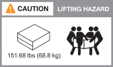
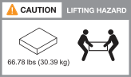

= 設置の準備- AFF A70、AFF A90
:allow-uri-read: 
:icons: font
:imagesdir: ../media/

[role="lead"]
プラットフォームのインストールを準備します。

.作業を開始する前に
* を使用し https://docs.netapp.com/us-en/ontap/software_setup/index.html["クラスタセットアップワークシート"] て、クラスタの設定時に必要な値を記録します。デフォルト値が指定されている場合は、その値を使用するか、独自の値を入力できます。
* ハードウェアの設置に必要な追加機器や工具がすべて揃っていることを確認します。
+
** No.2 プラスドライバ
** 懐中電灯
** 静電気防止用ストラップ
** NS224のシェルフIDを設定するためのペーパークリップまたはボールペン
** USB /シリアル接続を備えたラップトップまたはコンソール
** ストレージシステムを設定するためのWebブラウザへのアクセス

* プラットフォームの重量に関連する安全上の問題に注意する必要があります。
+
フル装備のA70-90プラットフォームの重量は最大68.8 kg（151.68ポンド）で、4人で持ち上げたり油圧リフトを使用したりする必要があります。

+

* シェルフの重量に関連する安全上の懸念事項に注意する必要があります。
+
フル装備のシェルフの重量は最大30.29 kg（66.78ポンド）です。2人で持ち上げたり、油圧リフトを使用したりする必要があります。シェルフの重量を軽くするために、シェルフコンポーネントを（シェルフの前面または背面から）取り外さないでください。シェルフの重量が不均衡になります。

+

* ストレージ・システム内の通気は'ベゼルまたはエンド・キャップが取り付けられている前面から入り'ポートが取り付けられている背面から排出されます

== ステップ1：サイトを準備する

設置場所および使用するキャビネットまたはラックが、ストレージシステムの仕様を満たしていることを確認します。

.手順
. 設置場所がプラットフォームの環境要件と電力要件を満たしていることを確認します（を参照 https://hwu.netapp.com["NetApp Hardware Universe の略"^]）。
. 十分なラックスペースがあることを確認します。
+
** プラットフォームシャーシは4U
** NS224シェルフごとに2U

. プラットフォームの近くに必要なネットワークスイッチを設置します。
+
インストール手順および互換性情報については、を参照してください https://docs.netapp.com/us-en/ontap-systems-switches/index.html["スイッチのドキュメント"^] link:https://hwu.netapp.com["NetApp Hardware Universe の略"^] 。

== 手順2：箱を開封する

すべての箱を開梱し、内容物を納品書の項目と比較します。

. すべての箱を慎重に開き、内容を整理された方法でレイアウトします。
. 開梱した内容を、納品書のリストと比較します。
+

NOTE: 梱包箱の側面にあるQRコードをスキャンすると、梱包リストを取得できます。

+
次の項目は、ボックスに表示される内容の一部です。

+
箱の中のすべてが納品書のリストと一致していることを確認してください。不一致がある場合は、それらをメモして、さらに対処してください。

+
[cols="12,9,4"]
|===

| * ハードウェア * | *ケーブル* |  

 a| 
** オンボードドライブが搭載されたプラットフォーム
** シェルフ（オプション）
** 取扱説明書付きのレールキット（オプション）
** ケーブル管理デバイス×2
** ベゼル

 a| 
** 電源コード
** ネットワークケーブル
** 管理イーサネットケーブル（RJ-45ケーブル）
** USB-Cシリアルポートケーブル
** ストレージケーブル（追加のストレージを注文する場合）

|  
|===

== 手順3：ハードウェアを登録する

プラットフォームを登録して、サポートを受けることができます。

.手順
. プラットフォームのシステムシリアル番号を確認します。
+
番号は、納品書、確認用Eメール、または開梱後のコントローラで確認できます。

+
image::../media/drw_ssn_label.svg[システムシリアル番号の場所を示す例]

. NetAppサポートサイトにアクセスします http://mysupport.netapp.com/["mysupport.netapp.com"^]。
. ハードウェアを登録します。
+
[role="tabbed-block"]
====
.オプション1：NetAppの既存のお客様
--
.手順
.. ユーザ名とパスワードを使用してサインインします。
.. [システム]>*[マイシステム]*を選択します。
.. 新しいシステムのシリアル番号が表示されていることを確認します。

NOTE: 新しいシステムのシリアル番号が表示されない場合は、NetAppの新規のお客様向けの手順に従います。

--
.オプション2：NetAppの新規のお客様
--
.. [ 今すぐ登録 ] をクリックしてアカウントを作成します。
.. Systems *>* Register Systems *を選択します。
.. 製品システムのシリアル番号と必要な詳細情報を入力します。

登録が承認されると、必要なソフトウェアをダウンロードできます。承認プロセスには最大 24 時間かかる場合があります。

--
====

