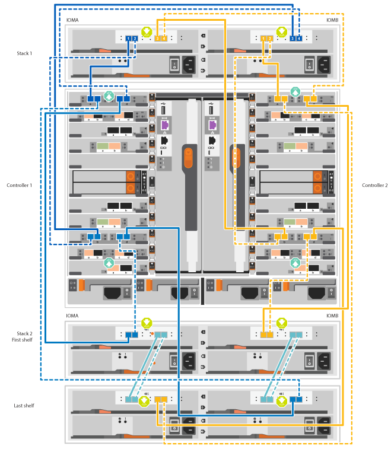
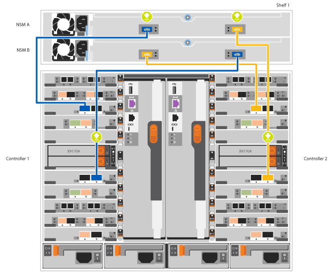

= 詳細ガイド- AFF A700
:allow-uri-read: 
:icons: font
:imagesdir: ../media/

[role="lead"]
このガイドでは、一般的なネットアップシステムのインストール手順について詳しく説明します。インストール手順の詳細については、このガイドを参照してください。

== 手順 1 ：設置の準備

システムを設置するには、ネットアップサポートサイトでアカウントを作成し、システムを登録し、ライセンスキーを取得する必要があります。また、システムに応じた適切な数とタイプのケーブルを準備し、特定のネットワーク情報を収集する必要があります。

.作業を開始する前に
サイト要件および構成済みシステムの追加情報の情報については、 Hardware Universe にアクセスできる必要があります。また、ご使用の ONTAP バージョンのリリースノートにアクセスして、このシステムの詳細を確認しておくことを推奨します。

https://hwu.netapp.com["NetApp Hardware Universe の略"]

http://mysupport.netapp.com/documentation/productlibrary/index.html?productID=62286["使用しているバージョンの ONTAP 9 に対するリリースノートを検索してください"]

お客様のサイトで次のものを準備する必要があります。

* ストレージシステム用のラックスペース
* No.2 プラスドライバ
* Web ブラウザを使用してシステムをネットワークスイッチおよびラップトップまたはコンソールに接続するための追加のネットワークケーブル

.手順
. すべての箱を開封して内容物を取り出します。
. コントローラのシステムシリアル番号をメモします。
+
image::../media/drw_ssn_label.png[システムシリアル番号の場所を示す例]

. 同梱されていたケーブルの数と種類を確認し、書き留めておきます。
+
次の表に、同梱されているケーブルの種類を示します。この表にないケーブルが含まれていた場合は、 Hardware Universe を参照してケーブルを特定し、用途を確認してください。

+
https://hwu.netapp.com["NetApp Hardware Universe の略"]

+
[cols="1,2,1,2"]
|===
| ケーブルのタイプ | パーツ番号と長さ | コネクタのタイプ | 用途 

 a| 
10GbE ネットワークケーブル
 a| 
X6566B-2-R6 、（ 112-00299 ）、 2m

X6566B-3-R6 、 112-00300 、 3m

X6566B-5-R6 、 112-00301 、 5m
 a| 
image:../media/oie_cable_sfp_gbe_copper.png[""]
 a| 
ネットワークケーブル

 a| 
40GbE ネットワークケーブル

40GbE のクラスタインターコネクト
 a| 
X66100-1,112-00542, 1m

X66100-3112-00543 、 3m
 a| 
image:../media/oie_cable100_gbe_qsfp28.png[""]
 a| 
40GbE ネットワーク

クラスタインターコネクト

 a| 
100GbE ネットワークケーブル

100GbE ストレージケーブル
 a| 
X666211A-05 (112-00595) 、 0.5m

X666211A-1 （ 112-00573 ）、 1m

X666211A-2 （ 112-00574 ）、 2m

X666211A-5 （ 112-00574 ）、 5m
 a| 
image:../media/oie_cable100_gbe_qsfp28.png[""]
 a| 
ネットワークケーブル

ストレージケーブル

NOTE: このケーブルは環境 AFF A700 のみです。

 a| 
光ネットワークケーブル（注文内容による）
 a| 
X6553-R6 （ 112-00188 ）、 2m

X6536-R6 （ 112-00090 ）、 5m
 a| 
image:../media/oie_cable_fiber_lc_connector.png["光ファイバLCコネクタを示す図"]
 a| 
FC ホストネットワーク

 a| 
Cat 6 、 RJ-45 （注文内容による）
 a| 
パーツ番号 X6585-R6 （ 112-00291 ）、 3m

X6562-R6 （ 112-00196 ）、 5m
 a| 
image:../media/oie_cable_rj45.png[""]
 a| 
管理ネットワークとイーサネットデータ

 a| 
ストレージ
 a| 
X66031A （ 112-00436 ）、 1m

X66032A （ 112-00437 ）、 2m

X66033A (112-00438) 、 3m
 a| 
image:../media/oie_cable_mini_sas_hd_to_mini_sas_hd.png[""]
 a| 
ストレージ

 a| 
Micro-USB コンソールケーブル
 a| 
該当なし
 a| 
image:../media/oie_cable_micro_usb.png["マイクロUSBコネクタを示す図"]
 a| 
Windows または Mac 以外のラップトップ / コンソールでソフトウェアをセットアップする際のコンソール接続

 a| 
電源ケーブル
 a| 
該当なし
 a| 
image:../media/oie_cable_power.png[""]
 a| 
システムの電源をオンにします

|===
. NetApp ONTAP 構成ガイドを確認して、必要な情報を収集します。
+
https://library.netapp.com/ecm/ecm_download_file/ECMLP2862613["『 ONTAP 構成ガイド』"]

== 手順 2 ：ハードウェアを設置する

システムは、 4 ポストラックまたはネットアップシステムキャビネットのいずれかに設置する必要があります。

.手順
. 必要に応じてレールキットを取り付けます。
. レールキットに付属の手順書に従って、システムを設置して固定します。
+

NOTE: システムの重量に関連する安全上の注意事項を確認しておく必要があります。

+
image::../media/drw_9000_lifting_icon.png[DRW 9000 リフティングアイコン]

NOTE: 左側のラベルは空のシャーシを、右側のラベルはフル装備のシステムを示しています。

. ケーブルマネジメントデバイスを取り付けます（図を参照）。
+
image::../media/drw_9000_cable_management_arms.png[DRW 9000 ケーブル管理アーム]

. システムの前面にベゼルを配置します。

== 手順 3 ：コントローラをネットワークに接続する

2 ノードスイッチレスクラスタメソッドまたはクラスタインターコネクトネットワークを使用して、コントローラをネットワークにケーブル接続できます。

=== オプション 1 ： 2 ノードスイッチレスクラスタ

コントローラの管理ネットワークポート、データネットワークポート、および管理ポートは、スイッチに接続されます。クラスタインターコネクトポートは、両方のコントローラでケーブル接続されます。

システムとスイッチの接続に関する情報を、ネットワーク管理者に確認しておく必要があります。

ケーブルをポートに差し込む際は、ケーブルのプルタブの向きを確認してください。ケーブルのプルタブは、すべてのネットワーキングモジュールポートで上向きになっています。

image::../media/oie_cable_pull_tab_up.png[OIE ケーブルのプルタブを上にします]

NOTE: コネクタを挿入すると、カチッという音がしてコネクタが所定の位置に収まるはずです。音がしない場合は、コネクタを取り外し、回転させてからもう一度試してください。

.手順
. アニメーションや図を使用して、コントローラとスイッチをケーブルで接続します。
+
.アニメーション- 2ノードスイッチレスクラスタをケーブル接続
video::7a55b98a-e8b8-41d5-821f-ac5b0032ead0[panopto]

image::../media/drw_9000_TNSC_composite_cabling.png[DRW 9000 TNSC 複合ケーブル]

. に進みます <<手順 4 ：コントローラをドライブシェルフにケーブル接続する>> ドライブシェルフのケーブル接続手順については、を参照して

=== オプション 2 ：スイッチクラスタ

コントローラの管理ネットワークポート、データネットワークポート、および管理ポートは、スイッチに接続されます。クラスタインターコネクト / HA ポートは、クラスタ / HA スイッチにケーブル接続されます。

システムとスイッチの接続に関する情報を、ネットワーク管理者に確認しておく必要があります。

ケーブルをポートに差し込む際は、ケーブルのプルタブの向きを確認してください。ケーブルのプルタブは、すべてのネットワーキングモジュールポートで上向きになっています。

image::../media/oie_cable_pull_tab_up.png[OIE ケーブルのプルタブを上にします]

NOTE: コネクタを挿入すると、カチッという音がしてコネクタが所定の位置に収まるはずです。音がしない場合は、コネクタを取り外し、回転させてからもう一度試してください。

.手順
. アニメーションや図を使用して、コントローラとスイッチをケーブルで接続します。
+
.アニメーションスイッチを使用したクラスタのケーブル接続
video::6381b3f1-4ce5-4805-bd0a-ac5b0032f51d[panopto]

image:../media/drw_9000_switched_cluster_cabling.png[""]

. に進みます <<手順 4 ：コントローラをドライブシェルフにケーブル接続する>> ドライブシェルフのケーブル接続手順については、を参照して

== 手順 4 ：コントローラをドライブシェルフにケーブル接続する

新しいシステムが DS212C 、 DS224C 、または NS224 のシェルフにケーブル接続できるかどうかは、 AFF システムまたは FAS システムのどちらであるかによって異なります。

=== オプション 1 ：コントローラを DS212C ドライブシェルフまたは DS224C ドライブシェルフにケーブル接続します

シェルフ / シェルフ間をケーブル接続してから、両方のコントローラを DS212C または DS224C ドライブシェルフにケーブル接続する必要があります。

ケーブルはプルタブを下にしてドライブシェルフに挿入し、ケーブルのもう一方の端はプルタブを上にしてコントローラストレージモジュールに挿入します。

image::../media/oie_cable_pull_tab_down.png[OIE ケーブルのプルタブを下に引きます]

image::../media/oie_cable_pull_tab_up.png[OIE ケーブルのプルタブを上にします]

.手順
. 次のアニメーションや図を使用して、ドライブシェルフをコントローラにケーブル接続します。
+

NOTE: この例では DS224C シェルフを使用しています。サポートされている他の SAS ドライブシェルフでもケーブル接続はほぼ同じです。

+
** FAS9000 、 AFF A700 、 ASA AFF A700 、 ONTAP 9.7 以前の SAS シェルフのケーブル接続：

+
.アニメーション- SASストレージをケーブル接続- ONTAP 9.7以前
video::a312e09e-df56-47b3-9b5e-ab2300477f67[panopto]
+
image:../media/SAS_storage_ONTAP_9.7_and_earlier.png[""]

+
** FAS9000 、 AFF A700 、 ASA AFF A700 、 ONTAP 9.8 以降での SAS シェルフのケーブル接続：

+
.アニメーション- SASストレージケーブル- ONTAP 9.8以降
video::61d23302-9526-4a2b-9335-ac5b0032eafd[panopto]
+

+

NOTE: ドライブシェルフスタックが複数ある場合は、使用するドライブシェルフタイプに対応した _ インストールおよびケーブル接続ガイド _ を参照してください。

+
https://docs.netapp.com/us-en/ontap-systems/sas3/install-new-system.html["IOM12 モジュールを搭載した新しいシステム設置用シェルフを設置してケーブル接続します"]

+
image:../media/Cable_shelves_new_system_IOM12_shelves.png[""]

. に進みます <<手順 5 ：システムのセットアップと設定を完了する>> をクリックして、システムのセットアップと設定を完了します。

=== オプション 2 ： AFF A700 システムと ONTAP 9.8 以降を実行する ASA AFF A700 システムにある 1 台の NS224 ドライブシェルフにコントローラをケーブル接続します

各コントローラを、 ONTAP 9.8 以降を実行している AFF A700 または ASA AFF A700 の NS224 ドライブシェルフの NSM モジュールにケーブル接続する必要があります。

* この作業は、 ONTAP 9.8 以降を実行する環境 AFF A700 および ASA AFF A700 のみです。
* 各コントローラのスロット 3 または 7 に、少なくとも 1 つの X91148A モジュールをインストールする必要があります。アニメーションや図は、このモジュールがスロット 3 と 7 の両方に取り付けられていることを示しています。
* 図の矢印を見て、ケーブルコネクタのプルタブの正しい向きを確認してください。ストレージモジュールのケーブルのプルタブは上向き、シェルフのプルタブは下向きです。
+
image::../media/oie_cable_pull_tab_up.png[OIE ケーブルのプルタブを上にします]

+
image::../media/oie_cable_pull_tab_down.png[OIE ケーブルのプルタブを下に引きます]

+

NOTE: コネクタを挿入すると、カチッという音がしてコネクタが所定の位置に収まるはずです。音がしない場合は、コネクタを取り外し、回転させてからもう一度試してください。

.手順
. 次のアニメーションまたは図を使用して、 2 つの X91148A ストレージモジュールを搭載するコントローラを 1 台の NS224 ドライブシェルフに接続するか、図を使用してコントローラに X91148A ストレージモジュールを 1 台の NS224 ドライブシェルフに接続します。
+
.アニメーション- 1台のNS224シェルフにケーブルを接続- ONTAP 9.8以降
video::6520eb01-87b3-4520-9109-ac5b0032ea4e[panopto]
+
image::../media/drw_ns224_a700_1shelf.png[DRW ns224 A700 1 シェルフ]

+

. に進みます <<手順 5 ：システムのセットアップと設定を完了する>> をクリックして、システムのセットアップと設定を完了します。

=== オプション 3 ： AFF A700 システムと ONTAP 9.8 以降を実行している ASA AFF A700 システムの 2 台の NS224 ドライブシェルフにコントローラをケーブル接続します

各コントローラを、 ONTAP 9.8 以降を実行している AFF A700 または ASA AFF A700 上の NS224 ドライブシェルフの NSM モジュールにケーブル接続する必要があります。

* この作業は、 ONTAP 9.8 以降を実行する環境 AFF A700 および ASA AFF A700 のみです。
* システムには、各コントローラに X91148A モジュールが 2 つあり、スロット 3 と 7 に取り付ける必要があります。
* 図の矢印を見て、ケーブルコネクタのプルタブの正しい向きを確認してください。ストレージモジュールのケーブルのプルタブは上向き、シェルフのプルタブは下向きです。
+
image::../media/oie_cable_pull_tab_up.png[OIE ケーブルのプルタブを上にします]

+
image::../media/oie_cable_pull_tab_down.png[OIE ケーブルのプルタブを下に引きます]

+

NOTE: コネクタを挿入すると、カチッという音がしてコネクタが所定の位置に収まるはずです。音がしない場合は、コネクタを取り外し、回転させてからもう一度試してください。

.手順
. 次のアニメーションや図を使用して、 2 台の NS224 ドライブシェルフにコントローラをケーブル接続します。
+
.アニメーション- 2台のNS224シェルフをケーブル接続します（ONTAP 9.8以降）
video::34098e39-73ad-45de-9af7-ac5b0032ea9a[panopto]
+
image::../media/drw_ns224_a700_2shelves.png[DRW ns224 A700 2 シェルフ]

+
image::../media/two_NS224_shelves.png[NS224 シェルフ × 2]

. に進みます <<手順 5 ：システムのセットアップと設定を完了する>> をクリックして、システムのセットアップと設定を完了します。

== 手順 5 ：システムのセットアップと設定を完了する

システムのセットアップと設定を実行するには、スイッチとラップトップのみを接続してクラスタ検出を使用するか、システムのコントローラに直接接続してから管理スイッチに接続します。

=== オプション 1 ：ネットワーク検出が有効になっている場合は、システムのセットアップと設定を実行する

ラップトップでネットワーク検出が有効になっている場合は、クラスタの自動検出を使用してシステムのセットアップと設定を実行できます。

.手順
. 次のアニメーションに従って、 1 つ以上のドライブシェルフ ID を設定します。
+
システムに NS224 ドライブシェルフがある場合、シェルフ ID は 00 および 01 に事前に設定されています。シェルフ ID を変更する場合は、ボタンが配置されている穴に差し込む工具が必要です。

+
.アニメーション- SASまたはNVMeドライブシェルフIDを設定します
video::95a29da1-faa3-4ceb-8a0b-ac7600675aa6[panopto]
. 電源コードをコントローラの電源装置に接続し、さらに別の回路の電源に接続します。
. 両方のノードの電源スイッチをオンにします。
+
.アニメーション-コントローラの電源をオンにします
video::bb04eb23-aa0c-4821-a87d-ab2300477f8b[panopto]
+

NOTE: 初回のブートには最大 8 分かかる場合があります。

. ラップトップでネットワーク検出が有効になっていることを確認します。
+
詳細については、ラップトップのオンラインヘルプを参照してください。

. 次のアニメーションに従って、ラップトップを管理スイッチに接続します。
+
.アニメーション-ラップトップを管理スイッチに接続します
video::d61f983e-f911-4b76-8b3a-ab1b0066909b[panopto]
. 検出する ONTAP アイコンを選択します。
+
image::../media/drw_autodiscovery_controler_select.png[DRW 自動検出コントローラ選択]

+
.. エクスプローラを開きます。
.. 左側のペインで、 [Network] ( ネットワーク ) をクリックします。
.. 右クリックして、更新を選択します。
.. いずれかの ONTAP アイコンをダブルクリックし、画面に表示された証明書を受け入れます。
+

NOTE: 「 XXXXX 」は、ターゲットノードのシステムシリアル番号です。

+
System Manager が開きます。

. System Manager のセットアップガイドを使用して、 _NetApp ONTAP 構成ガイド _ で収集したデータを基にシステムを設定します。
+
https://library.netapp.com/ecm/ecm_download_file/ECMLP2862613["『 ONTAP 構成ガイド』"]

. アカウントを設定して Active IQ Config Advisor をダウンロードします。
+
.. 既存のアカウントにログインするか、アカウントを作成します。
+
https://mysupport.netapp.com/eservice/public/now.do["ネットアップサポート登録"]

.. システムを登録します。
+
https://mysupport.netapp.com/eservice/registerSNoAction.do?moduleName=RegisterMyProduct["ネットアップ製品登録"]

.. Active IQ Config Advisor をダウンロードします。
+
https://mysupport.netapp.com/site/tools/tool-eula/activeiq-configadvisor["ネットアップのダウンロード： Config Advisor"]

. Config Advisor を実行してシステムの健全性を確認します。
. 初期設定が完了したら、に進みます https://www.netapp.com/data-management/oncommand-system-documentation/["ONTAP  ONTAP システムマネージャのマニュアルリソース"] ONTAP での追加機能の設定については、ページを参照してください。

=== オプション 2 ：ネットワーク検出が有効になっていない場合のシステムのセットアップと設定の実行

ラップトップでネットワーク検出が有効になっていない場合は、このタスクを使用して設定とセットアップを実行する必要があります。

.手順
. ラップトップまたはコンソールをケーブル接続して設定します。
+
.. ラップトップまたはコンソールのコンソールポートを、 115 、 200 ボー、 N-8-1 に設定します。
+

NOTE: コンソールポートの設定方法については、ラップトップまたはコンソールのオンラインヘルプを参照してください。

.. システム付属のコンソールケーブルを使用してラップトップまたはコンソールにコンソールケーブルを接続し、ラップトップを管理サブネット上の管理スイッチに接続します。
+
image::../media/drw_9000_cable_console_switch_controller.png[DRW 9000 ケーブルコンソールスイッチコントローラ]

.. 管理サブネット上の TCP / IP アドレスをラップトップまたはコンソールに割り当てます。

. 次のアニメーションに従って、 1 つ以上のドライブシェルフ ID を設定します。
+
システムに NS224 ドライブシェルフがある場合、シェルフ ID は 00 および 01 に事前に設定されています。シェルフ ID を変更する場合は、ボタンが配置されている穴に差し込む工具が必要です。

+
.アニメーション- SASまたはNVMeドライブシェルフIDを設定します
video::95a29da1-faa3-4ceb-8a0b-ac7600675aa6[panopto]
. 電源コードをコントローラの電源装置に接続し、さらに別の回路の電源に接続します。
. 両方のノードの電源スイッチをオンにします。
+
.アニメーション-コントローラの電源をオンにします
video::bb04eb23-aa0c-4821-a87d-ab2300477f8b[panopto]
+

NOTE: 初回のブートには最大 8 分かかる場合があります。

. いずれかのノードに初期ノード管理 IP アドレスを割り当てます。
+
[cols="1,3"]
|===
| 管理ネットワークでの DHCP の状況 | 作業 

 a| 
を設定します
 a| 
新しいコントローラに割り当てられた IP アドレスを記録します。

 a| 
未設定
 a| 
.. PuTTY 、ターミナルサーバ、または環境に対応した同等の機能を使用して、コンソールセッションを開きます。
+

NOTE: PuTTY の設定方法がわからない場合は、ラップトップまたはコンソールのオンラインヘルプを確認してください。

.. スクリプトからプロンプトが表示されたら、管理 IP アドレスを入力します。

|===
. ラップトップまたはコンソールで、 System Manager を使用してクラスタを設定します。
+
.. ブラウザでノード管理 IP アドレスを指定します。
+

NOTE: アドレスの形式は、 +https://x.x.x.x.+ です

.. NetApp ONTAP 構成ガイドで収集したデータを基にシステムを設定します。
+
https://library.netapp.com/ecm/ecm_download_file/ECMLP2862613["『 ONTAP 構成ガイド』"]

. アカウントを設定して Active IQ Config Advisor をダウンロードします。
+
.. 既存のアカウントにログインするか、アカウントを作成します。
+
https://mysupport.netapp.com/eservice/public/now.do["ネットアップサポート登録"]

.. システムを登録します。
+
https://mysupport.netapp.com/eservice/registerSNoAction.do?moduleName=RegisterMyProduct["ネットアップ製品登録"]

.. Active IQ Config Advisor をダウンロードします。
+
https://mysupport.netapp.com/site/tools/tool-eula/activeiq-configadvisor["ネットアップのダウンロード： Config Advisor"]

. Config Advisor を実行してシステムの健全性を確認します。
. 初期設定が完了したら、に進みます https://www.netapp.com/data-management/oncommand-system-documentation/["ONTAP  ONTAP システムマネージャのマニュアルリソース"] ONTAP での追加機能の設定については、ページを参照してください。

