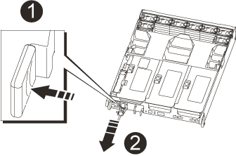

= コントローラモジュールハードウェア AFF A700s を交換してください
:allow-uri-read: 
:icons: font
:imagesdir: ../media/

[role="lead"]
コントローラモジュールハードウェアを交換するには、障害のあるコントローラを取り外し、 FRU コンポーネントを交換用コントローラモジュールに移動し、交換用コントローラモジュールをシャーシに取り付けてから、システムをメンテナンスモードでブートする必要があります。

== 手順 1 ：コントローラモジュールを取り外す

コントローラモジュールを交換する場合やコントローラモジュール内部のコンポーネントを交換する場合は、コントローラモジュールをシャーシから取り外す必要があります。

. まだ接地されていない場合は、適切なコントローラを自分で指定します。
. ケーブルマネジメントデバイスに接続しているケーブルをまとめているフックとループストラップを緩め、システムケーブルと SFP をコントローラモジュールから外し（必要な場合）、どのケーブルが何に接続されていたかを記録します。
+
ケーブルはケーブルマネジメントデバイスに収めたままにします。これにより、ケーブルマネジメントデバイスを取り付け直すときに、ケーブルを整理する必要がありません。

. コントローラモジュールの電源装置のコードをソースから抜き、電源装置から外します。
. ケーブルマネジメントデバイスをコントローラモジュールから取り外し、脇に置きます。
. 両方のロックラッチを押し下げ、両方のラッチを同時に下方向に回転させます。
+
コントローラモジュールがシャーシから少し引き出されます。

+
image::../media/drw_a700s_pcm_remove.png[DRW a700s PCM の削除]

+
[cols="1,4"]
|===

 a| 
image:../media/legend_icon_01.png[""]
| 固定ラッチ 

 a| 
image:../media/legend_icon_02.png[""]
 a| 
ロッキングピン

|===
. コントローラモジュールをシャーシから引き出します。
+
このとき、空いている手でコントローラモジュールの底面を支えてください。

. コントローラモジュールを安定した平らな場所に置き、エアダクトを開きます。
+
.. エアダクトの側面にある固定ツメをコントローラモジュールの中央方向に押します。
.. エアダクトをファンモジュールの方向にスライドさせ、完全に開いた状態になるまで上方向に回転させます。
+
image::../media/drw_a700s_open_air_duct.png[DRW a700s オープンエアダクト]

+
[cols="1,4"]
|===

 a| 
image:../media/legend_icon_01.png[""]
| エアダクトの固定ツメ 

 a| 
image:../media/legend_icon_02.png[""]
 a| 
ライザー

 a| 
image:../media/legend_icon_03.png[""]
 a| 
エアダクト

|===

== 手順 2 ： NVRAM カードを移動します

コントローラの交換プロセスの一環として、障害のあるコントローラモジュールのライザー 1 から NVRAM カードを取り外し、交換用コントローラモジュールのライザー 1 にカードを取り付ける必要があります。障害のあるコントローラモジュールから交換用コントローラモジュールに DIMM を移動したあとで、ライザー 1 を交換用コントローラモジュールに再度取り付ける必要があります。

. NVRAM ライザー「ライザー 1 」をコントローラモジュールから取り外します。
+
.. ライザーの左側にあるライザーロックラッチをファンの方に引き上げます。
+
NVRAM ライザーがコントローラモジュールからわずかに持ち上がります。

.. NVRAM ライザーを持ち上げ、ファンの方に動かしてライザーの金属板の縁がコントローラモジュールの端に接触しないようにします。次に、ライザーを真上に持ち上げてコントローラモジュールから取り外します。 次に、 NVRAM カードにアクセスできるように、安定した平らな場所に置きます。
+
image::../media/drw_a700s_nvme_replace.png[DRW a700s NVMe の置換]

+
[cols="1,4"]
|===

 a| 
image:../media/legend_icon_01.png[""]
| エアダクト 

 a| 
image:../media/legend_icon_02.png[""]
 a| 
ライザー 1 のロックラッチ

 a| 
image:../media/legend_icon_03.png[""]
 a| 
NVRAM カードに接続された NVRAM バッテリケーブルプラグ

 a| 
image:../media/legend_icon_04.png[""]
 a| 
カードロックブラケット

 a| 
image:../media/legend_icon_05.png[""]
 a| 
NVRAM カード

|===

. NVRAM カードをライザーモジュールから取り外します。
+
.. ライザーモジュールの向きを変えて NVRAM カードを取り出せるようにします。
.. NVRAM カードに接続されている NVRAM バッテリケーブルを取り外します。
.. NVRAM ライザーの側面にあるロックブラケットを押し、開いた位置まで回転させます。
.. NVRAM カードをライザーモジュールから取り外します。

. 交換用コントローラモジュールから NVRAM ライザーを取り外します。
. NVRAM ライザーに NVRAM カードを取り付けます。
+
.. ライザーモジュールのカードガイドとライザー内のカードソケットにカードを合わせます。
.. カードをカードソケットに垂直に挿入します。
+

NOTE: カードが正しい向きでライザーソケットに完全に装着されたことを確認します。

.. NVRAM カードのソケットにバッテリケーブルを接続します。
.. ロックラッチをロックされるまで動かし、所定の位置に固定されたことを確認します。

== 手順 3 ： PCIe カードを移動する

コントローラの交換プロセスの一環として、障害のあるコントローラモジュールから両方の PCIe ライザーモジュール、ライザー 2 （中央のライザー）、およびライザー 3 （右端のライザー）を取り外し、 PCIe カードをライザーモジュールから取り外します。 交換用コントローラモジュールの同じライザーモジュールに取り付けます。DIMM を交換用コントローラモジュールに移動したら、ライザーモジュールを交換用コントローラモジュールに取り付けます。

. PCIe ライザーをコントローラモジュールから取り外します。
+
.. PCIe カード内の SFP モジュールをすべて取り外します。
.. ライザーの左側にあるモジュールロックラッチをファンモジュールの方に引き上げます。
+
PCIe ライザーがコントローラモジュールからわずかに持ち上がります。

.. PCIe ライザーを持ち上げ、ファンの方に動かしてライザーの金属板の縁がコントローラモジュールの端に接触しないようにします。次に、ライザーを持ち上げてコントローラモジュールから取り外し、安定した平らな場所に置きます。
+
image::../media/drw_a700s_pcie_replace.png[DRW a700s PCIe の交換]

+
[cols="1,4"]
|===

 a| 
image:../media/legend_icon_01.png[""]
| エアダクト 

 a| 
image:../media/legend_icon_02.png[""]
 a| 
ライザーロックラッチ

 a| 
image:../media/legend_icon_03.png[""]
 a| 
カードロックブラケット

 a| 
image:../media/legend_icon_04.png[""]
 a| 
ライザー 2 （中央のライザー）とライザースロット 2 と 3 にある PCI カード

|===

. PCIe カードをライザーから取り外します。
+
.. ライザーを回して、 PCIe カードを取り出せるようにします。
.. PCIe ライザーの側面にあるロックブラケットを押し、開いた位置まで回転させます。
.. PCIe カードをライザーから取り外します。

. 交換用コントローラモジュールから対応するライザーを取り外します。
. PCIe カードを PCIe ライザーの同じスロットに取り付けます。
+
.. ライザーのカードガイドとライザー内のカードソケットにカードを合わせ、ライザー内のソケットに垂直に挿入します。
+

NOTE: カードが正しい向きでライザーソケットに完全に装着されたことを確認します。

.. ロックラッチを、カチッと音がしてロックされるまで動かします。

. 障害のあるコントローラモジュールのスロット 4 と 5 に取り付けられたライザー 3 と PCIe カードに対して、上記の手順を繰り返します。

== 手順 4 ：ブートメディアを移動します

AFF A700s には、プライマリブートメディアとセカンダリブートメディアまたはバックアップブートメディアの 2 つのブートメディアがあります。これらのコントローラを障害のあるコントローラから _replacement _controller に移動し、 _replacement _controller 内のそれぞれのスロットに取り付ける必要があります。

ブートメディアは、中央の PCIe ライザーモジュールであるライザー 2 の下にあります。ブートメディアにアクセスするには、この PCIe モジュールを取り外す必要があります。

. ブートメディアの場所を確認します。
+
.. 必要に応じてエアダクトを開きます。
.. 必要に応じて、固定ラッチを解除し、コントローラモジュールからライザーを取り外して、中央の PCIe モジュールであるライザー 2 を取り外します。

+
image::../media/drw_a700s_boot_media_replace.png[DRW a700s ブートメディアの交換]

+
[+]

+
[cols="1,4"]
|===

 a| 
image:../media/legend_icon_01.png[""]
| エアダクト 

 a| 
image:../media/legend_icon_02.png[""]
 a| 
ライザー 2 （中央の PCIe モジュール）

 a| 
image:../media/legend_icon_03.png[""]
 a| 
ブートメディアのネジ

 a| 
image:../media/legend_icon_04.png[""]
 a| 
ブートメディア

|===
. コントローラモジュールからブートメディアを取り外します。
+
.. ブートメディアを固定しているネジを No.1 プラスドライバを使用して外し、ネジを安全な場所に置きます。
.. ブートメディアの両側を持ってゆっくりと回し、ソケットからまっすぐに引き出して脇に置きます。

. 新しいコントローラモジュールにブートメディアを移して取り付けます。
+

NOTE: 交換用コントローラモジュールでは、障害のあるコントローラモジュールと同じソケットにブートメディアを取り付けてください。つまり、プライマリブートメディアソケット（スロット 1 ）にあったブートメディアはプライマリブートメディアソケットに、セカンダリブートメディアソケット（スロット 2 ）にあったブートメディアはセカンダリブートメディアソケットに取り付けます。

+
.. ブートメディアの端をソケットケースに合わせ、ソケットに対して垂直にゆっくりと押し込みます。
.. ブートメディアをマザーボードの方に回転させます。
.. ネジでブートメディアをマザーボードに固定します。
+
ネジを締め付けすぎないでください。ブートメディアが破損する可能性があります。

== 手順 5 ：ファンを移動します

障害が発生したコントローラモジュールを交換する場合は、障害のあるコントローラモジュールから交換用モジュールにファンを移動する必要があります。

. ファンモジュールの側面にある固定ツメをつまみ、ファンモジュールを持ち上げてコントローラモジュールから取り出します。
+
image::../media/drw_a700s_replace_fan.png[DRW a700s では、ファンを交換します]

+
[cols="1,4"]
|===

 a| 
image:../media/legend_icon_01.png[""]
| ファンの固定ツメ 

 a| 
image:../media/legend_icon_02.png[""]
 a| 
ファンモジュール

|===
. ファンモジュールを交換用コントローラモジュールに移動し、ファンモジュールの端をコントローラモジュールの開口部に合わせて取り付けます。次に、ロックラッチが所定の位置にカチッと収まるまでファンモジュールをコントローラモジュールにスライドさせます。
. 残りのファンモジュールに対して上記の手順を繰り返します。

== 手順 6 ：システム DIMM を移動します

[role="lead"]
DIMM を移動するには、障害のあるコントローラの DIMM の場所を確認し、 DIMM を交換用コントローラに移動して、特定の手順を実行します。

. コントローラモジュールで DIMM の場所を確認します。
+
image::../media/drw_a700s_dimm_replace.png[DRW a700s DIMM の交換]

+
[cols="1,4"]
|===

 a| 
image:../media/legend_icon_01.png[""]
| エアダクト 

 a| 
image:../media/legend_icon_02.png[""]
 a| 
ライザー 1 と DIMM バンク 1~4

 a| 
image:../media/legend_icon_03.png[""]
 a| 
ライザー 2 と DIMM バンク 5~8 および 9~12

 a| 
image:../media/legend_icon_04.png[""]
 a| 
ライザー 3 と DIMM バンク 13~16 です

|===
. DIMM を交換用コントローラモジュールに正しい向きで挿入できるように、ソケット内の DIMM の向きをメモします。
. DIMM の両側にある 2 つのツメをゆっくり押し開いて DIMM をスロットから外し、そのままスライドさせてスロットから取り出します。
+

NOTE: DIMM 回路基板のコンポーネントに力が加わらないように、 DIMM の両端を慎重に持ちます。

. DIMM を取り付けるスロットの位置を確認します。
. コネクタにある DIMM のツメが開いた状態になっていることを確認し、 DIMM をスロットに対して垂直に挿入します。
+
DIMM のスロットへの挿入にはある程度の力が必要です。簡単に挿入できない場合は、 DIMM をスロットに正しく合わせてから再度挿入してください。

+

NOTE: DIMM がスロットにまっすぐ差し込まれていることを目で確認してください。

. DIMM の両端のノッチにツメがかかるまで、 DIMM の上部を慎重にしっかり押し込みます。
. 残りの DIMM についても、上記の手順を繰り返します。

== 手順 7 ： NVRAM モジュールを取り付けます

NVRAM モジュールを取り付けるには、特定の手順を実行する必要があります。

. コントローラモジュールにライザーを取り付けます。
+
.. ライザーの縁をコントローラモジュールの金属板の下側に合わせます。
.. コントローラモジュールのピンにライザーを合わせ、コントローラモジュールに差し込みます。
.. ロックラッチを下に動かして、ロックされるまでクリックします。
+
ロックされたロックラッチはライザー上部と水平になり、ライザーがコントローラモジュールに垂直に装着されます。

.. PCIe カードから取り外したすべての SFP モジュールを再度取り付けます。

== 手順 8 ： NVRAM バッテリを移動する

コントローラモジュールを交換する場合は、障害のあるコントローラモジュールから交換用コントローラモジュールに NVRAM バッテリを移動する必要があります

. ライザーモジュール「ライザー 1 」の左側にある NVRAM バッテリの場所を確認します。
+
image::../media/drw_a700s_nvme_battery_replace.png[DRW a700s NVMe バッテリの交換]

+
[cols="1,4"]
|===

 a| 
image:../media/legend_icon_01.png[""]
| NVRAM バッテリプラグ 

 a| 
image:../media/legend_icon_02.png[""]
 a| 
NVRAM バッテリ固定ツメ（青）

|===
. バッテリプラグの場所を確認し、バッテリプラグ前面のクリップを押してプラグをソケットから外し、バッテリケーブルをソケットから抜きます。
. バッテリをつかんで「 PUSH 」と書かれた青色の固定ツメを押し、バッテリを持ち上げてホルダーとコントローラモジュールから取り出します。
. バッテリパックを交換用コントローラモジュールに移し、 NVRAM ライザーに取り付けます。
+
.. バッテリパックを金属板の側壁に沿って下にスライドさせます。側壁のサポートタブがバッテリパックのスロットに収まると、バッテリパックのラッチが所定の位置に固定されます。
.. バッテリパックをしっかりと押し下げて、所定の位置に固定します。
.. バッテリプラグをライザーソケットに接続し、プラグが所定の位置に固定されたことを確認します。

== 手順 9 ： PCIe ライザーを取り付けます

PCIe ライザーを取り付けるには、特定の手順を実行する必要があります。

. 接地対策がまだの場合は、自身で適切に実施します。
. コントローラモジュールにライザーを取り付けます。
+
.. ライザーの縁をコントローラモジュールの金属板の下側に合わせます。
.. コントローラモジュールのピンにライザーを合わせ、コントローラモジュールに差し込みます。
.. ロックラッチを下に動かして、ロックされるまでクリックします。
+
ロックされたロックラッチはライザー上部と水平になり、ライザーがコントローラモジュールに垂直に装着されます。

.. PCIe カードから取り外したすべての SFP モジュールを再度取り付けます。

. 障害のあるコントローラモジュールのスロット 4 と 5 に取り付けられたライザー 3 と PCIe カードに対して、上記の手順を繰り返します。

== 手順 10 ：電源装置を移動します

コントローラモジュールを交換する場合は、障害のあるコントローラモジュールから交換用コントローラモジュールに電源装置と電源装置ブランクを移動する必要があります。

. 接地対策がまだの場合は、自身で適切に実施します。
. 固定ツメを押しながらカムハンドルを回転させて、コントローラモジュールから電源装置を引き出せるようにします。
+

CAUTION: 電源装置は奥行きがないので、コントローラモジュールから突然落下して負傷することがないように、取り外すときは必ず両手で支えてください。

+

+
|===

 a| 
image:../media/legend_icon_01.png[""]
| 電源装置の固定ツメ（青） 

 a| 
image:../media/legend_icon_02.png[""]
 a| 
電源装置

|===
. 電源装置を新しいコントローラモジュールに移して取り付けます。
. 電源装置の端を両手で支えながらコントローラモジュールの開口部に合わせ、固定ツメがカチッと音を立てて所定の位置に収まるまで電源装置をコントローラモジュールにそっと押し込みます。
+
電源装置は、内部コネクタに正しく差し込まれ、所定の位置にロックされているだけです。

+

NOTE: 内部コネクタの破損を防ぐため、電源装置をシステムに挿入する際に力を入れすぎないようにしてください。

. 障害のあるコントローラモジュールから PSU ブランクパネルを取り外し、交換用コントローラモジュールに取り付けます。

== 手順 11 ：コントローラモジュールを取り付ける

障害のあるコントローラモジュールから交換用コントローラモジュールにすべてのコンポーネントを移動したら、交換用コントローラモジュールをシャーシに取り付け、メンテナンスモードでブートする必要があります。

. 接地対策がまだの場合は、自身で適切に実施します。
. まだ行っていない場合は、エアダクトを閉じます。
+
.. エアダクトをコントローラモジュールまで下げます。
.. カチッという音がして固定ツメが所定の位置に収まるまで、エアダクトをライザーの方向にスライドさせます。
.. エアダクトが正しく取り付けられ、所定の位置に固定されていることを確認します。

+
image::../media/drw_a700s_close_air_duct.png[DRW a700s 閉エアダクト]

+
[+]

+
|===

 a| 
image:../media/legend_icon_01.png[""]
| 固定ツメ 

 a| 
image:../media/legend_icon_02.png[""]
 a| 
スライドプランジャ

|===
. コントローラモジュールの端をシャーシの開口部に合わせ、コントローラモジュールをシステムに半分までそっと押し込みます。
+

NOTE: 指示があるまでコントローラモジュールをシャーシに完全に挿入しないでください。

. システムにアクセスして以降のセクションのタスクを実行できるように、管理ポートとコンソールポートのみをケーブル接続します。
+

NOTE: 残りのケーブルは、この手順の後半でコントローラモジュールに接続します。

. 電源装置に電源コードを接続し、電源ケーブルロックカラーを再度取り付けてから、電源装置を電源に接続します。
. コントローラモジュールの再取り付けを完了します。
+
.. ケーブルマネジメントデバイスをまだ取り付けていない場合は、取り付け直します。
.. コントローラモジュールをシャーシに挿入し、ミッドプレーンまでしっかりと押し込んで完全に装着します。
+
コントローラモジュールが完全に装着されると、ロックラッチが上がります。

+

NOTE: コネクタの破損を防ぐため、コントローラモジュールをスライドしてシャーシに挿入する際に力を入れすぎないでください。

+
コントローラモジュールは、シャーシに完全に装着されるとすぐにブートを開始します。ブートプロセスを中断できるように準備しておきます。

.. ロックラッチを上に回転させてロックピンが外れるように傾け、ロックされるまで下げます。
.. 「 Press Ctrl-C for Boot Menu 」 ( ブートメニューに Ctrl キーを押して C キーを押してください ) と表示されたら、 Ctrl+C キーを押して起動プロセスを中断します。
.. 表示されたメニューからメンテナンスモードでブートするオプションを選択します。

. システムが 40GbE NIC またはオンボードポートで 10GbE のクラスタインターコネクトとデータ接続をサポートするように設定されている場合は、保守モードで nicadmin convert コマンドを使用して、これらのポートを 10GbE 接続に変換します。
+

NOTE: 変換が完了したら必ずメンテナンスモードを終了してください。

