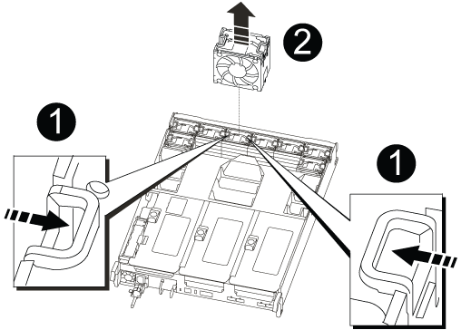

= ファンの交換 - AFF A700s
:allow-uri-read: 
:icons: font
:imagesdir: ../media/

[role="lead"]
ファンを交換するには、障害が発生したファンモジュールを取り外し、新しいファンモジュールと交換します。

. 接地対策がまだの場合は、自身で適切に実施します。
. 交換が必要なファンモジュールを特定するために、コンソールのエラーメッセージを確認するか、マザーボードでファンモジュールの LED が点灯していることを確認します。
. ファンモジュールの側面にある固定ツメをつまみ、ファンモジュールを持ち上げてコントローラモジュールから取り出します。
+

+
|===

 a| 
image:../media/legend_icon_01.png[""]
 a| 
ファンの固定ツメ

 a| 
image:../media/legend_icon_02.png[""]
 a| 
ファンモジュール

|===
. 交換用ファンモジュールの端をコントローラモジュールの開口部に合わせ、ロックラッチが所定の位置にカチッと収まるまで、交換用ファンモジュールをコントローラモジュールにスライドさせます。

