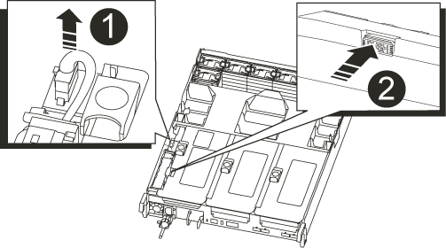

= NVRAM バッテリを交換してください - AFF A700s
:allow-uri-read: 
:icons: font
:imagesdir: ../media/

[role="lead"]
システムの NVRAM バッテリを交換するには、コントローラモジュールをシステムから取り出し、バッテリを取り外して交換し、コントローラモジュールを再度取り付ける必要があります。

システムのその他のコンポーネントがすべて正常に動作している必要があります。問題がある場合は、必ずテクニカルサポートにお問い合わせください。

== 手順 1 ：障害のあるコントローラをシャットダウンします

[role="lead"]
障害のあるコントローラをシャットダウンするには、コントローラのステータスを確認し、必要に応じて正常なコントローラが障害のあるコントローラストレージからデータを引き続き提供できるようにコントローラをテイクオーバーする必要があります。

ノードが 3 つ以上あるクラスタは、クォーラムを構成している必要があります。クラスタがクォーラムを構成していない場合、または正常なコントローラで適格性と正常性について false と表示される場合は、障害のあるコントローラをシャットダウンする前に問題 を修正する必要があります。を参照してください link:https://docs.netapp.com/us-en/ontap/system-admin/synchronize-node-cluster-task.html?q=Quorum["ノードをクラスタと同期します"^]。

.手順
. AutoSupport が有効になっている場合は、 AutoSupport メッセージを呼び出してケースの自動作成を抑制します。「 system node AutoSupport invoke -node * -type all -message MAINT=_Number_OF_hours_down_h
+
次の AutoSupport メッセージは、ケースの自動作成を 2 時間停止します。 cluster1 ： * > system node AutoSupport invoke -node * -type all -message MAINT=2h`

. 障害のあるコントローラが HA ペアの一部である場合は、正常なコントローラのコンソールから自動ギブバックを無効にします。 storage failover modify -node local-auto-giveback false
. 障害のあるコントローラに LOADER プロンプトを表示します。
+
[cols="1,2"]
|===
| 障害のあるコントローラの表示 | 作業 

 a| 
LOADER プロンプト
 a| 
コントローラモジュールの取り外しに進みます。

 a| 
ギブバックを待っています
 a| 
Ctrl キーを押しながら C キーを押し、「 y 」と入力します。

 a| 
システムプロンプトまたはパスワードプロンプト（システムパスワードの入力）
 a| 
正常なコントローラから障害のあるコントローラをテイクオーバーまたは停止します。「 storage failover takeover -ofnode impaired_node_name _

障害のあるコントローラに「 Waiting for giveback... 」と表示されたら、 Ctrl+C キーを押し、「 y 」と入力します。

|===

== 手順 2 ：コントローラモジュールを取り外す

[role="lead"]
コントローラモジュールを交換する場合やコントローラモジュール内部のコンポーネントを交換する場合は、コントローラモジュールをシャーシから取り外す必要があります。

. 接地対策がまだの場合は、自身で適切に実施します。
. コントローラモジュールの電源装置のコードをソースから抜き、電源装置から外します。
. ケーブルマネジメントデバイスに接続しているケーブルをまとめているフックとループストラップを緩め、システムケーブルと SFP をコントローラモジュールから外し（必要な場合）、どのケーブルが何に接続されていたかを記録します。
+
ケーブルはケーブルマネジメントデバイスに収めたままにします。これにより、ケーブルマネジメントデバイスを取り付け直すときに、ケーブルを整理する必要がありません。

. ケーブルマネジメントデバイスをコントローラモジュールから取り外し、脇に置きます。
. 両方のロックラッチを押し下げ、両方のラッチを同時に下方向に回転させます。
+
コントローラモジュールがシャーシから少し引き出されます。

+
image::../media/drw_a700s_pcm_remove.png[DRW a700s PCM の削除]

+
|===

 a| 
image:../media/legend_icon_01.png[""]
 a| 
固定ラッチ

 a| 
image:../media/legend_icon_02.png[""]
 a| 
ロッキングピン

|===
. コントローラモジュールをシャーシから引き出します。
+
このとき、空いている手でコントローラモジュールの底面を支えてください。

. コントローラモジュールを安全な場所に置いておきます。

== 手順3：NVRAMバッテリを交換します

[role="lead"]
NVRAM バッテリを交換するには、障害が発生した NVRAM バッテリをコントローラモジュールから取り外し、交換用 NVRAM バッテリをコントローラモジュールに取り付ける必要があります。

. 接地対策がまだの場合は、自身で適切に実施します。
. ライザーモジュール「ライザー 1 」の左側にある NVRAM バッテリの場所を確認します。
+

+
|===

 a| 
image:../media/legend_icon_01.png[""]
 a| 
NVRAM バッテリプラグ

 a| 
image:../media/legend_icon_02.png[""]
 a| 
NVRAM バッテリ固定ツメ（青）

|===
. バッテリプラグの場所を確認し、バッテリプラグ前面のクリップを押してプラグをソケットから外し、バッテリケーブルをソケットから抜きます。
. バッテリホルダーの青色の固定ツメを押してラッチをホルダーから外します。
. バッテリをライザーブラケットの下にスライドさせ、持ち上げてコントローラから取り出し、脇に置きます。
. 交換用バッテリパックを金属板の側壁に沿って下にスライドさせます。側壁のサポートタブがバッテリパックのスロットに収まると、バッテリパックのラッチが所定の位置に固定されます。
. バッテリプラグをライザーソケットに接続し、プラグが所定の位置に固定されたことを確認します。

== 手順 4 ：コントローラモジュールを再度取り付けます

[role="lead"]
コントローラモジュール内のコンポーネントを交換したら、コントローラモジュールをシステムシャーシに再度取り付けてブートする必要があります。

. 接地対策がまだの場合は、自身で適切に実施します。
. まだ行っていない場合は、エアダクトを閉じます。
+
.. エアダクトをコントローラモジュールまで下げます。
.. カチッという音がして固定ツメが所定の位置に収まるまで、エアダクトをライザーの方向にスライドさせます。
.. エアダクトが正しく取り付けられ、所定の位置に固定されていることを確認します。
+
image::../media/drw_a700s_close_air_duct.png[DRW a700s 閉エアダクト]

+
|===

 a| 
image:../media/legend_icon_01.png[""]
 a| 
固定ツメ

 a| 
image:../media/legend_icon_02.png[""]
 a| 
スライドプランジャ

|===

. コントローラモジュールの端をシャーシの開口部に合わせ、コントローラモジュールをシステムに半分までそっと押し込みます。
+

NOTE: 指示があるまでコントローラモジュールをシャーシに完全に挿入しないでください。

. 必要に応じてシステムにケーブルを再接続します。
+
光ファイバケーブルを使用する場合は、メディアコンバータ（ QSFP または SFP ）を取り付け直してください（取り外した場合）。

. 電源装置に電源コードを接続し、電源ケーブルロックカラーを再度取り付けてから、電源装置を電源に接続します。
. コントローラモジュールの再取り付けを完了します。
+
.. ケーブルマネジメントデバイスをまだ取り付けていない場合は、取り付け直します。
.. コントローラモジュールをシャーシに挿入し、ミッドプレーンまでしっかりと押し込んで完全に装着します。
+
コントローラモジュールが完全に装着されると、ロックラッチが上がります。

+

NOTE: コネクタの破損を防ぐため、コントローラモジュールをスライドしてシャーシに挿入する際に力を入れすぎないでください。

+
コントローラモジュールは、シャーシに完全に装着されるとすぐにブートを開始します。

.. ロックラッチを上に回転させてロックピンが外れるように傾け、ロックされるまで下げます。

. システムが 40GbE NIC またはオンボードポートで 10GbE のクラスタインターコネクトとデータ接続をサポートするように設定されている場合は、保守モードで nicadmin convert コマンドを使用して、これらのポートを 10GbE 接続に変換します。
+

NOTE: 変換が完了したら必ずメンテナンスモードを終了してください。

. ストレージをギブバックして、コントローラを通常の動作に戻します。 storage failover giveback -ofnode impaired_node_name _`
. 自動ギブバックを無効にした場合は、再度有効にします。「 storage failover modify -node local-auto-giveback true 」

== 手順 5 ：障害が発生したパーツをネットアップに返却する

[role="lead"]
障害のある部品は、キットに付属する RMA 指示書に従ってネットアップに返却してください。を参照してください https://mysupport.netapp.com/site/info/rma["パーツの返品と交換"] 詳細については、を参照してください。
