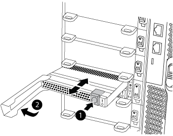

= キャッシングモジュールを交換するか、 FAS9500 コアダンプモジュールを追加 / 交換します
:icons: font
:imagesdir: ../media/

[role="lead"]
モジュールがオフラインになったことを示す単一の AutoSupport （ ASUP ）メッセージがシステムに登録された場合は、コントローラモジュールのキャッシングモジュールを交換する必要があります。交換しないと、パフォーマンスが低下します。AutoSupport が有効になっていない場合は、モジュールの前面にある障害 LED で、障害が発生したキャッシングモジュールの場所を確認できます。1TB の X9170a コアダンプモジュールは、 AFF A700 システムに NS224 ドライブシェルフを設置する場合に必要なモジュールとして追加または交換することもできます。

* 障害が発生したコンポーネントは、プロバイダから受け取った交換用 FRU コンポーネントと交換する必要があります。
* キャッシングモジュールのホットスワップの手順については、を参照してください link:../a900/caching_module_hot_swap.html["キャッシングモジュールのホットスワップ"]。
* キャッシングモジュールまたはコアダンプモジュールの取り外し、交換、追加を行う際は、ターゲットノードを LOADER に停止する必要があります。
* AFF A700 は、 1TB のコアダンプモジュールである X9170a をサポートします。 NS224 ドライブシェルフを追加する場合はこのモジュールが必要です。
* コアダンプモジュールは、スロット 6-1 および 6-2 に取り付けることができます。推奨されるベストプラクティスは、スロット 6-1 にモジュールを取り付けることです。
* X9170a コアダンプモジュールはホットスワップに対応していません。

== 手順 1 ：ノードをシャットダウンします

== 手順 1 ：障害ノードをシャットダウンします

[role="lead"]
ストレージシステムのハードウェア構成に応じた手順を使用して、障害のあるコントローラをシャットダウンまたはテイクオーバーできます。

=== オプション 1 ：ほとんどの構成

[role="lead"]
障害ノードをシャットダウンするには、ノードのステータスを確認し、必要に応じて正常なノードが障害ノードのストレージからデータを引き続き提供できるようにノードをテイクオーバーする必要があります。

ノードが 3 つ以上あるクラスタは、クォーラムを構成している必要があります。クラスタがクォーラムを構成していない場合や、正常なノードの資格と健全性に false と表示される場合は、障害ノードをシャットダウンする前に問題を修正する必要があります。を参照してください https://docs.netapp.com/us-en/ontap/system-admin/index.html["CLI での管理の概要"]。

.手順
. AutoSupport が有効になっている場合は、 AutoSupport メッセージを呼び出してケースの自動作成を抑制します。「 system node AutoSupport invoke -node * -type all -message MAINT=number_OF_hours_downh
+
次の AutoSupport メッセージは、ケースの自動作成を 2 時間停止します。 cluster1 ： * > system node AutoSupport invoke -node * -type all -message MAINT=2h`

. 正常なノードのコンソールから自動ギブバックを無効にします。「 storage failover modify – node local-auto-giveback false
. 障害ノードに LOADER プロンプトを表示します。
+
[cols="1,2"]
|===
| 障害ノードの表示 | 作業 

 a| 
LOADER プロンプト
 a| 
次の手順に進みます。

 a| 
ギブバックを待っています
 a| 
Ctrl キーを押しながら C キーを押し ' プロンプトが表示されたら y と入力します

 a| 
システムプロンプトまたはパスワードプロンプト（システムパスワードの入力）
 a| 
障害ノードをテイクオーバーまたは停止します。

** HA ペアの場合は、正常なノードから障害ノードをテイクオーバーします。「 storage failover takeover -ofnode impaired_node_name _
+
障害ノードに「 Waiting for giveback... 」と表示されたら、 Ctrl+C キーを押し、「 y 」と入力します。

|===

=== オプション 2 ：コントローラが MetroCluster に搭載されている

[role="lead"]
<stdin> の未解決のディレクティブ：： ./_include/shutdown_any_MCC_supported[]

== 手順 2 ：キャッシングモジュールを交換または追加する

[role="lead"]
NVMe SSD Flash Cache モジュール（ FlashCache またはキャッシングモジュール）は、個別のモジュールです。これらは NVRAM モジュールの前面にあります。キャッシングモジュールを交換または追加するには、スロット 6 のシステム背面にあるモジュールの場所を確認し、特定の手順に従って交換します。

状況に応じて、ストレージシステムが次に示す特定の条件を満たしている必要があります。

* 取り付けるキャッシングモジュールに適したオペレーティングシステムが必要です。
* キャッシュ容量をサポートする必要があります。
* キャッシングモジュールを追加または交換する前に、ターゲットノードに LOADER プロンプトが表示されている必要があります。
* 交換用キャッシングモジュールの容量は、障害が発生したキャッシングモジュールと同じでなければなりませんが、サポートされている別のベンダーのキャッシングモジュールを使用することもできます。
* ストレージシステムのその他のコンポーネントがすべて正常に動作している必要があります。問題がある場合は、必ずテクニカルサポートにお問い合わせください。
+
.. 接地対策がまだの場合は、自身で適切に実施します。
.. スロット 6 で、キャッシングモジュールの前面にある黄色の警告 LED が点灯している、障害が発生したキャッシングモジュールの場所を確認します。
.. キャッシングモジュールを取り外します。
+

NOTE: システムに別のキャッシングモジュールを追加する場合は、空のモジュールを取り外して次の手順に進みます。

+

+
|===

 a| 
image:../media/legend_icon_01.png[""]

 a| 
オレンジ色のリリースボタン。

 a| 
image:../media/legend_icon_02.png[""]

 a| 
キャッシングモジュールのカムハンドル

|===
+
... キャッシングモジュールの前面にあるテラコッタリリースボタンを押します。
+

IMPORTANT: 数字とアルファベットが印字された I/O カムラッチを使用してキャッシングモジュールをイジェクトしないでください。数字とアルファベットが印字された I/O カムラッチを使用すると、キャッシングモジュールではなく NVRAM10 モジュール全体がイジェクトされます。

... キャッシングモジュールが NVRAM10 モジュールから少し引き出されるまでカムハンドルを回転させます。
... カムハンドルを手前にゆっくりと引いて、 NVRAM10 モジュールからキャッシングモジュールを取り外します。
+
キャッシングモジュールを NVRAM10 モジュールから取り外す際は、必ずキャッシングモジュールを手で支えてください。

.. キャッシングモジュールを取り付けます。
+
... キャッシングモジュールの端を NVRAM10 モジュールの開口部に合わせます。
... キャッシングモジュールをゆっくりとベイに押し込んで、カムハンドルをはめ込みます。
... 所定の位置に固定されるまでカムハンドルを回転させます。

== X9170a コアダンプモジュールを追加または交換します

[role="lead"]
1TB キャッシュコアダンプである X9170a は、 AFF A700 システムでのみ使用されます。コアダンプモジュールをホットスワップできない。通常、コアダンプモジュールは NVRAM モジュールの前面のスロット 6-1 にあり、システムの背面にあります。コアダンプモジュールを交換または追加するには、スロット 6-1 の場所を確認し、特定の手順に従って追加または交換してください。

* コアダンプモジュールを追加するには、システムで ONTAP 9.8 以降が実行されている必要があります。
* X9170a コアダンプモジュールはホットスワップに対応していません。
* コードダンプモジュールを追加または交換する前に、ターゲットノードに LOADER プロンプトが表示されている必要があります。
* コントローラごとに 1 つずつ、 X9170 コアダンプモジュールを 2 つ入手しておく必要があります。
* ストレージシステムのその他のコンポーネントがすべて正常に動作している必要があります。問題がある場合は、必ずテクニカルサポートにお問い合わせください。
+
.. 接地対策がまだの場合は、自身で適切に実施します。
.. 障害が発生したコアダンプモジュールを交換する場合は、モジュールの場所を確認して取り外します。
+

+
|===

| image:../media/legend_icon_01.png[""] | オレンジ色のリリースボタン。 

 a| 
image:../media/legend_icon_02.png[""]
 a| 
コアダンプモジュールのカムハンドル

|===
+
... モジュールの前面にある黄色の警告 LED で、障害が発生したモジュールの場所を確認します。
... コアダンプモジュールの前面にあるテラコッタリリースボタンを押します。
+

IMPORTANT: 数字とアルファベットが印字された I/O カムラッチを使用してコアダンプモジュールをイジェクトしないでください。数字とアルファベットが印字された I/O カムラッチを使用すると、コアダンプモジュールではなく NVRAM10 モジュール全体がイジェクトされます。

... コアダンプモジュールが NVRAM10 モジュールから少し引き出されるまでカムハンドルを回転させます。
... カムハンドルを手前にゆっくりと引いて NVRAM10 モジュールからコアダンプモジュールを取り外し、脇に置きます。
+
コアダンプモジュールを NVRAM10 モジュールから取り外す際は、必ずコアダンプモジュールを手で支えてください。

.. コアダンプモジュールを取り付けます。
+
... 新しいコアダンプモジュールを取り付ける場合は、スロット 6-1 からブランクモジュールを取り外します。
... コアダンプモジュールの端を NVRAM10 モジュールの開口部に合わせます。
... コアダンプモジュールをゆっくりとベイに押し込んで、カムハンドルをはめ込みます。
... 所定の位置に固定されるまでカムハンドルを回転させます。

== FRU 交換後、コントローラをリブートしています

[role="lead"]
FRU を交換したら、コントローラモジュールをリブートする必要があります。

. LOADER プロンプトから ONTAP を起動するには、「 bye 」と入力します。

== 2 ノード MetroCluster 構成でのアグリゲートのスイッチバック

2 ノード MetroCluster 構成で FRU の交換が完了したら、 MetroCluster スイッチバック処理を実行できます。これにより構成が通常の動作状態に戻ります。また、障害が発生していたサイトの同期元 Storage Virtual Machine （ SVM ）がアクティブになり、ローカルディスクプールからデータを提供します。

このタスクでは、環境の 2 ノード MetroCluster 構成のみを実行します。

.手順
. すべてのノードの状態が「 enabled 」であることを確認します。 MetroCluster node show
+
[listing]
----
cluster_B::>  metrocluster node show

DR                           Configuration  DR
Group Cluster Node           State          Mirroring Mode
----- ------- -------------- -------------- --------- --------------------
1     cluster_A
              controller_A_1 configured     enabled   heal roots completed
      cluster_B
              controller_B_1 configured     enabled   waiting for switchback recovery
2 entries were displayed.
----
. すべての SVM で再同期が完了したことを確認します。「 MetroCluster vserver show 」
. 修復処理によって実行される LIF の自動移行が正常に完了したことを確認します。 MetroCluster check lif show
. サバイバークラスタ内の任意のノードから MetroCluster switchback コマンドを使用して、スイッチバックを実行します。
. スイッチバック処理が完了したことを確認します MetroCluster show
+
クラスタの状態が waiting-for-switchback の場合は、スイッチバック処理がまだ実行中です。

+
[listing]
----
cluster_B::> metrocluster show
Cluster              Configuration State    Mode
--------------------	------------------- 	---------
 Local: cluster_B configured       	switchover
Remote: cluster_A configured       	waiting-for-switchback
----
+
クラスタが「 normal 」状態のとき、スイッチバック処理は完了しています。

+
[listing]
----
cluster_B::> metrocluster show
Cluster              Configuration State    Mode
--------------------	------------------- 	---------
 Local: cluster_B configured      		normal
Remote: cluster_A configured      		normal
----
+
スイッチバックが完了するまでに時間がかかる場合は、「 MetroCluster config-replication resync-status show 」コマンドを使用することで、進行中のベースラインのステータスを確認できます。

. SnapMirror 構成または SnapVault 構成があれば、再確立します。

== 障害のあるパーツをネットアップに返却します

部品を交換したあと、障害のある部品をネットアップに返却することができます。詳細については、キットに付属する RMA 指示書を参照してください。テクニカルサポートにお問い合わせください https://mysupport.netapp.com/site/global/dashboard["ネットアップサポート"]RMA 番号を確認する場合や、交換用手順にサポートが必要な場合は、日本国内サポート用電話番号：国内フリーダイヤル 0066-33-123-265 または 0066-33-821-274 （国際フリーフォン 800-800-80-800 も使用可能）までご連絡ください。
