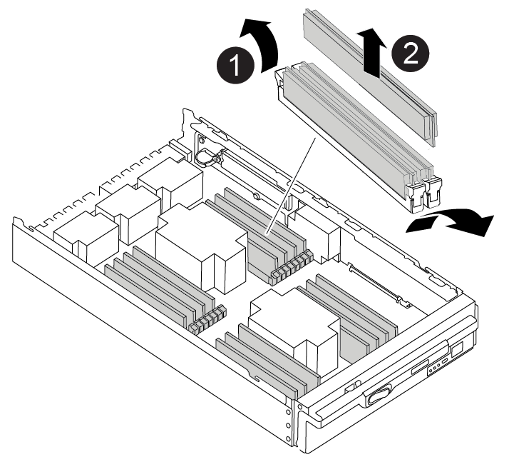

= DIMM- AFF A900 を交換してください
:allow-uri-read: 
:icons: font
:imagesdir: ../media/

[role="lead"]
システムで登録される修正可能なエラー修正コード（ ECC ）の数が増え続けている場合は、コントローラモジュールの DIMM を交換する必要があります。そのままにしているとシステムがパニック状態になります。

システムのその他のコンポーネントがすべて正常に動作している必要があります。問題がある場合は、必ずテクニカルサポートにお問い合わせください。

障害が発生したコンポーネントは、プロバイダから受け取った交換用 FRU コンポーネントと交換する必要があります。

== 手順 1 ：障害のあるコントローラをシャットダウンします

[role="lead"]
次のいずれかのオプションを使用して、障害のあるコントローラをシャットダウンまたはテイクオーバーします。

[role="tabbed-block"]
====
.オプション 1 ：ほとんどのシステム
--
障害のあるコントローラをシャットダウンするには、コントローラのステータスを確認し、必要に応じて正常なコントローラが障害のあるコントローラストレージからデータを引き続き提供できるようにコントローラをテイクオーバーする必要があります。

ノードが 3 つ以上あるクラスタは、クォーラムを構成している必要があります。クラスタがクォーラムを構成していない場合、または正常なコントローラで適格性と正常性について false と表示される場合は、障害のあるコントローラをシャットダウンする前に問題 を修正する必要があります。を参照してください link:https://docs.netapp.com/us-en/ontap/system-admin/index.html["CLI での管理の概要"^]。

.手順
. AutoSupport が有効になっている場合は、 AutoSupport メッセージを呼び出してケースの自動作成を抑制します。「 system node AutoSupport invoke -node * -type all -message MAINT=number_OF_hours_downh
+
次の AutoSupport メッセージは、ケースの自動作成を 2 時間停止します。 cluster1 ： * > system node AutoSupport invoke -node * -type all -message MAINT=2h`

. 正常なコントローラのコンソールから自動ギブバックを無効にします。 storage failover modify – node local-auto-giveback false
. 障害のあるコントローラに LOADER プロンプトを表示します。
+
[cols="1,2"]
|===
| 障害のあるコントローラの表示 | 作業 

 a| 
LOADER プロンプト
 a| 
コントローラモジュールの取り外しに進みます。

 a| 
ギブバックを待っています
 a| 
Ctrl キーを押しながら C キーを押し ' プロンプトが表示されたら y と入力します

 a| 
システムプロンプトまたはパスワードプロンプト（システムパスワードの入力）
 a| 
正常なコントローラから障害のあるコントローラをテイクオーバーまたは停止します。「 storage failover takeover -ofnode impaired_node_name _

障害のあるコントローラに「 Waiting for giveback... 」と表示されたら、 Ctrl+C キーを押し、「 y 」と入力します。

|===

--
.オプション 2 ：コントローラが MetroCluster に搭載されている
--

NOTE: 2 ノード MetroCluster 構成のシステムでは、この手順を使用しないでください。

障害のあるコントローラをシャットダウンするには、コントローラのステータスを確認し、必要に応じて正常なコントローラが障害のあるコントローラストレージからデータを引き続き提供できるようにコントローラをテイクオーバーする必要があります。

* ノードが 3 つ以上あるクラスタは、クォーラムを構成している必要があります。クラスタがクォーラムを構成していない場合、または正常なコントローラで適格性と正常性について false と表示される場合は、障害のあるコントローラをシャットダウンする前に問題 を修正する必要があります。を参照してください link:https://docs.netapp.com/us-en/ontap/system-admin/index.html["CLI での管理の概要"^]。
* MetroCluster 構成を使用している場合は、 MetroCluster 構成状態が構成済みで、ノードが有効かつ正常な状態であることを確認しておく必要があります（「 MetroCluster node show 」）。

.手順
. AutoSupport が有効になっている場合は、 AutoSupport メッセージを呼び出してケースの自動作成を抑制します。「 system node AutoSupport invoke -node * -type all -message MAINT=number_OF_hours_downh
+
次の AutoSupport メッセージは、ケースの自動作成を 2 時間停止します。 cluster1 ： * > system node AutoSupport invoke -node * -type all -message MAINT=2h`

. 正常なコントローラのコンソールから自動ギブバックを無効にします。 storage failover modify – node local-auto-giveback false
. 障害のあるコントローラに LOADER プロンプトを表示します。
+
[cols="1,2"]
|===
| 障害のあるコントローラの表示 | 作業 

 a| 
LOADER プロンプト
 a| 
コントローラモジュールの取り外しに進みます。

 a| 
ギブバックを待っています
 a| 
Ctrl キーを押しながら C キーを押し ' プロンプトが表示されたら y と入力します

 a| 
システムプロンプトまたはパスワードプロンプト（システムパスワードの入力）
 a| 
正常なコントローラから障害のあるコントローラをテイクオーバーまたは停止します。「 storage failover takeover -ofnode impaired_node_name _

障害のあるコントローラに「 Waiting for giveback... 」と表示されたら、 Ctrl+C キーを押し、「 y 」と入力します。

|===

--
====

== 手順 2 ：コントローラモジュールを取り外す

[role="lead"]
コントローラ内部のコンポーネントにアクセスするには、まずコントローラモジュールをシステムから取り外し、続いてコントローラモジュールのカバーを外す必要があります。

. 接地対策がまだの場合は、自身で適切に実施します。
. 障害のあるコントローラモジュールからケーブルを外し、どのケーブルが何に接続されていたかを記録します。
. カムハンドルのテラコッタボタンを下にスライドさせてロックを解除します。
+
https://netapp.hosted.panopto.com/Panopto/Pages/Viewer.aspx?id=256721fd-4c2e-40b3-841a-adf2000df5fa["アニメーション -- コントローラを取り外します"^]

+
image::../media/drw_a900_remove_PCM.png[DRW a900 は PCM を取り外します]

+
[cols="10,90"]
|===

 a| 
image:../media/legend_icon_01.png[""]
 a| 
カムハンドルのリリースボタン

 a| 
image:../media/legend_icon_02.png[""]
 a| 
カムハンドル

|===
. カムハンドルを回転させて、コントローラモジュールをシャーシから完全に外し、コントローラモジュールをシャーシから引き出します。
+
このとき、空いている手でコントローラモジュールの底面を支えてください。

. コントローラモジュールのふた側を上にして、平らで安定した場所に置きます。カバーの青いボタンを押し、コントローラモジュールの背面にカバーをスライドさせてから、カバーを上に動かしてコントローラモジュールから外します。
+
image::../media/drw_a900_PCM_open.png[DRW a900 PCM 開]

+
[cols="10,90"]
|===

 a| 
image:../media/legend_icon_01.png[""]
 a| 
コントローラモジュールのカバーの固定ボタン

|===

== 手順 3 ： DIMM を交換します

[role="lead"]
DIMM を交換するには、コントローラ内で DIMM の場所を確認し、特定の手順を実行します。

. 接地対策がまだの場合は、自身で適切に実施します。
. コントローラモジュールで DIMM の場所を確認します。
+

NOTE: 各システムメモリ DIMM の LED は、ボード上の各 DIMM スロットの横にあります。障害が発生した場合は、 LED が 2 秒ごとに点滅します。

+
image::../media/drw_a900_DIMM_map.png[DRW a900 DIMM マップ]

. DIMM の両側にある 2 つのツメをゆっくり押し開いて DIMM をスロットから外し、そのままスライドさせてスロットから取り出します。
+

IMPORTANT: DIMM 回路基板のコンポーネントに力が加わらないように、 DIMM の両端を慎重に持ちます。

+
https://netapp.hosted.panopto.com/Panopto/Pages/Viewer.aspx?id=db161030-298a-4ae4-b902-adf2000e2aa4["アニメーション -- DIMM を交換します"^]

+

+
[cols="10,90"]
|===

 a| 
image:../media/legend_icon_01.png[""]
 a| 
DIMM のツメ

 a| 
image:../media/legend_icon_02.png[""]
 a| 
DIMM

|===
. 交換用 DIMM を静電気防止用の梱包バッグから取り出し、 DIMM の端を持ってスロットに合わせます。
+
DIMM のピンの間にある切り欠きを、ソケットの突起と揃える必要があります。

. コネクタにある DIMM のツメが開いた状態になっていることを確認し、 DIMM をスロットに対して垂直に挿入します。
+
DIMM のスロットへの挿入にはある程度の力が必要です。簡単に挿入できない場合は、 DIMM をスロットに正しく合わせてから再度挿入してください。

+

IMPORTANT: DIMM がスロットにまっすぐ差し込まれていることを目で確認してください。

. DIMM の両端のノッチにツメがかかるまで、 DIMM の上部を慎重にしっかり押し込みます。
. コントローラモジュールのカバーを閉じます。

== 手順 4 ：コントローラを取り付ける

[role="lead"]
コンポーネントをコントローラモジュールに取り付けたら、コントローラモジュールをシステムシャーシに取り付け直してオペレーティングシステムをブートする必要があります。

2 台のコントローラモジュールを同じシャーシに搭載する HA ペアでは、シャーシへの設置が完了すると同時にリブートが試行されるため、コントローラモジュールの取り付け順序が特に重要です。

. 接地対策がまだの場合は、自身で適切に実施します。
. コントローラモジュールのカバーをまだ取り付けていない場合は取り付けます。
+
image::../media/drw_a900_PCM_open.png[DRW a900 PCM 開]

+
[cols="10,90"]
|===

 a| 
image:../media/legend_icon_01.png[""]
 a| 
コントローラモジュールのカバーの固定ボタン

|===
. コントローラモジュールの端をシャーシの開口部に合わせ、コントローラモジュールをシステムに半分までそっと押し込みます。
+
https://netapp.hosted.panopto.com/Panopto/Pages/Viewer.aspx?id=099237f3-d7f2-4749-86e2-adf2000df53c["アニメーション -- コントローラをインストールします"^]

+
image::../media/drw_a900_remove_PCM.png[DRW a900 は PCM を取り外します]

+
[cols="10,90"]
|===

 a| 
image:../media/legend_icon_01.png[""]
 a| 
カムハンドルのリリースボタン

 a| 
image:../media/legend_icon_02.png[""]
 a| 
カムハンドル

|===
+

NOTE: 指示があるまでコントローラモジュールをシャーシに完全に挿入しないでください。

. システムにアクセスして以降のセクションのタスクを実行できるように、管理ポートとコンソールポートのみをケーブル接続します。
+

NOTE: 残りのケーブルは、この手順の後半でコントローラモジュールに接続します。

. コントローラモジュールの再取り付けを完了します。
+
.. ケーブルマネジメントデバイスをまだ取り付けていない場合は、取り付け直します。
.. コントローラモジュールをシャーシに挿入し、ミッドプレーンまでしっかりと押し込んで完全に装着します。
+
コントローラモジュールが完全に装着されると、ロックラッチが上がります。

+

IMPORTANT: コネクタの破損を防ぐため、コントローラモジュールをスライドしてシャーシに挿入する際に力を入れすぎないでください。

+
コントローラモジュールは、シャーシに完全に装着されるとすぐにブートを開始します。ブートプロセスを中断できるように準備しておきます。

.. ロックラッチを上に回転させてロックピンが外れるように傾け、ロックされるまで下げます。
.. 起動メニューに Ctrl+C キーを押して ' 起動プロセスを中断します
.. 表示されたメニューからメンテナンスモードでブートするオプションを選択します。

== 手順 5 ：システムレベルの診断を実行します

[role="lead"]
新しい DIMM を取り付けたら、診断を実行する必要があります。

システムレベルの診断を開始するには、システムに LOADER プロンプトが表示されている必要があります。

診断手順のコマンドは、すべてコンポーネントを交換するコントローラから実行します。

. 作業をするコントローラに LOADER プロンプトが表示されていない場合は、次の手順を実行します。
+
.. 表示されたメニューからメンテナンスモードオプションを選択します。
.. コントローラが保守モードでブートしたら、コントローラを停止します
+
コマンドを問題したら、システムが LOADER プロンプトで停止するまで待ちます。

+

IMPORTANT: 起動プロセス中に 'y' とプロンプトを安全に入力できます

+
*** HA 構成でメンテナンスモードに切り替えたときに、正常なコントローラが停止したままであることの確認を求めるプロンプトが表示される場合。

. LOADER プロンプトで、システムレベルの診断用に特別に設計されたドライバ「 boot_diags 」にアクセスします
+
ブート・プロセス中に 'Maintenance] モードのプロンプト（ *> ）が表示されるまで 'y とプロンプトを入力しても安全です

. システムメモリの診断を実行します。 'lddiag device run -dev mem'
. DIMM の交換が原因でハードウェアの問題が発生していないことを確認します。 'lddiag device status -dev mem-long-state failed
+
テストに失敗した場合は、プロンプトに戻ります。失敗した場合は、そのステータスがすべて表示されます。

. 前述の手順の結果に応じて、次に進みます。
+
[cols="1,2"]
|===
| システムレベルの診断のテスト結果 | 作業 

 a| 
は失敗なしで完了しました
 a| 
.. ステータスログ「 `diag device clearstatus` 」を消去します
.. ログがクリアされたことを確認します。「 diag device status 」
+
次のデフォルトの応答が表示されます。

+
SLDIAG ：ログメッセージが存在しません。

.. 保守モードを終了します :halt
+
コントローラに LOADER プロンプトが表示されます。

.. LOADER プロンプトからコントローラをブートします
.. コントローラを通常動作に戻します。

|===
+
[cols="1,2"]
|===
| コントローラの構成 | 作業 

 a| 
HA ペア
 a| 
ギブバックを実行します。 storage failover giveback -ofnode replacement_node_name * 注： * 自動ギブバックを無効にした場合は、 storage failover modify コマンドを使用して再度有効にします。

 a| 
テストが失敗しました
 a| 
問題の原因を特定します。

.. 保守モードを終了します :halt
+
コマンドを問題したら、システムが LOADER プロンプトで停止するまで待ちます。

.. システムレベルの診断を実行するための考慮事項をすべて確認するとともに、ケーブルがしっかりと接続されているか、ハードウェアコンポーネントがストレージシステムに適切に取り付けられているかを確認します。
.. 対象となるコントローラモジュールをブートし、ブートメニューを表示するよう求められたら Ctrl+C キーを押してブートを中断します。
+
*** シャーシ内にコントローラモジュールが 2 つある場合は、対象となるコントローラモジュールをシャーシに完全に取り付けます。
+
コントローラモジュールを完全に取り付けると、モジュールがブートします。

*** シャーシ内にコントローラモジュールが 1 つしかない場合は、電源装置を接続して電源をオンにします。

.. メニューから、メンテナンスモードでのブートを選択します。
.. 次のコマンドを入力して保守モードを終了します :halt
+
コマンドを問題したら、システムが LOADER プロンプトで停止するまで待ちます。

.. システムレベルの診断テストを再実行します。

|===

== 手順 6 ：障害が発生したパーツをネットアップに返却する

[role="lead"]
障害のある部品は、キットに付属する RMA 指示書に従ってネットアップに返却してください。を参照してください https://mysupport.netapp.com/site/info/rma["パーツの返品と交換"] 詳細については、を参照してください。
