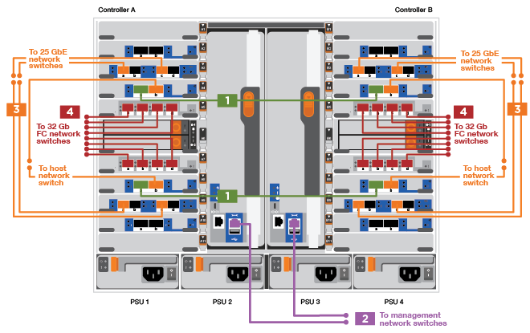
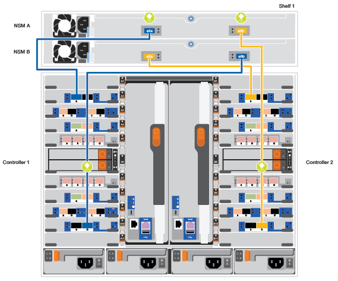
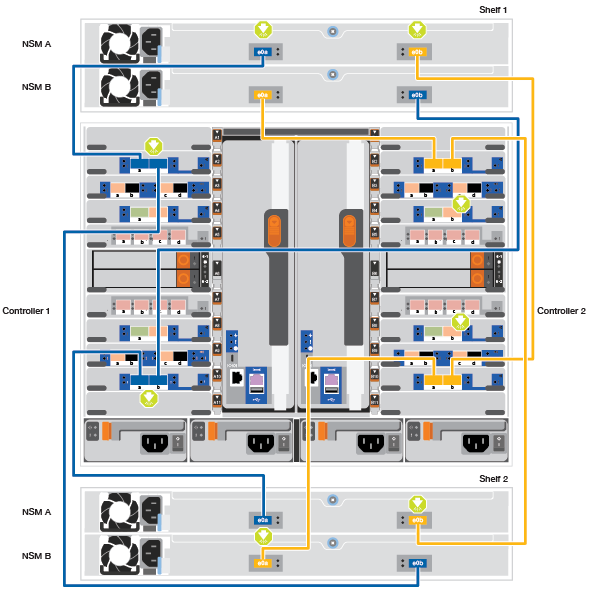
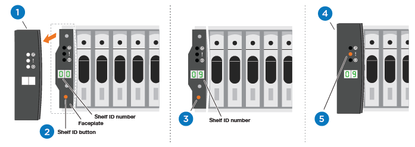
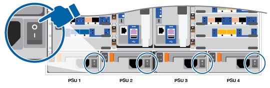

= 詳細な手順 - AFF 900
:allow-uri-read: 
:icons: font
:imagesdir: ../media/

[role="lead"]
この記事では、一般的なネットアップシステムのインストール手順について詳しく説明します。インストール手順の詳細については、この資料を参照してください。

== 手順 1 ：設置の準備

システムを設置するには、ネットアップサポートサイトでアカウントを作成し、システムを登録し、ライセンスキーを取得する必要があります。また、システムに応じた適切な数とタイプのケーブルを準備し、特定のネットワーク情報を収集する必要があります。

[role="lead"]
にアクセスできる必要があります https://hwu.netapp.com["NetApp Hardware Universe の略"^] サイト要件および構成済みシステム上の追加情報の詳細については、を参照してください。

へのアクセスも必要になる場合があります http://mysupport.netapp.com/documentation/productlibrary/index.html?productID=62286["ONTAP 9 リリースノート"^] ONTAP のバージョンに応じて、このシステムの詳細情報を確認してください。

お客様のサイトで次のものを準備する必要があります。

* ストレージシステム用のラックスペース
* No.2 プラスドライバ
* Web ブラウザを使用してシステムをネットワークスイッチおよびラップトップまたはコンソールに接続するための追加のネットワークケーブル

.手順
. すべての箱を開封して内容物を取り出します。
. コントローラのシステムシリアル番号をメモします。
+
image::../media/drw_ssn_label.png[DRW SSN ラベル]

. 同梱されていたケーブルの数と種類を確認し、書き留めておきます。
+
次の表に、同梱されているケーブルの種類を示します。この表にないケーブルが含まれていた場合は、 Hardware Universe を参照してケーブルを特定し、用途を確認してください。

+
https://hwu.netapp.com["NetApp Hardware Universe の略"^]

+
[cols="1,2,2,2"]
|===
| ケーブルのタイプ | パーツ番号と長さ | コネクタのタイプ | 用途 

 a| 
25GbE データケーブル
 a| 
X66240A-05 （ 112-00639 ）、 0.5m

X66240A-2 （ 112-00598 ）、 2m

X66240A-5 （ 112-00600 ）、 5m
| image:../media/oie_cable_sfp_gbe_copper.png[""]  a| 
ネットワークケーブル

 a| 
32Gb FC （ SFP+ 光）
 a| 
X66250-2 （ 112-00342 ）、 2m

X66250-5 （ 112-00344 ）、 5m

X66250-15 （ 112-00346 ）、 15m
 a| 
image:../media/oie_cable_sfp_gbe_copper.png[""]
 a| 
FC 光ネットワークケーブル

 a| 
40GbE ネットワークケーブル
 a| 
X66100-1 （ 112-00542 ）、 1m

X66100-3 (112-00543) 、 3m

X66100-5 （ 112-00544 ）、 5m
 a| 
image:../media/oie_cable100_gbe_qsfp28.png[""]
 a| 
イーサネットデータ、クラスタネットワーク

 a| 
100GbE ケーブル
 a| 
X66211B-1 （ 112-00573 ）、 1m

X66211B-2 （ 112-00574 ）、 2m

X66211B-5 （ 112-00576 ）、 5m
 a| 
image:../media/oie_cable100_gbe_qsfp28.png[""]
 a| 
ネットワーク、

NVMe ストレージ、

イーサネットデータ

クラスタネットワーク

 a| 
光ケーブル
 a| 
X66031A （ 112-00436 ）、 1m

X66032A （ 112-00437 ）、 2m

X66033A (112-00438) 、 3m
 a| 
image:../media/oie_cable_fiber_lc_connector.png[""]
 a| 
FC 光ネットワーク

 a| 
Cat 6 、 RJ-45 （注文内容による）
 a| 
パーツ番号 X6585-R6 （ 112-00291 ）、 3m

X6562-R6 （ 112-00196 ）、 5m
 a| 
image:../media/oie_cable_rj45.png[""]
 a| 
管理ネットワークとイーサネットデータ

 a| 
Micro-USB コンソールケーブル
 a| 
該当なし
 a| 
image:../media/oie_cable_micro_usb.png[""]
 a| 
Windows または Mac 以外のラップトップ / コンソールでソフトウェアをセットアップする際のコンソール接続

 a| 
電源ケーブル
 a| 
該当なし
 a| 
image:../media/oie_cable_power.png[""]
 a| 
システムの電源をオンにします

|===
. を確認します https://library.netapp.com/ecm/ecm_download_file/ECMLP2862613["『 ONTAP 構成ガイド』"^] およびそのガイドに記載されている必要な情報を収集します。

== 手順 2 ：ハードウェアを設置する

[role="lead"]
システムは、 4 ポストラックまたはネットアップシステムキャビネットのいずれかに設置する必要があります。

. 必要に応じてレールキットを取り付けます。
. レールキットに付属の手順書に従って、システムを設置して固定します。
+

NOTE: システムの重量に関連する安全上の注意事項を確認しておく必要があります。

+
image::../media/drw_9000_lifting_icon.png[DRW 9000 リフティングアイコン]

. ケーブルマネジメントデバイスを取り付けます（図を参照）。
+
image::../media/drw_9000_cable_management_arms.png[DRW 9000 ケーブル管理アーム]

. システムの前面にベゼルを配置します。

== 手順 3 ：コントローラをネットワークに接続する

[role="lead"]
2 ノードスイッチレスクラスタメソッドまたはクラスタインターコネクトネットワークを使用して、コントローラをネットワークにケーブル接続できます。

=== オプション 1 ： 2 ノードスイッチレスクラスタ

[role="lead"]
コントローラの管理ネットワークポート、データネットワークポート、および管理ポートは、スイッチに接続されます。クラスタインターコネクトポートは、両方のコントローラでケーブル接続されます。

システムとスイッチの接続に関する情報を、ネットワーク管理者に確認しておく必要があります。

ケーブルをポートに差し込む際は、ケーブルのプルタブの向きを確認してください。ケーブルのプルタブは、すべてのネットワーキングモジュールポートで上向きになっています。

image::../media/oie_cable_pull_tab_up.png[OIE ケーブルのプルタブを上にします]

NOTE: コネクタを挿入すると、カチッという音がしてコネクタが所定の位置に収まるはずです。音がしない場合は、コネクタを取り外し、回転させてからもう一度試してください。

. アニメーションや図を使用して、コントローラとスイッチをケーブルで接続します。
+
.アニメーション- 2ノードスイッチレスクラスタをケーブル接続
video::7a55b98a-e8b8-41d5-821f-ac5b0032ead0[panopto]
+

+
|===
| ステップ | 各コントローラでを実行します 

 a| 
image:../media/oie_legend_icon_1_lg.png[""]
 a| 
クラスタインターコネクトポートをケーブル接続します。

** スロット A4 および B4 （ e4A ）
** スロット A8 および B8 （ e8a ）

image:../media/oie_cable100_gbe_qsfp28.png[""]

 a| 
image:../media/oie_legend_icon_2_lp.png[""]
 a| 
コントローラ管理（レンチマーク）ポートをケーブル接続します。

image::../media/oie_cable_rj45.png[OIE ケーブル RJ45]

 a| 
image::../media/oie_legend_icon_3_o.png[OIE の凡例アイコン 3 o]
 a| 
25GbE ネットワークスイッチをケーブル接続します。

スロット A3 および B3 （ e3a および e3c ）およびスロット A9 および B9 （ e9a および e9c ）のポートは、 25GbE ネットワークスイッチに接続されます。

image::../media/oie_cable_sfp_gbe_copper.png[OIE ケーブル SFP GbE 銅線]

40GbE ホストネットワークスイッチ：

ホスト側の b ポートをスロット A4 と B4 （ e4b ）に接続し、スロット A8 と B8 （ e8b ）をホストスイッチに接続します。

image:../media/oie_cable100_gbe_qsfp28.png[""]

 a| 
image::../media/oie_legend_icon_4_dr.png[OIE の凡例アイコン 4 DR]
 a| 
32Gb FC 接続のケーブル接続：

スロット A5 および B5 （ 5a 、 5b 、 5c 、 5d ）およびスロット A7 および B7 （ 7a 、 7b 、 7c 、 7d ）のポートを 32 Gb FC ネットワークスイッチにケーブル接続します。

image:../media/oie_cable_sfp_gbe_copper.png[""]

|===
. ストレージをケーブル接続するには、を参照してください  4: Cable controllers to drive shelves。

=== オプション 2 ：スイッチクラスタ

[role="lead"]
コントローラの管理ネットワークポート、データネットワークポート、および管理ポートは、スイッチに接続されます。クラスタインターコネクト / HA ポートは、クラスタ / HA スイッチにケーブル接続されます。

システムとスイッチの接続に関する情報を、ネットワーク管理者に確認しておく必要があります。

ケーブルをポートに差し込む際は、ケーブルのプルタブの向きを確認してください。ケーブルのプルタブは、すべてのネットワーキングモジュールポートで上向きになっています。

image::../media/oie_cable_pull_tab_up.png[OIE ケーブルのプルタブを上にします]

NOTE: コネクタを挿入すると、カチッという音がしてコネクタが所定の位置に収まるはずです。音がしない場合は、コネクタを取り外し、回転させてからもう一度試してください。

. アニメーションや図を使用して、コントローラとスイッチをケーブルで接続します。
+
.アニメーション-スイッチクラスタをケーブル接続します
video::6381b3f1-4ce5-4805-bd0a-ac5b0032f51d[panopto]
+
image::../media/drw_a900_switched_network_cabling.png[DRW a900 スイッチドネットワークケーブル]

+
|===
| ステップ | 各コントローラでを実行します 

 a| 
image:../media/oie_legend_icon_1_lg.png[""]
 a| 
クラスタインターコネクト A ポートをケーブル接続します。

** スロット A4 と B4 （ e4A ）をクラスタネットワークスイッチに接続します。
** スロット A8 と B8 （ e8a ）をクラスタネットワークスイッチに接続します。

image:../media/oie_cable100_gbe_qsfp28.png[""]

 a| 
image::../media/oie_legend_icon_2_lp.png[OIE の凡例アイコン 2 LP]
 a| 
コントローラ管理（レンチマーク）ポートをケーブル接続します。

image::../media/oie_cable_rj45.png[OIE ケーブル RJ45]

 a| 
image::../media/oie_legend_icon_3_o.png[OIE の凡例アイコン 3 o]
 a| 
25GbE ネットワークスイッチをケーブル接続します。

スロット A3 および B3 （ e3a および e3c ）およびスロット A9 および B9 （ e9a および e9c ）のポートは、 25GbE ネットワークスイッチに接続されます。

image::../media/oie_cable_sfp_gbe_copper.png[OIE ケーブル SFP GbE 銅線]

40GbE ホストネットワークスイッチ：

ホスト側の b ポートをスロット A4 と B4 （ e4b ）に接続し、スロット A8 と B8 （ e8b ）をホストスイッチに接続します。

image:../media/oie_cable100_gbe_qsfp28.png[""]

 a| 
image::../media/oie_legend_icon_4_dr.png[OIE の凡例アイコン 4 DR]
 a| 
32Gb FC 接続のケーブル：

スロット A5 および B5 （ 5a 、 5b 、 5c 、 5d ）およびスロット A7 および B7 （ 7a 、 7b 、 7c 、 7d ）のポートを 32 Gb FC ネットワークスイッチにケーブル接続します。

image:../media/oie_cable_sfp_gbe_copper.png[""]

|===
. ストレージをケーブル接続するには、を参照してください  4: Cable controllers to drive shelves。

== 手順 4 ：コントローラをドライブシェルフにケーブル接続する

=== オプション 1 ： AFF A900 のコントローラを 1 台の NS224 ドライブシェルフにケーブル接続します

[role="lead"]
各コントローラを、 AFF A900 システムの NS224 ドライブシェルフの NSM モジュールにケーブル接続する必要があります。

.作業を開始する前に
* 図の矢印を見て、ケーブルコネクタのプルタブの正しい向きを確認してください。ストレージモジュールのケーブルのプルタブは上向き、シェルフのプルタブは下向きです。
+
image::../media/oie_cable_pull_tab_up.png[OIE ケーブルのプルタブを上にします]

+
image::../media/oie_cable_pull_tab_down.png[OIE ケーブルのプルタブを下に引きます]

+

NOTE: コネクタを挿入すると、カチッという音がしてコネクタが所定の位置に収まるはずです。音がしない場合は、コネクタを取り外し、回転させてからもう一度試してください。

+
.. 次のアニメーションや図に従って、 1 台の NS224 ドライブシェルフにコントローラをケーブル接続します。
+
.アニメーション- 1台のNS224シェルフにケーブルを接続します
video::6520eb01-87b3-4520-9109-ac5b0032ea4e[panopto]
+

+
|===
| ステップ | 各コントローラでを実行します 

 a| 
image:../media/oie_legend_icon_1_mb.png[""]
 a| 
** コントローラ A のポート e2a を、シェルフの NSM A のポート e0a に接続します。
** コントローラ A のポート e10b をシェルフの NSM B のポート e0b に接続します。

image:../media/oie_cable100_gbe_qsfp28.png[""]

100GbE ケーブル

 a| 
image:../media/oie_legend_icon_2_lo.png[""]
 a| 
** コントローラ B のポート e2a を、シェルフの NSM B のポート e0a に接続します。
** コントローラ B のポート e10b をシェルフの NSM A のポート e0b に接続します。

image:../media/oie_cable100_gbe_qsfp28.png[""]

100GbE ケーブル

|===
+
.. システムのセットアップを完了するには、を参照してください  5: Complete system setup and configuration。

=== オプション 2 ： AFF A900 の 2 台の NS224 ドライブシェルフにコントローラをケーブル接続します

[role="lead"]
各コントローラを、 NS224 ドライブシェルフの NSM モジュールにケーブル接続する必要があります。

.作業を開始する前に
* 図の矢印を見て、ケーブルコネクタのプルタブの正しい向きを確認してください。ストレージモジュールのケーブルのプルタブは上向き、シェルフのプルタブは下向きです。
+
image::../media/oie_cable_pull_tab_up.png[OIE ケーブルのプルタブを上にします]

image::../media/oie_cable_pull_tab_down.png[OIE ケーブルのプルタブを下に引きます]

NOTE: コネクタを挿入すると、カチッという音がしてコネクタが所定の位置に収まるはずです。音がしない場合は、コネクタを取り外し、回転させてからもう一度試してください。

. 次のアニメーションや図を使用して、 2 台の NS224 ドライブシェルフにコントローラをケーブル接続します。
+
.アニメーション- 2台のNS224シェルフをケーブル接続します
video::34098e39-73ad-45de-9af7-ac5b0032ea9a[panopto]
+
image:../media/drw_a900_NS224_line_art_two shelf_cabling.png[""]

+

+
|===
| ステップ | 各コントローラでを実行します 

 a| 
image:../media/oie_legend_icon_1_mb.png[""]
 a| 
** コントローラ A のポート e2a を、シェルフ 1 の NSM A に接続します。
** コントローラ A のポート e10b をシェルフ 1 の NSM B e0b に接続します。
** コントローラ A のポート e2b をシェルフ 2 の NSM B e0b に接続します。
** コントローラ A のポート e10a をシェルフ 2 の NSM A の e0a に接続します。
+
image:../media/oie_cable100_gbe_qsfp28.png[""]

100GbE ケーブル

 a| 
image:../media/oie_legend_icon_2_lo.png[""]
 a| 
** コントローラ B のポート e2a を、シェルフ 1 の NSM B e0a に接続します。
** コントローラ B のポート e10b をシェルフ 1 の NSM A e0b に接続します。
** コントローラ B のポート e2b をシェルフ 2 の NSM A e0b に接続します。
** コントローラ B のポート e10A をシェルフ 2 の NSM B e0a に接続します。

image:../media/oie_cable100_gbe_qsfp28.png[""]

100GbE ケーブル

|===
. システムのセットアップを完了するには、を参照してください  5: Complete system setup and configuration。

== 手順 5 ：システムのセットアップと設定を完了する

[role="lead"]
システムのセットアップと設定を実行するには、スイッチとラップトップのみを接続してクラスタ検出を使用するか、システムのコントローラに直接接続してから管理スイッチに接続します。

=== オプション 1 ：ネットワーク検出が有効になっている場合

[role="lead"]
ラップトップでネットワーク検出が有効になっている場合は、クラスタの自動検出を使用してシステムのセットアップと設定を実行できます。

. 次のアニメーションまたは図を使用して、 1 つ以上のドライブシェルフ ID を設定します。
+
NS224 シェルフ ID は 00 および 01 に事前に設定されています。シェルフ ID を変更する場合は、ボタンが配置されている穴に差し込む工具が必要です。

+
.アニメーション- SASまたはNVMeドライブシェルフIDを設定します
video::95a29da1-faa3-4ceb-8a0b-ac7600675aa6[panopto]
+

+
[cols="25h,~"]
|===

 a| 
image:../media/legend_icon_01.png[""]
 a| 
エンドキャップを取り外す。

 a| 
image:../media/legend_icon_02.png[""]
 a| 
1 桁目の数字が点滅するまでシェルフ ID ボタンを押し続けたら、 0~9 に進みます。

メモ： 1 桁目の数字は点滅したままです

 a| 
image:../media/legend_icon_03.png[""]
 a| 
2 桁目の数字が点滅するまでシェルフ ID ボタンを押し続けたら、 0~9 に進みます。メモ： 1 桁目の数字の点滅は止まり、 2 桁目の数字は点滅し続けます。

 a| 
image:../media/legend_icon_04.png[""]
 a| 
エンドキャップを取り付けます。

 a| 
image:../media/legend_icon_05.png[""]
 a| 
オレンジの LED が点灯するまで 10 秒間待ちます (!) 。 表示されるようにするには、ドライブシェルフの電源を再投入してシェルフ ID を設定します。

|===
. 電源コードをコントローラの電源装置に接続し、さらに別の回路の電源に接続します。
. 両方のノードの電源スイッチをオンにします。
+
.アニメーション-コントローラの電源をオンにします
video::a905e56e-c995-4704-9673-adfa0005a891[panopto]
+

+

NOTE: 初回のブートには最大 8 分かかる場合があります。

. ラップトップでネットワーク検出が有効になっていることを確認します。
+
詳細については、ラップトップのオンラインヘルプを参照してください。

. 次のアニメーションに従って、ラップトップを管理スイッチに接続します。
+
.アニメーション-ラップトップを管理スイッチに接続します
video::d61f983e-f911-4b76-8b3a-ab1b0066909b[panopto]
+
image::../media/dwr_laptop_to_switch_only.png[DWR ラップトップをスイッチのみに接続します]

. 検出する ONTAP アイコンを選択します。
+
image::../media/drw_autodiscovery_controler_select.png[DRW 自動検出コントローラ選択]

+
.. エクスプローラを開きます。
.. 左側のペインで、 [Network] ( ネットワーク ) をクリックします。
.. 右クリックして、更新を選択します。
.. いずれかの ONTAP アイコンをダブルクリックし、画面に表示された証明書を受け入れます。
+

NOTE: 「 XXXXX 」は、ターゲットノードのシステムシリアル番号です。

+
System Manager が開きます。

. System Manager のセットアップガイドを使用して、で収集したデータを基にシステムを設定します https://library.netapp.com/ecm/ecm_download_file/ECMLP2862613["『 ONTAP 構成ガイド』"^]。
. アカウントを設定して Active IQ Config Advisor をダウンロードします。
+
.. 既存のアカウントにログインするか、アカウントを作成します。
+
https://mysupport.netapp.com/eservice/public/now.do["ネットアップサポート登録"^]

.. システムを登録します。
+
https://mysupport.netapp.com/eservice/registerSNoAction.do?moduleName=RegisterMyProduct["ネットアップ製品登録"^]

.. Active IQ Config Advisor をダウンロードします。
+
https://mysupport.netapp.com/site/tools/tool-eula/activeiq-configadvisor["ネットアップのダウンロード： Config Advisor"^]

. Config Advisor を実行してシステムの健全性を確認します。
. 初期設定が完了したら、に進みます https://www.netapp.com/data-management/oncommand-system-documentation/["ONTAP  ONTAP システムマネージャのマニュアルリソース"^] ONTAP での追加機能の設定については、ページを参照してください。

=== オプション 2 ：ネットワーク検出が有効になっていない場合

[role="lead"]
Windows または Mac ベースのラップトップやコンソールを使用していない場合、または自動検出が有効になっていない場合は、このタスクで設定とセットアップを実行する必要があります。

. ラップトップまたはコンソールをケーブル接続して設定します。
+
.. ラップトップまたはコンソールのコンソールポートを、 115 、 200 ボー、 N-8-1 に設定します。
+

NOTE: コンソールポートの設定方法については、ラップトップまたはコンソールのオンラインヘルプを参照してください。

.. システム付属のコンソールケーブルを使用してラップトップまたはコンソールにコンソールケーブルを接続し、ラップトップを管理サブネット上の管理スイッチに接続します。
+
image::../media/drw_9000_cable_console_switch_controller.png[DRW 9000 ケーブルコンソールスイッチコントローラ]

.. 管理サブネット上の TCP / IP アドレスをラップトップまたはコンソールに割り当てます。

. 次のアニメーションに従って、 1 つ以上のドライブシェルフ ID を設定します。
+
NS224 シェルフ ID は 00 および 01 に事前に設定されています。シェルフ ID を変更する場合は、ボタンが配置されている穴に差し込む工具が必要です。

+
.アニメーション- SASまたはNVMeドライブシェルフIDを設定します
video::95a29da1-faa3-4ceb-8a0b-ac7600675aa6[panopto]
+

+
[cols="25h,~"]
|===

 a| 
image:../media/legend_icon_01.png[""]
 a| 
エンドキャップを取り外す。

 a| 
image:../media/legend_icon_02.png[""]
 a| 
1 桁目の数字が点滅するまでシェルフ ID ボタンを押し続けたら、 0~9 に進みます。

メモ： 1 桁目の数字は点滅したままです

 a| 
image:../media/legend_icon_03.png[""]
 a| 
2 桁目の数字が点滅するまでシェルフ ID ボタンを押し続けたら、 0~9 に進みます。メモ： 1 桁目の数字の点滅は止まり、 2 桁目の数字は点滅し続けます。

 a| 
image:../media/legend_icon_04.png[""]
 a| 
エンドキャップを取り付けます。

 a| 
image:../media/legend_icon_05.png[""]
 a| 
オレンジの LED が点灯するまで 10 秒間待ちます (!) 。 表示されるようにするには、ドライブシェルフの電源を再投入してシェルフ ID を設定します。

|===
. 電源コードをコントローラの電源装置に接続し、さらに別の回路の電源に接続します。
. 両方のノードの電源スイッチをオンにします。
+
.アニメーション-コントローラの電源をオンにします
video::bb04eb23-aa0c-4821-a87d-ab2300477f8b[panopto]

NOTE: 初回のブートには最大 8 分かかる場合があります。

. いずれかのノードに初期ノード管理 IP アドレスを割り当てます。
+
|===

| 管理ネットワークでの DHCP の状況 | 作業 

 a| 
を設定します
 a| 
新しいコントローラに割り当てられた IP アドレスを記録します。

 a| 
未設定
 a| 
.. PuTTY 、ターミナルサーバ、または環境に対応した同等の機能を使用して、コンソールセッションを開きます。
+

NOTE: PuTTY の設定方法がわからない場合は、ラップトップまたはコンソールのオンラインヘルプを確認してください。

.. スクリプトからプロンプトが表示されたら、管理 IP アドレスを入力します。

|===
. ラップトップまたはコンソールで、 System Manager を使用してクラスタを設定します。
+
.. ブラウザでノード管理 IP アドレスを指定します。
+

NOTE: アドレスの形式は、 +https://x.x.x.x+ です。

.. NetApp ONTAP 構成ガイドで収集したデータを基にシステムを設定します。
+
https://library.netapp.com/ecm/ecm_download_file/ECMLP2862613["『 ONTAP 構成ガイド』"^]

. アカウントを設定して Active IQ Config Advisor をダウンロードします。
+
.. 既存のアカウントにログインするか、アカウントを作成します。
+
https://mysupport.netapp.com/eservice/public/now.do["ネットアップサポート登録"^]

.. システムを登録します。
+
https://mysupport.netapp.com/eservice/registerSNoAction.do?moduleName=RegisterMyProduct["ネットアップ製品登録"^]

.. Active IQ Config Advisor をダウンロードします。
+
https://mysupport.netapp.com/site/tools/tool-eula/activeiq-configadvisor["ネットアップのダウンロード： Config Advisor"^]

. Config Advisor を実行してシステムの健全性を確認します。
. 初期設定が完了したら、に進みます https://www.netapp.com/data-management/oncommand-system-documentation/["ONTAP  ONTAP システムマネージャのマニュアルリソース"^] ONTAP での追加機能の設定については、ページを参照してください。

