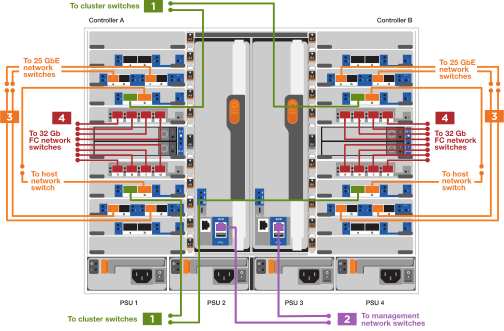

= 詳細な手順 - AFF 900
:allow-uri-read: 
:icons: font
:imagesdir: ../media/

[role="lead"]
この記事では、一般的なネットアップシステムのインストール手順について詳しく説明します。インストール手順の詳細については、この資料を参照してください。

== 手順 1 ：設置の準備

システムを設置するには、ネットアップサポートサイトでアカウントを作成し、システムを登録し、ライセンスキーを取得する必要があります。また、システムに応じた適切な数とタイプのケーブルを準備し、特定のネットワーク情報を収集する必要があります。

にアクセスできる必要があります https://["NetApp Hardware Universe の略"^] サイト要件および構成済みシステム上の追加情報の詳細については、を参照してください。

.必要なもの
へのアクセスも必要になる場合があります http://["ONTAP 9 リリースノート"^] ONTAP のバージョンに応じて、このシステムの詳細情報を確認してください。

お客様のサイトで次のものを準備する必要があります。

* ストレージシステム用のラックスペース
* No.2 プラスドライバ
* Web ブラウザを使用してシステムをネットワークスイッチおよびラップトップまたはコンソールに接続するための追加のネットワークケーブル

.手順
. すべての箱を開封して内容物を取り出します。
. コントローラのシステムシリアル番号をメモします。
+
image::../media/drw_ssn_label.svg[DRW SSN ラベル]

. 同梱されていたケーブルの数と種類を確認し、書き留めておきます。
+
次の表に、同梱されているケーブルの種類を示します。この表にないケーブルが含まれていた場合は、 Hardware Universe を参照してケーブルを特定し、用途を確認してください。

+
https://["NetApp Hardware Universe の略"^]

+
[cols="1,2,2,2"]
|===
| ケーブルのタイプ | パーツ番号と長さ | コネクタのタイプ | 用途 

 a| 
25GbE データケーブル
 a| 
X66240A-05 （ 112-00639 ）、 0.5m

X66240A-2 （ 112-00598 ）、 2m

X66240A-5 （ 112-00600 ）、 5m
 a| 
image::../media/oie_cable_sfp_gbe_copper.svg[OIE ケーブル SFP GbE 銅線]
 a| 
ネットワークケーブル

 a| 
32Gb FC （ SFP+ 光）
 a| 
X66250-2 （ 112-00342 ）、 2m

X66250-5 （ 112-00344 ）、 5m

X66250-15 （ 112-00346 ）、 15m
 a| 
image::../media/oie_cable_sfp_gbe_copper.svg[OIE ケーブル SFP GbE 銅線]
 a| 
FC 光ネットワークケーブル

 a| 
40GbE ネットワークケーブル
 a| 
X66100-1 （ 112-00542 ）、 1m

X66100-3 (112-00543) 、 3m

X66100-5 （ 112-00544 ）、 5m
 a| 
image::../media/oie_cable100_gbe_qsfp28.svg[OIEケーブル100 GbE qsfp28]
 a| 
イーサネットデータ、クラスタネットワーク

 a| 
100GbE ケーブル
 a| 
X66211B-1 （ 112-00573 ）、 1m

X66211B-2 （ 112-00574 ）、 2m

X66211B-5 （ 112-00576 ）、 5m
 a| 
image::../media/oie_cable100_gbe_qsfp28.svg[OIEケーブル100 GbE qsfp28]
 a| 
ネットワーク、

NVMe ストレージ、

イーサネットデータ

クラスタネットワーク

 a| 
光ケーブル
 a| 
X66031A （ 112-00436 ）、 1m

X66032A （ 112-00437 ）、 2m

X66033A (112-00438) 、 3m
 a| 
image::../media/oie_cable_fiber_lc_connector.svg[OIE ケーブルファイバ LC コネクタ]
 a| 
FC 光ネットワーク

 a| 
Cat 6 、 RJ-45 （注文内容による）
 a| 
パーツ番号 X6585-R6 （ 112-00291 ）、 3m

X6562-R6 （ 112-00196 ）、 5m
 a| 
image::../media/oie_cable_rj45.svg[OIE ケーブル RJ45]
 a| 
管理ネットワークとイーサネットデータ

 a| 
Micro-USB コンソールケーブル
 a| 
該当なし
 a| 
image::../media/oie_cable_micro_usb.svg[OIEケーブルマイクロUSB]
 a| 
Windows または Mac 以外のラップトップ / コンソールでソフトウェアをセットアップする際のコンソール接続

 a| 
電源ケーブル
 a| 
該当なし
 a| 
image::../media/oie_cable_power.svg[OIEケーブル電源]
 a| 
システムの電源をオンにします

|===
. を確認します https://["『 ONTAP 構成ガイド』"^] およびそのガイドに記載されている必要な情報を収集します。

== 手順 2 ：ハードウェアを設置する

システムは、 4 ポストラックまたはネットアップシステムキャビネットのいずれかに設置する必要があります。

. 必要に応じてレールキットを取り付けます。
. レールキットに付属の手順書に従って、システムを設置して固定します。
+

NOTE: システムの重量に関連する安全上の注意事項を確認しておく必要があります。

+
image::../media/drw_9500_lifting_icon.svg[DRW 9500リフティングアイコン]

. ケーブルマネジメントデバイスを取り付けます（図を参照）。
+
image::../media/drw_9500_cable_management_arms.svg[DRW 9500ケーブルマネジメントアーム]

. システムの前面にベゼルを配置します。

次の図は、一般的なシステムの外観と、システムの背面にある主なコンポーネントを示しています。

image::../media/drw_a900_controller_in _chassis_ID_IEOPS-856.svg[シャーシID IEOPS 856のDRW a900コントローラ]

== 手順 3 ：コントローラをネットワークに接続する

2 ノードスイッチレスクラスタメソッドまたはクラスタインターコネクトネットワークを使用して、コントローラをネットワークにケーブル接続できます。

[role="tabbed-block"]
====
.オプション 1 ： 2 ノードスイッチレスクラスタ
--
コントローラの管理ネットワークポート、データネットワークポート、および管理ポートは、スイッチに接続されます。クラスタインターコネクトポートは、両方のコントローラでケーブル接続されます。

.作業を開始する前に
システムとスイッチの接続に関する情報を、ネットワーク管理者に確認しておく必要があります。

ケーブルをポートに差し込む際は、ケーブルのプルタブの向きを確認してください。ケーブルのプルタブは、すべてのネットワーキングモジュールポートで上向きになっています。

image::../media/oie_cable_pull_tab_up.svg[OIE ケーブルのプルタブを上にします]

NOTE: コネクタを挿入すると、カチッという音がしてコネクタが所定の位置に収まるはずです。音がしない場合は、コネクタを取り外し、回転させてからもう一度試してください。

. アニメーションや図を使用して、コントローラとスイッチをケーブルで接続します。
+
.アニメーション- 2ノードスイッチレスクラスタをケーブル接続
video::37419c37-f56f-48e5-8e6c-afa600095444[panopto]
+
image::../media/drw_a900_tnsc_network_cabling_IEOPS-933.svg[DRW a900 TNSCネットワークケーブルIEOPS 933]

+
|===
| ステップ | 各コントローラでを実行します 

 a| 
image::../media/oie_legend_icon_1_lg.svg[OIEの凡例アイコン1LG]
 a| 
クラスタインターコネクトポートをケーブル接続します。

** スロット A4 および B4 （ e4A ）
** スロット A8 および B8 （ e8a ）

image::../media/oie_cable100_gbe_qsfp28.svg[OIEケーブル100 GbE qsfp28]

 a| 
image::../media/oie_legend_icon_2_lp.svg[OIE の凡例アイコン 2 LP]
 a| 
コントローラ管理（レンチマーク）ポートをケーブル接続します。

image::../media/oie_cable_rj45.svg[OIE ケーブル RJ45]

 a| 
image::../media/oie_legend_icon_3_o.svg[OIE の凡例アイコン 3 o]
 a| 
25GbE ネットワークスイッチをケーブル接続します。

スロット A3 および B3 （ e3a および e3c ）およびスロット A9 および B9 （ e9a および e9c ）のポートは、 25GbE ネットワークスイッチに接続されます。

image::../media/oie_cable_sfp_gbe_copper.svg[OIE ケーブル SFP GbE 銅線]

40GbE ホストネットワークスイッチ：

ホスト側の b ポートをスロット A4 と B4 （ e4b ）に接続し、スロット A8 と B8 （ e8b ）をホストスイッチに接続します。

image::../media/oie_cable100_gbe_qsfp28.svg[OIEケーブル100 GbE qsfp28]

 a| 

 a| 
32Gb FC 接続のケーブル接続：

スロット A5 および B5 （ 5a 、 5b 、 5c 、 5d ）およびスロット A7 および B7 （ 7a 、 7b 、 7c 、 7d ）のポートを 32 Gb FC ネットワークスイッチにケーブル接続します。

image::../media/oie_cable_sfp_gbe_copper.svg[OIE ケーブル SFP GbE 銅線]

 a| 
** ケーブルをケーブルマネジメントアームにストラップで固定します（図はなし）。
** 電源ケーブルをPSUに接続し、別の電源に接続します（図では省略）。PSU 1と3はA側のすべてのコンポーネントに電力を供給し、PSU 2とPSU 4はB側のすべてのコンポーネントに電力を供給します。

 a| 
image::../media/oie_cable_power.svg[OIEケーブル電源]

image::../media/drw_a900fas9500_power_source_icon_IEOPS-1142.svg[DRW a900fas9500電源アイコンIEOPS 1142]

|===

--
.オプション 2 ：スイッチクラスタ
--
コントローラの管理ネットワークポート、データネットワークポート、および管理ポートは、スイッチに接続されます。クラスタインターコネクト / HA ポートは、クラスタ / HA スイッチにケーブル接続されます。

.作業を開始する前に
システムとスイッチの接続に関する情報を、ネットワーク管理者に確認しておく必要があります。

ケーブルをポートに差し込む際は、ケーブルのプルタブの向きを確認してください。ケーブルのプルタブは、すべてのネットワーキングモジュールポートで上向きになっています。

image::../media/oie_cable_pull_tab_up.svg[OIE ケーブルのプルタブを上にします]

NOTE: コネクタを挿入すると、カチッという音がしてコネクタが所定の位置に収まるはずです。カチッと音がしない場合は、コネクタを取り外し、裏返してもう一度試してください。

. アニメーションや図を使用して、コントローラとスイッチをケーブルで接続します。
+
.アニメーション-スイッチクラスタをケーブル接続します
video::61ec11ec-aa30-474a-87a5-afa60008b52b[panopto]
+

+
|===
| ステップ | 各コントローラでを実行します 

 a| 
image::../media/oie_legend_icon_1_lg.svg[OIEの凡例アイコン1LG]
 a| 
クラスタインターコネクト A ポートをケーブル接続します。

** スロット A4 と B4 （ e4A ）をクラスタネットワークスイッチに接続します。
** スロット A8 と B8 （ e8a ）をクラスタネットワークスイッチに接続します。

image::../media/oie_cable100_gbe_qsfp28.svg[OIEケーブル100 GbE qsfp28]

 a| 
image::../media/oie_legend_icon_2_lp.svg[OIE の凡例アイコン 2 LP]
 a| 
コントローラ管理（レンチマーク）ポートをケーブル接続します。

image::../media/oie_cable_rj45.svg[OIE ケーブル RJ45]

 a| 
image::../media/oie_legend_icon_3_o.svg[OIE の凡例アイコン 3 o]
 a| 
25GbE ネットワークスイッチをケーブル接続します。

スロット A3 および B3 （ e3a および e3c ）およびスロット A9 および B9 （ e9a および e9c ）のポートは、 25GbE ネットワークスイッチに接続されます。

image::../media/oie_cable_sfp_gbe_copper.svg[OIE ケーブル SFP GbE 銅線]

40GbE ホストネットワークスイッチ：

ホスト側の b ポートをスロット A4 と B4 （ e4b ）に接続し、スロット A8 と B8 （ e8b ）をホストスイッチに接続します。

image::../media/oie_cable100_gbe_qsfp28.svg[OIEケーブル100 GbE qsfp28]

 a| 

 a| 
32Gb FC 接続のケーブル接続：

スロット A5 および B5 （ 5a 、 5b 、 5c 、 5d ）およびスロット A7 および B7 （ 7a 、 7b 、 7c 、 7d ）のポートを 32 Gb FC ネットワークスイッチにケーブル接続します。

image::../media/oie_cable_sfp_gbe_copper.svg[OIE ケーブル SFP GbE 銅線]

 a| 
** ケーブルをケーブルマネジメントアームにストラップで固定します（図はなし）。
** 電源ケーブルをPSUに接続し、別の電源に接続します（図では省略）。PSU 1と3はA側のすべてのコンポーネントに電力を供給し、PSU 2とPSU 4はB側のすべてのコンポーネントに電力を供給します。

 a| 
image::../media/oie_cable_power.svg[OIEケーブル電源]

image::../media/drw_a900fas9500_power_source_icon_IEOPS-1142.svg[DRW a900fas9500電源アイコンIEOPS 1142]

|===

--
====

== 手順 4 ：コントローラをドライブシェルフにケーブル接続する

1台のNS224ドライブシェルフまたは2台のNS224ドライブシェルフをコントローラにケーブル接続します。

[role="tabbed-block"]
====
.オプション1：コントローラを1台のNS224ドライブシェルフにケーブル接続します
--
各コントローラを、 AFF A900 システムの NS224 ドライブシェルフの NSM モジュールにケーブル接続する必要があります。

.作業を開始する前に
* 図の矢印を見て、ケーブルコネクタのプルタブの正しい向きを確認してください。ストレージモジュールのケーブルのプルタブは上向き、シェルフのプルタブは下向きです。

image::../media/oie_cable_pull_tab_up.svg[OIE ケーブルのプルタブを上にします]

image::../media/oie_cable_pull_tab_down.svg[OIE ケーブルのプルタブを下に引きます]

NOTE: コネクタを挿入すると、カチッという音がしてコネクタが所定の位置に収まるはずです。音がしない場合は、コネクタを取り外し、回転させてからもう一度試してください。

. 次のアニメーションや図に従って、 1 台の NS224 ドライブシェルフにコントローラをケーブル接続します。
+
.アニメーション- 1台のNS224シェルフにケーブルを接続します
video::8d8b45cd-bd8f-4fab-a4fa-afa5017e7b72[panopto]
+
image::../media/drw_a900_NS224_one shelf_cabling_IEOPS-937.svg[DRW a900 NS224シェルフ間のケーブル接続IEOPS 937]

+
|===
| ステップ | 各コントローラでを実行します 

 a| 
image::../media/oie_legend_icon_1_mb.svg[OIEの凡例アイコン1 MB]
 a| 
** コントローラ A のポート e2a を、シェルフの NSM A のポート e0a に接続します。
** コントローラ A のポート e10b をシェルフの NSM B のポート e0b に接続します。

image::../media/oie_cable100_gbe_qsfp28.svg[OIEケーブル100 GbE qsfp28]

100GbE ケーブル

 a| 

 a| 
** コントローラ B のポート e2a を、シェルフの NSM B のポート e0a に接続します。
** コントローラ B のポート e10b をシェルフの NSM A のポート e0b に接続します。

image::../media/oie_cable100_gbe_qsfp28.svg[OIEケーブル100 GbE qsfp28]

100GbE ケーブル

|===

--
.オプション2：コントローラを2台のNS224ドライブシェルフにケーブル接続します
--
各コントローラを、 NS224 ドライブシェルフの NSM モジュールにケーブル接続する必要があります。

.作業を開始する前に
* 図の矢印を見て、ケーブルコネクタのプルタブの正しい向きを確認してください。ストレージモジュールのケーブルのプルタブは上向き、シェルフのプルタブは下向きです。

image::../media/oie_cable_pull_tab_up.svg[OIE ケーブルのプルタブを上にします]

image::../media/oie_cable_pull_tab_down.svg[OIE ケーブルのプルタブを下に引きます]

NOTE: コネクタを挿入すると、カチッという音がしてコネクタが所定の位置に収まるはずです。音がしない場合は、コネクタを取り外し、回転させてからもう一度試してください。

. 次のアニメーションや図を使用して、 2 台の NS224 ドライブシェルフにコントローラをケーブル接続します。
+
.アニメーション- 2台のNS224シェルフをケーブル接続します
video::ec143c32-9e4b-47e5-893e-afa5017da6b4[panopto]
+
image::../media/drw_a900_NS224_line_art_two shelf_cabling_IEOPS-1147.svg[DRW a900 NS224ラインART 2シェルフケーブルIEOPS 1147]

+
image::../media/drw_a900_NS224_two_shelf_cabling_IEOPS-938.svg[DRW a900 NS224 2シェルフのケーブル接続IEOPS 938]

+
|===
| ステップ | 各コントローラでを実行します 

 a| 
image::../media/oie_legend_icon_1_mb.svg[OIEの凡例アイコン1 MB]
 a| 
** コントローラ A のポート e2a を、シェルフ 1 の NSM A に接続します。
** コントローラ A のポート e10b をシェルフ 1 の NSM B e0b に接続します。
** コントローラ A のポート e2b をシェルフ 2 の NSM B e0b に接続します。
** コントローラ A のポート e10a をシェルフ 2 の NSM A の e0a に接続します。

image::../media/oie_cable100_gbe_qsfp28.svg[OIEケーブル100 GbE qsfp28]

100GbE ケーブル

 a| 

 a| 
** コントローラ B のポート e2a を、シェルフ 1 の NSM B e0a に接続します。
** コントローラ B のポート e10b をシェルフ 1 の NSM A e0b に接続します。
** コントローラ B のポート e2b をシェルフ 2 の NSM A e0b に接続します。
** コントローラ B のポート e10A をシェルフ 2 の NSM B e0a に接続します。

image::../media/oie_cable100_gbe_qsfp28.svg[OIEケーブル100 GbE qsfp28]

100GbE ケーブル

|===

--
====

== 手順 5 ：システムのセットアップと設定を完了する

システムのセットアップと設定を実行するには、スイッチとラップトップのみを接続してクラスタ検出を使用するか、システムのコントローラに直接接続してから管理スイッチに接続します。

[role="tabbed-block"]
====
.オプション 1 ：ネットワーク検出が有効になっている場合
--
ラップトップでネットワーク検出が有効になっている場合は、クラスタの自動検出を使用してシステムのセットアップと設定を実行できます。

. 次のアニメーションまたは図を使用して、 1 つ以上のドライブシェルフ ID を設定します。
+
NS224 シェルフ ID は 00 および 01 に事前に設定されています。シェルフ ID を変更する場合は、ボタンが配置されている穴に差し込む工具が必要です。を参照してください https://["シェルフ ID - NS224 シェルフを変更します"] 詳しい手順については、を参照して

+
.アニメーション- NVMeドライブシェルフIDを設定します
video::95a29da1-faa3-4ceb-8a0b-ac7600675aa6[panopto]
+
image::../media/drw_a900_oie_change_ns224_shelf ID_IEOPS-836.svg[DRW a900 OIEでは'ns224シェルフID IEOPS 836が変更されます]

+
[cols="20%,80%"]
|===

 a| 
image::../media/legend_icon_01.svg[凡例アイコン 01]
 a| 
シェルフのエンドキャップ

 a| 
image::../media/legend_icon_02.svg[凡例アイコン 02]
 a| 
シェルフ前面プレート

 a| 
image::../media/legend_icon_03.svg[凡例アイコン 03]
 a| 
シェルフID LED

 a| 
image::../media/legend_icon_04.svg[凡例アイコン04]
 a| 
シェルフID設定ボタン

|===
. 両方のノードの電源装置の電源スイッチをオンにします。
+
.アニメーション-コントローラの電源をオンにします
video::a905e56e-c995-4704-9673-adfa0005a891[panopto]
+
image::../media/drw_a900_power-on_IEOPS-941.svg[IEOPS 941のDRW a900電源]

+

NOTE: 初回のブートには最大 8 分かかる場合があります。

. ラップトップでネットワーク検出が有効になっていることを確認します。
+
詳細については、ラップトップのオンラインヘルプを参照してください。

. 次のアニメーションに従って、ラップトップを管理スイッチに接続します。
+
.アニメーション-ラップトップを管理スイッチに接続します
video::d61f983e-f911-4b76-8b3a-ab1b0066909b[panopto]
+
image::../media/dwr_laptop_to_switch_only.svg[DWR ラップトップをスイッチのみに接続します]

. 検出する ONTAP アイコンを選択します。
+
image::../media/drw_autodiscovery_controler_select.svg[DRW 自動検出コントローラ選択]

+
.. エクスプローラを開きます。
.. 左側のペインで、 [Network] ( ネットワーク ) をクリックします。
.. 右クリックして、更新を選択します。
.. いずれかの ONTAP アイコンをダブルクリックし、画面に表示された証明書を受け入れます。
+

NOTE: 「 XXXXX 」は、ターゲットノードのシステムシリアル番号です。

+
System Manager が開きます。

. System Manager のセットアップガイドを使用して、で収集したデータを基にシステムを設定します https://["『 ONTAP 構成ガイド』"^]。
. アカウントを設定して Active IQ Config Advisor をダウンロードします。
+
.. 既存のアカウントにログインするか、アカウントを作成します。
+
https://["ネットアップサポート登録"^]

.. システムを登録します。
+
https://["ネットアップ製品登録"^]

.. Active IQ Config Advisor をダウンロードします。
+
https://["ネットアップのダウンロード： Config Advisor"^]

. Config Advisor を実行してシステムの健全性を確認します。
. 初期設定が完了したら、に進みます https://["ONTAP  ONTAP システムマネージャのマニュアルリソース"^] ONTAP での追加機能の設定については、ページを参照してください。

--
.オプション 2 ：ネットワーク検出が有効になっていない場合
--
Windows または Mac ベースのラップトップやコンソールを使用していない場合、または自動検出が有効になっていない場合は、このタスクで設定とセットアップを実行する必要があります。

. ラップトップまたはコンソールをケーブル接続して設定します。
+
.. ラップトップまたはコンソールのコンソールポートを、 115 、 200 ボー、 N-8-1 に設定します。
+

NOTE: コンソールポートの設定方法については、ラップトップまたはコンソールのオンラインヘルプを参照してください。

.. システム付属のコンソールケーブルを使用してラップトップまたはコンソールにコンソールケーブルを接続し、ラップトップを管理サブネット上の管理スイッチに接続します。
+
image::../media/drw_A900_cable_console_switch_controller_IEOPS-953.svg[DRW A900ケーブルコンソールスイッチコントローラIEOPS 953]

.. 管理サブネット上の TCP / IP アドレスをラップトップまたはコンソールに割り当てます。

. 次のアニメーションに従って、 1 つ以上のドライブシェルフ ID を設定します。
+
NS224 シェルフ ID は 00 および 01 に事前に設定されています。シェルフ ID を変更する場合は、ボタンが配置されている穴に差し込む工具が必要です。を参照してください https://["シェルフ ID - NS224 シェルフを変更します"] 詳しい手順については、を参照して

+
.アニメーション- NVMeドライブシェルフIDを設定します
video::95a29da1-faa3-4ceb-8a0b-ac7600675aa6[panopto]
+
image::../media/drw_a900_oie_change_ns224_shelf ID_IEOPS-836.svg[DRW a900 OIEでは'ns224シェルフID IEOPS 836が変更されます]

+
[cols="20%,80%"]
|===

 a| 
image::../media/legend_icon_01.svg[凡例アイコン 01]
 a| 
シェルフのエンドキャップ

 a| 
image::../media/legend_icon_02.svg[凡例アイコン 02]
 a| 
シェルフ前面プレート

 a| 
image::../media/legend_icon_03.svg[凡例アイコン 03]
 a| 
シェルフID LED

 a| 
image::../media/legend_icon_04.svg[凡例アイコン04]
 a| 
シェルフID設定ボタン

|===
. 両方のノードの電源装置の電源スイッチをオンにします。
+
.アニメーション-コントローラの電源をオンにします
video::bb04eb23-aa0c-4821-a87d-ab2300477f8b[panopto]
+
image::../media/drw_a900_power-on_IEOPS-941.svg[IEOPS 941のDRW a900電源]

+

NOTE: 初回のブートには最大 8 分かかる場合があります。

. いずれかのノードに初期ノード管理 IP アドレスを割り当てます。
+
[cols="20%,80%"]
|===
| 管理ネットワークでの DHCP の状況 | 作業 

 a| 
を設定します
 a| 
新しいコントローラに割り当てられた IP アドレスを記録します。

 a| 
未設定
 a| 
.. PuTTY 、ターミナルサーバ、または環境に対応した同等の機能を使用して、コンソールセッションを開きます。
+

NOTE: PuTTY の設定方法がわからない場合は、ラップトップまたはコンソールのオンラインヘルプを確認してください。

.. スクリプトからプロンプトが表示されたら、管理 IP アドレスを入力します。

|===
. ラップトップまたはコンソールで、 System Manager を使用してクラスタを設定します。
+
.. ブラウザでノード管理 IP アドレスを指定します。
+

NOTE: アドレスの形式は、 +https://x.x.x.x+ です。

.. で収集したデータを使用してシステムを設定します https://["『 ONTAP 構成ガイド』"^]

. アカウントを設定して Active IQ Config Advisor をダウンロードします。
+
.. 既存のアカウントにログインするか、アカウントを作成します。
+
https://["ネットアップサポート登録"^]

.. システムを登録します。
+
https://["ネットアップ製品登録"^]

.. Active IQ Config Advisor をダウンロードします。
+
https://["ネットアップのダウンロード： Config Advisor"^]

. Config Advisor を実行してシステムの健全性を確認します。
. 初期設定が完了したら、に進みます https://["ONTAP  ONTAP システムマネージャのマニュアルリソース"^] ONTAP での追加機能の設定については、ページを参照してください。

--
====