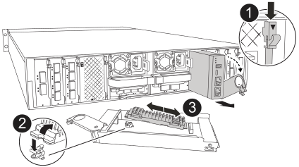

= ブートメディアの交換 - AFX 1K
:allow-uri-read: 
:icons: font
:imagesdir: ../media/

[role="lead"]
AFX 1K ストレージ システムのブート メディアには、重要なファームウェアと構成データが保存されます。交換プロセスでは、システム管理モジュールを取り外し、損傷したブートメディアを取り外し、交換用のブートメディアをシステム管理モジュールにインストールし、システム管理モジュールを再インストールします。

ブートメディアはシステム管理モジュールの内部にあり、モジュールをシステムから取り外すとアクセスできます。

[cols="1,4"]
|===

 a| 
image::../media/icon_round_1.png[番号1]
 a| 
システム管理モジュールのカムラッチ

 a| 
image::../media/icon_round_2.png[番号2]
 a| 
ブートメディアロックボタン

 a| 
image::../media/icon_round_3.png[番号3]
 a| 
ブートメディア

|===
.手順
. 接地対策がまだの場合は、自身で適切に実施します。
. PSU から電源ケーブルを取り外します。
. システム管理モジュールを取り外します。
+
.. システム管理モジュールからケーブルを取り外し、再インストール時に正しく再接続されるようにラベルを付けます。
.. ケーブルマネジメントトレイ内部の両側にあるボタンを引いてケーブルマネジメントトレイを下に回転させ、トレイを下に回転させます。
.. システム管理カムボタンを押します。
.. カムラッチをできるだけ下に回転させます。
.. カムレバーの開口部に指をはさみ、モジュールをエンクロージャから引き出して、システム管理モジュールをエンクロージャから取り外します。
.. システム管理モジュールを静電気防止用マットの上に置き、ブートメディアにアクセスできるようにします。

. 管理モジュールからブートメディアを取り外します。
+
.. 青色のロックボタンを押します。
.. ブートメディアを上に回転させ、ソケットから引き出して脇に置きます。

. 交換用ブートメディアをシステム管理モジュールに取り付けます。
+
.. ブートメディアの端をソケットケースに合わせ、ソケットに対して垂直にゆっくりと押し込みます。
.. ブートメディアをロックボタンの方に回転させます。
.. 固定ボタンを押し、ブートメディアを最後まで回転させて固定ボタンを放します。

. システム管理モジュールを取り付け直します。
+
.. モジュールをエンクロージャスロット開口部の端に合わせます。
.. モジュールをスロットにゆっくりと挿入してエンクロージャの奥まで押し込み、カムラッチを上に回転させてモジュールを所定の位置にロックします。

. ケーブルマネジメントトレイを上に回転させて閉じます。
+
.. システム管理モジュールにケーブルを再接続します。

. 電源装置に電源ケーブルを接続し、電源ケーブル固定クリップを再度取り付けます。
+
コントローラは、システムに電源を再接続するとすぐにブートを開始します。

.次の手順
ブートメディアを交換した後、link:bootmedia-recovery-image-boot.html["パートナーノードからONTAPイメージをリストアする"] 。
