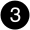

= I/Oモジュールの追加と交換の概要 - AFX 2K
:allow-uri-read: 
:icons: font
:imagesdir: ../media/

[role="lead"]
AFX 2Kストレージシステムは、I/Oモジュールの拡張や交換を柔軟に行えるため、ネットワーク接続性とパフォーマンスを向上させることができます。ネットワーク機能をアップグレードする場合や、故障したモジュールに対処する場合は、I/Oモジュールの追加または交換が不可欠です。

AFX 2K ストレージ システムで故障した I/O モジュールは、同じタイプの I/O モジュール、または異なるタイプの I/O モジュールと交換できます。空きスロットのあるシステムに I/O モジュールを追加することもできます。

* link:io-module-add.html["I/Oモジュールの追加"]
+
モジュールを追加すると、冗長性が向上し、1つのモジュールに障害が発生してもシステムが動作し続けるようになります。

* link:io-module-replace.html["I/Oモジュールの交換"]
+
障害が発生したI/Oモジュールを交換すると、システムを最適な動作状態に戻すことができます。

.I/Oスロット番号I/Oスロットバンゴウ
AFX 2KコントローラのI/Oスロットは、次の図に示すように、1から11までの番号が付けられています。

image::../media/drw_afx_2k_rear_slots_ieops-2862.svg[AFX 2Kコントローラーのスロット番号]

[cols="10%,23%,10%,24%,10%,23%"]
|===
| スロット番号 | I/Oスロット | スロット番号 | I/Oスロット | スロット番号 | I/Oスロット 

 a| 
image::../media/icon_round_1.svg[番号1]
| HA  a| 
image::../media/icon_round_4.svg[番号4]

image::../media/icon_round_5.svg[番号5]
| NVRAM12を使用したチャンク アップロード署名要求がサポートされるようになりました。  a| 
image::../media/icon_round_9.svg[コールアウト番号9]
| ネットワーク 

 a| 
image::../media/icon_round_2.svg[番号2]
| クラスタ  a| 
image::../media/icon_round_6.svg[コールアウト番号6]

image::../media/icon_round_7.svg[コールアウト番号7]
| NVRAM12-EXを使用したチャンク アップロード署名要求がサポートされるようになりました。  a| 
image::../media/icon_round_10.svg[コールアウト番号10]
| ストレージ 

 a| 

| ネットワーク  a| 

| ストレージ  a| 
image::../media/icon_round_11.svg[コールアウト番号11]
| （*オプション*）追加の管理接続のための4ポート25GbE SFP28 
|===