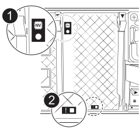

= NVRAM12-EX - AFX 2K の交換
:allow-uri-read: 
:icons: font
:imagesdir: ../media/

[role="lead"]
不揮発性メモリに不具合が生じた場合、またはアップグレードが必要になった場合は、AFX 2KストレージシステムのNVRAM12-EXを交換してください。交換プロセスには、故障したコントローラのシャットダウン、NVRAM12-EXモジュール、NVRAM DIMM、またはNVRAMバッテリーの交換、および故障した部品のNetAppへの返送が含まれます。

NVRAM12-EXモジュールは、NVRAM12ハードウェアと、現場で交換可能なDIMMで構成されています。故障したNVRAM12-EXモジュール、DIMM、またはNVRAM12-EXモジュール内部のNVRAMバッテリーを交換できます。

.作業を開始する前に
* 交換用パーツがあることを確認します。障害が発生したコンポーネントは、NetAppから受け取った交換用コンポーネントと交換する必要があります。
* ストレージシステムの他のすべてのコンポーネントが正常に動作していることを確認します。正常に動作していない場合は、にお問い合わせください。 https://support.netapp.com["ネットアップサポート"]
+

NOTE: NVRAM12-EXモジュールを交換する前に、交換作業を進める前に障害のあるコントローラの電源を必ず切ってください。

== 手順 1 ：障害のあるコントローラをシャットダウンします

障害のあるコントローラをシャットダウンするかテイクオーバーします。

障害のあるコントローラーを引き継いで停止し、正常なコントローラーが障害のあるコントローラーのストレージからデータを引き続き提供できるようにします。これを行うには、AutoSupportで自動ケース作成を抑制し、自動ギブバックを無効にして、障害のあるコントローラをLOADERプロンプトに切り替えます。LOADERプロンプトは、FRUを交換できる安全な停止状態です。

.このタスクについて
* 4 つ以上のノードを持つクラスターがある場合は、クォーラム内になければなりません。ノードに関するクラスター情報を表示するには、 `cluster show`指示。詳細については、 `cluster show`コマンドについては、link:https://docs.netapp.com/us-en/ontap/system-admin/display-nodes-cluster-task.html["ONTAPクラスタ内のノードレベルの詳細を表示する"^] 。
* クラスターがクォーラムにない場合、または (障害のあるコントローラー以外の) コントローラーの正常性または適格性が false と表示される場合は、障害のあるコントローラーをシャットダウンする前に問題を修正する必要があります。見るlink:https://docs.netapp.com/us-en/ontap/system-admin/synchronize-node-cluster-task.html?q=Quorum["ノードをクラスタと同期します"^] 。

.手順
. AutoSupportが有効になっている場合は、AutoSupportメッセージを呼び出してケースの自動作成を停止します。
+
`system node autosupport invoke -node * -type all -message MAINT=<# of hours>h`

+
次のAutoSupport メッセージは、ケースの自動作成を2時間停止します。

+
`cluster1:> system node autosupport invoke -node * -type all -message MAINT=2h`

. 障害のあるコントローラのコンソールからの自動ギブバックを無効にします。
+
`storage failover modify -node impaired-node -auto-giveback-of false`

+

NOTE: 「自動ギブバックを無効にしますか？」と表示されたら、次のように入力します。 `y` 。

. 障害のあるコントローラに LOADER プロンプトを表示します。
+
[cols="1,2"]
|===
| 障害のあるコントローラの表示 | 作業 

 a| 
LOADER プロンプト
 a| 
次の手順に進みます。

 a| 
システムプロンプトまたはパスワードプロンプト
 a| 
正常なコントローラから障害のあるコントローラを引き継ぐか、停止します。
`storage failover takeover -ofnode _impaired_node_name_ -halt _true_`

_-halt true_ パラメータは、障害のあるノードを LOADER プロンプトに表示します。

|===

== ステップ2：NVRAM12-EXモジュール、NVRAM DIMM、またはNVRAMバッテリーを交換する

NVRAM12-EXモジュール、NVRAM DIMM、またはNVRAMバッテリーを以下のオプションを使用して交換します。

コントローラモジュールを交換する場合、またはコントローラモジュール内部のコンポーネントを交換する場合は、コントローラモジュールをエンクロージャから取り外す必要があります。

[role="tabbed-block"]
====
.オプション1：NVRAM12-EXモジュールを交換する
--
NVRAM12-EXモジュールを交換するには、筐体のスロット6/7にモジュールを配置し、特定の手順に従ってください。

. システムのスロット4/5にあるNVRAMステータスLEDと、NVRAM12-EXのステータススロット6/7を確認してください。また、コントローラモジュールの前面パネルにもNVRAM LEDがあります。NVアイコンを探してください：
+

+
[cols="1,4"]
|===

2+| *NVRAM* 

 a| 
image:../media/icon_round_1.png["番号1"]
 a| 
NVRAMステータスLED

 a| 
image:../media/icon_round_2.png["番号2"]
 a| 
NVRAM警告LED

|===
+
image::../media/drw_afx_emr_nvram-led_ieops-2962.svg[NVRAM12-EXの注意とステータスLEDの位置を示す図]

+
[cols="1,4"]
|===

2+| *NVRAM12-EX* 

 a| 
image:../media/icon_round_1.png["番号1"]
 a| 
NVRAM12-EXステータスLED

 a| 
image:../media/icon_round_2.png["番号2"]
 a| 
NVRAM12-EX 注意用LED

|===
+
** NV LEDが消灯している場合は、次の手順に進みます。
** NV LEDが点滅している場合は、点滅が停止するまで待ちます。点滅が5分以上続く場合は、テクニカルサポートにお問い合わせください。

. 接地対策がまだの場合は、自身で適切に実施します。
. コントローラーの PSU から電源ケーブルを取り外します。
. ケーブルマネジメントトレイの端にあるピンをそっと引いてトレイを下に回転させ、トレイを下に回転させます。
. 故障した NVRAM12-EX モジュールを筐体から取り外します。
+
.. ロックカムボタンを押してください。
.. 故障したNVRAM12-EXモジュールを筐体から引き抜いて取り外してください。
+
image::../media/drw_afx_emr_nv12l_remove_replace_ieops-2879.svg[NVRAM12-EXモジュールを取り外す]

+
[cols="1,4"]
|===

 a| 
image:../media/icon_round_1.png["番号1"]
| カムロックボタン 
|===

. NVRAM12-EXモジュールを安定した場所に置いてください。
. NVRAM12-EXモジュールのカバーを開けるには、指またはドライバーを使用してカバーにある1本のつまみネジを緩め、カバーをモジュールから持ち上げてください。
+
image::../media/drw_afx_emr_nv12l_remove_cover_ieops-2929.svg[NVRAM12-EXのカバーを取り外します]

+
[cols="1,4"]
|===

 a| 
image:../media/icon_round_1.png["番号1"]
| NVRAM12-EXカバー用つまみネジ 
|===
. 故障したNVRAM12-EXモジュールからDIMMを1枚ずつ取り外し、交換用のNVRAM12-EXモジュールに取り付けます。
+
image::../media/drw_afx_emr_nv12l_remove_dimms_ieops-2883.svg[NVRAM12-EX DIMMを取り外す]

+
[cols="1,4"]
|===

 a| 
image:../media/icon_round_1.png["番号1"]
| DIMMの固定ツメ 
|===
. NVRAM12-EXモジュールからバッテリーを取り外します。
+
.. バッテリープラグの表面にあるクリップを握って、プラグをソケットから外します。
.. バッテリケーブルをソケットから抜きます。

. モジュールからバッテリーを取り外すには、バッテリーを持ち上げてモジュールから取り出します。
+
image::../media/drw_afx_emr_nv12l_remove_battery_ieops-2919.svg[NVRAM12-EXバッテリーを取り外す]

+
[cols="1,4"]
|===

 a| 
image:../media/icon_round_1.png["番号1"]
| NVRAM12-EXバッテリー接続クリップ 
|===
. 交換用NVRAM12-EXモジュールにバッテリーを取り付けます。
+
.. バッテリー接続クリップをソケットに差し込み、プラグがカチッと固定されることを確認してください。
.. バッテリパックをスロットに挿入し、バッテリパックをしっかりと押し下げて所定の位置に固定します。

. NVRAM12-EXモジュールのカバーをネジ穴に合わせて取り付け、つまみネジで固定します。
. 交換用NVRAM12-EXモジュールを筐体に取り付けます。
+
.. モジュールをスロット6/7の筐体開口部の端に合わせてください。
.. モジュールをスロットにゆっくりと奥まで差し込み、所定の位置に固定してください。

. ケーブルマネジメントトレイを上に回転させて閉じます。

--
.オプション2：NVRAM DIMMを交換する
--
NVRAM12-EXモジュール内のNVRAM DIMMを交換するには、NVRAM12-EXモジュールを取り外してから、対象のDIMMを交換する必要があります。

. システムのスロット4/5にあるNVRAMステータスLEDと、NVRAM12-EXのステータススロット6/7を確認してください。また、コントローラモジュールの前面パネルにもNVRAM LEDがあります。NVアイコンを探してください：
+

+
[cols="1,4"]
|===

2+| *NVRAM* 

 a| 
image:../media/icon_round_1.png["番号1"]
 a| 
NVRAMステータスLED

 a| 
image:../media/icon_round_2.png["番号2"]
 a| 
NVRAM警告LED

|===
+
image::../media/drw_afx_emr_nvram-led_ieops-2962.svg[NVRAM12-EXの注意とステータスLEDの位置を示す図]

+
[cols="1,4"]
|===

2+| *NVRAM12-EX* 

 a| 
image:../media/icon_round_1.png["番号1"]
 a| 
NVRAM12-EXステータスLED

 a| 
image:../media/icon_round_2.png["番号2"]
 a| 
NVRAM12-EX 注意用LED

|===
+
** NV LEDが消灯している場合は、次の手順に進みます。
** NV LEDが点滅している場合は、点滅が停止するまで待ちます。点滅が5分以上続く場合は、テクニカルサポートにお問い合わせください。

. 接地対策がまだの場合は、自身で適切に実施します。
. PSU から電源ケーブルを取り外します。
. ケーブルマネジメントトレイの端にあるピンをそっと引いてトレイを下に回転させ、トレイを下に回転させます。
. エンクロージャーから対象のNVRAM12-EXモジュールを取り外します。
+
.. ロックカムボタンを押してください。
.. 故障したNVRAM12-EXモジュールを筐体から引き抜いて取り外してください。
+
image::../media/drw_afx_emr_nv12l_remove_replace_ieops-2879.svg[NVRAM12-EXモジュールを取り外す]

+
[cols="1,4"]
|===

 a| 
image:../media/icon_round_1.png["番号1"]
| カムロックボタン 
|===

. NVRAM12-EXモジュールを安定した場所に置いてください。
. NVRAM12-EXモジュールのカバーを開けるには、指またはドライバーを使用してカバーにある1本のつまみネジを緩め、カバーをモジュールから持ち上げてください。
+
image::../media/drw_afx_emr_nv12l_remove_cover_ieops-2929.svg[NVRAM12-EXのカバーを取り外します]

+
[cols="1,4"]
|===

 a| 
image:../media/icon_round_1.png["番号1"]
| NVRAM12-EXカバー用つまみネジ 
|===
. NVRAM12-EXモジュール内部にある交換対象のDIMMを確認します。
+

NOTE: DIMMスロット1と2の位置を確認するには、NVRAM12-EXモジュールの側面にあるFRUマップラベルを参照してください。

. DIMMの固定ツメを押し下げ、ソケットから持ち上げてDIMMを取り外します。
+
image::../media/drw_afx_emr_nv12l_remove_dimms_ieops-2883.svg[NVRAM12-EX DIMMを取り外す]

+
[cols="1,4"]
|===

 a| 
image:../media/icon_round_1.png["番号1"]
| DIMMの固定ツメ 
|===
. DIMM をソケットに合わせ、固定ツメが所定の位置に収まるまで DIMM をそっとソケットに押し込み、交換用 DIMM を取り付けます。
. NVRAM12-EXモジュールのカバーをネジ穴に合わせて取り付け、つまみネジで固定します。
. NVRAM12-EXモジュールを筐体に取り付けます。
+
.. モジュールをスロットにゆっくりと奥まで差し込み、所定の位置に固定してください。

. ケーブルマネジメントトレイを上に回転させて閉じます。

--
.オプション3：NVRAMバッテリーの交換
--
NVRAM12-EXモジュール内のNVRAM DIMMを交換するには、NVRAM12-EXモジュールを取り外してから、バッテリーを交換する必要があります。

. システムのスロット4/5にあるNVRAMステータスLEDと、NVRAM12-EXのステータススロット6/7を確認してください。また、コントローラモジュールの前面パネルにもNVRAM LEDがあります。NVアイコンを探してください：
+

+
[cols="1,4"]
|===

2+| *NVRAM* 

 a| 
image:../media/icon_round_1.png["番号1"]
 a| 
NVRAMステータスLED

 a| 
image:../media/icon_round_2.png["番号2"]
 a| 
NVRAM警告LED

|===
+
image::../media/drw_afx_emr_nvram-led_ieops-2962.svg[NVRAM12-EXの注意とステータスLEDの位置を示す図]

+
[cols="1,4"]
|===

2+| *NVRAM12-EX* 

 a| 
image:../media/icon_round_1.png["番号1"]
 a| 
NVRAM12-EXステータスLED

 a| 
image:../media/icon_round_2.png["番号2"]
 a| 
NVRAM12-EX 注意用LED

|===
+
** NV LEDが消灯している場合は、次の手順に進みます。
** NV LEDが点滅している場合は、点滅が停止するまで待ちます。点滅が5分以上続く場合は、テクニカルサポートにお問い合わせください。

. 接地対策がまだの場合は、自身で適切に実施します。
. PSU から電源ケーブルを取り外します。
. ケーブルマネジメントトレイの端にあるピンをそっと引いてトレイを下に回転させ、トレイを下に回転させます。
. エンクロージャーから対象のNVRAM12-EXモジュールを取り外します。
+
.. ロックカムボタンを押してください。
.. 故障したNVRAM12-EXモジュールを筐体から引き抜いて取り外してください。
+
image::../media/drw_afx_emr_nv12l_remove_replace_ieops-2879.svg[NVRAM12-EXモジュールを取り外す]

+
[cols="1,4"]
|===

 a| 
image:../media/icon_round_1.png["番号1"]
| カムロックボタン 
|===

. NVRAM12-EXモジュールを安定した場所に置いてください。
. NVRAM12-EXモジュールのカバーを開けるには、指またはドライバーを使用してカバーにある1本のつまみネジを緩め、カバーをモジュールから持ち上げてください。
+
image::../media/drw_afx_emr_nv12l_remove_cover_ieops-2929.svg[NVRAM12-EXのカバーを取り外します]

+
[cols="1,4"]
|===

 a| 
image:../media/icon_round_1.png["番号1"]
| NVRAM12-EXカバー用つまみネジ 
|===
. NVRAM12-EXモジュールからバッテリーを取り外します。
+
.. バッテリープラグの表面にあるクリップを握って、プラグをソケットから外します。
.. バッテリケーブルをソケットから抜きます。

. モジュールからバッテリーを取り外すには、バッテリーを持ち上げてモジュールから取り出します。
+
image::../media/drw_afx_emr_nv12l_remove_battery_ieops-2919.svg[NVRAM12-EXバッテリーを取り外す]

+
[cols="1,4"]
|===

 a| 
image:../media/icon_round_1.png["番号1"]
| NVRAM12-EXバッテリー接続クリップ 
|===
. 交換用バッテリをパッケージから取り出します。
. 交換用バッテリーパックをNVRAM12-EXモジュールに取り付けます。
+
.. バッテリー接続クリップをソケットに差し込み、プラグがカチッと固定されることを確認してください。
.. バッテリパックをスロットに挿入し、バッテリパックをしっかりと押し下げて所定の位置に固定します。

. NVRAM12-EXモジュールのカバーをネジ穴に合わせて取り付け、つまみネジで固定します。
. NVRAM12-EXモジュールを筐体に取り付けます。
+
.. モジュールをスロットにゆっくりと奥まで差し込み、所定の位置に固定してください。

. ケーブルマネジメントトレイを上に回転させて閉じます。

--
====

== 手順3：コントローラをリブートする

FRU を交換したら、コントローラモジュールをリブートする必要があります。

. 電源ケーブルをPSUに再度差し込みます。
+
システムのリブートが開始され、通常はLOADERプロンプトが表示されます。

. 入力 `bye`LOADER プロンプトで。

== ステップ4：NVRAM12-EXの交換を完了する

NVRAM12-EXの交換を完了するには、以下の手順を実行してください。

.手順
. 正常なコントローラから、新しいパートナー システム ID が自動的に割り当てられたことを確認します。
`_storage failover show_`
+
コマンドの出力には、ストレージ交換の現在の状態を示すメッセージが表示されます。次の例では、 `node2`が交換され、現在の状態が `In takeover`として表示されています。

+
[listing]
----
node1:> storage failover show
                                    Takeover
Node              Partner           Possible     State Description
------------      ------------      --------     -------------------------------------
node1             node2             false        In takeover
node2             node1             -            Waiting for giveback
----
. コントローラをギブバックします。
+
.. 正常なコントローラーから、交換したコントローラーのストレージを返却します。 `_storage failover giveback -ofnode impaired_node_name_`
+
コントローラはストレージをテイクバックしてブートを完了します。

+

NOTE: ギブバックが拒否されている場合は、拒否を無効にすることを検討してください。

+
詳細については、を参照してください https://docs.netapp.com/us-en/ontap/high-availability/ha_manual_giveback.html#if-giveback-is-interrupted["手動ギブバックコマンド"^] 拒否を無視するトピック。

.. ギブバックの完了後、HAペアが正常でテイクオーバーが可能であることを確認します。_storage failover show_
+
「 storage failover show 」コマンドの出力に、パートナーメッセージで変更されたシステム ID は含まれません。

. 各コントローラに必要なボリュームが存在することを確認します。
+
`vol show -node node-name`

. コンソールメッセージが停止したら、<enter>キーを押します。
+
** _login_ プロンプトが表示されたら、次の手順に進みます。
** ログイン プロンプトが表示されない場合は、パートナー ノードにログインします。

. ギブバックレポートが完了してから5分待って、フェイルオーバーのステータスとギブバックのステータスを確認します。
+
`storage failover show`そして `storage failover show-giveback`

+

NOTE: 次のコマンドは、診断モードの特権レベルでのみ使用できます。

. 自動ギブバックを無効にした場合は、再度有効にします。
+
`storage failover modify -node local -auto-giveback-of true`

. AutoSupportが有効になっている場合は、ケースの自動作成をリストアまたは抑制解除します。
+
`system node autosupport invoke -node * -type all -message MAINT=END`

== 手順 5 ：障害が発生したパーツをネットアップに返却する

障害が発生したパーツは、キットに付属のRMA指示書に従ってNetAppに返却してください。 https://mysupport.netapp.com/site/info/rma["パーツの返品と交換"]詳細については、ページを参照してください。
