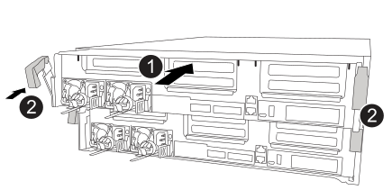

= DIMMの交換- ASA C400
:allow-uri-read: 
:icons: font
:imagesdir: ../media/

[role="lead"]
システムで登録される修正可能なエラー修正コード（ ECC ）の数が増え続けている場合は、コントローラモジュールの DIMM を交換する必要があります。そのままにしているとシステムがパニック状態になります。

システムのその他のコンポーネントがすべて正常に動作している必要があります。問題がある場合は、必ずテクニカルサポートにお問い合わせください。

障害が発生したコンポーネントは、プロバイダから受け取った交換用 FRU コンポーネントと交換する必要があります。

== 手順 1 ：障害のあるコントローラをシャットダウンします

構成に応じた適切な手順 を使用して、障害のあるコントローラをシャットダウンまたはテイクオーバーします。

[role="tabbed-block"]
====
.オプション 1 ：ほとんどの構成
--
障害のあるコントローラをシャットダウンするには、コントローラのステータスを確認し、必要に応じて正常なコントローラが障害のあるコントローラストレージからデータを引き続き提供できるようにコントローラをテイクオーバーする必要があります。

.このタスクについて
* SANシステムを使用している場合は、イベントメッセージを確認しておく必要があります  `cluster kernel-service show`)を参照してください。。 `cluster kernel-service show` コマンドは、ノード名、そのノードのクォーラムステータス、ノードの可用性ステータス、およびノードの動作ステータスを表示します。
+
各 SCSI ブレードプロセスは、クラスタ内の他のノードとクォーラムを構成している必要があります。交換を進める前に、すべての問題を解決しておく必要があります。

* ノードが 3 つ以上あるクラスタは、クォーラムを構成している必要があります。クラスタがクォーラムを構成していない場合、または正常なコントローラで適格性と正常性についてfalseと表示される場合は、障害のあるコントローラをシャットダウンする前に問題 を修正する必要があります。を参照してください link:https://docs.netapp.com/us-en/ontap/system-admin/synchronize-node-cluster-task.html?q=Quorum["ノードをクラスタと同期します"^]。

.手順
. AutoSupport が有効になっている場合は、 AutoSupport メッセージを呼び出してケースの自動作成を抑制します。「 system node AutoSupport invoke -node * -type all -message MAINT=number_OF_hours_downh
+
次のAutoSupport メッセージは、ケースの自動作成を2時間停止します。 `cluster1:> system node autosupport invoke -node * -type all -message MAINT=2h`

. 正常なコントローラのコンソールから自動ギブバックを無効にします。 storage failover modify – node local-auto-giveback false
+

NOTE: 自動ギブバックを無効にしますか?_と表示されたら'y'を入力します

. 障害のあるコントローラに LOADER プロンプトを表示します。
+
[cols="1,2"]
|===
| 障害のあるコントローラの表示 | 作業 

 a| 
LOADER プロンプト
 a| 
次の手順に進みます。

 a| 
ギブバックを待っています
 a| 
Ctrl キーを押しながら C キーを押し ' プロンプトが表示されたら y と入力します

 a| 
システムプロンプトまたはパスワードプロンプト
 a| 
正常なコントローラから障害のあるコントローラをテイクオーバーまたは停止します。「 storage failover takeover -ofnode impaired_node_name _

障害のあるコントローラに「 Waiting for giveback... 」と表示されたら、 Ctrl+C キーを押し、「 y 」と入力します。

|===

--
.オプション 2 ：コントローラは 2 ノード MetroCluster に搭載されています
--
障害のあるコントローラをシャットダウンするには、コントローラのステータスを確認し、必要に応じて正常なコントローラが障害のあるコントローラストレージからデータを引き続き提供できるようにコントローラをスイッチオーバーする必要があります。

.このタスクについて
* 正常なコントローラに電力を供給するために、この手順 の最後で電源装置をオンのままにしておく必要があります。

.手順
. MetroCluster ステータスをチェックして、障害のあるコントローラが正常なコントローラに自動的にスイッチオーバーしたかどうかを確認します。「 MetroCluster show 」
. 自動スイッチオーバーが発生したかどうかに応じて、次の表に従って処理を進めます。
+
[cols="1,2"]
|===
| 障害のあるコントローラの状況 | 作業 

 a| 
自動的にスイッチオーバーした
 a| 
次の手順に進みます。

 a| 
自動的にスイッチオーバーしていない
 a| 
正常なコントローラから計画的なスイッチオーバー操作を実行します : MetroCluster switchover

 a| 
スイッチオーバーは自動的には行われておらず、 MetroCluster switchover コマンドを使用してスイッチオーバーを試みたが、スイッチオーバーは拒否された
 a| 
拒否メッセージを確認し、可能であれば問題を解決してやり直します。問題を解決できない場合は、テクニカルサポートにお問い合わせください。

|===
. サバイバークラスタから MetroCluster heal-phase aggregates コマンドを実行して、データアグリゲートを再同期します。
+
[listing]
----
controller_A_1::> metrocluster heal -phase aggregates
[Job 130] Job succeeded: Heal Aggregates is successful.
----
+
修復が拒否された場合は '-override-vetoes パラメータを指定して MetroCluster heal コマンドを再実行できますこのオプションパラメータを使用すると、修復処理を妨げるソフトな拒否はすべて無視されます。

. MetroCluster operation show コマンドを使用して、処理が完了したことを確認します。
+
[listing]
----
controller_A_1::> metrocluster operation show
    Operation: heal-aggregates
      State: successful
Start Time: 7/25/2016 18:45:55
   End Time: 7/25/2016 18:45:56
     Errors: -
----
. 「 storage aggregate show 」コマンドを使用して、アグリゲートの状態を確認します。
+
[listing]
----
controller_A_1::> storage aggregate show
Aggregate     Size Available Used% State   #Vols  Nodes            RAID Status
--------- -------- --------- ----- ------- ------ ---------------- ------------
...
aggr_b2    227.1GB   227.1GB    0% online       0 mcc1-a2          raid_dp, mirrored, normal...
----
. 「 MetroCluster heal-phase root-aggregates 」コマンドを使用して、ルートアグリゲートを修復します。
+
[listing]
----
mcc1A::> metrocluster heal -phase root-aggregates
[Job 137] Job succeeded: Heal Root Aggregates is successful
----
+
修復が拒否された場合は '-override-vetoes パラメータを指定して MetroCluster heal' コマンドを再実行できますこのオプションパラメータを使用すると、修復処理を妨げるソフトな拒否はすべて無視されます。

. デスティネーションクラスタで「 MetroCluster operation show 」コマンドを使用して、修復処理が完了したことを確認します。
+
[listing]
----

mcc1A::> metrocluster operation show
  Operation: heal-root-aggregates
      State: successful
 Start Time: 7/29/2016 20:54:41
   End Time: 7/29/2016 20:54:42
     Errors: -
----
. 障害のあるコントローラモジュールで、電源装置の接続を解除します。

--
====

== 手順 2 ：コントローラモジュールを取り外す

コントローラモジュール内部のコンポーネントにアクセスするには、コントローラモジュールをシャーシから取り外す必要があります。

. 接地対策がまだの場合は、自身で適切に実施します。
. 電源ケーブル固定クリップを外し、電源装置からケーブルを抜きます。
. ケーブルマネジメントデバイスに接続しているケーブルをまとめているフックとループストラップを緩め、システムケーブルと SFP をコントローラモジュールから外し（必要な場合）、どのケーブルが何に接続されていたかを記録します。
+
ケーブルはケーブルマネジメントデバイスに収めたままにします。これにより、ケーブルマネジメントデバイスを取り付け直すときに、ケーブルを整理する必要がありません。

. ケーブルマネジメントデバイスをコントローラモジュールから取り外し、脇に置きます。
. 両方のロックラッチを押し下げ、両方のラッチを同時に下方向に回転させます。
+
コントローラモジュールがシャーシから少し引き出されます。

+
image::../media/drw_c400_remove_controller_IEOPS-1216.svg[DRW C400コントローラIEOPS 1216の取り外し]

+
[cols="10,90"]
|===

 a| 
image:../media/legend_icon_01.png["番号1"]
 a| 
ロックラッチ

 a| 
image:../media/legend_icon_02.png["番号2"]
 a| 
コントローラがシャーシからわずかに引き出されます

|===
. コントローラモジュールをシャーシから引き出します。
+
このとき、空いている手でコントローラモジュールの底面を支えてください。

. コントローラモジュールを安定した平らな場所に置きます。

== 手順 3 ：システム DIMM を交換します

システムDIMMを交換するには、関連するエラーメッセージで対象のDIMMを特定し、エアダクトのFRUマップを使用してターゲットDIMMの場所を確認し、DIMMを交換します。

次に示すアニメーションや図、または記載された手順に従って、システム DIMM を交換します。

NOTE: アニメーションと図は、 DIMM のないソケットの空きスロットを示しています。これらの空のソケットには何も挿入されていません。

.アニメーション-システムDIMMを交換します
video::93025369-2f61-46b1-bd51-b03100040fe6[panopto]
image::../media/drw_A400_Replace-NVDIMM-DIMM.png[DIMM の移動]

[cols="10,90"]
|===

 a| 
image:../media/legend_icon_01.png["番号1"]
 a| 
DIMMの固定ツメ

 a| 
image:../media/legend_icon_02.png["番号2"]
 a| 
DIMM

 a| 
image:../media/legend_icon_03.png["番号3"]
 a| 
DIMMソケット

|===
DIMM はソケット 2 、 4 、 13 、 15 にあります。NVDIMM はスロット 11 にあります。

. エアダクトを開きます。
+
.. エアダクトの側面にある固定ツメをコントローラモジュールの中央に向かって押します。
.. エアダクトをコントローラモジュールの背面方向にスライドさせ、完全に開いた状態になるまで上方向に回転させます。

. コントローラモジュールで DIMM の場所を確認します。
. 交換用 DIMM を正しい向きで挿入できるように、ソケット内の DIMM の向きをメモします。
. DIMM の両側にある 2 つのツメをゆっくり押し開いて DIMM をソケットから外し、そのままスライドさせてソケットから取り出します。
+

NOTE: DIMM 回路基板のコンポーネントに力が加わらないように、 DIMM の両端を慎重に持ちます。

. 交換用 DIMM を静電気防止用の梱包バッグから取り出し、 DIMM の端を持ってスロットに合わせます。
+
DIMM のピンの間にある切り欠きを、ソケットの突起と揃える必要があります。

. コネクタにある DIMM のツメが開いた状態になっていることを確認し、 DIMM をスロットに対して垂直に挿入します。
+
DIMM のスロットへの挿入にはある程度の力が必要です。簡単に挿入できない場合は、 DIMM をスロットに正しく合わせてから再度挿入してください。

+

NOTE: DIMM がスロットにまっすぐ差し込まれていることを目で確認してください。

. DIMM の両端のノッチにツメがかかるまで、 DIMM の上部を慎重にしっかり押し込みます。
. エアダクトを閉じます。

== 手順 4 ：コントローラモジュールを取り付ける

コントローラモジュールのコンポーネントを交換したら、コントローラモジュールをシャーシに再度取り付け、メンテナンスモードでブートする必要があります。

[cols="10,90"]
|===

 a| 
image:../media/legend_icon_01.png["番号1"]
 a| 
コントローラモジュール

 a| 
image:../media/legend_icon_02.png["番号2"]
 a| 
コントローラのロックラッチ

|===
. まだ行っていない場合は、エアダクトを閉じます。
. コントローラモジュールの端をシャーシの開口部に合わせ、コントローラモジュールをシステムに半分までそっと押し込みます。
+

NOTE: 指示があるまでコントローラモジュールをシャーシに完全に挿入しないでください。

. システムにアクセスして以降のセクションのタスクを実行できるように、管理ポートとコンソールポートのみをケーブル接続します。
+

NOTE: 残りのケーブルは、この手順の後半でコントローラモジュールに接続します。

. コントローラモジュールの取り付けを完了します。
+
.. 電源装置に電源コードを接続し、電源ケーブルロックカラーを再度取り付けてから、電源装置を電源に接続します。
.. ロックラッチを使用し、ロックラッチが持ち上がるまで、コントローラモジュールをシャーシにしっかりと押し込みます。
+

NOTE: コネクタの破損を防ぐため、コントローラモジュールをスライドしてシャーシに挿入する際に力を入れすぎないでください。

.. コントローラモジュールをシャーシに完全に挿入するために、ロックラッチを上に回転させ、ロックピンが外れるように傾けてコントローラをそっと奥まで押し込んだら、ロックラッチをロックされるまで下げます。
+
コントローラモジュールは、シャーシに完全に装着されるとすぐにブートを開始します。ブートプロセスを中断できるように準備しておきます。

.. ケーブルマネジメントデバイスをまだ取り付けていない場合は、取り付け直します。
.. 通常のブート・プロセスを中断し 'Ctrl+C キーを押して LOADER でブートします
+

NOTE: システムがブートメニューで停止した場合は、 LOADER でブートするオプションを選択します。

.. LOADER プロンプトで「 bye 」と入力して、 PCIe カードおよびその他のコンポーネントを再初期化します。
.. Ctrl+C キーを押して、ブート・プロセスを中断し、 LOADER プロンプトでブートします。
+
システムがブートメニューで停止した場合は、 LOADER でブートするオプションを選択します。

== 手順 5 ：コントローラモジュールを動作状態に戻す

システムにケーブルを再接続し、コントローラモジュールをギブバックして、自動ギブバックを再度有効にする必要があります。

. 必要に応じてシステムにケーブルを再接続します。
+
光ファイバケーブルを使用する場合は、メディアコンバータ（ QSFP または SFP ）を取り付け直してください（取り外した場合）。

. ストレージをギブバックして、コントローラを通常の動作に戻します。 storage failover giveback -ofnode impaired_node_name _`
. 自動ギブバックを無効にした場合は、再度有効にします。「 storage failover modify -node local-auto-giveback true 」

== 手順 6 ： 2 ノード MetroCluster 構成のアグリゲートをスイッチバックする

2 ノード MetroCluster 構成で FRU の交換が完了したら、 MetroCluster スイッチバック処理を実行できます。これにより構成が通常の動作状態に戻ります。また、障害が発生していたサイトの同期元 Storage Virtual Machine （ SVM ）がアクティブになり、ローカルディスクプールからデータを提供します。

このタスクでは、環境の 2 ノード MetroCluster 構成のみを実行します。

.手順
. すべてのノードの状態が「 enabled 」であることを確認します。 MetroCluster node show
+
[listing]
----
cluster_B::>  metrocluster node show

DR                           Configuration  DR
Group Cluster Node           State          Mirroring Mode
----- ------- -------------- -------------- --------- --------------------
1     cluster_A
              controller_A_1 configured     enabled   heal roots completed
      cluster_B
              controller_B_1 configured     enabled   waiting for switchback recovery
2 entries were displayed.
----
. すべての SVM で再同期が完了したことを確認します。「 MetroCluster vserver show 」
. 修復処理によって実行される LIF の自動移行が正常に完了したことを確認します。 MetroCluster check lif show
. サバイバークラスタ内の任意のノードから MetroCluster switchback コマンドを使用して、スイッチバックを実行します。
. スイッチバック処理が完了したことを確認します MetroCluster show
+
クラスタの状態が waiting-for-switchback の場合は、スイッチバック処理がまだ実行中です。

+
[listing]
----
cluster_B::> metrocluster show
Cluster              Configuration State    Mode
--------------------	------------------- 	---------
 Local: cluster_B configured       	switchover
Remote: cluster_A configured       	waiting-for-switchback
----
+
クラスタが「 normal 」状態のとき、スイッチバック処理は完了しています。

+
[listing]
----
cluster_B::> metrocluster show
Cluster              Configuration State    Mode
--------------------	------------------- 	---------
 Local: cluster_B configured      		normal
Remote: cluster_A configured      		normal
----
+
スイッチバックが完了するまでに時間がかかる場合は、「 MetroCluster config-replication resync-status show 」コマンドを使用することで、進行中のベースラインのステータスを確認できます。

. SnapMirror 構成または SnapVault 構成があれば、再確立します。

== 手順 7 ：障害が発生したパーツをネットアップに返却する

障害のある部品は、キットに付属する RMA 指示書に従ってネットアップに返却してください。を参照してください https://mysupport.netapp.com/site/info/rma["パーツの返品と交換"] 詳細については、を参照してください。
