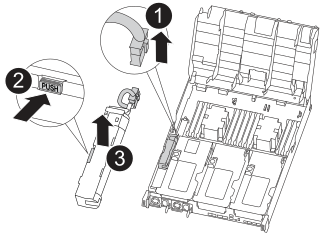
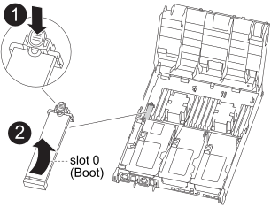

= コントローラの交換- ASA A400
:allow-uri-read: 
:icons: font
:imagesdir: ../media/

[role="lead"]
コントローラモジュールハードウェアを交換するには、障害のあるコントローラを取り外し、 FRU コンポーネントを交換用コントローラモジュールに移動し、交換用コントローラモジュールをシャーシに取り付けてから、システムをメンテナンスモードでブートする必要があります。

== 手順 1 ：コントローラモジュールを取り外す

コントローラモジュール内部のコンポーネントにアクセスするには、コントローラモジュールをシャーシから取り外す必要があります。

. 接地対策がまだの場合は、自身で適切に実施します。
. 電源ケーブル固定クリップを外し、電源装置からケーブルを抜きます。
. ケーブルマネジメントデバイスに接続しているケーブルをまとめているフックとループストラップを緩め、システムケーブルと SFP をコントローラモジュールから外し（必要な場合）、どのケーブルが何に接続されていたかを記録します。
+
ケーブルはケーブルマネジメントデバイスに収めたままにします。これにより、ケーブルマネジメントデバイスを取り付け直すときに、ケーブルを整理する必要がありません。

. ケーブルマネジメントデバイスをコントローラモジュールから取り外し、脇に置きます。
. 両方のロックラッチを押し下げ、両方のラッチを同時に下方向に回転させます。
+
コントローラモジュールがシャーシから少し引き出されます。

+
image::../media/drw_c400_remove_controller_IEOPS-1216.svg[DRW C400コントローラIEOPS 1216の取り外し]

+
[cols="10,90"]
|===

 a| 
image:../media/legend_icon_01.png["番号1"]
 a| 
ロックラッチ

 a| 
image:../media/legend_icon_02.png["番号2"]
 a| 
コントローラがシャーシからわずかに引き出されます

|===
. コントローラモジュールをシャーシから引き出します。
+
このとき、空いている手でコントローラモジュールの底面を支えてください。

. コントローラモジュールを安定した平らな場所に置きます。
. アニメーション、図、または記載された手順に従って、交換用コントローラモジュールでエアダクトを開き、コントローラモジュールから空のライザーを取り外します。
+
.アニメーション-交換用コントローラモジュールから空のライザーを取り外します
video::018a1c3c-0a26-4f48-bd60-b0300184c147[panopto]
+
image::../media/drw_c400_empty_riser_remove_IEOPS-1225.svg[DRW C400空のライザーIEOPS 1225の取り外し]

[cols="10,90"]
|===

 a| 
image:../media/legend_icon_01.png["番号1"]
 a| 
ライザーラッチ

|===
. エアダクトの側面にある固定ツメをコントローラモジュールの中央に向かって押します。
. エアダクトをコントローラモジュールの背面方向にスライドさせ、完全に開いた状態になるまで上方向に回転させます。
. ライザー 1 の左側にあるライザーロックラッチをエアダクトの方向に上に回し、ライザーを持ち上げて脇に置きます。
. 残りのライザーについても、同じ手順を繰り返します。

== 手順 2 ：電源装置を移動します

コントローラモジュールを交換する場合は、障害のあるコントローラモジュールから交換用コントローラモジュールに電源装置を移動する必要があります。

次に示すアニメーション、図、または記載された手順に従って、交換用コントローラモジュールに電源装置を移動します。

.アニメーション-電源装置を移動します
video::6cac8f5f-dc11-4b1d-9b18-b03001858fda[panopto]
. 電源装置を取り外します。
+
image::../media/drw_c400_psu_IEOPS-1237.svg[DRW C400 PSU IEOPS 1237]

[cols="10,90"]
|===

 a| 
image:../media/legend_icon_01.png["番号1"]
 a| 
PSUの固定ツメ

 a| 
image:../media/legend_icon_02.png["番号2"]
 a| 
電源ケーブル固定クリップ

|===
. カムハンドルを回転させて、電源装置をシャーシから引き出せるようにします。
. 青色の固定ツメを押して電源装置をシャーシから外します。
. 両手で電源装置をシャーシから引き出し、脇に置きます。
+
.. 電源装置を新しいコントローラモジュールに移して取り付けます。
.. 電源装置の端を両手で支えながらコントローラモジュールの開口部に合わせ、固定ツメがカチッと音を立てて所定の位置に収まるまで電源装置をコントローラモジュールにそっと押し込みます。
+
電源装置は、内部コネクタに正しく差し込まれ、所定の位置にロックされているだけです。

+

NOTE: 内部コネクタの破損を防ぐため、電源装置をシステムに挿入する際に力を入れすぎないようにしてください。

.. 残りの電源装置に対して上記の手順を繰り返します。

== 手順 3 ： NVDIMM バッテリを移動します

NVDIMM バッテリを障害のあるコントローラモジュールから交換用コントローラモジュールに移動するには、特定の手順を実行する必要があります。

次に示すアニメーション、図、または記載された手順に従って、障害のあるコントローラモジュールから交換用コントローラモジュールに NVDIMM バッテリを移動します。

.アニメーション- NVDIMMバッテリを移動します
video::d38ef37e-aa0e-46ff-9283-b03001864e0c[panopto]

[cols="10,90"]
|===

 a| 
image:../media/legend_icon_01.png["番号1"]
 a| 
NVDIMM バッテリプラグ

 a| 
image:../media/legend_icon_02.png["番号2"]
 a| 
NVDIMMバッテリの固定ツメ

 a| 
image:../media/legend_icon_03.png["番号3"]
 a| 
NVDIMM バッテリ

|===
. エアダクトを開きます。
+
.. エアダクトの側面にある固定ツメをコントローラモジュールの中央に向かって押します。
.. エアダクトをコントローラモジュールの背面方向にスライドさせ、完全に開いた状態になるまで上方向に回転させます。

. コントローラモジュールで NVDIMM バッテリの場所を確認します。
. バッテリプラグの場所を確認し、バッテリプラグ前面のクリップを押してプラグをソケットから外し、バッテリケーブルをソケットから抜きます。
. バッテリをつかんで「 PUSH 」と書かれた青色の固定ツメを押し、バッテリを持ち上げてホルダーとコントローラモジュールから取り出します。
. バッテリを交換用コントローラモジュールに移動します。
. バッテリモジュールをバッテリの開口部に合わせ、バッテリをスロットにそっと押し込んで所定の位置に固定します。
+

NOTE: 指示があるまで、バッテリケーブルをマザーボードに再接続しないでください。

== 手順 4 ：ブートメディアを移動します

ブートメディアの場所を確認し、手順に従って障害のあるコントローラモジュールからブートメディアを取り外して、交換用コントローラモジュールに挿入する必要があります。

次に示すアニメーション、図、または記載された手順に従って、障害のあるコントローラモジュールから交換用コントローラモジュールにブートメディアを移動します。

.アニメーション-ブートメディアを移動します
video::01d3d868-4c8a-4385-b264-b0300186fc58[panopto]

[cols="10,90"]
|===

 a| 
image:../media/legend_icon_01.png["番号1"]
 a| 
ブートメディアの固定ツメ

 a| 
image:../media/legend_icon_02.png["番号2"]
 a| 
ブートメディア

|===
. コントローラモジュールからブートメディアの場所を確認して取り出します。
+
.. ブートメディアの横の青いボタンを押して、ブートメディアの端を青いボタンの上まで跳ね上げます。
.. ブートメディアを回しながらソケットからゆっくりと引き出します。

. 新しいコントローラモジュールにブートメディアを移し、ブートメディアの端をソケットケースに合わせ、ソケットにゆっくりと押し込みます。
. ブートメディアが正しい向きでソケットに完全に装着されたことを確認します。
+
必要に応じて、ブートメディアを取り外してソケットへの装着をやり直します。

. ブートメディアを所定の位置にロックします。
+
.. ブートメディアをマザーボードの方に回転させます。
.. 青色のロックボタンを押して、開いた位置にします。
.. ブートメディアの横の青いボタンを押し、ブートメディアの端をしっかりと押し下げて、青いロックボタンをはめ込みます。

== 手順 5 ： PCIe ライザーとメザニンカードを移動します

コントローラの交換プロセスの一環として、 PCIe ライザーとメザニンカードを障害のあるコントローラモジュールから交換用コントローラモジュールに移動する必要があります。

PCIe ライザーとメザニンカードを障害のあるコントローラモジュールから交換用コントローラモジュールに移動するには、次のアニメーション、図、または記載された手順を使用します。

PCIe ライザー 1 および 2 （左および中央のライザー）の移動：

.アニメーション- PCIライザー1と2を移動します
video::a38898c3-61a2-47bd-9011-b0300183540d[panopto]
メザニンカードとライザー 3 （右のライザー）の移動：

.アニメーション-メザニンカードとライザー3を移動します
video::54c98658-29a3-423b-ae01-b030018091f5[panopto]
image::../media/drw_c400_replace_PCIe_cards_IEOPS-1235.svg[DRW C400 PCIeカードの交換IEOPS 1235]

[cols="10,90"]
|===

 a| 
image:../media/legend_icon_01.png["番号1"]
 a| 
ライザーロックラッチ

 a| 
image:../media/legend_icon_02.png["番号2"]
 a| 
PCIカードロックラッチ

 a| 
image:../media/legend_icon_03.png["番号3"]
 a| 
PCIロックプレート

 a| 
image:../media/legend_icon_04.png["番号4"]
 a| 
PCIカード

|===
. PCIe ライザー 1 と 2 を障害のあるコントローラモジュールから交換用コントローラモジュールに移動します。
+
.. PCIe カード内の SFP モジュールまたは QSFP モジュールを取り外します。
.. ライザーの左側にあるライザーロックラッチをエアダクトの方に引き上げます。
+
ライザーがコントローラモジュールからわずかに持ち上がります。

.. ライザーを持ち上げ、交換用コントローラモジュールに移動します。
.. ライザーをライザーソケットの側面にあるピンに合わせてピンの上に下ろし、マザーボードのソケットに垂直に押し込み、ラッチを下に回してライザーの金属板と同じ高さにします。
.. ライザー 2 についてもこの手順を繰り返します。

. ライザー 3 を取り外し、メザニンカードを取り外して、両方を交換用コントローラモジュールに取り付けます。
+
.. PCIe カード内の SFP モジュールまたは QSFP モジュールを取り外します。
.. ライザーの左側にあるライザーロックラッチをエアダクトの方に引き上げます。
+
ライザーがコントローラモジュールからわずかに持ち上がります。

.. ライザーを持ち上げ、安定した平らな場所に置きます。
.. メザニンカードの取り付けネジを緩め、カードをソケットから直接そっと持ち上げて、交換用コントローラモジュールに移動します。
.. メザニンを交換用コントローラに取り付け、取り付けネジで固定します。
.. 3 つ目のライザーを交換用コントローラモジュールに取り付けます。

== 手順 6 ： DIMM を移動します

DIMM の場所を確認し、障害のあるコントローラモジュールから交換用コントローラモジュールに DIMM を移動する必要があります。

障害のあるコントローラモジュールから交換用コントローラモジュールの対応するスロットに DIMM を直接移動できるように、新しいコントローラモジュールを準備しておく必要があります。

次に示すアニメーション、図、または記載された手順に従って、障害のあるコントローラモジュールから交換用コントローラモジュールに DIMM を移動します。

.アニメーション- DIMMを移動します
video::c5c77fd1-b566-467f-a1cd-b0300187de35[panopto]
image::../media/drw_A400_Replace-NVDIMM-DIMM_IEOPS-1009.svg[DRW A400 NVDIMM IEOPS 1009を交換してください]

[cols="10,90"]
|===

 a| 
image:../media/legend_icon_01.png["番号1"]
 a| 
DIMMの固定ツメ

 a| 
image:../media/legend_icon_02.png["番号2"]
 a| 
DIMM

 a| 
image:../media/legend_icon_03.png["番号3"]
 a| 
DIMMソケット

|===
. コントローラモジュールで DIMM の場所を確認します。
. DIMM を交換用コントローラモジュールに正しい向きで挿入できるように、ソケット内の DIMM の向きをメモします。
. NVDIMM バッテリが新しいコントローラモジュールに接続されていないことを確認します。
. 障害のあるコントローラモジュールから交換用コントローラモジュールに DIMM を移動します。
+

NOTE: 障害のあるコントローラモジュールで使用していたスロットと同じスロットに各 DIMM を取り付けてください。

+
.. DIMM の両側にあるツメをゆっくり押し開いて DIMM をスロットから外し、そのままスライドさせてスロットから取り出します。
+

NOTE: DIMM 回路基板のコンポーネントに力が加わらないように、 DIMM の両端を慎重に持ちます。

.. 交換用コントローラモジュールで対応する DIMM スロットの場所を確認します。
.. DIMM ソケットのツメが開いた状態になっていることを確認し、 DIMM をソケットに対して垂直に挿入します。
+
DIMM のソケットへの挿入にはある程度の力が必要です。簡単に挿入できない場合は、 DIMM をソケットに正しく合わせてから再度挿入してください。

.. DIMM がソケットにまっすぐ差し込まれていることを目で確認してください。
.. 残りの DIMM についても、上記の手順を繰り返します。

. NVDIMM バッテリをマザーボードに接続します。
+
プラグがコントローラモジュールに固定されていることを確認します。

== 手順 7 ：コントローラモジュールを取り付ける

障害のあるコントローラモジュールから交換用コントローラモジュールにすべてのコンポーネントを移動したら、交換用コントローラモジュールをシャーシに取り付け、メンテナンスモードでブートする必要があります。

. まだ行っていない場合は、エアダクトを閉じます。
. コントローラモジュールの端をシャーシの開口部に合わせ、コントローラモジュールをシステムに半分までそっと押し込みます。
+

NOTE: 指示があるまでコントローラモジュールをシャーシに完全に挿入しないでください。

+
image::../media/drw_c400_install_controller_IEOPS-1226.svg[DRW C400取り付けコントローラIEOPS 1226]

+
[cols="10,90"]
|===

 a| 
image:../media/legend_icon_01.png["番号1"]
 a| 
コントローラをシャーシに挿入します

 a| 
image:../media/legend_icon_02.png["番号2"]
 a| 
ロックラッチ

|===
. システムにアクセスして以降のセクションのタスクを実行できるように、管理ポートとコンソールポートのみをケーブル接続します。
+

NOTE: 残りのケーブルは、この手順の後半でコントローラモジュールに接続します。

. コントローラモジュールの取り付けを完了します。
+
.. 電源装置に電源コードを接続し、電源ケーブルロックカラーを再度取り付けてから、電源装置を電源に接続します。
.. ロックラッチを使用し、ロックラッチが持ち上がるまで、コントローラモジュールをシャーシにしっかりと押し込みます。
+

NOTE: コネクタの破損を防ぐため、コントローラモジュールをスライドしてシャーシに挿入する際に力を入れすぎないでください。

.. コントローラモジュールをシャーシに完全に挿入するために、ロックラッチを上に回転させ、ロックピンが外れるように傾けてコントローラをそっと奥まで押し込んだら、ロックラッチをロックされるまで下げます。
+
コントローラモジュールは、シャーシに完全に装着されるとすぐにブートを開始します。ブートプロセスを中断できるように準備しておきます。

.. ケーブルマネジメントデバイスをまだ取り付けていない場合は、取り付け直します。
.. 通常のブート・プロセスを中断し 'Ctrl+C キーを押して LOADER でブートします
+

NOTE: システムがブートメニューで停止した場合は、 LOADER でブートするオプションを選択します。

.. LOADER プロンプトで「 bye 」と入力して、 PCIe カードおよびその他のコンポーネントを再初期化します。
.. Ctrl+C キーを押して、ブート・プロセスを中断し、 LOADER プロンプトでブートします。
+
システムがブートメニューで停止した場合は、 LOADER でブートするオプションを選択します。

