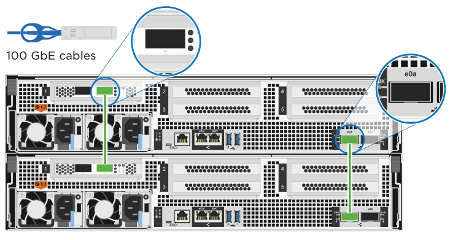
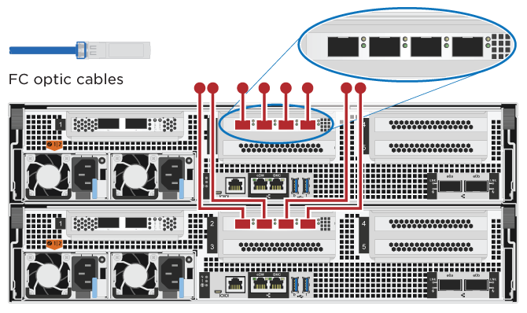
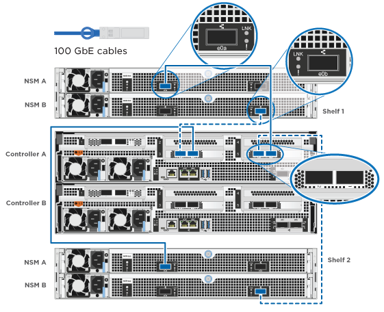

= 詳細な手順- ASA A800
:allow-uri-read: 
:icons: font
:imagesdir: ../media/

[role="lead"]
このページでは、ASA A800システムの設置手順について詳しく説明します。

== 手順 1 ：設置の準備

システムをインストールするには、アカウントを作成してシステムを登録する必要があります。また、システムに応じた適切な数とタイプのケーブルを準備し、特定のネットワーク情報を収集する必要があります。

にアクセスできる必要があります link:https://hwu.netapp.com["NetApp Hardware Universe の略"^] （ HWU ）を参照してください。サイト要件および構成済みシステム上の追加情報に関する情報が含まれます。へのアクセスも必要になる場合があります link:http://mysupport.netapp.com/documentation/productlibrary/index.html?productID=62286["使用している ONTAP のバージョンに対応したリリースノート"^] このシステムの詳細については、を参照してください。

.必要なもの
お客様のサイトで次のものを準備する必要があります。

* ストレージシステム用のラックスペース
* No.2 プラスドライバ
* Web ブラウザを使用してシステムをネットワークスイッチおよびラップトップまたはコンソールに接続するための追加のネットワークケーブル
+
.. すべての箱を開封して内容物を取り出します。
.. コントローラのシステムシリアル番号をメモします。
+
image::../media/drw_ssn_label.png[システムシリアル番号の例]

.手順
. アカウントを設定します。
+
.. 既存のアカウントにログインするか、アカウントを作成します。
.. 登録（link:https://mysupport.netapp.com/eservice/registerSNoAction.do?moduleName=RegisterMyProduct["ネットアップ製品登録"^]）をクリックします。

. ダウンロードしてインストールします link:https://mysupport.netapp.com/site/tools/tool-eula/activeiq-configadvisor["ネットアップのダウンロード： Config Advisor"^] ノートブック PC で。
. 同梱されていたケーブルの数と種類を確認し、書き留めておきます。
+
次の表に、同梱されているケーブルの種類を示します。表に記載されていないケーブルがある場合は、を参照してください link:https://hwu.netapp.com["NetApp Hardware Universe の略"^] ケーブルの場所を確認し、用途を特定します。

+
[cols="1,2,2,2"]
|===
| コネクタのタイプ | パーツ番号と長さ | ケーブルのタイプ | 用途 

 a| 
100GbE ケーブル
 a| 
X666211A-05 (112-00595) 、 0.5m

X66211-1 （ 112-00573 ）、 1m

X66211-2（112-00574）、2m

X66211-5 （ 112-00576 ）、 5m
 a| 
image:../media/oie_cable100_gbe_qsfp28.png["100GbE QSFP28コネクタ"]
 a| 
** HA インターコネクト
** クラスタインターコネクトネットワーク
** ストレージ / データ

 a| 
10GbE ケーブル
 a| 
X6566B-3-R6 （ 112-00300 ）、 3m ；

X6566B-5-R6 （ 112-00301 ）、 5m
 a| 
image:../media/oie_cable100_gbe_qsfp28.png["10GbE QSFP28コネクタ"]
 a| 
** データ

 a| 
25GbE ケーブル
 a| 
X66240A-2 （ 112-00598 ）、 2m ；

X66240A-5 （ 112-00600 ）、 5m
 a| 
image:../media/oie_cable100_gbe_qsfp28.png["25GbE QSFP28コネクタ"]
 a| 
** データ

 a| 
RJ-45 （注文内容による）
 a| 
該当なし
 a| 
image:../media/oie_cable_rj45.png["RJ-45ケーブルコネクタ"]
 a| 
** 管理

 a| 
ファイバチャネル
 a| 
X66250-2 （ 112-00342 ） 2m ；

X66250-5 （ 112-00344 ） 5m ；

X66250-15 （ 112-00346 ） 15m ；

X66250-30 （ 112-00347 ） 30m
 a| 
image:../media/oie_cable_fc_optical.png["OIEファイバチャネル光ケーブル"]
 a| 
** ネットワーク

 a| 
Micro-USB コンソールケーブル
 a| 
該当なし
 a| 
image:../media/oie_cable_micro_usb.png["マイクロUSBコネクタ"]
 a| 
** ソフトウェアのセットアップ中のコンソール接続

 a| 
電源ケーブル
 a| 
該当なし
 a| 
image:../media/oie_cable_power.png["電源ケーブル"]
 a| 
PSUと電源の接続

|===
. をダウンロードして実行します link:https://library.netapp.com/ecm/ecm_download_file/ECMLP2839002["クラスタ設定ワークシート"^]。

== 手順 2 ：ハードウェアを設置する

システムは、 4 ポストラックまたはネットアップシステムキャビネットのいずれかに設置する必要があります。

.手順
. 必要に応じてレールキットを取り付けます。
+
link:../platform-supplemental/superrail-install.html["丸穴 4 ポストラックへの SuperRail の取り付け"]

. レールキットに付属の手順書に従って、システムを設置して固定します。
+

NOTE: システムの重量に関連する安全上の注意事項を確認しておく必要があります。

+
image::../media/drw_affa800_weight_caution.png[4人でのリフトに関する注意]

. ケーブルマネジメントデバイスを取り付けます（図を参照）。
+
image::../media/drw_affa800_install_cable_mgmt.png[ケーブルマネジメントデバイスの取り付け]

. システムの前面にベゼルを配置します。

== 手順 3 ：コントローラをケーブル接続する

2 ノードスイッチレスクラスタメソッドまたはクラスタインターコネクトネットワークメソッドを使用して、プラットフォームのクラスタにケーブル接続が必要です。ファイバチャネル、 iSCSI ホストネットワーク、または直接接続型ストレージへのケーブル接続はオプションです。このケーブル接続は排他的ではなく、ホストネットワークとストレージにケーブルを接続できます。

=== 必要なケーブル接続：コントローラをクラスタにケーブル接続します

2 ノードスイッチレスクラスタメソッドまたはクラスタインターコネクトネットワークを使用して、コントローラをクラスタにケーブル接続します。

==== オプション 1 ： 2 ノードスイッチレスクラスタをケーブル接続

コントローラの管理ネットワークポートはスイッチに接続されます。HA インターコネクトポートとクラスタインターコネクトポートは、両方のコントローラでケーブル接続されます。

.作業を開始する前に
システムとスイッチの接続については、ネットワーク管理者にお問い合わせください。

図の矢印を見て、ケーブルコネクタのプルタブの正しい向きを確認してください。

image::../media/oie_cable_pull_tab_up.png[プルタブ付きケーブルコネクタ（上部）]

NOTE: コネクタを挿入すると、カチッという音がしてコネクタが所定の位置に収まるはずです。音がしない場合は、コネクタを取り外し、回転させてからもう一度試してください。

.手順
. アニメーションまたは表形式の手順を使用して、コントローラとスイッチの間のケーブル接続を完了します。
+
.アニメーション- 2ノードスイッチレスクラスタをケーブル接続
video::edc42447-f721-4cbe-b080-ab0c0123a139[panopto]
+
[cols="10,90"]
|===
| ステップ | 各コントローラモジュールでを実行します 

 a| 
image:../media/icon_square_1_dark_purple.png["番号1"]
 a| 
HA インターコネクトポートをケーブル接続します。

** e0b から e0b
** e1b~e1b

image:../media/drw_affa800_ha_pair_cabling.png["HAペアノケーブルセツゾク"]

 a| 
image:../media/icon_square_2_green.png["番号2"]
 a| 
クラスタインターコネクトポートをケーブル接続します。

** e0a から e0a
** e1a ~ e1a

 a| 
image:../media/icon_square_3_purple.png["手順 3"]
 a| 
管理ポートを管理ネットワークスイッチにケーブル接続します    image:../media/drw_affa800_mgmt_cabling.png["システム背面の管理ポートの場所を示す図"]

 a| 
image:../media/oie_legend_icon_attn_symbol.png["注意記号"]
 a| 
この時点ではまだ電源コードをプラグに接続しないでください。

|===
. オプションのケーブル接続を行うには、以下を参照してください
+
** <<オプション 1 ： Fibre Channel ホストネットワークにケーブルを接続する>>
** <<オプション 2 ： 10GbE ホストネットワークにケーブルを接続する>>
** <<オプション 3 ：コントローラを 1 台のドライブシェルフにケーブル接続する>>
** <<オプション 4 ：コントローラを 2 台のドライブシェルフにケーブル接続する>>

. システムのセットアップを完了するには、を参照してください link:install-detailed-guide.html#step-4-complete-system-setup-and-configuration["手順 4 ：システムのセットアップと設定を完了する"]。

==== オプション 2 ：スイッチクラスタをケーブル接続する

コントローラのクラスタインターコネクト / 管理ネットワークポートはスイッチに接続され、 HA インターコネクトポートは両方のコントローラでケーブル接続されます。

.作業を開始する前に
システムとスイッチの接続については、ネットワーク管理者にお問い合わせください。

図の矢印を見て、ケーブルコネクタのプルタブの正しい向きを確認してください。

image::../media/oie_cable_pull_tab_up.png[プルタブ付きケーブルコネクタ（上部）]

NOTE: コネクタを挿入すると、カチッという音がしてコネクタが所定の位置に収まるはずです。音がしない場合は、コネクタを取り外し、回転させてからもう一度試してください。

.手順
. アニメーションまたは表形式の手順を使用して、コントローラとスイッチの間のケーブル接続を完了します。
+
.アニメーション-スイッチクラスタをケーブル接続します
video::49e48140-4c5a-4395-a7d7-ab0c0123a10e[panopto]
+
[cols="10,90"]
|===
| ステップ | 各コントローラモジュールでを実行します 

 a| 
image:../media/icon_square_1_dark_purple.png["番号1"]
 a| 
HA インターコネクトポートをケーブル接続します。

** e0b から e0b
** e1b~e1b

image:../media/drw_affa800_ha_pair_cabling.png["HAペアノケーブルセツゾク"]

 a| 
image:../media/icon_square_2_green.png["番号2"]
 a| 
クラスタインターコネクトポートを 100GbE クラスタインターコネクトスイッチにケーブル接続します。

** e0a
** E1A

image:../media/drw_affa800_switched_clust_cabling.png["クラスタインターコネクトのケーブル接続"]

 a| 
image:../media/icon_square_3_purple.png["手順 3"]
 a| 
管理ポートを管理ネットワークスイッチにケーブル接続します    image:../media/drw_affa800_mgmt_cabling.png["システム背面の管理ポートの場所を示す図"]

 a| 
image:../media/oie_legend_icon_attn_symbol.png["注意記号"]
 a| 
この時点ではまだ電源コードをプラグに接続しないでください。

|===
. オプションのケーブル接続を行うには、以下を参照してください
+
** <<オプション 1 ： Fibre Channel ホストネットワークにケーブルを接続する>>
** <<オプション 2 ： 10GbE ホストネットワークにケーブルを接続する>>
** <<オプション 3 ：コントローラを 1 台のドライブシェルフにケーブル接続する>>
** <<オプション 4 ：コントローラを 2 台のドライブシェルフにケーブル接続する>>

. システムのセットアップを完了するには、を参照してください link:install-detailed-guide.html#step-4-complete-system-setup-and-configuration["手順 4 ：システムのセットアップと設定を完了する"]。

=== オプションのケーブル接続：ケーブル構成に依存するオプション

オプションで、 Fibre Channel または iSCSI ホストネットワークまたは直接接続型ストレージに、構成に依存するケーブルを接続します。このケーブル接続は排他的ではなく、ホストネットワークおよびストレージにケーブル接続できます。

==== オプション 1 ： Fibre Channel ホストネットワークにケーブルを接続する

コントローラの Fibre Channel ポートは、 Fibre Channel ホストネットワークスイッチに接続されます。

.作業を開始する前に
システムとスイッチの接続については、ネットワーク管理者にお問い合わせください。

図の矢印を見て、ケーブルコネクタのプルタブの正しい向きを確認してください。

image::../media/oie_cable_pull_tab_up.png[プルタブ付きケーブルコネクタ（上部）]

NOTE: コネクタを挿入すると、カチッという音がしてコネクタが所定の位置に収まるはずです。音がしない場合は、コネクタを取り外し、回転させてからもう一度試してください。

[cols="10,90"]
|===
| ステップ | 各コントローラモジュールでを実行します 

 a| 
1.
 a| 
ポート 2a~2d を FC ホストスイッチにケーブル接続します。

 a| 
2.
 a| 
その他のオプションのケーブル接続を行うには、次のいずれかを選択します

* <<オプション 3 ：コントローラを 1 台のドライブシェルフにケーブル接続する>>
* <<オプション 4 ：コントローラを 2 台のドライブシェルフにケーブル接続する>>

 a| 
3.
 a| 
システムのセットアップを完了するには、を参照してください link:install-detailed-guide.html#step-4-complete-system-setup-and-configuration["手順 4 ：システムのセットアップと設定を完了する"]。

|===

==== オプション 2 ： 10GbE ホストネットワークにケーブルを接続する

コントローラの 10GbE ポートは、 10GbE ホストネットワークスイッチに接続されます。

.作業を開始する前に
システムとスイッチの接続については、ネットワーク管理者にお問い合わせください。

図の矢印を見て、ケーブルコネクタのプルタブの正しい向きを確認してください。

image::../media/oie_cable_pull_tab_up.png[プルタブ付きケーブルコネクタ（上部）]

NOTE: コネクタを挿入すると、カチッという音がしてコネクタが所定の位置に収まるはずです。音がしない場合は、コネクタを取り外し、回転させてからもう一度試してください。

[cols="10,90"]
|===
| ステップ | 各コントローラモジュールでを実行します 

 a| 
1.
 a| 
ポート e4A から e4d を 10GbE ホストネットワークスイッチにケーブル接続します。image:../media/drw_affa800_10gbe_host_cabling.png["ホストネットワークのケーブル接続"]

 a| 
2.
 a| 
その他のオプションのケーブル接続を行うには、次のいずれかを選択します

* <<オプション 3 ：コントローラを 1 台のドライブシェルフにケーブル接続する>>
* <<オプション 4 ：コントローラを 2 台のドライブシェルフにケーブル接続する>>

 a| 
3.
 a| 
システムのセットアップを完了するには、を参照してください link:install-detailed-guide.html#step-4-complete-system-setup-and-configuration["手順 4 ：システムのセットアップと設定を完了する"]。

|===

==== オプション 3 ：コントローラを 1 台のドライブシェルフにケーブル接続する

各コントローラを、 NS224 ドライブシェルフの NSM モジュールにケーブル接続する必要があります。

.作業を開始する前に
図の矢印を見て、ケーブルコネクタのプルタブの正しい向きを確認してください。

image::../media/oie_cable_pull_tab_up.png[プルタブ付きケーブルコネクタ（上部）]

NOTE: コネクタを挿入すると、カチッという音がしてコネクタが所定の位置に収まるはずです。音がしない場合は、コネクタを取り外し、回転させてからもう一度試してください。

アニメーションまたは表形式の手順を使用して、1台のシェルフにコントローラをケーブル接続します。

.アニメーション-コントローラを1台のドライブシェルフにケーブル接続します
video::09dade4f-00bd-4d41-97d7-ab0c0123a0b4[panopto]
[cols="10,90"]
|===
| ステップ | 各コントローラモジュールでを実行します 

 a| 
image:../media/icon_square_1_blue.png["番号1"]
 a| 
コントローラ A をシェルフにケーブル接続します。    image:../media/drw_affa800_1shelf_cabling_a.png["1台のシェルフへのコントローラのケーブル接続"]

 a| 
image:../media/icon_square_2_yellow.png["番号2"]
 a| 
コントローラ B をシェルフにケーブル接続します。    image:../media/drw_affa800_1shelf_cabling_b.png["コントロオラBトタンイチノシエルフノケエフル"]

|===
システムのセットアップを完了するには、を参照してください link:install-detailed-guide.html#step-4-complete-system-setup-and-configuration["手順 4 ：システムのセットアップと設定を完了する"]。

==== オプション 4 ：コントローラを 2 台のドライブシェルフにケーブル接続する

各コントローラを両方の NS224 ドライブシェルフの NSM モジュールにケーブル接続する必要があります。

.作業を開始する前に
図の矢印を見て、ケーブルコネクタのプルタブの正しい向きを確認してください。

image::../media/oie_cable_pull_tab_up.png[プルタブ付きケーブルコネクタ（上部）]

NOTE: コネクタを挿入すると、カチッという音がしてコネクタが所定の位置に収まるはずです。音がしない場合は、コネクタを取り外し、回転させてからもう一度試してください。

アニメーションまたは表形式の手順を使用して、2台のドライブシェルフにコントローラをケーブル接続します。

.アニメーション-コントローラを2台のドライブシェルフにケーブル接続します
video::fe50ac38-9375-4e6b-85af-ab0c0123a0e0[panopto]
[cols="10,90"]
|===
| ステップ | 各コントローラモジュールでを実行します 

 a| 
image:../media/icon_square_1_blue.png["番号1"]
 a| 
コントローラ A をシェルフにケーブル接続します。    

 a| 
image:../media/icon_square_2_yellow.png["番号2"]
 a| 
コントローラ B をシェルフにケーブル接続します。    image:../media/drw_affa800_2shelf_cabling_b.png["コントローラBと2台のシェルフのケーブル接続"]

|===
システムのセットアップを完了するには、を参照してください link:install-detailed-guide.html#step-4-complete-system-setup-and-configuration["手順 4 ：システムのセットアップと設定を完了する"]。

== 手順 4 ：システムのセットアップと設定を完了する

スイッチとラップトップのみを接続したクラスタ検出を使用するか、システムのコントローラに直接接続してから管理スイッチに接続して、システムのセットアップと設定を実行します。

=== オプション 1 ：ネットワーク検出が有効になっている場合は、システムのセットアップと設定を実行する

ラップトップでネットワーク検出が有効になっている場合は、クラスタの自動検出を使用してシステムのセットアップと設定を実行できます。

.手順
. 電源コードをコントローラの電源装置に接続し、さらに別の回路の電源に接続します。
+
システムがブートを開始します。初回のブートには最大 8 分かかる場合があります。

. ラップトップでネットワーク検出が有効になっていることを確認します。
+
詳細については、ラップトップのオンラインヘルプを参照してください。

. アニメーションに従って、ラップトップを管理スイッチに接続します。
+
.アニメーション-ラップトップを管理スイッチに接続します
video::d61f983e-f911-4b76-8b3a-ab1b0066909b[panopto]
. 検出する ONTAP アイコンを選択します。
+
image::../media/drw_autodiscovery_controler_select_ieops-1849.svg[ONTAPアイコンの選択]

+
.. エクスプローラを開きます。
.. 左側のペインで*[ネットワーク]*をクリックし、右クリックして*[更新]*を選択します。
.. いずれかの ONTAP アイコンをダブルクリックし、画面に表示された証明書を受け入れます。
+

NOTE: 「 XXXXX 」は、ターゲットノードのシステムシリアル番号です。

+
System Manager が開きます。

. System Manager のセットアップガイドを使用して、で収集したデータを基にシステムを設定します link:https://library.netapp.com/ecm/ecm_download_file/ECMLP2862613["『 ONTAP 構成ガイド』"^]。
. Config Advisor を実行してシステムの健全性を確認します。
. 初期設定が完了したら、ONTAPのその他の機能の設定についてに進みます https://docs.netapp.com/us-en/ontap/index.html["ONTAP 9 のドキュメント"^]。

=== オプション 2 ：ネットワーク検出が有効になっていない場合は、システムのセットアップと設定を実行する

ラップトップでネットワーク検出が有効になっていない場合は、このタスクを使用して設定とセットアップを実行する必要があります。

.手順
. ラップトップまたはコンソールをケーブル接続して設定します。
+
.. ラップトップまたはコンソールのコンソールポートを、 115 、 200 ボー、 N-8-1 に設定します。
+

NOTE: コンソールポートの設定方法については、ラップトップまたはコンソールのオンラインヘルプを参照してください。

.. ラップトップまたはコンソールにコンソールケーブルを接続し、システムに付属のコンソールケーブルを使用してコントローラのコンソールポートに接続します。
+
image::../media/drw_console_connect_affa800.png[コンソールポートへの接続]

.. ラップトップまたはコンソールを管理サブネット上のスイッチに接続します。
+
image::../media/drw_client_mgmt_subnet_affa800.png[ラップトップマタハコンソールヲカンリサブネットノスイッチニセツゾク]

.. 管理サブネット上の TCP / IP アドレスをラップトップまたはコンソールに割り当てます。

. 電源コードをコントローラの電源装置に接続し、さらに別の回路の電源に接続します。
+
システムがブートを開始します。初回のブートには最大 8 分かかる場合があります。

. いずれかのノードに初期ノード管理 IP アドレスを割り当てます。
+
[cols="1,2"]
|===
| 管理ネットワークでの DHCP の状況 | 作業 

 a| 
を設定します
 a| 
新しいコントローラに割り当てられた IP アドレスを記録します。

 a| 
未設定
 a| 
.. PuTTY 、ターミナルサーバ、または環境に対応した同等の機能を使用して、コンソールセッションを開きます。
+

NOTE: PuTTY の設定方法がわからない場合は、ラップトップまたはコンソールのオンラインヘルプを確認してください。

.. スクリプトからプロンプトが表示されたら、管理 IP アドレスを入力します。

|===
. ラップトップまたはコンソールで、 System Manager を使用してクラスタを設定します。
+
.. ブラウザでノード管理 IP アドレスを指定します。
+

NOTE: アドレスの形式は、 +https://x.x.x.x+ です。

.. で収集したデータを使用してシステムを設定します link:https://library.netapp.com/ecm/ecm_download_file/ECMLP2862613["『 ONTAP 構成ガイド』"^]。

. Config Advisor を実行してシステムの健全性を確認します。
. 初期設定が完了したら、ONTAPのその他の機能の設定についてに進みます https://docs.netapp.com/us-en/ontap/index.html["ONTAP 9 のドキュメント"^]。

