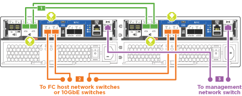
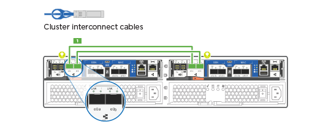
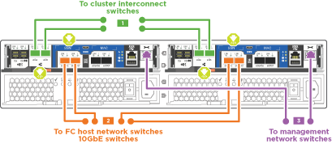

= ステップの詳細 - AFF C190
:allow-uri-read: 
:icons: font
:imagesdir: ../media/

[role="lead"]
このセクションでは、 AFF C190 システムをインストールする手順について詳しく説明します。

== 手順 1 ：設置の準備

AFF C190システムをインストールするには、アカウントを作成してシステムを登録します。また、システムに応じた適切な数とタイプのケーブルを準備し、特定のネットワーク情報を収集する必要があります。

.作業を開始する前に
* にアクセスできることを確認します link:https://hwu.netapp.com["NetApp Hardware Universe の略"^] （ HWU ）を参照してください。サイト要件および構成済みシステム上の追加情報に関する情報が含まれます。
* にアクセスできることを確認します link:http://mysupport.netapp.com/documentation/productlibrary/index.html?productID=62286["リリースノート"^] ONTAP のバージョンに応じて、このシステムの詳細情報を確認してください。
* サイトに次のアイテムがあることを確認します。
+
** ストレージシステム用のラックスペース
** No.2 プラスドライバ
** Web ブラウザを使用してシステムをネットワークスイッチおよびラップトップまたはコンソールに接続するための追加のネットワークケーブル
** RJ-45 接続を備え、 Web ブラウザにアクセスできるラップトップまたはコンソール

.手順
. すべての箱を開封して内容物を取り出します。
. コントローラのシステムシリアル番号をメモします。
+
image::../media/drw_ssn_label.png[システムシリアル番号の場所を示す例]

. アカウントを設定します。
+
.. 既存のアカウントにログインするか、アカウントを作成します。
.. 登録（link:https://mysupport.netapp.com/eservice/registerSNoAction.do?moduleName=RegisterMyProduct["ネットアップ製品登録"^]）をクリックします。

. ダウンロードしてインストールします link:https://mysupport.netapp.com/site/tools/tool-eula/activeiq-configadvisor["ネットアップのダウンロード： Config Advisor"^] ノートブック PC で。
. 同梱されていたケーブルの数と種類を確認し、書き留めておきます。
+
次の表に、同梱されているケーブルの種類を示します。表に記載されていないケーブルがある場合は、を参照してください link:https://hwu.netapp.com["NetApp Hardware Universe の略"^] ケーブルの場所を確認し、用途を特定します。

+
[cols="1,2,1,2"]
|===
| ケーブルのタイプ | パーツ番号と長さ | コネクタのタイプ | 用途 

 a| 
10GbE ケーブル（注文内容による）
 a| 
X6566B-05-R6 （ 112-00297 ）、 0.5m

X6566B-2-R6 （ 112-00299 ）、 2m
 a| 
image:../media/oie_cable_sfp_gbe_copper.png["GbE SFP銅線コネクタ"]
 a| 
クラスタインターコネクトネットワーク

 a| 
X6566B-2-R6 （ 112-00299 ）、 2m

X6566B-3-R6 （ 112-00300 ）、 3m

X6566B-5-R6 （ 112-00301 ）、 5m
 a| 
データ

 a| 
光ネットワークケーブル（注文内容による）
 a| 
X6553-R6 （ 112-00188 ）、 2m

X6536-R6 （ 112-00090 ）、 5m

X6554-R6 （ 112-00189 ）、 15m
 a| 
image:../media/oie_sfp_optical.png[""]

image::../media/oie_cable_fiber_lc_connector.png[OIE ケーブルファイバ LC コネクタ]
 a| 
SFP + FC ホストネットワーク

 a| 
Cat 6 、 RJ-45 （注文内容による）
 a| 
X6585-R6 （ 112-00291 ）、 3m

X6562-R6 （ 112-00196 ）、 5m
 a| 
image:../media/oie_cable_rj45.png["RJ-45ケーブルコネクタ"]
 a| 
イーサネットホストおよび管理ネットワーク

 a| 
Micro-USB コンソールケーブル
 a| 
該当なし
 a| 
image:../media/oie_cable_micro_usb.png["マイクロUSBコネクタを示す図"]
 a| 
Windows または Mac 以外のラップトップ / コンソールでソフトウェアをセットアップする際のコンソール接続

 a| 
電源ケーブル
 a| 
該当なし
 a| 
image:../media/oie_cable_power.png["電源ケーブル"]
 a| 
システムの電源をオンにします

|===
. をダウンロードして実行します link:https://library.netapp.com/ecm/ecm_download_file/ECMLP2839002["クラスタ設定ワークシート"^]。

== 手順 2 ：ハードウェアを設置する

システムを4ポストラックまたはネットアップシステムキャビネットに設置します。

.手順
. 必要に応じてレールキットを取り付けます。
. レールキットに付属の手順書に従って、システムを設置して固定します。
+

NOTE: システムの重量に関連する安全上の注意事項を確認しておく必要があります。

+
image::../media/drw_oie_fas2700_weight_caution.png[2人で持ち上げる場合の注意]

. ケーブルマネジメントデバイスを取り付けます（図を参照）。
+
image::../media/drw_cable_management_arm_install.png[ケーブルマネジメントデバイスの接続]

. システムの前面にベゼルを配置します。

== 手順 3 ：コントローラをネットワークに接続する

2ノードスイッチレスクラスタまたはクラスタインターコネクトネットワークを使用して、コントローラをネットワークにケーブル接続します。

次の表に、2ノードスイッチレスクラスタネットワークのケーブル接続とスイッチクラスタネットワークのケーブル接続の両方について、図中のコールアウト番号とケーブルの色を記載したケーブルタイプを示します。

[cols="20%,80%"]
|===
| ケーブル配線 | 接続タイプ 

 a| 
image::../media/oie_legend_icon_1_lg.svg[OIEの凡例アイコン1LG]
 a| 
クラスタインターコネクト

 a| 
image::../media/oie_legend_icon_2_o.svg[OIE凡例アイコン2 o]
 a| 
コントローラはデータネットワークスイッチをホストします

 a| 
image::../media/oie_legend_icon_3_lp.svg[OIE凡例アイコン3 LP]
 a| 
コントローラと管理ネットワークスイッチ

|===
[role="tabbed-block"]
====
.オプション 1 ： 2 ノードスイッチレスクラスタ
--
2ノードスイッチレスクラスタのケーブル接続方法について説明します。

.作業を開始する前に
システムとスイッチの接続については、ネットワーク管理者にお問い合わせください。

図の矢印を見て、ケーブルコネクタのプルタブの正しい向きを確認してください。

image::../media/oie_cable_pull_tab_down.png[下部にプルタブ付きケーブルコネクタ]

NOTE: コネクタを挿入すると、カチッという音がしてコネクタが所定の位置に収まるはずです。音がしない場合は、コネクタを取り外し、回転させてからもう一度試してください。

NOTE: 光スイッチに接続する場合は、ポートにケーブル接続する前に、 SFP をコントローラポートに挿入します。

.このタスクについて
コントローラとスイッチをケーブル接続する場合は、次のケーブル接続図を参照してください。

UTA2データネットワーク構成::
+
--

--
イーサネットネットワーク構成::
+
--
image::../media/drw_c190_tnsc_ethernet_network_cabling_animated_gif.png[DRW C190 TNSC イーサネットネットワークケーブル配線のアニメーション GIF]

--

各コントローラモジュールで次の手順を実行します。

.手順
. クラスタインターコネクトケーブルを使用して、クラスタインターコネクトポートe0aとe0a、e0bとe0bを接続します。
 [+]

. コントローラをUTA2データネットワークまたはイーサネットネットワークにケーブル接続します。
+
UTA2データネットワーク構成:: 次のいずれかのタイプのケーブルを使用して、データポートe0c/0cとe0d/0dまたはe0e/0eとe0f/0fをホストネットワークに接続します。
+
--
image:../media/drw_c190_u_fc_10gbe_cbling.png["説明が付随しているデータポート接続の図"]

--
イーサネットネットワーク構成:: Cat 6 RJ45ケーブルを使用して、e0c~e0fポートをホストネットワークに接続します。次の図に示します。
+
--
image:../media/drw_c190_e_rj45_cbling.png["ホストネットワークのケーブル接続"]

--

. RJ45 ケーブルを使用して、 e0M ポートを管理ネットワークスイッチに接続します。
+
image:../media/drw_c190_u_mgmt_cbling.png["管理ポートのケーブル接続"]

IMPORTANT: この時点ではまだ電源コードをプラグに接続しないでください。

--
.オプション 2 ：スイッチクラスタ
--
スイッチクラスタのケーブル接続方法について説明します。

.作業を開始する前に
システムとスイッチの接続については、ネットワーク管理者にお問い合わせください。

図の矢印を見て、ケーブルコネクタのプルタブの正しい向きを確認してください。

image::../media/oie_cable_pull_tab_down.png[下部にプルタブ付きケーブルコネクタ]

NOTE: コネクタを挿入すると、カチッという音がしてコネクタが所定の位置に収まるはずです。音がしない場合は、コネクタを取り外し、回転させてからもう一度試してください。

NOTE: 光スイッチに接続する場合は、ポートにケーブル接続する前に、 SFP をコントローラポートに挿入します。

.このタスクについて
コントローラとスイッチをケーブル接続する場合は、次のケーブル接続図を参照してください。

ユニファイドネットワーク構成::
+
--

--
イーサネットネットワーク構成::
+
--
image::../media/drw_c190_switched_ethernet_network_cabling_animated.png[DRW C190 スイッチドイーサネットネットワークのケーブル配線のアニメーション]

--

各コントローラモジュールで次の手順を実行します。

.手順
. クラスタインターコネクトケーブルを使用して、e0aとe0bをクラスタインターコネクトスイッチに接続します。
+
image:../media/drw_c190_u_switched_clust_cbling.png["クラスタインターコネクトのケーブル接続"]

. コントローラをUTA2データネットワークまたはイーサネットネットワークにケーブル接続します。
+
UTA2データネットワーク構成:: 次のいずれかのタイプのケーブルを使用して、データポートe0c/0cとe0d/0dまたはe0e/0eとe0f/0fをホストネットワークに接続します。
+
--
image:../media/drw_c190_u_fc_10gbe_cbling.png["説明が付随しているデータポート接続の図"]

--
イーサネットネットワーク構成:: Cat 6 RJ45ケーブルを使用して、e0c~e0fポートをホストネットワークに接続します。
+
--
image:../media/drw_c190_e_rj45_cbling.png["ホストネットワークのケーブル接続"]

--

. RJ45 ケーブルを使用して、 e0M ポートを管理ネットワークスイッチに接続します。
+
image:../media/drw_c190_u_mgmt_cbling.png["管理ポートのケーブル接続"]

IMPORTANT: この時点ではまだ電源コードをプラグに接続しないでください。

--
====

== 手順4：システムのセットアップを完了します

スイッチとラップトップのみを接続したクラスタ検出を使用するか、システムのコントローラに直接接続してから管理スイッチに接続して、システムのセットアップと設定を実行します。

[role="tabbed-block"]
====
.オプション 1 ：ネットワーク検出が有効になっている場合
--
ラップトップでネットワーク検出が有効になっている場合に、システムセットアップを完了する方法について説明します。

.手順
. 電源コードをコントローラの電源装置に接続し、さらに別の回路の電源に接続します。
. 両方のノードの電源スイッチをオンにします。
+
image::../media/drw_turn_on_power_switches_to_psus.png[電源の投入]

+

NOTE: 初回のブートには最大で 8 分かかる場合があります。

. ラップトップでネットワーク検出が有効になっていることを確認します。
+
詳細については、ラップトップのオンラインヘルプを参照してください。

. ラップトップを管理スイッチに接続します。

image::../media/dwr_laptop_to_switch_only.svg[DWR ラップトップをスイッチのみに接続します]

. 検出する ONTAP アイコンを選択します。
+
image::../media/drw_autodiscovery_controler_select.png[ONTAPアイコンの選択]

+
.. エクスプローラを開きます。
.. 左側のペインで、 *Network* をクリックします。
.. 右クリックし、 * 更新 * を選択します。
.. いずれかの ONTAP アイコンをダブルクリックし、画面に表示された証明書を受け入れます。
+

NOTE: 「 XXXXX 」は、ターゲットノードのシステムシリアル番号です。

+
System Manager が開きます。

. System Manager のセットアップガイドを使用して、で収集したデータを基にシステムを設定します link:https://library.netapp.com/ecm/ecm_download_file/ECMLP2862613["『 ONTAP 構成ガイド』"^]。
. Config Advisor を実行してシステムの健全性を確認します。
. 初期設定が完了したら、に進みます link:https://docs.netapp.com/us-en/ontap-family/["ONTAP のドキュメント"] ONTAP の追加機能の設定については、サイトを参照してください。
+

NOTE: ユニファイド構成システムのデフォルトのポート設定は CNA モードです。 FC ホストネットワークに接続する場合は、ポートを FC モードに変更する必要があります。

--
.オプション 2 ：ネットワーク検出が有効になっていない場合
--
ラップトップでネットワーク検出が有効になっていない場合のシステムセットアップの完了方法について説明します。

.手順
. ラップトップまたはコンソールをケーブル接続して設定します。
+
.. ラップトップまたはコンソールのコンソールポートを、 115 、 200 ボー、 N-8-1 に設定します。
+

NOTE: コンソールポートの設定方法については、ラップトップまたはコンソールのオンラインヘルプを参照してください。

.. ラップトップまたはコンソールにコンソールケーブルを接続し、システムに付属のコンソールケーブルを使用してコントローラのコンソールポートに接続します。
+
image::../media/drw_console_connect_fas2700_affa200.png[コンソールポートへの接続]

.. ラップトップまたはコンソールを管理サブネット上のスイッチに接続します。
+
image::../media/drw_client_to_mgmt_subnet_fas2700_affa220.png[管理サブネットへの接続]

.. 管理サブネット上の TCP / IP アドレスをラップトップまたはコンソールに割り当てます。

. 電源コードをコントローラの電源装置に接続し、さらに別の回路の電源に接続します。
. 両方のノードの電源スイッチをオンにします。
+
image::../media/drw_turn_on_power_switches_to_psus.png[電源の投入]

+

NOTE: 初回のブートには最大で 8 分かかる場合があります。

. いずれかのノードに初期ノード管理 IP アドレスを割り当てます。
+
[cols="1,2"]
|===
| 管理ネットワークでの DHCP の状況 | 作業 

 a| 
を設定します
 a| 
新しいコントローラに割り当てられた IP アドレスを記録します。

 a| 
未設定
 a| 
.. PuTTY 、ターミナルサーバ、または環境に対応した同等の機能を使用して、コンソールセッションを開きます。
+

NOTE: PuTTY の設定方法がわからない場合は、ラップトップまたはコンソールのオンラインヘルプを確認してください。

.. スクリプトからプロンプトが表示されたら、管理 IP アドレスを入力します。

|===
. ラップトップまたはコンソールで、 System Manager を使用してクラスタを設定します。
+
.. ブラウザでノード管理 IP アドレスを指定します。
+

NOTE: アドレスの形式は、 +https://x.x.x.x+ です。

.. で収集したデータを使用してシステムを設定します link:https://library.netapp.com/ecm/ecm_download_file/ECMLP2862613["『 ONTAP 構成ガイド』"^]。

. Config Advisor を実行してシステムの健全性を確認します。
. 初期設定が完了したら、に進みます link:https://docs.netapp.com/us-en/ontap-family/["ONTAP  ocumentationの略"] ONTAP の追加機能の設定については、サイトを参照してください。
+

NOTE: ユニファイド構成システムのデフォルトのポート設定は CNA モードです。 FC ホストネットワークに接続する場合は、ポートを FC モードに変更する必要があります。

--
====