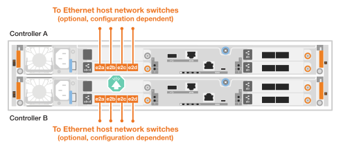

= ハードウェアのケーブル接続- AFF C30とAFF C60
:allow-uri-read: 
:icons: font
:imagesdir: ../media/

[role="lead"]
AFF C30またはAFF C60ストレージシステムハードウェアを設置したら、コントローラをネットワークおよびシェルフにケーブル接続します。

.作業を開始する前に
ストレージシステムをネットワークスイッチに接続する方法については、ネットワーク管理者にお問い合わせください。

.このタスクについて
* 一般的な構成については、クラスタ/ HAおよびホストネットワークのケーブル接続手順を参照してください。具体的なケーブル接続は、ご使用のストレージシステム用に注文したコンポーネントによって異なることに注意してください。設定およびスロットプライオリティの詳細については、を参照してください link:https://hwu.netapp.com["NetApp Hardware Universe の略"^]。
* ケーブル配線図には、ポートにコネクタを挿入する際のケーブルコネクタプルタブの正しい方向（上または下）を示す矢印アイコンがあります。
+
コネクタを挿入すると、カチッという音がしてコネクタが所定の位置に収まるはずです。カチッと音がしない場合は、コネクタを取り外し、裏返してもう一度試してください。

+
image:../media/drw_cable_pull_tab_direction_ieops-1699.svg["ケーブルプルタブの方向"]

* 光スイッチにケーブル接続する場合は、光トランシーバをコントローラポートに挿入してから、スイッチポートにケーブル接続します。

== 手順1：クラスタ/ HAをケーブル接続する

コントローラをONTAPクラスタにケーブル接続します。この手順は、ストレージシステムのモデルおよびI/Oモジュールの構成によって異なります。

[role="tabbed-block"]
====
.スイッチレスクラスタのケーブル接続
--
コントローラを相互にケーブル接続して、ONTAPクラスタ接続を作成します。

.2ポート100GbE I/Oモジュールを2つ搭載したAFF A30またはA50
[%collapsible]
=====
スロット2および4のI/Oモジュールポートは、40 / 100GbEポートです。これは30-50にのみ適用されますか。はいの場合は、2つのノートを残しておきますが、3つすべてに適用される場合は、セクションのリードテキストの下に新しい段落を移動します。

.手順
. クラスタ/ HAインターコネクト接続をケーブル接続します。
+

NOTE: クラスタインターコネクトトラフィックとHAトラフィックは、同じ物理ポートを共有します。

+
.. コントローラAのポートe2aをコントローラBのポートe2aにケーブル接続します。
.. コントローラAのポートe4aをコントローラBのポートe4aにケーブル接続します。
+

NOTE: スロット2および4のI/Oモジュールのポートe2bおよびe4bは未使用で、必要に応じてフロントエンド（ホストネットワーク）接続に使用できます。

+
*クラスタ/ HAインターコネクトケーブル*

+
image::../media/oie_cable_25Gb_Ethernet_SFP28_IEOPS-1069.svg[クラスタHAケーブル]

+
image::../media/drw_isi_a30-50_switchless_2p_100gbe_2card_cabling_ieops-2011.svg[2つの100GbE IOモジュールを使用した2ノードスイッチレスクラスタのケーブル接続図]

=====
.AFF A30またはA50（2ポート100GbE I/Oモジュール×1）
[%collapsible]
=====
スロット2および4のI/Oモジュールポートは、40 / 100GbEポートです。

.手順
. クラスタ/ HAインターコネクト接続をケーブル接続します。
+

NOTE: クラスタインターコネクトトラフィックとHAトラフィックは、同じ物理ポートを共有します。

+
.. コントローラAのポートe4aをコントローラBのポートe4aにケーブル接続します。
.. コントローラAのポートe4bをコントローラBのポートe4bにケーブル接続します。
+
*クラスタ/ HAインターコネクトケーブル*

+
image::../media/oie_cable_25Gb_Ethernet_SFP28_IEOPS-1069.svg[クラスタHAケーブル]

+
image::../media/drw_isi_a30-50_switchless_2p_100gbe_1card_cabling_ieops-1925.svg[1つの100GbE IOモジュールを使用した2ノードスイッチレスクラスタのケーブル接続図]

=====
.AFF A20（2ポート10 / 25GbE I/Oモジュール×1）
[%collapsible]
=====
例を追加

+image:../media/oie_cable_sfp_gbe_copper.png["GbE SFP銅線コネクタ"]

+

=====
--
.スイッチクラスタのケーブル接続
--
コントローラをクラスタネットワークスイッチにケーブル接続して、ONTAPクラスタ接続を作成します。

.2ポート100GbE I/Oモジュールを2つ搭載したAFF A30またはA50
[%collapsible]
=====
例を追加

メモを追加：スロット2と4のI/Oモジュールの40 / 100GbEポートe2bとe4bは未使用で、必要に応じてフロントエンド接続に使用できます。

=====
.AFF A30またはA50（2ポート100GbE I/Oモジュール×1）
[%collapsible]
=====
.手順
. コントローラをクラスタネットワークスイッチにケーブル接続します。
+

NOTE: クラスタインターコネクトトラフィックとHAトラフィックは、同じ物理ポートを共有します。

+
.. コントローラAのポートe4aとコントローラBのポートe4aをクラスタネットワークスイッチAにケーブル接続します。
.. コントローラAのポートe4bとコントローラBのポートe4bをクラスタネットワークスイッチBにケーブル接続します。
+
*クラスタ/ HAインターコネクトケーブル*

+
image::../media/oie_cable100_gbe_qsfp28.png[100Gbケーブル]

+
image::../media/drw_isi_a30-50_2p_100gbe_1card_switched_cabling_ieops-1926.svg[クラスタネットワークへのクラスタ接続のケーブル接続]

=====
.AFF A20（2ポート10 / 25GbE I/Oモジュール×1）
[%collapsible]
=====
例を追加

=====
--
====

== 手順2：ホストネットワーク接続をケーブル接続する

コントローラをホストネットワークにケーブル接続します。この手順は、ストレージシステムのモデルおよびI/Oモジュールの構成によって異なります。ホスト接続は40 / 100GbEです。

.2ポート100GbE I/Oモジュールを2つ搭載したAFF A30またはA50
[%collapsible]
====
テキスト（ Text ）

====
.AFF A30またはA50（2ポート100GbE I/Oモジュール×1）
[%collapsible]
====
. ホストネットワーク接続をケーブル接続します。
+
次に、オプションのホストネットワークケーブル接続の例を示します。必要に応じて、ご使用のストレージ・システム構成に対応するを参照してくださいlink:https://hwu.netapp.com["NetApp Hardware Universe の略"^]。

+
.. オプション：40 / 100GbEホストネットワークスイッチへのケーブル接続
+
各コントローラのポートe2a、e2b、e2c、e2dをイーサネットホストネットワークスイッチにケーブル接続します。

+
* 40/100GbEケーブル*

+
image::../media/oie_cable_sfp_gbe_copper.png[40 / 100Gbケーブル]

+

.. オプション：FCホストネットワークスイッチへのケーブル接続
+
各コントローラのポート1a、1b、1c、1dをFCホストネットワークスイッチにケーブル接続します。

+
* 64 Gb/秒FCケーブル*

+
image::../media/oie_cable_sfp_gbe_copper.png[64Gb FCケーブル]

+
image::../media/drw_isi_a30-50_4p_64gb_fc_1card_cabling_ieops-1924.svg[64Gb FCホストネットワークスイッチへのケーブル接続]

====
.AFF A20（2ポート100GbEモジュール×1）
[%collapsible]
====
テキストの追加

====

== 手順3：管理ネットワークをケーブル接続する

コントローラを管理ネットワークにケーブル接続します。

. 各コントローラの管理（レンチマーク）ポートを管理ネットワークスイッチにケーブル接続します。
+
* 1000BASE-T RJ-45ケーブル*

+
image::../media/oie_cable_rj45.png[RJ-45ケーブル]

+
image::../media/drw_isi_g_wrench_cabling_ieops-1928.svg[管理ネットワークへの接続]

IMPORTANT: まだ電源コードを接続しないでください。

== 手順4：シェルフをケーブル接続する

この手順では、1台のNS224シェルフにコントローラをケーブル接続する方法を示します。

.このタスクについて
* ストレージシステムでサポートされるシェルフの最大数、および光ファイバやスイッチ接続などのすべてのケーブル接続オプションについては、を参照してくださいlink:https://hwu.netapp.com["NetApp Hardware Universe の略"^]。
* ストレージシステムに付属のストレージケーブルを使用して、各コントローラをNS224シェルフの各NSM100Bモジュールにケーブル接続します。次のタイプのケーブルを使用できます。
+
* 100GbE QSFP28銅線ケーブル*

+
image::../media/oie_cable100_gbe_qsfp28.png[100GbE QSFP28銅線ケーブル]

* 図は、コントローラAのケーブル配線を青で示し、コントローラBのケーブル配線を黄色で示しています。

.手順
. コントローラ A をシェルフにケーブル接続します。
+
.. コントローラAのポートe3aをNSM Aのポートe1aにケーブル接続します。
.. コントローラAのポートe3bをNSM Bのポートe1bにケーブル接続します。
+
image:../media/drw_isi_g_1_ns224_controller_a_cabling_ieops-1945.svg["コントローラAのポートe3aおよびe3bを1台のNS224シェルフに接続"]

. コントローラ B をシェルフにケーブル接続します。
+
.. コントローラBのポートe3aをNSM Bのポートe1aにケーブル接続します。
.. コントローラBのポートe3bをNSM Aのポートe1bにケーブル接続します。
+
image:../media/drw_isi_g_1_ns224_controller_b_cabling_ieops-1946.svg["コントローラBのポートe3aおよびe3bを1台のNS224シェルフに接続"]

.次の手順
ストレージシステム用のハードウェアのケーブル接続が完了したら、link:install-power-hardware.html["ストレージ・システムの電源をオンにする"]
