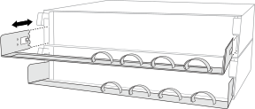
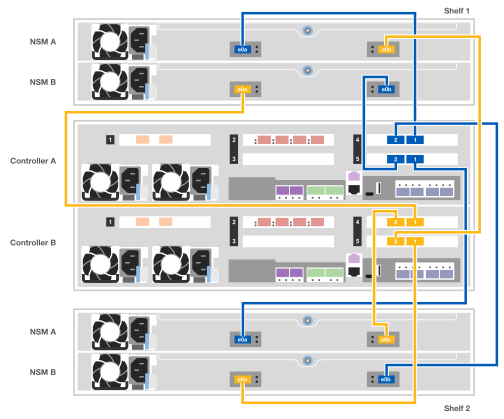

= 詳細ガイド- AFF C400
:allow-uri-read: 
:icons: font
:imagesdir: ../media/

[role="lead"]
このガイドでは、一般的なネットアップシステムのインストール手順について詳しく説明します。インストール手順の詳細については、このガイドを参照してください。

MetroCluster 構成の場合は、MetroCluster のインストールコンテンツを使用します。

https://docs.netapp.com/us-en/ontap-metrocluster/index.html["MetroCluster のドキュメント"^]

== 手順 1 ：設置の準備

システムを設置するには、アカウントを作成し、システムを登録し、ライセンスキーを取得する必要があります。また、システムに応じた適切な数とタイプのケーブルを準備し、特定のネットワーク情報を収集する必要があります。

.作業を開始する前に
* サイト要件および構成済みシステムの追加情報の情報については、 Hardware Universe にアクセスできる必要があります。また、ご使用の ONTAP バージョンのリリースノートにアクセスして、このシステムの詳細を確認しておくことを推奨します。
+
https://hwu.netapp.com["NetApp Hardware Universe の略"]

+
http://mysupport.netapp.com/documentation/productlibrary/index.html?productID=62286["使用しているバージョンの ONTAP 9 に対するリリースノートを検索してください"]

* お客様のサイトで次のものを準備する必要があります。
+
** ストレージシステム用のラックスペース
** No.2 プラスドライバ
** Web ブラウザを使用してシステムをネットワークスイッチおよびラップトップまたはコンソールに接続するための追加のネットワークケーブル

.手順
. すべての箱を開封して内容物を取り出します。
. コントローラのシステムシリアル番号をメモします。
+
image::../media/drw_ssn_label.png[システムシリアル番号の例]

. 同梱されていたケーブルの数と種類を確認し、書き留めておきます。
+
次の表に、同梱されているケーブルの種類を示します。この表にないケーブルが含まれていた場合は、 Hardware Universe を参照してケーブルを特定し、用途を確認してください。

+
https://hwu.netapp.com["NetApp Hardware Universe の略"]

+
[cols="1,2,1,2"]
|===
| ケーブルのタイプ | パーツ番号と長さ | コネクタのタイプ | 用途 

 a| 
100GbEケーブル（QSFP28）
 a| 
X666211A-05 (112-00595) 、 0.5m

X666211A-1 （ 112-00573 ）、 1m

X666211A-2 （ 112-00574 ）、 2m

X666211A-5 （ 112-00574 ）、 5m
 a| 
image:../media/oie_cable100_gbe_qsfp28.png["100GbE QSFP28コネクタ"]
 a| 
ストレージ、クラスタインターコネクト / HA 、イーサネットデータ（注文内容による）

 a| 
25GbEケーブル（SFP28）
 a| 
X66240 2 （ 112-00598 ）、 2m

X66240 - 5 （ 112-00639 ）、 5m
 a| 
image:../media/oie_cable_sfp_gbe_copper.png["GbE SFP銅線コネクタ"]
 a| 
GbE ネットワーク接続（注文内容による）

 a| 
32Gb FC （ SFP+ 光）
 a| 
X66250-2 （ 112-00342 ）、 2m

X66250-5 （ 112-00344 ）、 5m

X66250-15 （ 112-00346 ）、 15m
 a| 
image:../media/oie_cable_sfp_gbe_copper.png["GbE SFP銅線コネクタ"]
 a| 
FC ネットワーク接続

 a| 
光ケーブル
 a| 
X66250-2-N-C （ 112-00342 ）
 a| 
image:../media/oie_cable_fiber_lc_connector.png["LCファイバコネクタ"]
 a| 
メザニンカード用の 16Gb FC ケーブルまたは 25GbE ケーブル（注文内容による）

 a| 
RJ-45 （注文内容による）
 a| 
X6585-R6 （ 112-00291 ）、 3m

X6562-R6 （ 112-00196 ）、 5m
 a| 
image:../media/oie_cable_rj45.png["RJ-45ケーブルコネクタ"]
 a| 
管理ネットワーク

 a| 
Micro-USB コンソールケーブル
 a| 
該当なし
 a| 
image:../media/oie_cable_micro_usb.png["マイクロUSBコネクタ"]
 a| 
ネットワーク検出をサポートしていないラップトップまたはコンソールでソフトウェアをセットアップする際に使用するコンソール接続

 a| 
電源ケーブル
 a| 
該当なし
 a| 
image:../media/oie_cable_power.png["電源ケーブル"]
 a| 
システムの電源をオンにします

|===
. NetApp ONTAP 構成ガイドを確認して、必要な情報を収集します。
+
https://library.netapp.com/ecm/ecm_download_file/ECMLP2862613["『 ONTAP 構成ガイド』"]

== 手順 2 ：ハードウェアを設置する

システムは、 4 ポストラックまたはネットアップシステムキャビネットのいずれかに設置する必要があります。

. 必要に応じてレールキットを取り付けます。
. レールキットに付属の手順書に従って、システムを設置して固定します。
+

NOTE: システムの重量に関連する安全上の注意事項を確認しておく必要があります。

+
image::../media/drw_katana_lifting_restriction_icon.png[2人で持ち上げる場合の注意]

. ケーブルマネジメントデバイスをコントローラの背面に接続します（図を参照）。
+

. システムの前面にベゼルを配置します。

== 手順 3 ：コントローラをネットワークに接続する

2ノードスイッチレスクラスタメソッドまたはスイッチクラスタメソッドを使用して、コントローラをネットワークにケーブル接続できます。

.このタスクについて
* カードのポートラベルが見えない場合は、カードの取り付け方向を確認し（C400の場合、PCIeコネクタソケットはカードスロットの左側にあります）、NetApp Hardware Universe でカードのパーツ番号を確認します。 これは、ベゼルとポートラベルの図を示しています。カードのパーツ番号は、sysconfig -aコマンドを使用するか、システムパッキングリストに記載されています。
* MetroCluster IP構成をケーブル接続する場合は、ポートe0a/e0bをデータLIF（通常はデフォルトのIPSpace）のホストに使用できます。

[role="tabbed-block"]
====
.オプション 1 ： 2 ノードスイッチレスクラスタをケーブル接続
--
コントローラモジュールのクラスタインターコネクトポートとHAポートは、そのパートナーコントローラモジュールにケーブル接続されます。コントローラモジュールのオプションのデータポート、オプションの NIC カード、および管理ポートは、スイッチに接続されます。

.作業を開始する前に
システムとスイッチの接続に関する情報を、ネットワーク管理者に確認しておく必要があります。

.このタスクについて
ケーブルをポートに差し込む際は、ケーブルのプルタブの向きを確認してください。ケーブルのプルタブは、すべてのオンボードポートでは上向き、拡張（ NIC ）カードでは下向きになります。

image::../media/oie_cable_pull_tab_up.png[プルタブ付きケーブルコネクタ（上部）]

image::../media/oie_cable_pull_tab_down.png[下部にプルタブ付きケーブルコネクタ]

NOTE: コネクタを挿入すると、カチッという音がしてコネクタが所定の位置に収まるはずです。音がしない場合は、コネクタを取り外し、回転させてからもう一度試してください。

.手順
. 次の図を使用して、コントローラとスイッチをケーブル接続します。
+
image::../media/drw_c400_TNSC-networking-cabling_IEOPS-1189.svg[DRW C400 TNSCネットワーキングケーブル配線IEOPS 1189]

. に進みます <<手順 4 ：コントローラをドライブシェルフにケーブル接続する>> ドライブシェルフのケーブル接続手順については、を参照して

--
.オプション 2 ：スイッチクラスタをケーブル接続する
--
コントローラモジュールのクラスタインターコネクトポートとHAポートは、クラスタ/ HAスイッチにケーブル接続されます。オプションのデータポート、オプションのNICカード、メザニンカード、および管理ポートは、スイッチに接続されます。

.作業を開始する前に
システムとスイッチの接続に関する情報を、ネットワーク管理者に確認しておく必要があります。

.このタスクについて
ケーブルをポートに差し込む際は、ケーブルのプルタブの向きを確認してください。ケーブルのプルタブは、すべてのオンボードポートでは上向き、拡張（ NIC ）カードでは下向きになります。

image::../media/oie_cable_pull_tab_up.png[プルタブ付きケーブルコネクタ（上部）]

image::../media/oie_cable_pull_tab_down.png[下部にプルタブ付きケーブルコネクタ]

NOTE: コネクタを挿入すると、カチッという音がしてコネクタが所定の位置に収まるはずです。音がしない場合は、コネクタを取り外し、回転させてからもう一度試してください。

.手順
. 次の図を使用して、コントローラとスイッチをケーブル接続します。
+
image::../media/drw_c400_switched_network_cabling_IEOPS-1190.svg[DRW C400スイッチネットワークケーブルIEOPS 1190]

. に進みます <<手順 4 ：コントローラをドライブシェルフにケーブル接続する>> ドライブシェルフのケーブル接続手順については、を参照して

--
====

== 手順 4 ：コントローラをドライブシェルフにケーブル接続する

以下のオプションでは、1台または2台のNS224ドライブシェルフをシステムにケーブル接続する方法を説明します。

=== オプション 1 ：コントローラを 1 台のドライブシェルフにケーブル接続する

各コントローラを、 NS224 ドライブシェルフの NSM モジュールにケーブル接続する必要があります。

.このタスクについて
図の矢印を見て、ケーブルコネクタのプルタブの正しい向きを確認してください。NS224 のケーブルのプルタブは上向きです。

image::../media/oie_cable_pull_tab_up.png[プルタブ付きケーブルコネクタ（上部）]

NOTE: コネクタを挿入すると、カチッという音がしてコネクタが所定の位置に収まるはずです。音がしない場合は、コネクタを取り外し、回転させてからもう一度試してください。

.手順
. 次の図を使用して、1台のドライブシェルフにコントローラをケーブル接続します。
+
image::../media/drw_c400_one_ns224_shelf_IEOPS-1191.svg[DRW C400 ns224シェルフIEOPS 1191×1]

. に進みます <<手順 5 ：システムのセットアップと設定を完了する>> をクリックして、システムのセットアップと設定を完了します。

=== オプション 2 ：コントローラを 2 台のドライブシェルフにケーブル接続する

各コントローラを両方の NS224 ドライブシェルフの NSM モジュールにケーブル接続する必要があります。

.このタスクについて
図の矢印を見て、ケーブルコネクタのプルタブの正しい向きを確認してください。NS224 のケーブルのプルタブは上向きです。

image::../media/oie_cable_pull_tab_up.png[プルタブ付きケーブルコネクタ（上部）]

NOTE: コネクタを挿入すると、カチッという音がしてコネクタが所定の位置に収まるはずです。音がしない場合は、コネクタを取り外し、回転させてからもう一度試してください。

.手順
. 次の図を使用して、 2 台のドライブシェルフにコントローラをケーブル接続します。
+

. に進みます <<手順 5 ：システムのセットアップと設定を完了する>> をクリックして、システムのセットアップと設定を完了します。

== 手順 5 ：システムのセットアップと設定を完了する

システムのセットアップと設定を実行するには、スイッチとラップトップのみを接続してクラスタ検出を使用するか、システムのコントローラに直接接続してから管理スイッチに接続します。

=== オプション 1 ：ネットワーク検出が有効になっている場合は、システムのセットアップと設定を実行する

ラップトップでネットワーク検出が有効になっている場合は、クラスタの自動検出を使用してシステムのセットアップと設定を実行できます。

. 次のアニメーションに従って、1つ以上のドライブシェルフの電源をオンにしてシェルフIDを設定します。
+
NS224ドライブシェルフの場合、シェルフIDは00と01に事前に設定されています。シェルフIDを変更する場合は、クリップのまっすぐな端または先端の細いボールペンを使用して、前面プレートの後ろにあるシェルフIDボタンを押します。

+
.アニメーション-ドライブシェルフIDを設定します
video::c500e747-30f8-4763-9065-afbf00008e7f[panopto]
. 電源コードをコントローラの電源装置に接続し、さらに別の回路の電源に接続します。
. ラップトップでネットワーク検出が有効になっていることを確認します。
+
詳細については、ラップトップのオンラインヘルプを参照してください。

. ラップトップを管理スイッチに接続します。
+
image::../media/dwr_laptop_to_switch_only.svg[DWR ラップトップをスイッチのみに接続します]

. 検出する ONTAP アイコンを選択します。
+
image::../media/drw_autodiscovery_controler_select.png[ONTAPアイコンの選択]

+
.. エクスプローラを開きます。
.. 左側のペインで*[ネットワーク]*をクリックし、右クリックして*[更新]*を選択します。
.. いずれかの ONTAP アイコンをダブルクリックし、画面に表示された証明書を受け入れます。
+

NOTE: 「 XXXXX 」は、ターゲットノードのシステムシリアル番号です。

+
System Manager が開きます。

. System Manager のセットアップガイドを使用して、 _NetApp ONTAP 構成ガイド _ で収集したデータを基にシステムを設定します。
+
https://library.netapp.com/ecm/ecm_download_file/ECMLP2862613["『 ONTAP 構成ガイド』"]

. アカウントを設定して Active IQ Config Advisor をダウンロードします。
+
.. 既存のアカウントにログインするか、アカウントを作成します。
+
https://mysupport.netapp.com/site/user/registration["ネットアップサポート登録"]

.. システムを登録します。
+
https://mysupport.netapp.com/site/systems/register["ネットアップ製品登録"]

.. Active IQ Config Advisor をダウンロードします。
+
https://mysupport.netapp.com/site/tools["ネットアップのダウンロード： Config Advisor"]

. Config Advisor を実行してシステムの健全性を確認します。
. 初期設定が完了したら、ONTAPのその他の機能の設定についてに進みます https://docs.netapp.com/us-en/ontap/index.html["ONTAP 9 のドキュメント"^]。

=== オプション 2 ：ネットワーク検出が有効になっていない場合のシステムのセットアップと設定の実行

ラップトップでネットワーク検出が有効になっていない場合は、このタスクを使用して設定とセットアップを実行する必要があります。

. ラップトップまたはコンソールをケーブル接続して設定します。
+
.. ラップトップまたはコンソールのコンソールポートを、 115 、 200 ボー、 N-8-1 に設定します。
+

NOTE: コンソールポートの設定方法については、ラップトップまたはコンソールのオンラインヘルプを参照してください。

.. システム付属のコンソールケーブルを使用してラップトップまたはコンソールにコンソールケーブルを接続し、ラップトップを管理サブネット上の管理スイッチに接続します。
.. 管理サブネット上の TCP / IP アドレスをラップトップまたはコンソールに割り当てます。

. 次のアニメーションに従って、1つ以上のドライブシェルフの電源をオンにしてシェルフIDを設定します。
+
NS224ドライブシェルフの場合、シェルフIDは00と01に事前に設定されています。シェルフIDを変更する場合は、クリップのまっすぐな端または先端の細いボールペンを使用して、前面プレートの後ろにあるシェルフIDボタンを押します。

+
.アニメーション-ドライブシェルフIDを設定します
video::c500e747-30f8-4763-9065-afbf00008e7f[panopto]
. 電源コードをコントローラの電源装置に接続し、さらに別の回路の電源に接続します。
+

NOTE: 初回のブートには最大 8 分かかる場合があります。

. いずれかのノードに初期ノード管理 IP アドレスを割り当てます。
+
[cols="1,2"]
|===
| 管理ネットワークでの DHCP の状況 | 作業 

 a| 
を設定します
 a| 
新しいコントローラに割り当てられた IP アドレスを記録します。

 a| 
未設定
 a| 
.. PuTTY 、ターミナルサーバ、または環境に対応した同等の機能を使用して、コンソールセッションを開きます。
+

NOTE: PuTTY の設定方法がわからない場合は、ラップトップまたはコンソールのオンラインヘルプを確認してください。

.. スクリプトからプロンプトが表示されたら、管理 IP アドレスを入力します。

|===
. ラップトップまたはコンソールで、 System Manager を使用してクラスタを設定します。
+
.. ブラウザでノード管理 IP アドレスを指定します。
+

NOTE: アドレスの形式は、 +https://x.x.x.x.+ です

.. NetApp ONTAP 構成ガイドで収集したデータを基にシステムを設定します。
+
https://library.netapp.com/ecm/ecm_download_file/ECMLP2862613["『 ONTAP 構成ガイド』"]

. アカウントを設定して Active IQ Config Advisor をダウンロードします。
+
.. 既存のアカウントにログインするか、アカウントを作成します。
+
https://mysupport.netapp.com/site/user/registration["ネットアップサポート登録"]

.. システムを登録します。
+
https://mysupport.netapp.com/site/systems/register["ネットアップ製品登録"]

.. Active IQ Config Advisor をダウンロードします。
+
https://mysupport.netapp.com/site/tools["ネットアップのダウンロード： Config Advisor"]

. Config Advisor を実行してシステムの健全性を確認します。
. 初期設定が完了したら、ONTAPのその他の機能の設定についてに進みます https://docs.netapp.com/us-en/ontap/index.html["ONTAP 9 のドキュメント"^]。

