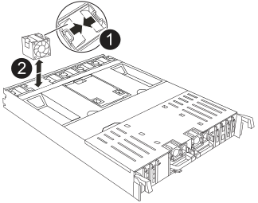

= ファンモジュールの交換- AFF C80
:allow-uri-read: 
:icons: font
:imagesdir: ../media/

[role="lead"]
ファンに障害が発生した場合、またはファンが効率的に動作していない場合は、AFF C80システムのファンモジュールを交換してください。これは、システムの冷却と全体的なパフォーマンスに影響する可能性があります。交換プロセスでは、コントローラのシャットダウン、コントローラの取り外し、ファンの交換、コントローラの再取り付け、障害が発生したパーツのNetAppへの返却を行います。

ファンを交換するには、障害が発生したファンモジュールを取り外し、新しいファンモジュールと交換します。

.手順
. 交換が必要なファンモジュールを特定するために、コンソールのエラーメッセージを確認します。
. ファンモジュールの側面にある固定ツメをつまみ、ファンモジュールを持ち上げてコントローラモジュールから取り出します。
+

+
[cols="1,4"]
|===

 a| 
image:../media/icon_round_1.png["番号1"]
| ファンの固定ツメ 

 a| 
image:../media/icon_round_2.png["番号2"]
| ファンモジュール 
|===
. 交換用ファンモジュールの端をコントローラモジュールの開口部に合わせ、ロックラッチが所定の位置にカチッと収まるまで、交換用ファンモジュールをコントローラモジュールにスライドさせます。

