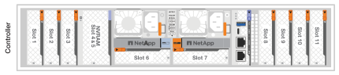

= I/Oモジュールの追加と交換の概要- AFF C80
:allow-uri-read: 
:icons: font
:imagesdir: ../media/

[role="lead"]
AFF C80システムは、I/Oモジュールを柔軟に拡張または交換して、ネットワーク接続とパフォーマンスを強化します。I/Oモジュールの追加または交換は、ネットワーク機能をアップグレードする場合や、障害が発生したモジュールに対処する場合に不可欠です。

AFF C80ストレージシステム内の障害が発生したI/Oモジュールは、同じタイプのI/Oモジュールに交換することも、別の種類のI/Oモジュールに交換することもできます。空きスロットのあるシステムにI/Oモジュールを追加することもできます。

* link:io-module-add.html["I/Oモジュールの追加"]
+
モジュールを追加すると、冗長性が向上し、1つのモジュールに障害が発生してもシステムが動作し続けるようになります。

* link:io-module-hotswap.html["I/O モジュールのホット スワップ"]
+
I/O モジュールのホット スワップを使用すると、システムをシャットダウンせずに障害が発生したモジュールを交換できるため、ダウンタイムを最小限に抑え、システムの可用性を維持できます。

* link:io-module-replace.html["I/Oモジュールの交換"]
+
障害が発生したI/Oモジュールを交換すると、システムを最適な動作状態に戻すことができます。

.I/Oスロット番号I/Oスロットバンゴウ
次の図に示すように、AFF C80コントローラのI/Oスロットには1~11の番号が付けられています。

