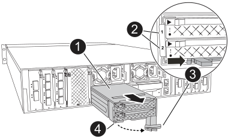

= FlashCacheモジュールキャリアまたはキャッシングモジュールの交換- FAS70およびFAS90
:allow-uri-read: 
:icons: font
:imagesdir: ../media/

[role="lead"]
NVMe SSD FlashCacheモジュールキャリアには、1つまたは2つのFlashCacheモジュール（キャッシングモジュール）が搭載されており、それぞれのキャッシングモジュールにSSD FlashCacheドライブが1本搭載されています。

FAS70は2TBのキャッシングモジュールをサポートし、FAS90は4TBのキャッシングモジュールをサポートします。FlashCacheモジュールキャリアに容量の異なるキャッシングモジュールを混在させることはできません。

交換が必要な項目（FlashCacheモジュールキャリア全体またはキャッシングモジュール）に応じて、次のいずれかの手順を実行できます。

* <<FlashCacheモジュールキャリアを交換>>
* <<キャッシングモジュールを交換>>

== FlashCacheモジュールキャリアを交換

FlashCacheモジュールキャリアはスロット6にあり、FlashCacheモジュールを2つまで搭載できます。FlashCacheモジュールキャリアはホットスワップできません。

.作業を開始する前に
* 交換用FlashCacheモジュールキャリアに対応したオペレーティングシステムがストレージシステムにインストールされていることを確認します。
* 他のすべてのコンポーネントが正常に動作していることを確認します。正常に動作していない場合は、テクニカルサポートにお問い合わせください。

=== 手順 1 ：障害ノードをシャットダウンします

次のいずれかのオプションを使用して、障害のあるコントローラをシャットダウンまたはテイクオーバーします。

.オプション1 MOSTシステム
[%collapsible]
====
障害のあるコントローラをシャットダウンするには、コントローラのステータスを確認し、必要に応じて正常なコントローラが障害のあるコントローラストレージからデータを引き続き提供できるようにコントローラをテイクオーバーする必要があります。

.このタスクについて
ノードが 3 つ以上あるクラスタは、クォーラムを構成している必要があります。クラスタがクォーラムを構成していない場合、または正常なコントローラで適格性と正常性についてfalseと表示される場合は、障害のあるコントローラをシャットダウンする前に問題 を修正する必要があります。を参照してください link:https://docs.netapp.com/us-en/ontap/system-admin/synchronize-node-cluster-task.html?q=Quorum["ノードをクラスタと同期します"^]。

.手順
. AutoSupportが有効になっている場合は、AutoSupport messageコマンドを呼び出してケースの自動作成を抑制します。 `system node autosupport invoke -node * -type all -message MAINT=number_of_hours_downh`
+
次のAutoSupportコマンドは、ケースの自動作成を2時間停止します。 `cluster1:*> system node autosupport invoke -node * -type all -message MAINT=2h`

. 正常なコントローラのコンソールから自動ギブバックを無効にします。 storage failover modify – node local-auto-giveback false
. 障害のあるコントローラに LOADER プロンプトを表示します。
+
[cols="1,2"]
|===
| 障害のあるコントローラの表示 | 作業 

 a| 
LOADER プロンプト
 a| 
次の手順に進みます。

 a| 
ギブバックを待機しています
 a| 
Ctrl キーを押しながら C キーを押し ' プロンプトが表示されたら y と入力します

 a| 
システムプロンプトまたはパスワードプロンプト（システムパスワードの入力）
 a| 
障害のあるコントローラを正常なコントローラから停止またはテイクオーバーします。 `storage failover takeover -ofnode _impaired_node_name_`

障害のあるコントローラに「 Waiting for giveback... 」と表示されたら、 Ctrl+C キーを押し、「 y 」と入力します。

|===

====
.オプション2 MetroCluster構成
[%collapsible]
====

NOTE: 2 ノード MetroCluster 構成のシステムでは、この手順を使用しないでください。

障害のあるコントローラをシャットダウンするには、コントローラのステータスを確認し、必要に応じて正常なコントローラが障害のあるコントローラストレージからデータを引き続き提供できるようにコントローラをテイクオーバーする必要があります。

* ノードが 3 つ以上あるクラスタは、クォーラムを構成している必要があります。クラスタがクォーラムを構成していない場合、または正常なコントローラで適格性と正常性についてfalseと表示される場合は、障害のあるコントローラをシャットダウンする前に問題 を修正する必要があります。を参照してください link:https://docs.netapp.com/us-en/ontap/system-admin/synchronize-node-cluster-task.html?q=Quorum["ノードをクラスタと同期します"^]。
* MetroCluster 構成を使用している場合は、 MetroCluster 構成状態が構成済みで、ノードが有効かつ正常な状態であることを確認しておく必要があります（「 MetroCluster node show 」）。

.手順
. AutoSupportが有効になっている場合は、AutoSupportコマンドを呼び出してケースの自動作成を抑制します。 `system node autosupport invoke -node * -type all -message MAINT=number_of_hours_downh`
+
次のAutoSupportコマンドは、ケースの自動作成を2時間停止します。 `cluster1:*> system node autosupport invoke -node * -type all -message MAINT=2h`

. 正常なコントローラのコンソールから自動ギブバックを無効にします。 storage failover modify – node local-auto-giveback false
. 障害のあるコントローラに LOADER プロンプトを表示します。
+
[cols="1,2"]
|===
| 障害のあるコントローラの表示 | 作業 

 a| 
LOADER プロンプト
 a| 
次の手順に進みます。

 a| 
ギブバックを待っています
 a| 
Ctrl キーを押しながら C キーを押し ' プロンプトが表示されたら y と入力します

 a| 
システムプロンプトまたはパスワードプロンプト（システムパスワードの入力）
 a| 
障害のあるコントローラを正常なコントローラから停止またはテイクオーバーします。 `storage failover takeover -ofnode _impaired_node_name_`

障害のあるコントローラに「 Waiting for giveback... 」と表示されたら、 Ctrl+C キーを押し、「 y 」と入力します。

|===

====

=== 手順2：FlashCacheモジュールキャリアを交換する

FlashCacheモジュールキャリアを交換するには、次の手順を実行します。

.手順
. 接地対策がまだの場合は、自身で適切に実施します。
. スロット6で、FlashCacheモジュールキャリアの前面にある黄色の警告LEDが点灯している、障害が発生したFlashCacheモジュールキャリアの場所を確認します。
+

+
[cols="1,4"]
|===

 a| 
image:../media/legend_icon_01.svg["番号1、幅= 30px"]
 a| 
FlashCacheモジュールキャリア

 a| 
image:../media/legend_icon_02.svg["番号2、幅= 30px"]
 a| 
キャッシングモジュールのスロット番号

 a| 
image:../media/legend_icon_03.svg["番号3、幅= 30px"]
 a| 
FlashCacheモジュールキャリアのカムハンドル

 a| 
image:../media/legend_icon_04.svg["番号4、幅= 30px"]
 a| 
FlashCacheモジュールキャリア障害LED

|===
. 障害が発生したFlashCacheモジュールキャリアを取り外します。
+
.. ケーブルマネジメントトレイ内部の両側にあるボタンを引いてケーブルマネジメントトレイを下に回転させ、トレイを下に回転させます。
.. FlashCacheモジュールキャリアの下部にある青いタブをつまみます。
.. タブを回転させてモジュールから離します。

. FlashCacheモジュールキャリアをコントローラモジュールから引き出し、静電気防止用マットの上に置きます。
. キャッシングモジュールを交換用FlashCacheモジュールキャリアに移動します。
+
.. キャッシングモジュールの上部にある[Terra Cotta]タブをつまみ、カムハンドルを回転させてキャッシングモジュールから取り外します。
.. カムレバーの開口部に指をかけ、モジュールをFlashCacheモジュールキャリアから引き出して、モジュールをエンクロージャから取り外します。
.. 交換用FlashCacheモジュールキャリアの同じスロットにキャッシングモジュールを取り付け、カムハンドルをキャッシングモジュールの閉じた位置に回転させて所定の位置にロックします。

. 2つ目のキャッシングモジュールがある場合は、上記の手順を繰り返します。
. 交換用FlashCacheモジュールキャリアをシステムに取り付けます。
+
.. モジュールをエンクロージャスロット開口部の端に合わせます。
.. モジュールをスロットにゆっくりと挿入してエンクロージャの奥まで押し込み、カムラッチを上に回転させてモジュールを所定の位置にロックします。
.. ケーブルマネジメントトレイを上に回転させて閉じます。

=== 手順3：コントローラをリブートする

FlashCacheモジュールキャリアを交換したら、コントローラモジュールをリブートする必要があります。

.手順
. LOADER プロンプトで、ノードをリブートします： bye _
+

NOTE: これにより、I/Oカードおよびその他のコンポーネントが再初期化され、ノードがリブートされます。

. ノードを通常動作に戻します。_storage failover giveback -ofnode impaired_node_name_
. 自動ギブバックが無効になっていた場合は、再度有効にします。_storage failover modify -node local -auto-giveback true_

=== 手順 4 ：障害が発生したパーツをネットアップに返却する

障害が発生したパーツは、キットに付属のRMA指示書に従ってNetAppに返却してください。 https://mysupport.netapp.com/site/info/rma["パーツの返品と交換"]詳細については、ページを参照してください。

== キャッシングモジュールを交換

.作業を開始する前に
FlashCacheモジュール（キャッシングモジュール）は、スロット6-1、スロット6-2、またはスロット6-1とスロット6-2の両方に搭載されています。

個 々 のキャッシングモジュールを、同じベンダーまたはサポート対象の別のベンダーの同じ容量のキャッシングモジュールとホットスワップできます。

.作業を開始する前に
* 交換用キャッシングモジュールの容量が、障害が発生したキャッシングモジュールと同じベンダーまたはサポートされている別のベンダーのものであることを確認してください。
* 他のすべてのコンポーネントが正常に動作していることを確認します。正常に動作していない場合は、テクニカルサポートにお問い合わせください。
* キャッシングモジュールのドライブは、Field Replaceable Unit（FRU；フィールド交換可能ユニット）ではありません。キャッシングモジュール全体を交換する必要があります。

.手順
. 接地対策がまだの場合は、自身で適切に実施します。
. スロット 6 で、キャッシングモジュールの前面にある黄色の警告 LED が点灯している、障害が発生したキャッシングモジュールの場所を確認します。
. 交換用のキャッシングモジュールスロットを次のように準備します。
+
.. ターゲットノードのキャッシングモジュールの容量、パーツ番号、およびシリアル番号を記録します。_system node run local sysconfig -av 6_
.. admin権限レベルで、ターゲットキャッシングモジュールスロットを取り外す準備をし、 `y`続行するかどうかを確認するメッセージが表示されたらと入力します。_system controller slot module remove -node node_name -slot slot_number_次のコマンドは、node1のスロット6-1を取り外す準備をし、安全に取り外すことができるというメッセージを表示します。
+
[listing]
----
::> system controller slot module remove -node node1 -slot 6-1

Warning: SSD module in slot 6-1 of the node node1 will be powered off for removal.
Do you want to continue? (y|n): _y_
The module has been successfully removed from service and powered off. It can now be safely removed.
----
.. 「 system controller slot module show 」コマンドを使用して、スロットのステータスを表示します。
+
 `powered-off`交換が必要なキャッシングモジュールの画面出力に、キャッシングモジュールのスロットステータスが表示されます。

+

NOTE: を参照してください https://docs.netapp.com/us-en/ontap-cli-9121/["コマンドマニュアルページ"^] 詳細については、お使いのバージョンの ONTAP を参照してください。

. キャッシングモジュールを取り外します。
+
image::../media/drw_fas70-90_caching_module_remove_ieops-1773.svg[キャッシングモジュールを取り外し]

+
[cols="1,4"]
|===

 a| 
image:../media/legend_icon_01.svg["番号1、幅= 30px"]
 a| 
キャッシングモジュールのカムハンドル

 a| 
image:../media/legend_icon_02.svg["番号2、幅= 30px"]
 a| 
キャッシングモジュール障害LED

|===
+
.. ケーブルマネジメントトレイ内部の両側にあるボタンを引いてケーブルマネジメントトレイを下に回転させ、トレイを下に回転させます。
.. キャッシングモジュールの前面にあるテラコッタリリースボタンを押します。
.. カムハンドルを所定の位置まで回転させます。
.. カムレバーの開口部に指をかけ、FlashCacheモジュールキャリアからモジュールを引き出して、キャッシングモジュールモジュールをエンクロージャから取り外します。
+
FlashCacheモジュールキャリアから取り外す際は、必ずキャッシングモジュールを支えてください。

. 交換用キャッシングモジュールを取り付けます。
+
.. キャッシングモジュールの端をコントローラモジュールの開口部に合わせます。
.. キャッシングモジュールをゆっくりとベイに押し込んで、カムハンドルをはめ込みます。
.. 所定の位置に固定されるまでカムハンドルを回転させます。
.. ケーブルマネジメントトレイを上に回転させて閉じます。

. 次のように「 system controller slot module insert 」コマンドを使用して、交換用キャッシングモジュールをオンラインにします。
+
次のコマンドでは、node1のスロット6-1の電源投入の準備を行い、電源がオンになったことを示すメッセージを表示します。

+
[listing]
----
::> system controller slot module insert -node node1 -slot 6-1

Warning: NVMe module in slot 6-1 of the node localhost will be powered on and initialized.
Do you want to continue? (y|n): `y`

The module has been successfully powered on, initialized and placed into service.
----
. 「 system controller slot module show 」コマンドを使用して、スロットのステータスを確認します。
+
コマンド出力で、のステータスが「電源オン」と表示され、操作可能であることを確認します。

. 交換用キャッシングモジュールがオンラインで認識されていることを確認し、黄色の警告 LED が点灯していないことを目視で確認します。「 sysconfig -av slot_number 」
+

NOTE: キャッシングモジュールを別のベンダーのキャッシングモジュールに交換すると、コマンド出力に新しいベンダー名が表示されます。

. 障害が発生したパーツは、キットに付属のRMA指示書に従ってNetAppに返却してください。 https://mysupport.netapp.com/site/info/rma["パーツの返品と交換"^]詳細については、ページを参照してください。

