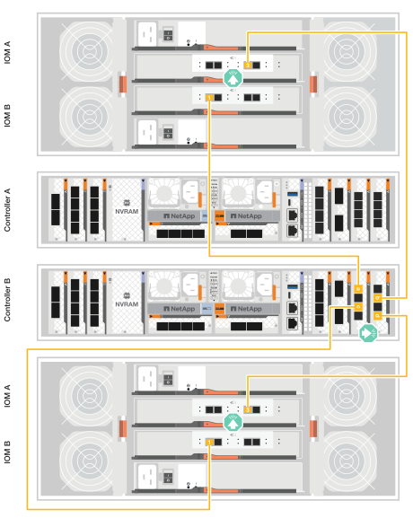

= ハードウェアのケーブル接続- FAS70およびFAS90
:allow-uri-read: 
:icons: font
:imagesdir: ../media/

[role="lead"]
FAS70またはFAS90ストレージ・システムのラック・ハードウェアを設置したら、コントローラにネットワーク・ケーブルを接続し、コントローラとストレージ・シェルフを接続します。

.作業を開始する前に
ストレージシステムをスイッチに接続する方法については、ネットワーク管理者にお問い合わせください。

.このタスクについて
* ここでは、一般的な設定について説明します。具体的なケーブル接続は、ご使用のストレージシステム用に注文したコンポーネントによって異なります。設定およびスロットプライオリティの詳細については、を参照してください link:https://hwu.netapp.com["NetApp Hardware Universe の略"^]。
* FAS70およびFAS90コントローラのI/Oスロットには、1~11の番号が付けられています。
+
image::../media/drw_a1K_back_slots_labeled_ieops-2162.svg[FAS70およびFAS90コントローラのスロット番号]

* ケーブル配線図には、ポートにコネクタを挿入する際のケーブルコネクタプルタブの正しい方向（上または下）を示す矢印アイコンがあります。
+
コネクタを挿入すると、カチッという音がしてコネクタが所定の位置に収まるはずです。カチッと音がしない場合は、コネクタを取り外し、裏返してもう一度試してください。

+
image::../media/drw_cable_pull_tab_direction_ieops-1699.svg[ケーブルプルタブの向きの例]

* 光スイッチにケーブル接続する場合は、光トランシーバをコントローラポートに挿入してから、スイッチポートにケーブル接続します。

== 手順1：ストレージコントローラをネットワークに接続する

コントローラをONTAPクラスタにケーブル接続します。この手順は、ストレージシステムのモデルおよびI/Oモジュールの構成によって異なります。

NOTE: クラスタインターコネクトトラフィックとHAトラフィックは、同じ物理ポートを共有します。

[role="tabbed-block"]
====
.スイッチレスクラスタのケーブル接続
--
クラスタ/ HAインターコネクトケーブルを使用して、ポートe1aとe1a、ポートe7aとe7aを接続します。

.手順
. コントローラAのポートe1aをコントローラBのポートe1aに接続します。
. コントローラAのポートe7aをコントローラBのポートe7aに接続します。
+
*クラスタ/ HAインターコネクトケーブル*

+
image::../media/oie_cable_25Gb_Ethernet_SFP28_IEOPS-1069.svg[クラスタHAケーブル]

+
image::../media/drw_a1k_tnsc_cluster_cabling_ieops-1648.svg[2ノードスイッチレスクラスタのケーブル配線図]

--
.スイッチクラスタのケーブル接続
--
100GbEケーブルを使用して、ポートe1aとe1a、ポートe7aとe7aを接続します。

.手順
. コントローラAのポートe1aとコントローラBのポートe1aをクラスタネットワークスイッチAに接続します。
. コントローラAのポートe7aとコントローラBのポートe7aをクラスタネットワークスイッチBに接続します。
+
* 100GbEケーブル*

+
image::../media/oie_cable100_gbe_qsfp28.png[100Gbケーブル]

+
image::../media/drw_a1k_switched_cluster_cabling_ieops-1652.svg[クラスタネットワークへのクラスタ接続のケーブル接続]

--
====

== 手順2：ホストネットワーク接続をケーブル接続する

イーサネットモジュールポートをホストネットワークに接続します。

次に、一般的なホストネットワークのケーブル接続例を示します。ご使用のシステム構成については、を参照してください link:https://hwu.netapp.com["NetApp Hardware Universe の略"^] 。

.手順
. ポートe9aおよびe9bをイーサネットデータネットワークスイッチに接続します。
+

NOTE: ホスト ネットワーク接続にはポート e1b および e7b ポートを使用しないでください。別のホスト カードを使用します。

+
* 100GbEケーブル*

+
image::../media/oie_cable_sfp_gbe_copper.png[100Gbイーサネットケーブル]

+
image::../media/drw_a1k_network_cabling1_ieops-1649.svg[100Gbイーサネットネットワークへのケーブル接続]

. 10 / 25GbEホストネットワークスイッチを接続します。
+
* 4ポート、10/25GbEホスト*

+
image::../media/oie_cable_sfp_gbe_copper.png[10/25Gbイーサネットケーブル]

+
image::../media/drw_a1k_network_cabling2_ieops-1650.svg[10 / 25Gbイーサネットネットワークへのケーブル接続]

== 手順3：管理ネットワークをケーブル接続する

1000BASE-T RJ-45ケーブルを使用して、各コントローラの管理（レンチ）ポートを管理ネットワークスイッチに接続します。

image::../media/oie_cable_rj45.png[RJ-45ケーブル]

* 1000BASE-T RJ-45ケーブル*

image::../media/drw_a1k_management_connection_ieops-1651.svg[管理ネットワークへの接続]

IMPORTANT: まだ電源コードを接続しないでください。

== 手順4：シェルフをケーブル接続する

次のケーブル接続手順では、コントローラをストレージシェルフに接続する方法を示します。次のいずれかのケーブル接続オプションを、ご使用の環境に合わせて選択します。

ストレージシステムでサポートされるシェルフの最大数、およびすべてのケーブル接続オプションについては、を参照してくださいlink:https://hwu.netapp.com["NetApp Hardware Universe の略"^]。

SASシェルフのケーブル接続に関するその他のガイダンスについては、を参照してくださいlink:https://docs.netapp.com/us-en/ontap-systems/sas3/install-cabling-rules.html["SASケーブル接続のルールと概念- IOM12 / IOM12Bモジュールを搭載したシェルフ"]。

.このタスクについて
FAS70 および FAS90 ストレージ システムは、NSM100 または NSM100B モジュールのいずれかを搭載した DS212C、DS224C、DS460C、および NS224 シェルフをサポートします。

NS224 モジュール間の主な違いは次のとおりです。

* NSM100 シェルフ モジュールは、組み込みポート e0a および e0b を使用します。
* NSM100B シェルフ モジュールは、スロット 1 のポート e1a と e1b を使用します。

次の NS224 ケーブル接続例では、シェルフ モジュール ポートを参照する場合の NS224 シェルフ内の NSM100 モジュールを示しています。

[role="tabbed-block"]
====
.オプション1：NS224ストレージシェルフ1台
--
各コントローラをNS224シェルフのNSMモジュールに接続します。図は、コントローラAのケーブル配線を青で示し、コントローラBのケーブル配線を黄色で示しています。

* 100GbE QSFP28銅線ケーブル*

image::../media/oie_cable100_gbe_qsfp28.png[100GbE QSFP28銅線ケーブル]

.手順
. コントローラAで、次のポートを接続します。
+
.. ポートe11aをNSM Aのポートe0aに接続します。
.. ポートe11bをポートNSM Bのポートe0bに接続します。
+
image:../media/drw_a1k_1shelf_cabling_a_ieops-1703.svg["コントローラAのe11aおよびe11bを1台のNS224シェルフに移行"]

. コントローラBで、次のポートを接続します。
+
.. ポートe11aをNSM Bのポートe0aに接続します。
.. ポートe11bをNSM Aのポートe0bに接続します。

+
image:../media/drw_a1k_1shelf_cabling_b_ieops-1704.svg["コントローラBのポートe11aおよびe11bを1台のNS224シェルフにケーブル接続"]

--
.オプション2：NS224ストレージシェルフ×2
--
各コントローラを両方のNS224シェルフのNSMモジュールにケーブル接続します。図は、コントローラAのケーブル配線を青で示し、コントローラBのケーブル配線を黄色で示しています。

* 100GbE QSFP28銅線ケーブル*

image::../media/oie_cable100_gbe_qsfp28.png[100GbE QSFP28銅線ケーブル]

.手順
. コントローラAで、次のポートを接続します。
+
.. ポートe11aをシェルフ1のNSM Aのポートe0aに接続します。
.. ポートe11bをシェルフ2のNSM Bのポートe0bに接続します。
.. ポートe10aをシェルフ2のNSM Aのポートe0aに接続します。
.. ポートe10bをシェルフ1のNSM Aのポートe0bに接続します。

+
image:../media/drw_a1k_2shelf_cabling_a_ieops-1705.svg["コントローラAのポートe11a e11b e10aおよびe10bを2台のNS224シェルフにケーブル接続します。"]

. コントローラBで、次のポートを接続します。
+
.. ポートe11aをシェルフ1のNSM Bのポートe0aに接続します。
.. ポートe11bをシェルフ2のNSM Aのポートe0bに接続します。
.. ポートe10aをシェルフ2のNSM Bのポートe0aに接続します。
.. ポートe10bをシェルフ1のNSM Aのポートe0bに接続します。

+
image:../media/drw_a1k_2shelf_cabling_b_ieops-1706.svg["コントローラBのポートe11a e11b e10aおよびe10bを2台のNS224シェルフにケーブル接続します。"]

--
.オプション3：DS460Cシェルフ×2
--
各コントローラを両方のDS460CシェルフのIOMモジュールにケーブル接続します。図は、コントローラAのケーブル配線を青で示し、コントローラBのケーブル配線を黄色で示しています。

* Mini-SAS HDケーブル*

image::../media/oie_cable_mini_sas_hd_to_mini_sas_hd.png[Mini-SAS HDケーブル]

.手順
. コントローラAで、次の接続をケーブル接続します。
+
.. ポートe10aをシェルフ1のIOM Aポート1に接続します。
.. ポートe10cをシェルフ2のIOM Aポート1に接続
.. ポートe11bをシェルフ1のIOM Bポート3に接続します。
.. ポートe11dをシェルフ2のIOM Bポート3に接続します。

+
image:../media/drw_fas70-90_twoshelf_ds460c_cabling_controller1_ieops-1918.svg["コントローラAのポートe10a e10c、e11b、e11dを2台のDS460Cシェルフにケーブル接続します。"]

. コントローラBで、次の接続をケーブル接続します。
+
.. ポートe10aをシェルフ1のIOM Bポート1に接続します。
.. ポートe10cをシェルフ2のIOM Bポート1に接続します。
.. ポートe11bをシェルフ1のIOM Aポート3に接続します。
.. ポートe11dをシェルフ2のIOM Aポート3に接続します。

+

--
====
.次の手順
FAS70またはFAS90システムのハードウェアのケーブル接続が完了したら、次の作業を行いlink:install-power-hardware.html["FAS70またはFAS90ストレージ・システムの電源をオンにする"]ます。
