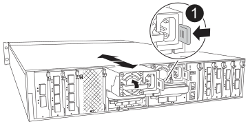

= 電源装置を交換します - FAS70 および FAS90
:allow-uri-read: 
:icons: font
:imagesdir: ../media/

[role="lead"]
FAS70またはFAS90システムで障害が発生した場合や障害が発生した場合は、ACまたはDC電源装置ユニット（PSU）を交換して、安定した動作のために必要な電力をシステムに供給し続けます。交換プロセスでは、ターゲットPSUを電源から切断し、電源ケーブルを抜き、障害が発生したPSUを取り外して交換用PSUを取り付け、電源に再接続します。

電源装置は冗長で、ホットスワップに対応しています。

.このタスクについて
この手順 は、PSUを1台ずつ交換するためのものです。

IMPORTANT: 効率性の異なる PSU を混在させないでください。いつものように同じように置換します。

PSUのタイプ（ACまたはDC）に応じた手順 を使用します。

[role="tabbed-block"]
====
.オプション1：AC PSUを交換します
--
AC PSUを交換するには、次の手順を実行します。

.手順
. 接地対策がまだの場合は、自身で適切に実施します。
. コンソールのエラーメッセージまたはPSUの障害LED（赤）から、交換するPSUを特定します。
. PSUを取り外します。
+
.. 電源ケーブルの固定クリップを開き、電源ケーブルをPSUから抜きます。

. PSUを取り外します。ハンドルを上に回転させ、固定ツメを押して、PSUをコントローラモジュールから引き出します。
+

CAUTION: PSUは短い。コントローラモジュールから突然落下して負傷することがないように、取り外すときは必ず両手で支えてください。

+

+
[cols="1,4"]
|===

 a| 
image:../media/icon_round_1.png["番号1"]
 a| 
Terracotta PSUの固定ツメ

|===
. コントローラモジュールに交換用PSUを取り付けます。
+
.. 両手で支えながら、交換用PSUの端をコントローラモジュールの開口部に合わせます。
.. カチッという音がして固定ツメが所定の位置に収まるまで、PSUをコントローラモジュールにそっと押し込みます。
+
電源装置は、内部コネクタに正しく差し込まれ、所定の位置にロックされているだけです。

+

NOTE: 内部コネクタの損傷を防ぐため、PSUをシステムにスライドさせるときは力を入れすぎないでください。

. PSUケーブルを再接続します。
+
.. 電源ケーブルをPSUに再接続します。
.. 電源ケーブル固定クリップを使用して、電源ケーブルをPSUに固定します。

+
PSUへの電源が復旧すると、STATUS LEDがグリーンに点灯します。

. 障害が発生したパーツは、キットに付属のRMA指示書に従ってNetAppに返却してください。 https://mysupport.netapp.com/site/info/rma["パーツの返品と交換"^]詳細については、ページを参照してください。

--
.オプション2：DC PSUを交換する
--
DC PSUを交換するには、次の手順を実行します。

.手順
. 接地対策がまだの場合は、自身で適切に実施します。
. コンソールのエラーメッセージまたはPSUの障害LED（赤）から、交換するPSUを特定します。
. PSUを取り外します。
+
.. プラグのつまみネジを使用して、D-SUB DCケーブルコネクタを緩めます。
.. PSUからケーブルを抜き、脇に置きます。

. PSUを取り外します。ハンドルを上に回転させ、固定ツメを押して、PSUをコントローラモジュールから引き出します。
+

CAUTION: PSUは短い。コントローラモジュールから突然落下して負傷することがないように、取り外すときは必ず両手で支えてください。

+
image::../media/drw_dcpsu_remove-replace-generic_IEOPS-788.svg[DC PSUの取り外し]

+
[cols="1,4"]
|===

 a| 
image:../media/icon_round_1.png["番号1"]
 a| 
サムスクリュー

 a| 
image:../media/icon_round_2.png["番号2"]
 a| 
D-SUB DC電源PSUケーブルコネクタ

 a| 
image:../media/icon_round_3.png["番号3"]
 a| 
電源装置ハンドル

 a| 
image:../media/icon_round_4.png["番号4"]
 a| 
PSUの固定ツメ（青）

|===
. コントローラモジュールに交換用PSUを取り付けます。
+
.. 両手で支えながら、交換用PSUの端をコントローラモジュールの開口部に合わせます。
.. カチッという音がして固定ツメが所定の位置に収まるまで、PSUをコントローラモジュールにそっと押し込みます。
+
電源装置は、内部コネクタに正しく差し込まれ、所定の位置にロックされているだけです。

+

NOTE: 内部コネクタの損傷を防ぐため、PSUをシステムにスライドさせるときは力を入れすぎないでください。

. D-sub DC電源ケーブルを再接続します。
+
.. 電源ケーブルコネクタをPSUに接続します。
.. 電源ケーブルを蝶ネジでPSUに固定します。
+
PSUへの電源が復旧すると、STATUS LEDがグリーンに点灯します。

. 障害が発生したパーツは、キットに付属のRMA指示書に従ってNetAppに返却してください。 https://mysupport.netapp.com/site/info/rma["パーツの返品と交換"^]詳細については、ページを参照してください。

--
====