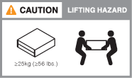
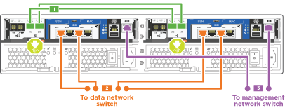

= 詳細ガイド - AFF A220 および FAS2700
:icons: font
:imagesdir: ../media/

[role="lead"]
このガイドでは、一般的なネットアップシステムのインストール手順について詳しく説明します。インストール手順の詳細については、このガイドを参照してください。

== 手順 1 ：設置の準備

[role="lead"]
FAS2700 または AFF A220 システムを設置するには、ネットアップサポートサイトでアカウントを作成し、システムを登録し、ライセンスキーを取得する必要があります。また、システムに応じた適切な数とタイプのケーブルを準備し、特定のネットワーク情報を収集する必要があります。

サイト要件および構成済みシステムの追加情報の情報については、 Hardware Universe にアクセスできる必要があります。また、ご使用の ONTAP バージョンのリリースノートにアクセスして、このシステムの詳細を確認しておくことを推奨します。

https://hwu.netapp.com["NetApp Hardware Universe の略"]

http://mysupport.netapp.com/documentation/productlibrary/index.html?productID=62286["使用しているバージョンの ONTAP 9 に対するリリースノートを検索してください"]

お客様のサイトで次のものを準備する必要があります。

* ストレージシステム用のラックスペース
* No.2 プラスドライバ
* Web ブラウザを使用してシステムをネットワークスイッチおよびラップトップまたはコンソールに接続するための追加のネットワークケーブル
* RJ-45 接続を備え、 Web ブラウザにアクセスできるラップトップまたはコンソール

.手順
. すべての箱を開封して内容物を取り出します。
. コントローラのシステムシリアル番号をメモします。
+
image::../media/drw_ssn_label.png[DRW SSN ラベル]

. アカウントを設定します。
+
.. 既存のアカウントにログインするか、アカウントを作成します。
.. システムを登録します。
+
https://mysupport.netapp.com/eservice/registerSNoAction.do?moduleName=RegisterMyProduct["ネットアップ製品登録"]

. ラップトップに Config Advisor をダウンロードしてインストールします。
+
https://mysupport.netapp.com/site/tools/tool-eula/activeiq-configadvisor["ネットアップのダウンロード： Config Advisor"]

. 同梱されていたケーブルの数と種類を確認し、書き留めておきます。
+
次の表に、同梱されているケーブルの種類を示します。この表にないケーブルが含まれていた場合は、 Hardware Universe を参照してケーブルを特定し、用途を確認してください。

+
https://hwu.netapp.com["NetApp Hardware Universe の略"]

+
[cols="1,2,1,2"]
|===
| ケーブルのタイプ | パーツ番号と長さ | コネクタのタイプ | 用途 

 a| 
10GbE ケーブル（注文内容による）
 a| 
X6566B-05-R6 （ 112-00297 ）、 0.5m

X6566B-2-R6 （ 112-00299 ）、 2m
 a| 
image:../media/oie_cable_sfp_gbe_copper.png[""]
 a| 
クラスタインターコネクトネットワーク

 a| 
10GbE ケーブル（注文内容による）
 a| 
パーツ番号 X6566B-2-R6 （ 112-00299 ）、 2m

または X6566B-3-R6 （ 112-00300 ）、 3m

X6566B-5-R6 （ 112-00301 ）、 5m
 a| 
image:../media/oie_cable_sfp_gbe_copper.png[""]
 a| 
データ

 a| 
光ネットワークケーブル（注文内容による）
 a| 
X6553-R6 （ 112-00188 ）、 2m

X6536-R6 （ 112-00090 ）、 5m

X6554-R6 （ 112-00189 ）、 15m
 a| 
image:../media/oie_cable_fiber_lc_connector.png[""]
 a| 
FC ホストネットワーク

 a| 
Cat 6 、 RJ-45 （注文内容による）
 a| 
パーツ番号 X6585-R6 （ 112-00291 ）、 3m

X6562-R6 （ 112-00196 ）、 5m
 a| 
image:../media/oie_cable_rj45.png[""]
 a| 
管理ネットワークとイーサネットデータ

 a| 
ストレージ（注文内容による）
 a| 
部品番号 X66030A （ 112-00435 ）、 0.5m

X66031A （ 112-00436 ）、 1m

X66032A （ 112-00437 ）、 2m

X66033A (112-00438) 、 3m
 a| 

 a| 
ストレージ

 a| 
Micro-USB コンソールケーブル
 a| 
該当なし
 a| 
image:../media/oie_cable_micro_usb.png[""]
 a| 
Windows または Mac 以外のラップトップ / コンソールでソフトウェアをセットアップする際のコンソール接続

 a| 
電源ケーブル
 a| 
該当なし
 a| 
image:../media/oie_cable_power.png[""]
 a| 
システムの電源をオンにします

|===
. クラスタ設定ワークシート _ をダウンロードして記入します。
+
https://library.netapp.com/ecm/ecm_download_file/ECMLP2839002["クラスタ設定ワークシート"]

== 手順 2 ：ハードウェアを設置する

[role="lead"]
システムは、 4 ポストラックまたはネットアップシステムキャビネットのいずれかに設置する必要があります。

.手順
. 必要に応じてレールキットを取り付けます。
. レールキットに付属の手順書に従って、システムを設置して固定します。
+

NOTE: システムの重量に関連する安全上の注意事項を確認しておく必要があります。

+

. ケーブルマネジメントデバイスを取り付けます（図を参照）。
+
image::../media/drw_cable_management_arm_install.png[DRW ケーブルマネジメントアーム取り付け]

. システムの前面にベゼルを配置します。

== 手順 3 ：コントローラをネットワークに接続する

[role="lead"]
2 ノードスイッチレスクラスタメソッドまたはクラスタインターコネクトネットワークを使用して、コントローラをネットワークにケーブル接続できます。

=== オプション 1 ： 2 ノードスイッチレスクラスタをケーブル接続し、ユニファイドネットワーク構成にする

[role="lead"]
コントローラの管理ネットワークポート、 UTA2 データネットワークポート、および管理ポートは、スイッチに接続されます。クラスタインターコネクトポートは、両方のコントローラでケーブル接続されます。

システムとスイッチの接続に関する情報を、ネットワーク管理者に確認しておく必要があります。

図の矢印を見て、ケーブルコネクタのプルタブの正しい向きを確認してください。

image::../media/oie_cable_pull_tab_down.png[OIE ケーブルのプルタブを下に引きます]

NOTE: コネクタを挿入すると、カチッという音がしてコネクタが所定の位置に収まるはずです。音がしない場合は、コネクタを取り外し、回転させてからもう一度試してください。

.手順
. この図またはステップバイステップの手順に従って、コントローラとスイッチをケーブルで接続します。
+
image::../media/drw_2700_tnsc_unified_network_cabling_animated_gif.png[DRW 2700 TNSC ユニファイドネットワークケーブルのアニメーション GIF]

+
[cols="1,3"]
|===
| ステップ | 各コントローラでを実行します 

 a| 
image:../media/oie_legend_icon_1_lg.png[""]
 a| 
クラスタインターコネクトケーブルを使用して、クラスタインターコネクトポートを相互に接続します。

** e0a から e0a
** e0b から e0bimage:../media/drw_c190_u_tnsc_clust_cbling.png[""]

 a| 
image:../media/oie_legend_icon_2_o.png[""]
 a| 
次のいずれかのタイプのケーブルを使用して、 UTA2 データポートをホストネットワークに接続します。

FC ホスト

** 0c と 0d
** * または * 0e と 0f A 10GbE
** e0c および e0d
** * または * e0e と e0f

NOTE: 一方のポートペアを CNA 、もう一方のポートペアを FC として接続するか、あるいは両方のポートペアを CNA または FC として接続することができます。

image:../media/drw_c190_u_fc_10gbe_cbling.png[""]

 a| 
image:../media/oie_legend_icon_3_lp.png[""]
 a| 
RJ45 ケーブルを使用して、 e0M ポートを管理ネットワークスイッチに接続します。

image:../media/drw_c190_u_mgmt_cbling.png[""]

 a| 
image:../media/oie_legend_icon_attn_symbol.png[""]
 a| 

|===
. ストレージをケーブル接続するには、を参照してください link:install_detailed_guide.md#["コントローラとドライブシェルフのケーブル接続"]

=== オプション 2 ：スイッチクラスタとユニファイドネットワークのケーブル接続

[role="lead"]
コントローラの管理ネットワークポート、 UTA2 データネットワークポート、および管理ポートは、スイッチに接続されます。クラスタインターコネクトポートは、クラスタインターコネクトスイッチにケーブル接続されます。

システムとスイッチの接続に関する情報を、ネットワーク管理者に確認しておく必要があります。

図の矢印を見て、ケーブルコネクタのプルタブの正しい向きを確認してください。

image::../media/oie_cable_pull_tab_down.png[OIE ケーブルのプルタブを下に引きます]

NOTE: コネクタを挿入すると、カチッという音がしてコネクタが所定の位置に収まるはずです。音がしない場合は、コネクタを取り外し、回転させてからもう一度試してください。

.手順
. 図またはステップバイステップの手順に従って、コントローラとスイッチをケーブルで接続します。
+
image::../media/drw_2700_switched_unified_network_cabling_animated_gif.png[DRW 2700 スイッチドユニファイドネットワークケーブルのアニメーション GIF]

+
[cols="1,3"]
|===
| ステップ | 各コントローラモジュールでを実行します 

 a| 
image:../media/oie_legend_icon_1_lg.png[""]
 a| 
クラスタインターコネクトケーブルを使用して、 e0a と e0b をクラスタインターコネクトスイッチに接続します。

image:../media/drw_c190_u_switched_clust_cbling.png[""]

 a| 
image:../media/oie_legend_icon_2_o.png[""]
 a| 
次のいずれかのタイプのケーブルを使用して、 UTA2 データポートをホストネットワークに接続します。

FC ホスト

** 0c と 0d
** ** または **0e および 0f

10GbE

** e0c および e0d
** ** または **e0e と e0f

NOTE: 一方のポートペアを CNA 、もう一方のポートペアを FC として接続するか、あるいは両方のポートペアを CNA または FC として接続することができます。

image:../media/drw_c190_u_fc_10gbe_cbling.png[""]

 a| 
image:../media/oie_legend_icon_3_lp.png[""]
 a| 
RJ45 ケーブルを使用して、 e0M ポートを管理ネットワークスイッチに接続します。

image:../media/drw_c190_u_mgmt_cbling.png[""]

 a| 
image:../media/oie_legend_icon_attn_symbol.png[""]
 a| 
この時点ではまだ電源コードをプラグに接続しないでください。

|===
. ストレージをケーブル接続するには、を参照してください link:install_detailed_guide.md#["コントローラとドライブシェルフのケーブル接続"]

=== オプション 3 ： 2 ノードスイッチレスクラスタをケーブル接続し、イーサネットネットワーク構成にする

[role="lead"]
コントローラの管理ネットワークポート、イーサネットデータネットワークポート、および管理ポートは、スイッチに接続されます。クラスタインターコネクトポートは、両方のコントローラでケーブル接続されます。

システムとスイッチの接続に関する情報を、ネットワーク管理者に確認しておく必要があります。

図の矢印を見て、ケーブルコネクタのプルタブの正しい向きを確認してください。

image::../media/oie_cable_pull_tab_down.png[OIE ケーブルのプルタブを下に引きます]

NOTE: コネクタを挿入すると、カチッという音がしてコネクタが所定の位置に収まるはずです。音がしない場合は、コネクタを取り外し、回転させてからもう一度試してください。

.手順
. この図またはステップバイステップの手順に従って、コントローラとスイッチをケーブルで接続します。
+

+
[cols="1,3"]
|===
| ステップ | 各コントローラでを実行します 

 a| 
image:../media/oie_legend_icon_1_lg.png[""]
 a| 
クラスタインターコネクトケーブルを使用して、クラスタインターコネクトポートを相互に接続します。

** e0a から e0a
** e0b から e0bimage:../media/drw_c190_e_tnsc_clust_cbling.png[""]

 a| 
image:../media/oie_legend_icon_2_o.png[""]
 a| 
Cat 6 RJ45 ケーブルを使用して、 e0c~e0f のポートをホストネットワークに接続します。

image:../media/drw_c190_e_rj45_cbling.png[""]

 a| 
image:../media/oie_legend_icon_3_lp.png[""]
 a| 
RJ45 ケーブルを使用して、 e0M ポートを管理ネットワークスイッチに接続します。

image:../media/drw_c190_e_mgmt_cbling.png[""]

 a| 
image:../media/oie_legend_icon_attn_symbol.png[""]
 a| 
この時点ではまだ電源コードをプラグに接続しないでください。

|===
. ストレージをケーブル接続するには、を参照してください link:install_detailed_guide.md#["コントローラとドライブシェルフのケーブル接続"]

=== オプション 4 ：スイッチクラスタのケーブル接続、イーサネットネットワーク構成

[role="lead"]
コントローラの管理ネットワークポート、イーサネットデータネットワークポート、および管理ポートは、スイッチに接続されます。クラスタインターコネクトポートは、クラスタインターコネクトスイッチにケーブル接続されます。

システムとスイッチの接続に関する情報を、ネットワーク管理者に確認しておく必要があります。

図の矢印を見て、ケーブルコネクタのプルタブの正しい向きを確認してください。

image::../media/oie_cable_pull_tab_down.png[OIE ケーブルのプルタブを下に引きます]

NOTE: コネクタを挿入すると、カチッという音がしてコネクタが所定の位置に収まるはずです。音がしない場合は、コネクタを取り外し、回転させてからもう一度試してください。

.手順
. 図またはステップバイステップの手順に従って、コントローラとスイッチをケーブルで接続します。
+
image::../media/drw_2700_switched_ethernet_network_cabling_animated_gif.png[DRW 2700 スイッチドイーサネットネットワークケーブル配線アニメーション GIF]

+
[cols="1,2"]
|===
| ステップ | 各コントローラモジュールでを実行します 

 a| 
image:../media/oie_legend_icon_1_lg.png[""]
 a| 
クラスタインターコネクトケーブルを使用して、 e0a と e0b をクラスタインターコネクトスイッチに接続します。

image:../media/drw_c190_e_switched_clust_cbling.png[""]

 a| 
image:../media/oie_legend_icon_2_o.png[""]
 a| 
Cat 6 RJ45 ケーブルを使用して、 e0c~e0f のポートをホストネットワークに接続します。

image:../media/drw_c190_e_rj45_cbling.png[""]

 a| 
image:../media/oie_legend_icon_3_lp.png[""]
 a| 
RJ45 ケーブルを使用して、 e0M ポートを管理ネットワークスイッチに接続します。

image:../media/drw_c190_e_mgmt_cbling.png[""]

 a| 
image:../media/oie_legend_icon_attn_symbol.png[""]
 a| 
この時点ではまだ電源コードをプラグに接続しないでください。

|===
. ストレージをケーブル接続するには、を参照してください link:install_detailed_guide.md#["コントローラとドライブシェルフのケーブル接続"]

== 手順 4 ：コントローラをドライブシェルフにケーブル接続する

[role="lead"]
オンボードストレージポートを使用して、コントローラをシェルフにケーブル接続する必要があります。ネットアップでは、外付けストレージを使用するシステムに MP-HA ケーブル接続を推奨しています。SAS テープドライブがある場合は、シングルパスケーブル接続を使用できます。外付けシェルフがない場合は、システムと一緒に SAS ケーブルを購入した場合、内蔵ドライブへの MP-HA ケーブル接続はオプションです（図では省略しています）。

=== オプション 1 ： HA ペアのストレージを外付けドライブシェルフとケーブル接続する

[role="lead"]
シェルフ / シェルフ間をケーブル接続し、そのあとに両方のコントローラをドライブシェルフにケーブル接続する必要があります。

図の矢印を見て、ケーブルコネクタのプルタブの正しい向きを確認してください。

image::../media/oie_cable_pull_tab_down.png[OIE ケーブルのプルタブを下に引きます]

.手順
. 外付けドライブシェルフがある HA ペアをケーブル接続します。
+

NOTE: この例では DS224C を使用していますサポートされている他のドライブシェルフでもケーブル接続はほぼ同じです。

+
image::../media/drw_2700_ha_storage_cabling_animated_gif.png[DRW 2700 HA ストレージのケーブル配線アニメーション GIF]

+
[cols="1,3"]
|===
| ステップ | 各コントローラでを実行します 

 a| 
image:../media/oie_legend_icon_1_lo.png[""]
 a| 
シェルフ間でポートをケーブル接続します。

** IOM A のポート 3 と直下のシェルフにある IOM A のポート 1
** IOM B のポート 3 と直下のシェルフにある IOM B のポート 1
+
 mini-SAS HD 間ケーブル

 a| 
image:../media/oie_legend_icon_2_mb.png[""]
 a| 
各ノードをスタック内の IOM A に接続します。

** コントローラ 1 のポート 0b とスタックの最後のドライブシェルフにある IOM A のポート 3
** コントローラ 2 のポート 0a とスタックの最初のドライブシェルフにある IOM A のポート 1
+
 mini-SAS HD 間ケーブル

 a| 
image:../media/oie_legend_icon_3_t.png[""]
 a| 
各ノードをスタック内の IOM B に接続します

** コントローラ 1 のポート 0a とスタックの最初のドライブシェルフにある IOM B のポート 1
** コントローラ 2 のポート 0b とスタックの最後のドライブシェルフにある IOM B のポート 3image:../media/oie_cable_mini_sas_hd_to_mini_sas_hd.png[""] mini-SAS HD 間ケーブル

|===
+
ドライブシェルフスタックが複数ある場合は、使用するドライブシェルフタイプに対応した _ インストールおよびケーブル接続ガイド _ を参照してください。

+
link:../com.netapp.doc.hw-ds-sas3-icg/home.html["設置とケーブル接続"]

. システムのセットアップを完了するには、を参照してください link:install_detailed_guide.md#["システムのセットアップと設定を実行"]

== 手順 5 ：システムのセットアップと設定を完了する

[role="lead"]
システムのセットアップと設定を実行するには、スイッチとラップトップのみを接続してクラスタ検出を使用するか、システムのコントローラに直接接続してから管理スイッチに接続します。

=== オプション 1 ：ネットワーク検出が有効になっている場合は、システムのセットアップを完了する

[role="lead"]
ラップトップでネットワーク検出が有効になっている場合は、クラスタの自動検出を使用してシステムのセットアップと設定を実行できます。

.手順
. 次のアニメーションに従って、 1 つ以上のドライブシェルフ ID を設定します。
+
https://netapp.hosted.panopto.com/Panopto/Pages/embed.aspx?id=c600f366-4d30-481a-89d9-ab1b0066589b["ドライブシェルフ ID を設定します"]

. 電源コードをコントローラの電源装置に接続し、さらに別の回路の電源に接続します。
. 両方のノードの電源スイッチをオンにします。
+
image::../media/drw_turn_on_power_switches_to_psus.png[DRW 電源スイッチをオンにして PSU に切り替えます]

+

NOTE: 初回のブートには最大 8 分かかる場合があります。

. ラップトップでネットワーク検出が有効になっていることを確認します。
+
詳細については、ラップトップのオンラインヘルプを参照してください。

. 次のアニメーションに従って、ラップトップを管理スイッチに接続します。
+
https://netapp.hosted.panopto.com/Panopto/Pages/embed.aspx?id=d61f983e-f911-4b76-8b3a-ab1b0066909b["ラップトップを管理スイッチに接続します"]

. 検出する ONTAP アイコンを選択します。
+
image::../media/drw_autodiscovery_controler_select.png[DRW 自動検出コントローラ選択]

+
.. エクスプローラを開きます。
.. 左側のペインで、 [Network] ( ネットワーク ) をクリックします。
.. 右クリックして、更新を選択します。
.. いずれかの ONTAP アイコンをダブルクリックし、画面に表示された証明書を受け入れます。
+

NOTE: 「 XXXXX 」は、ターゲットノードのシステムシリアル番号です。

+
System Manager が開きます。

. System Manager のセットアップガイドを使用して、 _NetApp ONTAP 構成ガイド _ で収集したデータを基にシステムを設定します。
+
https://library.netapp.com/ecm/ecm_download_file/ECMLP2862613["『 ONTAP 構成ガイド』"]

. Config Advisor を実行してシステムの健全性を確認します。
. 初期設定が完了したら、に進みます https://www.netapp.com/data-management/oncommand-system-documentation/["ONTAP & ONTAP システムマネージャのマニュアルリソース"] ONTAP での追加機能の設定については、ページを参照してください。

=== オプション 2 ：ネットワーク検出が有効になっていない場合のシステムのセットアップと設定の実行

[role="lead"]
ラップトップでネットワーク検出が有効になっていない場合は、このタスクを使用して設定とセットアップを実行する必要があります。

.手順
. ラップトップまたはコンソールをケーブル接続して設定します。
+
.. ラップトップまたはコンソールのコンソールポートを、 115 、 200 ボー、 N-8-1 に設定します。
+

NOTE: コンソールポートの設定方法については、ラップトップまたはコンソールのオンラインヘルプを参照してください。

.. ラップトップまたはコンソールにコンソールケーブルを接続し、システムに付属のコンソールケーブルを使用してコントローラのコンソールポートに接続します。
+
image::../media/drw_console_connect_fas2700_affa200.png[DRW コンソール接続 fas2700 affa200]

.. ラップトップまたはコンソールを管理サブネット上のスイッチに接続します。
+
image::../media/drw_client_to_mgmt_subnet_fas2700_affa220.png[DRW クライアントから mgmt サブネット fas2700 affa220]

.. 管理サブネット上の TCP / IP アドレスをラップトップまたはコンソールに割り当てます。

. 次のアニメーションに従って、 1 つ以上のドライブシェルフ ID を設定します。
+
https://netapp.hosted.panopto.com/Panopto/Pages/embed.aspx?id=c600f366-4d30-481a-89d9-ab1b0066589b["ドライブシェルフ ID を設定します"]

. 電源コードをコントローラの電源装置に接続し、さらに別の回路の電源に接続します。
. 両方のノードの電源スイッチをオンにします。
+
image::../media/drw_turn_on_power_switches_to_psus.png[DRW 電源スイッチをオンにして PSU に切り替えます]

+

NOTE: 初回のブートには最大 8 分かかる場合があります。

. いずれかのノードに初期ノード管理 IP アドレスを割り当てます。
+
[cols="1-3"]
|===
| 管理ネットワークでの DHCP の状況 | 作業 

 a| 
を設定します
 a| 
新しいコントローラに割り当てられた IP アドレスを記録します。

 a| 
未設定
 a| 
.. PuTTY 、ターミナルサーバ、または環境に対応した同等の機能を使用して、コンソールセッションを開きます。
+

NOTE: PuTTY の設定方法がわからない場合は、ラップトップまたはコンソールのオンラインヘルプを確認してください。

.. スクリプトからプロンプトが表示されたら、管理 IP アドレスを入力します。

|===
. ラップトップまたはコンソールで、 System Manager を使用してクラスタを設定します。
+
.. ブラウザでノード管理 IP アドレスを指定します。
+

NOTE: アドレスの形式はです https://x.x.x.x[]。

.. NetApp ONTAP 構成ガイドで収集したデータを基にシステムを設定します。
+
https://library.netapp.com/ecm/ecm_download_file/ECMLP2862613["『 ONTAP 構成ガイド』"]

. Config Advisor を実行してシステムの健全性を確認します。
. 初期設定が完了したら、に進みます https://www.netapp.com/data-management/oncommand-system-documentation/["ONTAP & ONTAP システムマネージャのマニュアルリソース"] ONTAP での追加機能の設定については、ページを参照してください。

