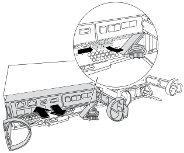

= FAS2820システムのシャーシを交換する
:allow-uri-read: 
:icons: font
:imagesdir: ../media/

[role="lead"]
FAS2820システムで、電源装置、ハードドライブ、およびコントローラモジュールを障害のあるシャーシから交換用シャーシに移動し、障害のあるシャーシと同じモデルの交換用シャーシと機器ラックまたはシステムキャビネット内で交換します。

[[step-1-move-a-power-supply]]
== 手順 1 ：電源装置を移動します

シャーシを交換するときに電源装置を移動するには、障害のあるシャーシの電源装置の電源をオフにして接続を解除し、電源装置を交換用シャーシに取り付けて接続します。

. 接地対策がまだの場合は、自身で適切に実施します。
. 電源装置をオフにし、電源ケーブルを外します。
+
.. 電源装置の電源スイッチをオフにします。
.. 電源ケーブルの固定クリップを開き、電源装置から電源ケーブルを抜きます。
.. 電源から電源ケーブルを抜きます。

. 電源装置のカムハンドルのラッチを押し、カムハンドルを最大まで開いて電源装置をミッドプレーンから外します。
. カムハンドルをつかみ、電源装置をスライドしてシステムから引き出します。
+

CAUTION: 電源装置を取り外すときは、重量があるので必ず両手で支えながら作業してください。

. 残りの電源装置に対して上記の手順を繰り返します。
. 両手で電源ユニットの端を支え、システムシャーシの開口部に位置を合わせ、カムハンドルを使って電源ユニットをシャーシにゆっくりと押し込みます。
+
電源装置にはキーが付いており、一方向のみ取り付けることができます。

+

NOTE: 電源装置をスライドさせてシステムに挿入する際に力を入れすぎないようにしてください。コネクタが破損する可能性があります。

. カムハンドルを閉じます。ラッチがカチッという音を立ててロックされ、電源装置が完全に収まります。
. 電源ケーブルを再接続し、電源ケーブル固定用ツメを使用して電源装置に固定します。
+

NOTE: 電源ケーブルは電源装置にのみ接続してください。この時点では、電源ケーブルを電源に接続しないでください。

[[step-2-remove-the-controller-module]]
== 手順 2 ：コントローラモジュールを取り外す

障害のあるシャーシからコントローラモジュールを取り外します。

. ケーブルマネジメントデバイスに接続しているケーブルをまとめているフックとループストラップを緩め、システムケーブルと SFP をコントローラモジュールから外し（必要な場合）、どのケーブルが何に接続されていたかを記録します。
+
ケーブルはケーブルマネジメントデバイスに収めたままにします。これにより、ケーブルマネジメントデバイスを取り付け直すときに、ケーブルを整理する必要がありません。

. ケーブルマネジメントデバイスをコントローラモジュールの右側と左側から取り外し、脇に置きます。
. カムハンドルのラッチをつかんで解除し、カムハンドルを最大限に開いてコントローラモジュールをミッドプレーンから離し、両手でコントローラモジュールをシャーシから外します。
+

. コントローラモジュールを安全な場所に置いておきます。
. シャーシ内の2台目のコントローラモジュールについて、上記の手順を繰り返します。

[[step-3-move-drives-to-the-replacement-chassis]]
== 手順3：交換用シャーシにドライブを移動する

障害のあるシャーシの各ドライブベイの開口部から、交換用シャーシの同じ開口部にドライブを移動します。

. システムの前面からベゼルをそっと取り外します。
. ドライブを取り外します。
+
.. LEDの反対側にあるリリースボタンを押します。
.. カムハンドルを完全に引き下げてミッドプレーンからドライブを外し、ドライブをシャーシからそっと引き出します。
+
ドライブがシャーシから外れ、シャーシから取り出せるようになります。

+

NOTE: ドライブを取り外すときは、必ず両手で支えながら作業してください。

+

NOTE: ドライブは壊れやすいので、損傷を防ぐために、できる限り取り扱いは最小限にしてください。

. 障害シャーシのドライブを交換用シャーシの同じベイ開口部に合わせます。
. ドライブをシャーシの奥までそっと押し込みます。
+
カムハンドルが噛み合い、閉じた位置まで回転し始めます。

. ドライブをシャーシの奥までしっかりと押し込み、カムハンドルをドライブホルダーに押し付けてロックします。
+
カムハンドルは、ドライブキャリアの前面に揃うようにゆっくりと閉じてください。安全な状態でカチッと音がします。

. システムの残りのドライブに対して同じ手順を繰り返します。

[[step-4-replace-a-chassis-from-within-the-equipment-rack-or-system-cabinet]]
== 手順 4 ：装置ラックまたはシステムキャビネット内のシャーシを交換する

装置ラックまたはシステムキャビネットから既存のシャーシを取り外し、交換用シャーシを装置ラックまたはシステムキャビネットに設置します。

. シャーシ取り付けポイントからネジを外します。
. 2～3人の協力を得て、システムキャビネット内のラックレールまたは機器ラック内の _L_ ブラケットから、故障したシャーシをスライドさせて外し、脇に置いてください。
. 接地対策がまだの場合は、自身で適切に実施します。
. 交換用シャーシを機器ラックまたはシステムキャビネットに取り付けるには、2～3人で作業し、システムキャビネットの場合はラックレールに、機器ラックの場合は _L_ 字型ブラケットにシャーシを誘導して取り付けます。
. シャーシをスライドさせて装置ラックまたはシステムキャビネットに完全に挿入します。
. 障害のあるシャーシから取り外したネジを使用して、シャーシの前面を装置ラックまたはシステムキャビネットに固定します。
. まだベゼルを取り付けていない場合は、取り付けます。

[[step-5-install-the-controller]]
== 手順 5 ：コントローラを取り付ける

コントローラーモジュールとその他のコンポーネントを交換用シャーシに取り付け、メンテナンスモードで起動します。

2 台のコントローラモジュールを同じシャーシに搭載する HA ペアでは、シャーシへの設置が完了すると同時にリブートが試行されるため、コントローラモジュールの取り付け順序が特に重要です。

. コントローラモジュールの端をシャーシの開口部に合わせ、コントローラモジュールをシステムに半分までそっと押し込みます。
+

NOTE: 指示があるまでコントローラモジュールをシャーシに完全に挿入しないでください。

. コンソールとコントローラモジュールを再度ケーブル接続し、管理ポートを再接続します。
. 交換用シャーシの2台目のコントローラで上記の手順を繰り返します。
. コントローラモジュールの取り付けを完了します。
+
.. カムハンドルを開き、コントローラモジュールをミッドプレーンまでしっかりと押し込んで完全に装着し、カムハンドルをロック位置まで閉じます。
+

NOTE: コネクタの破損を防ぐため、コントローラモジュールをスライドしてシャーシに挿入する際に力を入れすぎないでください。

.. ケーブルマネジメントデバイスをまだ取り付けていない場合は、取り付け直します。
.. ケーブルマネジメントデバイスに接続されているケーブルをフックとループストラップでまとめます。
.. 交換用シャーシの2台目のコントローラモジュールで上記の手順を繰り返します。

. 電源装置を別の電源に接続し、電源をオンにします。
. 各コントローラをメンテナンスモードでブートします。
+
.. 各コントローラーが起動し始めたら、 `Ctrl-C`を押して、 `Press Ctrl-C for Boot Menu`というメッセージが表示されたときにブートプロセスを中断してください。
+

NOTE: プロンプトを見逃してコントローラモジュールが ONTAP で起動する場合は、「 halt 」と入力し、 LOADER プロンプトで「 boot_ontap 」と入力して、プロンプトが表示されたら「 Ctrl+C 」を押して、この手順を繰り返します。

.. ブートメニューからメンテナンスモードのオプションを選択します。

