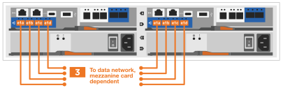

= 詳細な手順- FAS2820
:allow-uri-read: 
:icons: font
:imagesdir: ../media/

[role="lead"]
この手順では、一般的なNetAppストレージシステムをインストールする手順を詳しく説明します。より詳細なインストール手順が必要な場合は、この手順を使用します。

== 手順 1 ：設置の準備

.作業を開始する前に
お客様のサイトで次のものを準備する必要があります。

* Telcoラックまたはシステムキャビネット内のストレージシステムのラックスペース。
+
** ストレージシステム用に2U
** システムのドライブシェルフごとに2Uまたは4U

* No.2 プラスドライバ
* 追加のネットワークケーブル（ストレージシステムをWebブラウザを使用してネットワークスイッチやラップトップまたはコンソールに接続する場合）
* RJ-45 接続を備え、 Web ブラウザにアクセスできるラップトップまたはコンソール
+
** にアクセスします https://hwu.netapp.com["NetApp Hardware Universe の略"] 構成済みのストレージシステム上のサイト要件および追加情報については、を参照してください。
** へのアクセスも必要になる場合があります http://mysupport.netapp.com/documentation/productlibrary/index.html?productID=62286["使用しているONTAP 9のバージョンに対応したリリースノート"] このストレージシステムの詳細については、ONTAPのバージョンに対応しています。

.手順
. すべての箱を開梱し、中身を確認します。
+

IMPORTANT: 特定の電力要件を持つお客様は、確認する必要があります https://hwu.netapp.com["NetApp Hardware Universe の略"] をクリックしてください。

. にアクセスします https://docs.netapp.com/us-en/ontap/task_configure_ontap.html#assign-a-node-management-ip-address["System Managerを使用して新しいクラスタにONTAPを設定します"^]
+
.. AMD手順の要件を確認します。
.. 次の手順を実行して、ストレージシステムに関する情報を収集します。 https://docs.netapp.com/us-en/ontap/task_configure_ontap.html["セットアップワークシート^（ワークシートのURLが必要）"]。
.. コントローラのストレージシステムのシリアル番号をメモします。
+
image::../media/drw_ssn_label.svg[システムシリアル番号の例]

次の表に、同梱されているケーブルの種類を示します。表に記載されていないケーブルがある場合は、を参照してください https://hwu.netapp.com["NetApp Hardware Universe の略"] ケーブルの場所を確認し、用途を特定します。

[cols="1,2,1,2"]
|===
| ケーブルのタイプ | パーツ番号と長さ | コネクタのタイプ | 用途 

 a| 
10GbE、SFP28ケーブル（発注内容に応じて）
 a| 
X6566B-05-R6、.5、

X6566B-2-R6、2m
 a| 
image::../media/oie_cable_sfp_gbe_copper.png[GbE SFP銅線コネクタ]
 a| 
ネットワークケーブル

 a| 
25Gbイーサネット、SFP28
 a| 
X66240A-05、0.5m

X66240-2、2m

X66240A-5、5m
 a| 
image::../media/oie_cable_25Gb_Ethernet_SFP28_IEOPS-1069.svg[OIEケーブル25GbイーサネットSFP28 IEOPS 1069]
 a| 
ネットワークケーブル

 a| 
32Gbファイバチャネル、
SFP+（ターゲット/イニシエータ）
 a| 
X66250-2、2m

X66250-5、5m

X66250-15、15m
 a| 
image::../media/oie_cable_sfp_gbe_copper.png[GbE SFP銅線コネクタ]
 a| 
FCネットワーク

 a| 
Cat 6 、 RJ-45 （注文内容による）
 a| 
X6561-R6

X6562-R6
 a| 
image::../media/oie_cable_rj45.png[RJ-45ケーブル]
 a| 
管理ネットワークとイーサネットデータ

 a| 
ストレージ
 a| 
X66030A、0.5m

X66031A、1m

X66032A、2m
 a| 
image::../media/oie_cable_mini_sas_hd_to_mini_sas_hd.svg[OIEケーブルミニSAS HDからミニSAS HD]
 a| 
ストレージ

 a| 
USB-Cコンソールケーブル
 a| 
パーツ番号ラベルなし
 a| 

 a| 
Windows または Mac 以外のラップトップ / コンソールでソフトウェアをセットアップする際のコンソール接続

 a| 
電源ケーブル
 a| 
パーツ番号ラベルなし
 a| 
image::../media/oie_cable_power.png[OIEケーブル電源]
 a| 
ストレージシステムの電源

 a| 
オプションのFCケーブル
 a| 
オプションのFCケーブル
 a| 
image::../media/oie_cable_fiber_lc_connector.png[LCファイバコネクタ]
 a| 
追加のFCネットワークケーブル

|===

== 手順 2 ：ハードウェアを設置する

必要に応じて、TelcoラックまたはNetAppストレージシステムキャビネットにストレージシステムを設置します。

.手順
. 必要に応じてレールキットを取り付けます。
. レールキットに付属の手順書に従って、ストレージシステムを設置して固定します。
+

NOTE: ストレージシステムの重量に関連する安全上の懸念事項に注意する必要があります。

+
image::../media/oie_fas2800_weight_caution_IEOPS-1070.svg[OIE fas2800重量注意IEOPS 1070]

. ケーブルマネジメントデバイスを取り付けます（図を参照）。
+
image::../media/drw_cable_management_arm_install.svg[DRW ケーブルマネジメントアーム取り付け]

. ベゼルをストレージシステムの前面に配置します。

== 手順 3 ：コントローラをネットワークに接続する

2ノードスイッチレスクラスタまたはスイッチクラスタとしてコントローラをネットワークにケーブル接続します。

次の表に、2ノードスイッチレスクラスタとスイッチクラスタの両方の図のケーブルタイプ、コールアウト番号、およびケーブルの色を示します。

[cols="20%,80%"]
|===
| ケーブル配線 | 接続タイプ 

 a| 
image::../media/icon_square_1_green.png[番号3 ]]
 a| 
クラスタインターコネクト

 a| 
image::../media/icon_square_2_purple.png[番号2]
 a| 
管理ネットワークスイッチ

 a| 
image::../media/icon_square_3_orange.png[番号3]
 a| 
ホストネットワークスイッチ

|===
.作業を開始する前に
* ストレージシステムをスイッチに接続する方法については、ネットワーク管理者にお問い合わせください。
* 図の矢印を確認して、ケーブルコネクタのプルタブの向きが正しいことを確認します。
+
** コネクタを挿入すると、カチッという音がして所定の位置に収まります。カチッという音がしない場合は、コネクタを取り外し、ケーブルヘッドを裏返してやり直してください。
** 光スイッチに接続する場合は、ポートにケーブル接続する前に、 SFP をコントローラポートに挿入します。

image::../media/oie_cable_pull_tab_down.png[プルタブ方向]

[role="tabbed-block"]
====
.オプション 1 ： 2 ノードスイッチレスクラスタをケーブル接続
--
2ノードスイッチレスクラスタの場合は、ネットワーク接続とクラスタインターコネクトポートをケーブル接続します。

.このタスクについて
アニメーションやステップバイステップの手順に従って、コントローラとスイッチをケーブル接続します。

.アニメーション- 2ノードスイッチレスクラスタのケーブル接続
video::90577508-fa79-46cf-b18a-afe8016325af[panopto]
.手順
. クラスタインターコネクトケーブルを使用して、クラスタインターコネクトポートe0aからe0a、e0bからe0bを接続します。
+
image::../media/oie_cable_25Gb_Ethernet_SFP28_IEOPS-1069.svg[OIEケーブル25GbイーサネットSFP28 IEOPS 1069]

+
*クラスタインターコネクトケーブル*

+
image::../media/drw_2800_tnsc_cluster_cabling_IEOPS-892.svg[DRW 2800 TNSCクラスタケーブル配線IEOPS 892]

. RJ45 ケーブルを使用して、 e0M ポートを管理ネットワークスイッチに接続します。
+
image::../media/oie_cable_rj45.png[RJ-45ケーブル]

+
* RJ45ケーブル*

+
image::../media/drw_2800_management_connection_IEOPS-1077.svg[DRW 2800管理接続IEOPS 1077]

. メザニンカードポートをホストネットワークにケーブル接続します。
+

+
.. 4ポートイーサネットデータネットワークの場合は、ポートe1a~e1dをイーサネットデータネットワークにケーブル接続します。
+
*** 4ポート、10 / 25Gbイーサネット、SFP28
+
image::../media/oie_cable_sfp_gbe_copper.png[GbE SFP銅線コネクタ]

+
image::../media/oie_cable_25Gb_Ethernet_SFP28_IEOPS-1069.svg[OIEケーブル25GbイーサネットSFP28 IEOPS 1069]

*** 4ポート、10GBASE-T、RJ45
+
image::../media/oie_cable_rj45.png[RJ-45ケーブル]

.. 4ポートのFibre Channelデータネットワークを使用する場合は、FCネットワーク用にポート1a~1dをケーブル接続します。
+
*** 4ポート、32Gbファイバチャネル、SFP+（ターゲットのみ）
+
image::../media/oie_cable_sfp_gbe_copper.png[GbE SFP銅線コネクタ]

*** 4ポート、32Gbファイバチャネル、SFP+（イニシエータ/ターゲット）
+
image::../media/oie_cable_sfp_gbe_copper.png[GbE SFP銅線コネクタ]

.. 2+2カード（2ポートがイーサネット接続、2ポートがファイバチャネル接続）を使用している場合は、ポートe1aとe1bをFCデータネットワークに、ポートe1cとe1dをイーサネットデータネットワークにケーブル接続します。
+
*** 10 / 25Gbイーサネット（SFP28）×2ポート+32Gb FC（SFP+）×2ポート
+
image::../media/oie_cable_sfp_gbe_copper.png[GbE SFP銅線コネクタ]

+
image::../media/oie_cable_sfp_gbe_copper.png[GbE SFP銅線コネクタ]

IMPORTANT: 電源コードは接続しないでください。

--
.オプション 2 ：スイッチクラスタをケーブル接続する
--
スイッチクラスタのネットワーク接続とクラスタインターコネクトポートをケーブル接続します。

.このタスクについて
アニメーションやステップバイステップの手順に従って、コントローラとスイッチをケーブル接続します。

.アニメーションスイッチを使用したクラスタのケーブル接続
video::6553a3db-57dd-4247-b34a-afe8016315d4[panopto]
.手順
. クラスタインターコネクトケーブルを使用して、クラスタインターコネクトポートe0aからe0a、e0bからe0bを接続します。
+
image::../media/oie_cable_25Gb_Ethernet_SFP28_IEOPS-1069.svg[OIEケーブル25GbイーサネットSFP28 IEOPS 1069]

+
image::../media/drw_2800_switched_cluster_cabling_IEOPS-893.svg[DRW 2800スイッチクラスタのケーブル接続IEOPS 893]

. RJ45 ケーブルを使用して、 e0M ポートを管理ネットワークスイッチに接続します。
+
image::../media/oie_cable_rj45.png[RJ-45ケーブル]

+
image::../media/drw_2800_management_connection_IEOPS-1077.svg[DRW 2800管理接続IEOPS 1077]

. メザニンカードポートをホストネットワークにケーブル接続します。
+

+
.. 4ポートイーサネットデータネットワークの場合は、ポートe1a~e1dをイーサネットデータネットワークにケーブル接続します。
+
*** 4ポート、10 / 25Gbイーサネット、SFP28
+
image::../media/oie_cable_sfp_gbe_copper.png[GbE SFP銅線コネクタ]

+
image::../media/oie_cable_25Gb_Ethernet_SFP28_IEOPS-1069.svg[OIEケーブル25GbイーサネットSFP28 IEOPS 1069]

*** 4ポート、10GBASE-T、RJ45
+
image::../media/oie_cable_rj45.png[RJ-45ケーブル]

.. 4ポートのFibre Channelデータネットワークを使用する場合は、FCネットワーク用にポート1a~1dをケーブル接続します。
+
*** 4ポート、32Gbファイバチャネル、SFP+（ターゲットのみ）
+
image::../media/oie_cable_sfp_gbe_copper.png[GbE SFP銅線コネクタ]

*** 4ポート、32Gbファイバチャネル、SFP+（イニシエータ/ターゲット）
+
image::../media/oie_cable_sfp_gbe_copper.png[GbE SFP銅線コネクタ]

.. 2+2カード（2ポートがイーサネット接続、2ポートがファイバチャネル接続）を使用している場合は、ポートe1aとe1bをFCデータネットワークに、ポートe1cとe1dをイーサネットデータネットワークにケーブル接続します。
+
*** 10 / 25Gbイーサネット（SFP28）×2ポート+32Gb FC（SFP+）×2ポート
+
image::../media/oie_cable_sfp_gbe_copper.png[GbE SFP銅線コネクタ]

+
image::../media/oie_cable_sfp_gbe_copper.png[GbE SFP銅線コネクタ]

IMPORTANT: 電源コードは接続しないでください。

--
====

== 手順 4 ：コントローラをドライブシェルフにケーブル接続する

コントローラを外付けストレージにケーブル接続します。

次の表に、ドライブシェルフをストレージシステムにケーブル接続する際の図のケーブルタイプ、コールアウト番号、およびケーブルの色を示します。

NOTE: この例では DS224C を使用していますサポートされている他のドライブシェルフでもケーブル接続はほぼ同じです。詳細については、を参照してください link:../sas3/install-new-system.html["IOM12 / IOM12Bモジュールを搭載したシェルフを新しいシステムに設置してケーブル接続します"] 。

[cols="20%,80%"]
|===
| ケーブル配線 | 接続タイプ 

 a| 

 a| 
シエルフ/シエルフカンケエフルセツソク

 a| 
image::../media/icon_square_2_blue.png[吹き出しアイコン2]
 a| 
コントロオラAヲトライフシエルフニ

 a| 
image::../media/icon_square_3_tourquoise.png[吹き出しアイコン3]
 a| 
コントローラBをドライブシェルフに接続

|===
図の矢印を見て、ケーブルコネクタのプルタブの正しい向きを確認してください。

image::../media/oie_cable_pull_tab_down.png[プルタブ方向]

.このタスクについて
アニメーションやステップバイステップの手順に従って、コントローラとドライブシェルフをケーブル接続します。

IMPORTANT: FAS2820ではポート0b2を使用しないでください。このSASポートはONTAPでは使用されず、常に無効になっています。詳細については、を参照してください link:../sas3/install-new-system.html["新しいストレージシステムにシェルフを設置します"^] 。

.アニメーション-ドライブシェルフのケーブル配線
video::b2a7549d-8141-47dc-9e20-afe8016f4386[panopto]
.手順
. シェルフ間でポートをケーブル接続します。
+
.. IOM Aのポート1と直下のシェルフにあるIOM Aのポート3
.. IOM Bのポート1と直下のシェルフにあるIOM Bのポート3
+
image::../media/oie_cable_mini_sas_hd_to_mini_sas_hd.svg[OIEケーブルミニSAS HDからミニSAS HD]

+
* Mini-SAS HD間ケーブル*

+
image::../media/drw_2800_shelf-to-shelf_cabling_IEOPS-895.svg[DRW 2800シェルフとシェルフのケーブル配線IEOPS 895]

. コントローラAをドライブシェルフにケーブル接続します。
+
.. コントローラAのポート0aとスタックの最初のドライブシェルフにあるIOM Bのポート1
.. コントローラAのポート0b1とスタックの最後のドライブシェルフにあるIOM Aのポート3
+
image::../media/oie_cable_mini_sas_hd_to_mini_sas_hd.svg[OIEケーブルミニSAS HDからミニSAS HD]

+
* Mini-SAS HD間ケーブル*

+
image::../media/dwr-2800_controller1-to shelves_IEOPS-896.svg[DWR 2800コントローラ1をシェルフIEOPS 896に接続]

. コントローラBをドライブシェルフに接続します。
+
.. コントローラBのポート0aとスタックの最初のドライブシェルフにあるIOM Aのポート1
.. コントローラBのポート0b1とスタックの最後のドライブシェルフにあるIOM Bのポート3
+
image::../media/oie_cable_mini_sas_hd_to_mini_sas_hd.svg[OIEケーブルミニSAS HDからミニSAS HD]

+
* Mini-SAS HD間ケーブル*

+
image::../media/dwr-2800_controller2-to shelves_IEOPS-897.svg[DWR 2800コントローラ2をシェルフIEOPS 897に接続]

== 手順5：ストレージシステムのセットアップと設定を完了する

オプション1：ネットワーク検出が有効な場合、またはオプション2：ネットワーク検出が有効でない場合のいずれかを使用して、ストレージシステムのセットアップと設定を完了します。

[role="tabbed-block"]
====
.オプション 1 ：ネットワーク検出が有効になっている場合
--
ラップトップでネットワーク検出が有効になっている場合は、クラスタの自動検出を使用してストレージシステムのセットアップと設定を完了します。

.手順
. 次のアニメーションに従って、シェルフの電源をオンにし、シェルフIDを設定します。
+
.アニメーション-ドライブシェルフIDを設定します
video::c600f366-4d30-481a-89d9-ab1b0066589b[panopto]
. コントローラの電源をオンにします
+
.. 電源コードをコントローラの電源装置に接続し、さらに別の回路の電源に接続します。
.. 両方のノードの電源スイッチをオンにします。
+

NOTE: 初回のブートには最大 8 分かかる場合があります。

+
image::../media/dwr_2800_turn_on_power_IEOPS-898.svg[DWR 2800電源をオンにしますIEOPS 898]

. ラップトップでネットワーク検出が有効になっていることを確認します。
+
詳細については、ラップトップのオンラインヘルプを参照してください。

. ラップトップを管理スイッチに接続します。
. 次の図または手順に従って、設定するストレージシステムノードを検出します。
+
image::../media/drw_autodiscovery_controler_select.svg[DRW 自動検出コントローラ選択]

+
.. エクスプローラを開きます。
.. 左側のペインで、 [Network] ( ネットワーク ) をクリックします。
.. 右クリックして、更新を選択します。
.. いずれかの ONTAP アイコンをダブルクリックし、画面に表示された証明書を受け入れます。
+

NOTE: XXXXXは、ターゲットノードのストレージシステムのシリアル番号です。

+
System Manager が開きます。

. System Managerのセットアップガイドを使用して、で収集したデータを使用してストレージシステムを設定します。 <<手順 1 ：設置の準備>>。
. アカウントを作成するか、アカウントにログインします。
+
.. をクリックします https://mysupport.netapp.com["mysupport.netapp.com"]
.. アカウントを作成するか、アカウントにログインする必要がある場合は、_Create Account_をクリックします。

. ダウンロードしてインストールします https://mysupport.netapp.com/site/tools["Active IQ Config Advisor"]
+
.. Active IQ Config Advisorを実行して、ストレージシステムの健全性を確認します。

. でシステムを登録します。 https://mysupport.netapp.com/site/systems/register[]。
. 初期設定が完了したら、に進みます https://www.netapp.com/support-and-training/documentation/["NetApp ONTAPのリソース"] ONTAP での追加機能の設定については、ページを参照してください。

--
.オプション 2 ：ネットワーク検出が有効になっていない場合
--
ラップトップでネットワーク検出が有効になっていない場合は、設定とセットアップを手動で完了します。

.手順
. ラップトップまたはコンソールをケーブル接続して設定します。
+
.. ラップトップまたはコンソールのコンソールポートを、 115 、 200 ボー、 N-8-1 に設定します。
+

NOTE: コンソールポートの設定方法については、ラップトップまたはコンソールのオンラインヘルプを参照してください。

.. ストレージシステムに付属のコンソールケーブルを使用してコンソールケーブルをラップトップまたはコンソールに接続し、コントローラのコンソールポートを接続します。次にcラップトップまたはコンソールを管理サブネット上のスイッチに接続します。
+
image::../media/drw_2800_laptop_to_switch_to_controller_IEOPS-1084.svg[DRW 2800ラップトップをコントローラIEOPS 1084に切り替えます]

.. 管理サブネット上の TCP / IP アドレスをラップトップまたはコンソールに割り当てます。

. 次のアニメーションに従って、 1 つ以上のドライブシェルフ ID を設定します。
+
.アニメーション-ドライブシェルフIDを設定します
video::c600f366-4d30-481a-89d9-ab1b0066589b[panopto]
. 電源コードをコントローラの電源装置に接続し、さらに別の回路の電源に接続します。
. 両方のノードの電源スイッチをオンにします。
+
image::../media/dwr_2800_turn_on_power_IEOPS-898.svg[DWR 2800電源をオンにしますIEOPS 898]

+

NOTE: 初回のブートには最大 8 分かかる場合があります。

. いずれかのノードに初期ノード管理 IP アドレスを割り当てます。
+
[cols="20%,80%"]
|===
| 管理ネットワークでの DHCP の状況 | 作業 

 a| 
を設定します
 a| 
新しいコントローラに割り当てられた IP アドレスを記録します。

 a| 
未設定
 a| 
.. PuTTY 、ターミナルサーバ、または環境に対応した同等の機能を使用して、コンソールセッションを開きます。
+

NOTE: PuTTY の設定方法がわからない場合は、ラップトップまたはコンソールのオンラインヘルプを確認してください。

.. スクリプトからプロンプトが表示されたら、管理 IP アドレスを入力します。

|===
. ラップトップまたはコンソールで、 System Manager を使用してクラスタを設定します。
+
.. ブラウザでノード管理 IP アドレスを指定します。
+

NOTE: アドレスの形式は、 +https://x.x.x.x.+ です

.. で収集したデータを使用してストレージシステムを設定する <<手順 1 ：設置の準備>>。

. アカウントを作成するか、アカウントにログインします。
+
.. をクリックします https://mysupport.netapp.com["mysupport.netapp.com"]
.. アカウントを作成するか、アカウントにログインする必要がある場合は、_Create Account_をクリックします。

. ダウンロードしてインストールします https://mysupport.netapp.com/site/tools["Active IQ Config Advisor"]
+
.. Active IQ Config Advisorを実行して、ストレージシステムの健全性を確認します。

. でシステムを登録します。 https://mysupport.netapp.com/site/systems/register[]。
. 初期設定が完了したら、に進みます https://www.netapp.com/support-and-training/documentation/["NetApp ONTAPのリソース"] ONTAP での追加機能の設定については、ページを参照してください。

--
====