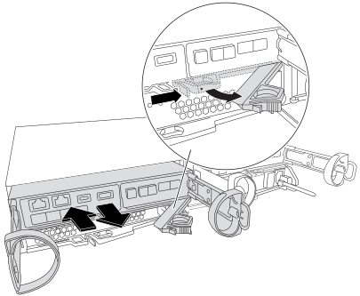

= リアルタイムクロックバッテリを交換してください- FAS2800
:allow-uri-read: 
:icons: font
:imagesdir: ../media/

[role="lead"]
コントローラモジュールのリアルタイムクロック（ RTC ）バッテリを交換して、正確な時刻同期に依存するシステムのサービスとアプリケーションが機能を継続できるようにします。

* この手順は、システムでサポートされるすべてのバージョンの ONTAP で使用できます
* システムのその他のコンポーネントがすべて正常に動作している必要があります。問題がある場合は、必ずテクニカルサポートにお問い合わせください。

== 手順 1 ：障害のあるコントローラをシャットダウンします

障害のあるコントローラをシャットダウンするには、コントローラのステータスを確認し、必要に応じて正常なコントローラが障害のあるコントローラストレージからデータを引き続き提供できるようにコントローラをテイクオーバーする必要があります。

.このタスクについて
* SANシステムを使用している場合は、障害コントローラのSCSIブレードのイベントメッセージを確認しておく必要があり  `cluster kernel-service show`ます）。コマンド（priv advancedモードから）を実行すると、 `cluster kernel-service show` ノード名、そのノードのクォーラムステータス、そのノードの可用性ステータス、およびそのノードの動作ステータスが表示されます。
+
各 SCSI ブレードプロセスは、クラスタ内の他のノードとクォーラムを構成している必要があります。交換を進める前に、すべての問題を解決しておく必要があります。

* ノードが 3 つ以上あるクラスタは、クォーラムを構成している必要があります。クラスタがクォーラムを構成していない場合、または正常なコントローラで適格性と正常性についてfalseと表示される場合は、障害のあるコントローラをシャットダウンする前に問題 を修正する必要があります。を参照してください link:https://docs.netapp.com/us-en/ontap/system-admin/synchronize-node-cluster-task.html?q=Quorum["ノードをクラスタと同期します"^]。

.手順
. AutoSupportが有効になっている場合は、AutoSupportメッセージを呼び出してケースの自動作成を停止します。 `system node autosupport invoke -node * -type all -message MAINT=<# of hours>h`
+
次のAutoSupport メッセージは、ケースの自動作成を2時間停止します。 `cluster1:> system node autosupport invoke -node * -type all -message MAINT=2h`

. 正常なコントローラのコンソールから自動ギブバックを無効にします。 storage failover modify – node local-auto-giveback false
+

NOTE: 自動ギブバックを無効にしますか?_と表示されたら'y'を入力します

. 障害のあるコントローラに LOADER プロンプトを表示します。
+
[cols="1,2"]
|===
| 障害のあるコントローラの表示 | 作業 

 a| 
LOADER プロンプト
 a| 
次の手順に進みます。

 a| 
ギブバックを待っています
 a| 
Ctrl キーを押しながら C キーを押し ' プロンプトが表示されたら y と入力します

 a| 
システムプロンプトまたはパスワードプロンプト
 a| 
正常なコントローラから障害のあるコントローラをテイクオーバーまたは停止します。「 storage failover takeover -ofnode impaired_node_name _

障害のあるコントローラに「 Waiting for giveback... 」と表示されたら、 Ctrl+C キーを押し、「 y 」と入力します。

|===

== 手順 2 ：コントローラモジュールを取り外す

コントローラモジュールをシステムから取り外し、コントローラモジュールのカバーを取り外します。

. 接地対策がまだの場合は、自身で適切に実施します。
. ケーブルマネジメントデバイスに接続しているケーブルをまとめているフックとループストラップを緩め、システムケーブルと SFP をコントローラモジュールから外し（必要な場合）、どのケーブルが何に接続されていたかを記録します。
+
ケーブルはケーブルマネジメントデバイスに収めたままにします。これにより、ケーブルマネジメントデバイスを取り付け直すときに、ケーブルを整理する必要がありません。

. ケーブルマネジメントデバイスをコントローラモジュールの右側と左側から取り外し、脇に置きます。
. カムハンドルのラッチをつかんで解除し、カムハンドルを最大限に開いてコントローラモジュールをミッドプレーンから離し、両手でコントローラモジュールをシャーシから外します。
+

. コントローラモジュールを裏返し、平らで安定した場所に置きます。
. コントローラモジュールの側面にある青いボタンを押してカバーを開き、カバーを上に回してコントローラモジュールから取り外します。
+
image::../media/drw_2850_open_controller_module_cover_IEOPS-695.svg[DRW 2850オープンコントローラモジュールはIEOPS 695をカバーしています]

== 手順 3 ： RTC バッテリを交換します

RTCバッテリをコントローラ内部の場所に移動して交換し、特定の手順を実行します。

.アニメーション- RTCバッテリを交換します
video::7420d100-23b1-4213-a8da-af4701725622[panopto]
image::../media/drw_2850_replace_rtc_battery_IEOPS-701.svg[DRW 2850 RTCバッテリIEOPS 701を交換します]

. 接地対策がまだの場合は、自身で適切に実施します。
. RTC バッテリの場所を確認します。
. バッテリをそっと押してホルダーから離し、持ち上げてホルダーから取り出します。
+

NOTE: ホルダーから取り外す際に、バッテリの極の向きを確認しておいてください。バッテリに記載されているプラス記号に従って、バッテリをホルダーに正しく配置する必要があります。ホルダーの近くにプラス記号が表示されているので、バッテリーの位置を確認できます。

. 交換用バッテリを静電気防止用の梱包バッグから取り出します。
. コントローラモジュールで空のバッテリホルダーの場所を確認します。
. RTC バッテリの極の向きを確認し、バッテリを斜めに傾けた状態で押し下げてホルダーに挿入します。
. バッテリがホルダーに完全に取り付けられ、かつ極の向きが正しいことを目で見て確認します。

== 手順 4 ：コントローラモジュールを再度取り付けます

コントローラモジュールを再度取り付けてブートし、LOADERプロンプトを表示します。

. コントローラモジュールを裏返し、シャーシの開口部に端を合わせます。
. コントローラモジュールをシステムの途中までそっと押し込みます。コントローラモジュールの端をシャーシの開口部に合わせ、コントローラモジュールをシステムの途中までそっと押し込みます。
+
指示があるまでコントローラモジュールをシャーシに完全に挿入しないでください。

. 必要に応じてシステムにケーブルを再接続します。
+
光ファイバケーブルを使用する場合は、メディアコンバータ（ QSFP または SFP ）を取り付け直してください（取り外した場合）。

. 電源装置を取り外した場合は、電源装置を再度接続し、電源ケーブルの固定クリップを再度取り付けます。
. コントローラモジュールの再取り付けを完了します。

. カムハンドルを開き、コントローラモジュールをミッドプレーンまでしっかりと押し込んで完全に装着し、カムハンドルをロック位置まで閉じます。
+

NOTE: コネクタの破損を防ぐため、コントローラモジュールをスライドしてシャーシに挿入する際に力を入れすぎないでください。

+
コントローラは、シャーシに装着されるとすぐにブートを開始します。

. ケーブルマネジメントデバイスをまだ取り付けていない場合は、取り付け直します。
. ケーブルマネジメントデバイスに接続されているケーブルをフックとループストラップでまとめます。
. 電源装置と電源に電源ケーブルを再接続し、電源をオンにしてブートプロセスを開始します。
. LOADER プロンプトでコントローラを停止します。

== 手順5：RTCバッテリ交換後の日時を設定します

. コントローラの時刻と日付をリセットします。
+
.. show date コマンドを使用して ' 正常なコントローラの日付と時刻を確認します
.. ターゲットコントローラの LOADER プロンプトで、日時を確認します。
.. 必要に応じて 'set date mm/dd/yyyy` コマンドで日付を変更します
.. 必要に応じて、「 set time hh ： mm ： ss 」コマンドを使用して、時刻を GMT で設定します。
.. ターゲットコントローラの日付と時刻を確認します。

. LOADER プロンプトで「 bye 」と入力して、 PCIe カードおよびその他のコンポーネントを再初期化し、コントローラをリブートさせます。
. ストレージをギブバックして、コントローラを通常の動作に戻します。 storage failover giveback -ofnode impaired_node_name _`
. を使用して自動ギブバックをリストアします `storage failover modify -node local -auto-giveback true` コマンドを実行します
. AutoSupportのメンテナンス時間がトリガーされた場合は、を使用して終了します `system node autosupport invoke -node * -type all -message MAINT=END` コマンドを実行します

== 手順 6 ：障害が発生したパーツをネットアップに返却する

障害が発生したパーツは、キットに付属のRMA指示書に従ってNetAppに返却してください。 https://mysupport.netapp.com/site/info/rma["パーツの返品と交換"]詳細については、ページを参照してください。
