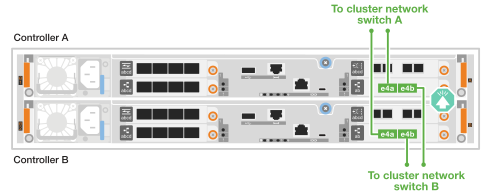
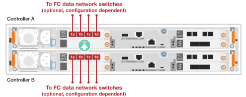
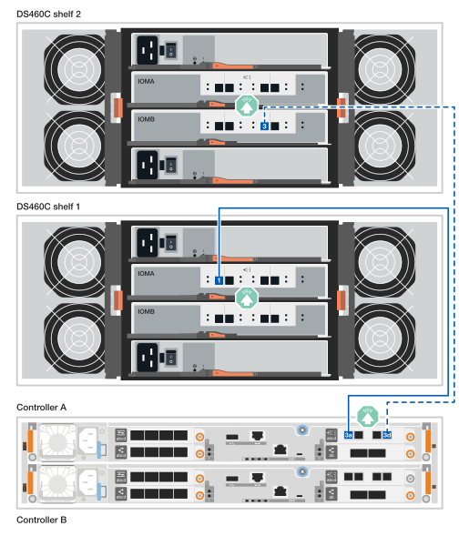

= ハードウェアのケーブル接続- FAS50
:allow-uri-read: 
:icons: font
:imagesdir: ../media/

[role="lead"]
FAS50ストレージシステムハードウェアを設置したら、コントローラをネットワークおよびシェルフにケーブル接続します。

.作業を開始する前に
ストレージシステムをネットワークスイッチに接続する方法については、ネットワーク管理者にお問い合わせください。

.このタスクについて
* 一般的な構成については、クラスタ/ HAおよびホストネットワークのケーブル接続手順を参照してください。
+
ここに構成が表示されない場合は、にアクセスしlink:https://hwu.netapp.com["NetApp Hardware Universe の略"^]てストレージシステムのケーブル接続に関する包括的な構成とスロット優先度情報を確認してください。

* ケーブル配線図には、ポートにコネクタを挿入する際のケーブルコネクタプルタブの正しい方向（上または下）を示す矢印アイコンがあります。
+
コネクタを挿入すると、カチッという音がしてコネクタが所定の位置に収まるはずです。カチッと音がしない場合は、コネクタを取り外し、裏返してもう一度試してください。

+
image:../media/drw_cable_pull_tab_direction_ieops-1699.svg["ケーブルプルタブの方向"]

* 光スイッチにケーブル接続する場合は、光トランシーバをコントローラポートに挿入してから、スイッチポートにケーブル接続します。

== 手順1：クラスタ/ HAをケーブル接続する

コントローラをケーブル接続してONTAPクラスタ接続を作成します。

[role="tabbed-block"]
====
.スイッチレスクラスタのケーブル接続
--
.FAS50：2ポート40 / 100GbE I/Oモジュール×1
[%collapsible]
=====
.手順
. クラスタ/ HAインターコネクト接続をケーブル接続します。
+

NOTE: クラスタインターコネクトトラフィックとHAトラフィックは、同じ物理ポートを共有します（スロット4のI/Oモジュール上）。ポートは40 / 100GbEです。

+
.. コントローラAのポートe4aをコントローラBのポートe4aにケーブル接続します。
.. コントローラAのポートe4bをコントローラBのポートe4bにケーブル接続します。
+
* 100GbEクラスタ/ HAインターコネクトケーブル*

+
image::../media/oie_cable100_gbe_qsfp28.png[クラスタHA 100GbEケーブル]

+
image::../media/drw_isi_fas50_switchless_2p_100gbe_cabling_ieops-1937.svg[1つの100GbE IOモジュールを使用したFas50スイッチレスクラスタのケーブル配線図]

=====
--
.スイッチクラスタのケーブル接続
--
.FAS50：2ポート40 / 100GbE I/Oモジュール×1
[%collapsible]
=====
. コントローラをクラスタネットワークスイッチにケーブル接続します。
+

NOTE: クラスタインターコネクトトラフィックとHAトラフィックは、同じ物理ポートを共有します（スロット4のI/Oモジュール上）。ポートは40 / 100GbEです。

+
.. コントローラAのポートe4aをクラスタネットワークスイッチAにケーブル接続します。
.. コントローラAのポートe4bをクラスタネットワークスイッチBにケーブル接続します。
.. コントローラBのポートe4aをクラスタネットワークスイッチAにケーブル接続します。
.. コントローラBのポートe4bをクラスタネットワークスイッチBにケーブル接続します。
+
* 40 / 100GbEクラスタ/ HAインターコネクトケーブル*

+
image::../media/oie_cable100_gbe_qsfp28.png[クラスタHA 40 / 100GbEケーブル]

+

=====
--
====

== 手順2：ホストネットワーク接続をケーブル接続する

コントローラをイーサネットまたはFCホストネットワークにケーブル接続します。

[role="tabbed-block"]
====
.イーサネットホストのケーブル接続
--
.FAS50：4ポート10 / 25GbE I/Oモジュール×1
[%collapsible]
=====
.手順
. 各コントローラで、ポートe2a、e2b、e2c、e2dをイーサネットホストネットワークスイッチにケーブル接続します。
+
* 10/25GbEケーブル*

+
image:../media/oie_cable_sfp_gbe_copper.png["GbE SFP銅線コネクタ、幅= 100px"]

+
image::../media/drw_isi_fas50_4p_25gbe_optional_cabling_ieops-1934.svg[FAS50から10 / 25GbEイーサネットホストネットワークスイッチへのケーブル接続]

=====
--
.FCホストのケーブル接続
--
.FAS50（4ポート64 Gb/秒FC I/Oモジュール×1）
[%collapsible]
=====
.手順
. 各コントローラで、ポート1a、1b、1c、および1dをFCホストネットワークスイッチにケーブル接続します。
+
* 64 Gb/秒FCケーブル*

+
image:../media/oie_cable_sfp_gbe_copper.png["64Gb FCケーブル、幅= 100px"]

+

=====
--
====

== 手順3：管理ネットワークをケーブル接続する

コントローラを管理ネットワークにケーブル接続します。

. 各コントローラの管理（レンチマーク）ポートを管理ネットワークスイッチにケーブル接続します。
+
* 1000BASE-T RJ-45ケーブル*

+
image::../media/oie_cable_rj45.png[RJ-45ケーブル]

+
image::../media/drw_isi_fas50_wrench_cabling_ieops-1938.svg[管理ネットワークへの接続]

IMPORTANT: まだ電源コードを接続しないでください。

== 手順4：シェルフをケーブル接続する

次の手順では、1台または2台のDS460Cシェルフにコントローラをケーブル接続する方法を示します。

.このタスクについて
* ケーブル接続例ではDS460Cシェルフを使用していますが、追加のSASシェルフもサポートされます（を参照）link:https://hwu.netapp.com["NetApp Hardware Universe の略"^]。
+
サポートされている他のSASシェルフのケーブル接続も同様です。を参照して link:../sas3/install-new-system.html["新しいシステムを設置する場合のシェルフの設置とケーブル接続"^]を参照することもできますlink:../sas3/overview-cabling-rules-examples.html["SASケーブル接続ルー、ワークシート、および例の概要"^]。

* ストレージシステムでサポートされるシェルフの最大数、および光ファイバやスイッチ接続などのすべてのケーブル接続オプションについては、を参照してくださいlink:https://hwu.netapp.com["NetApp Hardware Universe の略"^]。
* 図は、コントローラAのケーブル配線を青で示し、コントローラBのケーブル配線を黄色で示しています。
* ストレージシステムに付属のストレージケーブルを使用します。次の種類のケーブルを使用できます。
+
* Mini-SAS HDケーブル*

+
image::../media/oie_cable_mini_sas_hd_to_mini_sas_hd.svg[Mini-SAS HDケーブル]

[role="tabbed-block"]
====
.オプション1：DS460Cシェルフ1台
--
各コントローラをDS460Cシェルフの各IOM12モジュールにケーブル接続します。

.手順
. コントローラ A をシェルフにケーブル接続します。
+
.. コントローラAのポート3aをIOMAポート1にケーブル接続します。
.. コントローラAのポート3DをIOMBポート3にケーブル接続します。
+
image:../media/drw_isi_fas50_1_ds460c_controller_a_cabling_ieops-2167.svg["コントローラAのポート3aと3Dを1台のDS460Cシェルフに接続"]

. コントローラ B をシェルフにケーブル接続します。
+
.. コントローラBのポート3aをIOMBポート1にケーブル接続します。
.. コントローラBのポート3DをIOMAポート3にケーブル接続します。
+
image:../media/drw_isi_fas50_1_ds460c_controller_b_cabling_ieops-2169.svg["コントローラBのポート3aと3Dケーブルを1台のDS460Cシェルフに接続"]

--
.オプション2：DS460Cシェルフ×2
--
各コントローラを両方のDS460CシェルフのIOM12モジュールに接続します。

. シェルフ/シェルフ間をケーブル接続します。
+
.. シェルフ1のIOMAポート3をシェルフ2のIOMAポート1にケーブル接続します。
.. シェルフ1のIOMBポート3をシェルフ2のIOMBポート1にケーブル接続します。
+
image:../media/drw_isi_fas50_2_ds460c_shelf_to_shelf_ieops-2172.svg["シェルフとシェルフの接続をケーブル接続"]

. コントローラ A をシェルフにケーブル接続します。
+
.. コントローラAのポート3aをシェルフ1のIOMAポート1にケーブル接続します。
.. コントローラAのポート3Dをシェルフ2のIOMBポート3にケーブル接続します。
+

. コントローラ B をシェルフにケーブル接続します。
+
.. コントローラBのポート3aをシェルフ1のIOMBポート1にケーブル接続します。
.. コントローラBのポート3Dをシェルフ2のIOMAポート3にケーブル接続します。
+
image:../media/drw_isi_fas50_2_ds460c_controller_b_cabling_ieops-2171.svg["コントローラBのポート3aと3Dを2台のDS460Cシェルフに接続"]

--
====
.次の手順
ストレージシステム用のハードウェアのケーブル接続が完了したら、link:install-power-hardware.html["ストレージ・システムの電源をオンにする"]
