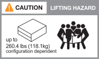

= 設置要件- FAS50
:allow-uri-read: 
:icons: font
:imagesdir: ../media/

[role="lead"]
FAS50ストレージ・システムの要件を確認します。

== 設置に必要な機器

ストレージシステムを設置するには、次の機器および工具が必要です。

* ストレージシステムを設定するためのWebブラウザへのアクセス
* 静電放電（ESD）ストラップ
* 懐中電灯
* USB /シリアル接続を備えたラップトップまたはコンソール
* No.2 プラスドライバ

== 吊り上げ時の注意事項

ストレージシステムやシェルフは重い。これらのアイテムを持ち上げたり移動したりするときは、注意してください。

=== ストレージシステムノオモミ

ストレージシステムを移動または持ち上げるときは、必要な予防措置を講じてください。

ストレージシステムの重量は最大24.4 kg（53.8ポンド）になることがあります。ストレージ・システムを持ち上げるには、2人で作業するか、油圧リフトを使用します。

image::../media/drw_g_lifting_weight_ieops-1831.svg[FAS50重量警告アイコン]

=== シェルフの重量

シェルフを移動または持ち上げるときは、必要な予防措置を講じてください。

DS460Cシェルフの重量は最大181.1kg（260.4ポンド）です。シェルフを持ち上げるには、最大5人で作業するか、油圧リフトを使用します。シェルフの重量がバランスを崩さないように、すべてのコンポーネント（前面と背面の両方）をシェルフに保管してください。

.関連情報
* https://library.netapp.com/ecm/ecm_download_file/ECMP12475945["安全に関する情報と規制に関する通知"^]

.次の手順
ストレージシステムのインストール要件と考慮事項を確認したら、を実行しlink:install-prepare.html["設置の準備"]ます。
